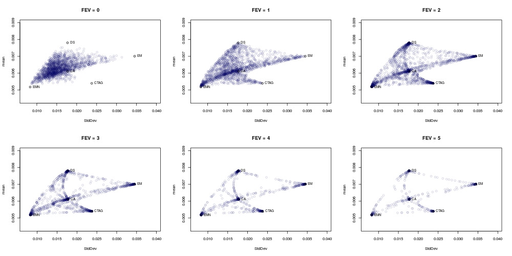
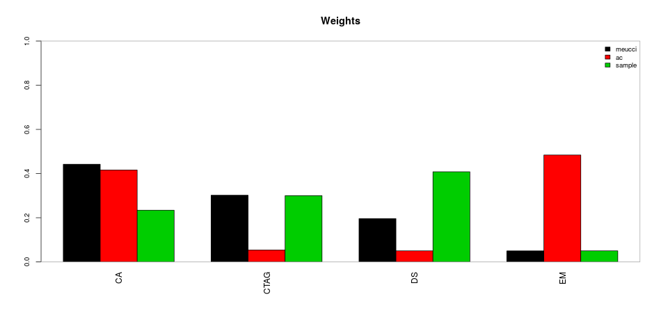
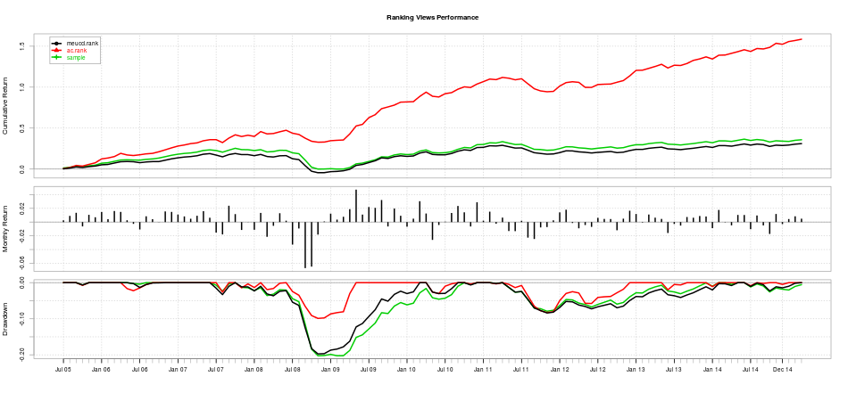
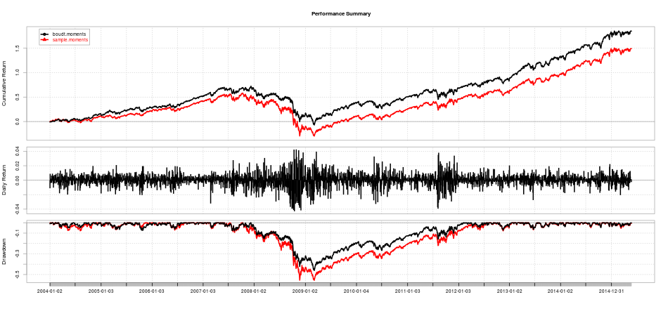

## Overview
* Discuss Portfolio Optimization
* Introduce PortfolioAnalytics
* Demonstrate PortfolioAnalytics with Examples

<!--
* Discuss Portfolio Optimization
    * Background and challenges of portfolio theory
* Introduce PortfolioAnalytics
    * What PortfolioAnalytics does and the problems it solves
* Demonstrate PortfolioAnalytics with Examples
    * Brief overview of the examples I will be giving
-->

---

## Modern Portfolio Theory
"Modern" Portfolio Theory (MPT) was introduced by Harry Markowitz in 1952.

In general, MPT states that an investor's objective is to maximize portfolio expected return for a given amount of risk.

General Objectives

* Maximize a measure of gain per unit measure of risk
* Minimize a measure of risk

How do we define risk? What about more complex objectives and constraints?

<!--
Several approaches follow the Markowitz approach using mean return as a measure of gain and standard deviation of returns as a measure of risk. This is an academic approach. 
-->

---

## Portfolio Optimization Objectives
* Minimize Risk
    * Volatility
    * Tail Loss (VaR, ES)
    * Other Downside Risk Measure
* Maximize Risk Adjusted Return
    * Sharpe Ratio, Modified Sharpe Ratio
    * Several Others
* Risk Budgets
    * Equal Component Contribution to Risk (i.e. Risk Parity)
    * Limits on Component Contribution
* Maximize a Utility Function
    * Quadratic, CRRA, etc.

<!--
* Expand on pros/cons of closed-form solvers vs. global solvers and what objectives can be solved.
* The challenge here is knowing what solver to use and the capabilities/limits of the chosen solver. 
* Some of these problems can be formulated as a quadratic or linear programming problem. Constructing the constraint matrix and objective function matrix or vector is not trivial. Limited to the quality of LP and QP solvers available for R. 
-->

---

## PortfolioAnalytics Overview
PortfolioAnalytics is an R package designed to provide numerical solutions and visualizations for portfolio optimization problems with complex constraints and objectives.

* Support for multiple constraint and objective types
* Modular constraints and objectives
* An objective function can be any valid R function
* Support for user defined moment functions
* Visualizations
* Solver agnostic
* Support for parallel computing

<!---
The key points to make here are:
* Flexibility
    * The multiple types and modularity of constraints and objectives allows us to add, remove, combine, etc. multiple constraint and objective types very easily.
    * Define an objective as any valid R function
    * Define a function to compute the moments (sample, robust, shrinkage, factor model, GARCH model, etc.)
    * Estimation error is a significant concern with optimization. Having the ability to test different models with different parameters is critical.
* PortfolioAnalytics comes "out of the box" with several constraint types.
* Visualization helps to build intuition about the problem and understand the feasible space of portfolios
* Periodic rebalancing and analyzing out of sample performance will help refine objectives and constraints
* Framework for evaluating portfolios with different sets of objectives and portfolios through time
-->

---

## New in PortfolioAnalytics

* Pushed to CRAN
* Regime Switching Framework
* Multilayer Optimization
* Rank Based Optimization
* Factor Model Moment Estimates
* Improved Random Portfolios Algorithm
* More demos, vignettes, and documentation

<!--
Highlight a few things about each point
* Pushed to CRAN
  * 2015-04-19
* Regime Switching Framework
  * very general framework to define 'n' portfolios for 'n' regimes
  * useful for out of sample backtesting
* Multilayer Optimization
  * more on this in next slide
* Rank Based Optimization
  * examples
* Factor Model Moment Estimates
  * statistical factor model
  * compute higher order moments based on the work of kris boudt
* Improved Random Portfolios Algorithm
  * support more constraints by construction
  * more efficient for group constraints
* More demos, vignettes, and documentation
  * added vignette for custom moments and objectives
  * demos for each new feature added last summer during GSoC 2014
-->

---

## Multilayer Optimization


<!--
explanation of how the multilayer optimization works
start with portfolio of subportfolios
the subportfolios could be countris, sectors, etc.
optimize subportfolios
this gives us 'n' synthetic return streams for 'n' sub portfolios
we then optimize the top level portfolio using the 'n' synthetic return streams
-->

---

## Support Multiple Solvers
Linear and Quadratic Programming Solvers

* R Optimization Infrastructure (ROI)
    * GLPK (Rglpk)
    * Symphony (Rsymphony)
    * Quadprog (quadprog)

Global (stochastic or continuous solvers)

* Random Portfolios
* Differential Evolution (DEoptim)
* Particle Swarm Optimization (pso)
* Generalized Simulated Annealing (GenSA)

<!---
Brief explanation of each solver and what optimization problems are supported
-->

---

## Random Portfolios
PortfolioAnalytics has three methods to generate random portfolios.

1. The **sample** method to generate random portfolios is based on an idea by Pat Burns.
2. The **simplex** method to generate random portfolios is based on a paper by W. T. Shaw.
3. The **grid** method to generate random portfolios is based on the `gridSearch` function in the NMOF package.

<!--
* Random portfolios allow one to generate an arbitray number of portfolios based on given constraints. Will cover the edges as well as evenly cover the interior of the feasible space. Allows for massively parallel execution.

* The sample method to generate random portfolios is based on an idea by Patrick Burns. This is the most flexible method, but also the slowest, and can generate portfolios to satisfy leverage, box, group, and position limit constraints.

* The simplex method to generate random portfolios is based on a paper by W. T. Shaw. The simplex method is useful to generate random portfolios with the full investment constraint, where the sum of the weights is equal to 1, and min box constraints. Values for min_sum and max_sum of the leverage constraint will be ignored, the sum of weights will equal 1. All other constraints such as the box constraint max, group and position limit constraints will be handled by elimination. If the constraints are very restrictive, this may result in very few feasible portfolios remaining. Another key point to note is that the solution may not be along the vertexes depending on the objective. For example, a risk budget objective will likely place the portfolio somewhere on the interior.

* The grid method to generate random portfolios is based on the gridSearch function in NMOF package. The grid search method only satisfies the min and max box constraints. The min_sum and max_sum leverage constraint will likely be violated and the weights in the random portfolios should be normalized. Normalization may cause the box constraints to be violated and will be penalized in constrained_objective.
-->

---

## Comparison of Random Portfolio Methods (Interactive!)

<div id = 'chart5ce4224ea298' class = 'rChart nvd3'></div>
<script type='text/javascript'>
 $(document).ready(function(){
      drawchart5ce4224ea298()
    });
    function drawchart5ce4224ea298(){  
      var opts = {
 "dom": "chart5ce4224ea298",
"width":    800,
"height":    400,
"x": "sd",
"y": "mean",
"group": "name",
"type": "scatterChart",
"id": "chart5ce4224ea298" 
},
        data = [
 {
 "name": "sample",
"mean": 0.006299908675799,
"sd": 0.01458428543478 
},
{
 "name": "sample",
"mean": 0.007035025570776,
"sd": 0.03369427999999 
},
{
 "name": "sample",
"mean": 0.006108878538813,
"sd": 0.01339853663384 
},
{
 "name": "sample",
"mean": 0.0065435543379,
"sd": 0.0165625811089 
},
{
 "name": "sample",
"mean": 0.006218503196347,
"sd": 0.01401383132067 
},
{
 "name": "sample",
"mean": 0.005287979908676,
"sd": 0.008478667155509 
},
{
 "name": "sample",
"mean": 0.006190447488584,
"sd": 0.01201184251351 
},
{
 "name": "sample",
"mean": 0.006140085844749,
"sd": 0.01480518016825 
},
{
 "name": "sample",
"mean": 0.005378141552511,
"sd": 0.01300339750221 
},
{
 "name": "sample",
"mean": 0.006401564383562,
"sd": 0.02059494073386 
},
{
 "name": "sample",
"mean": 0.005326830136986,
"sd": 0.01632166464264 
},
{
 "name": "sample",
"mean": 0.006737539726027,
"sd": 0.01865403492582 
},
{
 "name": "sample",
"mean": 0.005270052054795,
"sd": 0.008723485293237 
},
{
 "name": "sample",
"mean": 0.007506135159817,
"sd": 0.01620194932499 
},
{
 "name": "sample",
"mean": 0.005829348858447,
"sd": 0.01665001014471 
},
{
 "name": "sample",
"mean": 0.006663653881279,
"sd": 0.01403267913235 
},
{
 "name": "sample",
"mean": 0.006148967123288,
"sd": 0.01705494910889 
},
{
 "name": "sample",
"mean": 0.006299167123288,
"sd": 0.01804366435638 
},
{
 "name": "sample",
"mean": 0.006438704109589,
"sd": 0.02425423572262 
},
{
 "name": "sample",
"mean": 0.006334444748858,
"sd": 0.01690072311447 
},
{
 "name": "sample",
"mean": 0.006340797260274,
"sd": 0.01311721527268 
},
{
 "name": "sample",
"mean": 0.006641080365297,
"sd": 0.0250113637218 
},
{
 "name": "sample",
"mean": 0.007088884931507,
"sd": 0.01485783540036 
},
{
 "name": "sample",
"mean": 0.005948048401826,
"sd": 0.01649017176268 
},
{
 "name": "sample",
"mean": 0.006312716894977,
"sd": 0.01623030050204 
},
{
 "name": "sample",
"mean": 0.006252727853881,
"sd": 0.01485688136903 
},
{
 "name": "sample",
"mean": 0.005867961643836,
"sd": 0.01332595438694 
},
{
 "name": "sample",
"mean": 0.005506823744292,
"sd": 0.01959497090542 
},
{
 "name": "sample",
"mean": 0.006648568949772,
"sd": 0.02225889651095 
},
{
 "name": "sample",
"mean": 0.005581683105023,
"sd": 0.009683350963884 
},
{
 "name": "sample",
"mean": 0.005907002739726,
"sd": 0.01441583831146 
},
{
 "name": "sample",
"mean": 0.006731747945205,
"sd": 0.02747858182461 
},
{
 "name": "sample",
"mean": 0.00632216803653,
"sd": 0.0181091436251 
},
{
 "name": "sample",
"mean": 0.006185591780822,
"sd": 0.01387152193344 
},
{
 "name": "sample",
"mean": 0.006909519634703,
"sd": 0.01371159157229 
},
{
 "name": "sample",
"mean": 0.006466891324201,
"sd": 0.01442839419796 
},
{
 "name": "sample",
"mean": 0.007212084931507,
"sd": 0.02054076022902 
},
{
 "name": "sample",
"mean": 0.006702196347032,
"sd": 0.02915858725468 
},
{
 "name": "sample",
"mean": 0.006489521461187,
"sd": 0.02018189669353 
},
{
 "name": "sample",
"mean": 0.005471852054795,
"sd": 0.01013952455178 
},
{
 "name": "sample",
"mean": 0.006123406392694,
"sd": 0.01776018838004 
},
{
 "name": "sample",
"mean": 0.006221107762557,
"sd": 0.01788935630869 
},
{
 "name": "sample",
"mean": 0.006627684931507,
"sd": 0.02696033596893 
},
{
 "name": "sample",
"mean": 0.006243674885845,
"sd": 0.02019898774449 
},
{
 "name": "sample",
"mean": 0.005911684931507,
"sd": 0.0126182393348 
},
{
 "name": "sample",
"mean": 0.006266550684932,
"sd": 0.01570440261962 
},
{
 "name": "sample",
"mean": 0.005561028310502,
"sd": 0.01076345707593 
},
{
 "name": "sample",
"mean": 0.006145249315068,
"sd": 0.01696741948333 
},
{
 "name": "sample",
"mean": 0.006109081278539,
"sd": 0.01524333896553 
},
{
 "name": "sample",
"mean": 0.006214463013699,
"sd": 0.01850924747219 
},
{
 "name": "sample",
"mean": 0.006212233789954,
"sd": 0.01771183615834 
},
{
 "name": "sample",
"mean": 0.00641804109589,
"sd": 0.02176269484516 
},
{
 "name": "sample",
"mean": 0.0058944456621,
"sd": 0.01377243588624 
},
{
 "name": "sample",
"mean": 0.005922056621005,
"sd": 0.01438082166607 
},
{
 "name": "sample",
"mean": 0.006685284018265,
"sd": 0.01371321869865 
},
{
 "name": "sample",
"mean": 0.00637321826484,
"sd": 0.02298161787484 
},
{
 "name": "sample",
"mean": 0.007478090410959,
"sd": 0.01931549547355 
},
{
 "name": "sample",
"mean": 0.006160432876712,
"sd": 0.01059043435678 
},
{
 "name": "sample",
"mean": 0.006340749771689,
"sd": 0.01558109934214 
},
{
 "name": "sample",
"mean": 0.006775592694064,
"sd": 0.02728284468274 
},
{
 "name": "sample",
"mean": 0.005668452968037,
"sd": 0.0119852344077 
},
{
 "name": "sample",
"mean": 0.007084502283105,
"sd": 0.01569114017948 
},
{
 "name": "sample",
"mean": 0.006357135159817,
"sd": 0.01656942308421 
},
{
 "name": "sample",
"mean": 0.006391313242009,
"sd": 0.01971768695695 
},
{
 "name": "sample",
"mean": 0.006391455707763,
"sd": 0.01425246717077 
},
{
 "name": "sample",
"mean":      0.0056086,
"sd": 0.01635068862296 
},
{
 "name": "sample",
"mean": 0.006415106849315,
"sd": 0.01210470611264 
},
{
 "name": "sample",
"mean": 0.006739851141553,
"sd": 0.01918236809542 
},
{
 "name": "sample",
"mean": 0.006907410045662,
"sd": 0.01544786219406 
},
{
 "name": "sample",
"mean": 0.006465089497717,
"sd": 0.01211928333501 
},
{
 "name": "sample",
"mean": 0.006762653881279,
"sd": 0.01351894752846 
},
{
 "name": "sample",
"mean": 0.006163468493151,
"sd": 0.01616181574759 
},
{
 "name": "sample",
"mean": 0.005725705936073,
"sd": 0.01842938861735 
},
{
 "name": "sample",
"mean": 0.005368680365297,
"sd": 0.009395764381682 
},
{
 "name": "sample",
"mean": 0.005877299543379,
"sd": 0.01125809974125 
},
{
 "name": "sample",
"mean": 0.006339550684932,
"sd": 0.01526959652718 
},
{
 "name": "sample",
"mean": 0.005981061187215,
"sd": 0.01404971489517 
},
{
 "name": "sample",
"mean": 0.005568514155251,
"sd": 0.0122457137722 
},
{
 "name": "sample",
"mean": 0.006017097716895,
"sd": 0.01668995211822 
},
{
 "name": "sample",
"mean": 0.005876736073059,
"sd": 0.01331190594963 
},
{
 "name": "sample",
"mean": 0.006369925114155,
"sd": 0.02107156331343 
},
{
 "name": "sample",
"mean": 0.005923334246575,
"sd": 0.01564358876438 
},
{
 "name": "sample",
"mean": 0.006108378995434,
"sd": 0.01628166972744 
},
{
 "name": "sample",
"mean": 0.006292429223744,
"sd": 0.01362176201488 
},
{
 "name": "sample",
"mean": 0.005786611872146,
"sd": 0.01230756120142 
},
{
 "name": "sample",
"mean": 0.006436610045662,
"sd": 0.01580053901622 
},
{
 "name": "sample",
"mean": 0.006828327853881,
"sd": 0.01930399976039 
},
{
 "name": "sample",
"mean": 0.005821715981735,
"sd": 0.01355063309905 
},
{
 "name": "sample",
"mean": 0.00606797716895,
"sd": 0.0152899915809 
},
{
 "name": "sample",
"mean": 0.005991580821918,
"sd": 0.0122130084645 
},
{
 "name": "sample",
"mean": 0.006568176255708,
"sd": 0.02386084177325 
},
{
 "name": "sample",
"mean": 0.00611544109589,
"sd": 0.01617217366945 
},
{
 "name": "sample",
"mean": 0.005734628310502,
"sd": 0.01119480440767 
},
{
 "name": "sample",
"mean": 0.006724138812785,
"sd": 0.02815642675631 
},
{
 "name": "sample",
"mean": 0.007104660273973,
"sd": 0.01450676078067 
},
{
 "name": "sample",
"mean": 0.006036360730594,
"sd": 0.01150102319404 
},
{
 "name": "sample",
"mean": 0.005771918721461,
"sd": 0.01294577869444 
},
{
 "name": "sample",
"mean": 0.006887561643836,
"sd": 0.02723146781065 
},
{
 "name": "sample",
"mean": 0.006352220091324,
"sd": 0.01564072482746 
},
{
 "name": "sample",
"mean": 0.005599960730594,
"sd": 0.01002362826293 
},
{
 "name": "sample",
"mean": 0.005434343378995,
"sd": 0.009021603306116 
},
{
 "name": "sample",
"mean": 0.006432101369863,
"sd": 0.01393311111159 
},
{
 "name": "sample",
"mean": 0.006417656621005,
"sd": 0.01835573147674 
},
{
 "name": "sample",
"mean": 0.007076915068493,
"sd": 0.01579559246696 
},
{
 "name": "sample",
"mean": 0.005716296803653,
"sd": 0.0186740560195 
},
{
 "name": "sample",
"mean": 0.007248131506849,
"sd": 0.01716948303283 
},
{
 "name": "sample",
"mean": 0.005568738812785,
"sd": 0.009144866907168 
},
{
 "name": "sample",
"mean": 0.007141726027397,
"sd": 0.02624135336385 
},
{
 "name": "sample",
"mean": 0.005924785388128,
"sd": 0.01453177717273 
},
{
 "name": "sample",
"mean": 0.006765355251142,
"sd": 0.01479767736409 
},
{
 "name": "sample",
"mean": 0.006693431050228,
"sd": 0.02134406361529 
},
{
 "name": "sample",
"mean": 0.00651041826484,
"sd": 0.0205372752566 
},
{
 "name": "sample",
"mean": 0.005541150684932,
"sd": 0.02050581072448 
},
{
 "name": "sample",
"mean": 0.005462464840183,
"sd": 0.01954301975171 
},
{
 "name": "sample",
"mean": 0.006497517808219,
"sd": 0.02109318587087 
},
{
 "name": "sample",
"mean": 0.006105707762557,
"sd": 0.0148520277945 
},
{
 "name": "sample",
"mean": 0.00620062739726,
"sd": 0.01354924552328 
},
{
 "name": "sample",
"mean": 0.00632801369863,
"sd": 0.01601786857731 
},
{
 "name": "sample",
"mean": 0.007090670319635,
"sd": 0.01422038897247 
},
{
 "name": "sample",
"mean": 0.005336570776256,
"sd": 0.00942079206652 
},
{
 "name": "sample",
"mean": 0.006087648401826,
"sd": 0.01763536833371 
},
{
 "name": "sample",
"mean": 0.006889426484018,
"sd": 0.01684079609916 
},
{
 "name": "sample",
"mean": 0.005570956164384,
"sd": 0.01746075037492 
},
{
 "name": "sample",
"mean": 0.00540283196347,
"sd": 0.01515625661183 
},
{
 "name": "sample",
"mean": 0.006226298630137,
"sd": 0.01627255282738 
},
{
 "name": "sample",
"mean": 0.006663756164384,
"sd": 0.02412764141905 
},
{
 "name": "sample",
"mean": 0.007102716894977,
"sd": 0.025461814741 
},
{
 "name": "sample",
"mean": 0.006886780821918,
"sd": 0.02503011834361 
},
{
 "name": "sample",
"mean": 0.005550254794521,
"sd": 0.01006224524278 
},
{
 "name": "sample",
"mean": 0.006361709589041,
"sd": 0.01635111832964 
},
{
 "name": "sample",
"mean": 0.006868513242009,
"sd": 0.03117269617156 
},
{
 "name": "sample",
"mean": 0.00583302739726,
"sd": 0.01548486736649 
},
{
 "name": "sample",
"mean": 0.00613701369863,
"sd": 0.01540023876208 
},
{
 "name": "sample",
"mean": 0.006937305022831,
"sd": 0.01617617224035 
},
{
 "name": "sample",
"mean": 0.005935108675799,
"sd": 0.01145271107976 
},
{
 "name": "sample",
"mean": 0.005435394520548,
"sd": 0.02210345294627 
},
{
 "name": "sample",
"mean": 0.005761210958904,
"sd": 0.01435626302692 
},
{
 "name": "sample",
"mean": 0.006235668493151,
"sd": 0.01681987328451 
},
{
 "name": "sample",
"mean": 0.006197850228311,
"sd": 0.01639812659382 
},
{
 "name": "sample",
"mean": 0.005833514155251,
"sd": 0.01005196272354 
},
{
 "name": "sample",
"mean": 0.007591594520548,
"sd": 0.01917622882289 
},
{
 "name": "sample",
"mean": 0.006160215525114,
"sd": 0.01753332584196 
},
{
 "name": "sample",
"mean": 0.006789153424658,
"sd": 0.01507334229635 
},
{
 "name": "sample",
"mean": 0.006404529680365,
"sd": 0.01827510781725 
},
{
 "name": "sample",
"mean": 0.005686696803653,
"sd": 0.01750623198231 
},
{
 "name": "sample",
"mean": 0.006332092237443,
"sd": 0.01845924397653 
},
{
 "name": "sample",
"mean": 0.006680850228311,
"sd": 0.0125179152506 
},
{
 "name": "sample",
"mean": 0.00668437716895,
"sd": 0.0247075708201 
},
{
 "name": "sample",
"mean": 0.007181187214612,
"sd": 0.01670484189538 
},
{
 "name": "sample",
"mean": 0.006132483105023,
"sd": 0.01701116925431 
},
{
 "name": "sample",
"mean": 0.006318882191781,
"sd": 0.01749374536227 
},
{
 "name": "sample",
"mean": 0.007329930593607,
"sd": 0.01527099415258 
},
{
 "name": "sample",
"mean": 0.006025090410959,
"sd": 0.01369652849075 
},
{
 "name": "sample",
"mean": 0.00596458630137,
"sd": 0.01446856171693 
},
{
 "name": "sample",
"mean": 0.006807477625571,
"sd": 0.01508396115236 
},
{
 "name": "sample",
"mean": 0.005307252054795,
"sd": 0.008631597884094 
},
{
 "name": "sample",
"mean": 0.006606670319635,
"sd": 0.01459850918483 
},
{
 "name": "sample",
"mean": 0.006799597260274,
"sd": 0.02582350638937 
},
{
 "name": "sample",
"mean": 0.006474282191781,
"sd": 0.02417904753377 
},
{
 "name": "sample",
"mean": 0.005508109589041,
"sd": 0.01384345828218 
},
{
 "name": "sample",
"mean": 0.005620766210046,
"sd": 0.01874037055288 
},
{
 "name": "sample",
"mean": 0.007247384474886,
"sd": 0.02155157699439 
},
{
 "name": "sample",
"mean": 0.005986491324201,
"sd": 0.01009613012438 
},
{
 "name": "sample",
"mean": 0.006141947945205,
"sd": 0.01628580134821 
},
{
 "name": "sample",
"mean": 0.006671891324201,
"sd": 0.02540790502997 
},
{
 "name": "sample",
"mean": 0.006339124200913,
"sd": 0.01324350500775 
},
{
 "name": "sample",
"mean": 0.007339692237443,
"sd": 0.01779524359163 
},
{
 "name": "sample",
"mean": 0.007640600913242,
"sd": 0.02060130038763 
},
{
 "name": "sample",
"mean": 0.007041136986301,
"sd": 0.01969687546926 
},
{
 "name": "sample",
"mean": 0.006594057534247,
"sd": 0.02092869498734 
},
{
 "name": "sample",
"mean": 0.00622103196347,
"sd": 0.01370352952845 
},
{
 "name": "sample",
"mean": 0.006019910502283,
"sd": 0.01462412280653 
},
{
 "name": "sample",
"mean": 0.005344515068493,
"sd": 0.01439077728656 
},
{
 "name": "sample",
"mean": 0.006375642009132,
"sd": 0.02081406497131 
},
{
 "name": "sample",
"mean": 0.006914726027397,
"sd": 0.01638872940546 
},
{
 "name": "sample",
"mean": 0.006951322374429,
"sd": 0.01412067758582 
},
{
 "name": "sample",
"mean": 0.005983533333333,
"sd": 0.01173538416776 
},
{
 "name": "sample",
"mean": 0.00569902283105,
"sd": 0.01764860148272 
},
{
 "name": "sample",
"mean": 0.006866584474886,
"sd": 0.01287863188644 
},
{
 "name": "sample",
"mean": 0.005813038356164,
"sd": 0.0195817212194 
},
{
 "name": "sample",
"mean": 0.005992210045662,
"sd": 0.01534485233712 
},
{
 "name": "sample",
"mean": 0.006702052054795,
"sd": 0.02790687497591 
},
{
 "name": "sample",
"mean": 0.006145337899543,
"sd": 0.01810100715467 
},
{
 "name": "sample",
"mean":      0.0060832,
"sd": 0.02031095196014 
},
{
 "name": "sample",
"mean": 0.006546592694064,
"sd": 0.01929805182474 
},
{
 "name": "sample",
"mean": 0.006351300456621,
"sd": 0.01528975333149 
},
{
 "name": "sample",
"mean": 0.006115626484018,
"sd": 0.01704937134278 
},
{
 "name": "sample",
"mean": 0.006770114155251,
"sd": 0.02884079219132 
},
{
 "name": "sample",
"mean": 0.006746221917808,
"sd": 0.02168925916562 
},
{
 "name": "sample",
"mean": 0.005918457534247,
"sd": 0.01502513103554 
},
{
 "name": "sample",
"mean": 0.006738284931507,
"sd": 0.01625157821139 
},
{
 "name": "sample",
"mean": 0.005913200913242,
"sd": 0.0141689505299 
},
{
 "name": "sample",
"mean": 0.005684621004566,
"sd": 0.01227466220196 
},
{
 "name": "sample",
"mean": 0.007108522374429,
"sd": 0.01609430787903 
},
{
 "name": "sample",
"mean": 0.007202488584475,
"sd": 0.02477219444815 
},
{
 "name": "sample",
"mean": 0.006733630136986,
"sd": 0.01959386608731 
},
{
 "name": "sample",
"mean": 0.006088601826484,
"sd": 0.01516013198265 
},
{
 "name": "sample",
"mean": 0.006895543378995,
"sd": 0.02342291583328 
},
{
 "name": "sample",
"mean": 0.006985816438356,
"sd": 0.01393356909328 
},
{
 "name": "sample",
"mean": 0.006317557990868,
"sd": 0.02275934528698 
},
{
 "name": "sample",
"mean": 0.007315875799087,
"sd": 0.02261084151775 
},
{
 "name": "sample",
"mean": 0.005548927853881,
"sd": 0.01317286925491 
},
{
 "name": "sample",
"mean": 0.006460251141553,
"sd": 0.01747446358483 
},
{
 "name": "sample",
"mean": 0.005912927853881,
"sd": 0.01420520582556 
},
{
 "name": "sample",
"mean": 0.006197232876712,
"sd": 0.02000856787651 
},
{
 "name": "sample",
"mean": 0.005948365296804,
"sd": 0.0136444565284 
},
{
 "name": "sample",
"mean": 0.00561158173516,
"sd": 0.01578963340706 
},
{
 "name": "sample",
"mean": 0.005904301369863,
"sd": 0.01084316321736 
},
{
 "name": "sample",
"mean": 0.007003684931507,
"sd": 0.01763565122871 
},
{
 "name": "sample",
"mean": 0.005792769863014,
"sd": 0.01400219946078 
},
{
 "name": "sample",
"mean": 0.006114059360731,
"sd": 0.01708190064452 
},
{
 "name": "sample",
"mean": 0.006943105022831,
"sd": 0.02635039686618 
},
{
 "name": "sample",
"mean": 0.005536625570776,
"sd": 0.01941794970792 
},
{
 "name": "sample",
"mean": 0.006328337899543,
"sd": 0.01929213650594 
},
{
 "name": "sample",
"mean": 0.006060797260274,
"sd": 0.01182615288709 
},
{
 "name": "sample",
"mean": 0.006452644748858,
"sd": 0.02163952665453 
},
{
 "name": "sample",
"mean": 0.006525835616438,
"sd": 0.02549924422909 
},
{
 "name": "sample",
"mean": 0.005877315981735,
"sd": 0.01261732752424 
},
{
 "name": "sample",
"mean": 0.006840212785388,
"sd": 0.01474221221186 
},
{
 "name": "sample",
"mean": 0.006566515981735,
"sd": 0.01250995938545 
},
{
 "name": "sample",
"mean": 0.007351698630137,
"sd": 0.01715410592076 
},
{
 "name": "sample",
"mean": 0.006277021917808,
"sd": 0.01941580117937 
},
{
 "name": "sample",
"mean": 0.006013751598174,
"sd": 0.01336014802105 
},
{
 "name": "sample",
"mean": 0.005840589954338,
"sd": 0.01108969607986 
},
{
 "name": "sample",
"mean": 0.005512495890411,
"sd": 0.009303949731741 
},
{
 "name": "sample",
"mean": 0.005649468493151,
"sd": 0.01009380946624 
},
{
 "name": "sample",
"mean": 0.006140233789954,
"sd": 0.0175849422561 
},
{
 "name": "sample",
"mean": 0.0054624456621,
"sd": 0.01377023383688 
},
{
 "name": "sample",
"mean": 0.005906829223744,
"sd": 0.01023708103578 
},
{
 "name": "sample",
"mean": 0.006798460273973,
"sd": 0.01538876078641 
},
{
 "name": "sample",
"mean": 0.005455225570776,
"sd": 0.009154864979292 
},
{
 "name": "sample",
"mean": 0.006159345205479,
"sd": 0.01606455952394 
},
{
 "name": "sample",
"mean": 0.005680839269406,
"sd": 0.01996623032193 
},
{
 "name": "sample",
"mean": 0.005479263013699,
"sd": 0.009283913187729 
},
{
 "name": "sample",
"mean": 0.006172988127854,
"sd": 0.01711855997803 
},
{
 "name": "sample",
"mean": 0.005648055707763,
"sd": 0.01964775441685 
},
{
 "name": "sample",
"mean": 0.005661040182648,
"sd": 0.0106579350149 
},
{
 "name": "sample",
"mean":      0.0062328,
"sd": 0.02170184794656 
},
{
 "name": "sample",
"mean": 0.006849305022831,
"sd": 0.01762117629341 
},
{
 "name": "sample",
"mean": 0.005513657534247,
"sd": 0.01568268322419 
},
{
 "name": "sample",
"mean": 0.0065937543379,
"sd": 0.02224999368875 
},
{
 "name": "sample",
"mean": 0.005785369863014,
"sd": 0.01375724249113 
},
{
 "name": "sample",
"mean": 0.006119650228311,
"sd": 0.01045975093004 
},
{
 "name": "sample",
"mean": 0.007157919634703,
"sd": 0.02018016906161 
},
{
 "name": "sample",
"mean": 0.006086569863014,
"sd": 0.01485187318508 
},
{
 "name": "sample",
"mean": 0.005595947945205,
"sd": 0.01930628622199 
},
{
 "name": "sample",
"mean": 0.006716805479452,
"sd": 0.01609436249103 
},
{
 "name": "sample",
"mean": 0.007365357077626,
"sd": 0.01623576152203 
},
{
 "name": "sample",
"mean": 0.006687834703196,
"sd": 0.02792694970355 
},
{
 "name": "sample",
"mean": 0.006719063013699,
"sd": 0.01829571885386 
},
{
 "name": "sample",
"mean": 0.006306014611872,
"sd": 0.02325479460305 
},
{
 "name": "sample",
"mean": 0.006596469406393,
"sd": 0.0251435530896 
},
{
 "name": "sample",
"mean": 0.006116069406393,
"sd": 0.01847913799589 
},
{
 "name": "sample",
"mean": 0.006715705022831,
"sd": 0.02490011863667 
},
{
 "name": "sample",
"mean": 0.006148765296804,
"sd": 0.01660660189369 
},
{
 "name": "sample",
"mean": 0.00604640913242,
"sd": 0.01026508629057 
},
{
 "name": "sample",
"mean": 0.006231168949772,
"sd": 0.01838843958399 
},
{
 "name": "sample",
"mean": 0.006514891324201,
"sd": 0.01393438314105 
},
{
 "name": "sample",
"mean": 0.006635697716895,
"sd": 0.02202082343047 
},
{
 "name": "sample",
"mean": 0.00541101826484,
"sd": 0.01319730723306 
},
{
 "name": "sample",
"mean": 0.0060530456621,
"sd": 0.01765222583504 
},
{
 "name": "sample",
"mean": 0.006419401826484,
"sd": 0.01653225698764 
},
{
 "name": "sample",
"mean": 0.005860194520548,
"sd": 0.01225790224104 
},
{
 "name": "sample",
"mean": 0.005658874885845,
"sd": 0.01536948058282 
},
{
 "name": "sample",
"mean": 0.005591026484018,
"sd": 0.009688319023823 
},
{
 "name": "sample",
"mean": 0.006985675799087,
"sd": 0.01769071324043 
},
{
 "name": "sample",
"mean": 0.006538894063927,
"sd": 0.02607094125262 
},
{
 "name": "sample",
"mean": 0.005880267579909,
"sd": 0.01675156342743 
},
{
 "name": "sample",
"mean": 0.00696917260274,
"sd": 0.02520968846515 
},
{
 "name": "sample",
"mean": 0.007037393607306,
"sd": 0.01610041340485 
},
{
 "name": "sample",
"mean": 0.005887200913242,
"sd": 0.01377241087639 
},
{
 "name": "sample",
"mean": 0.006442824657534,
"sd": 0.01301691653669 
},
{
 "name": "sample",
"mean": 0.005773567123288,
"sd": 0.01228478742794 
},
{
 "name": "sample",
"mean": 0.006789384474886,
"sd": 0.01965806381408 
},
{
 "name": "sample",
"mean": 0.006699424657534,
"sd": 0.01404735048602 
},
{
 "name": "sample",
"mean": 0.006335905022831,
"sd": 0.01292039418219 
},
{
 "name": "sample",
"mean": 0.006374889497717,
"sd": 0.01789783476167 
},
{
 "name": "sample",
"mean": 0.006036348858447,
"sd": 0.01401605924808 
},
{
 "name": "sample",
"mean": 0.005802082191781,
"sd": 0.009959607262227 
},
{
 "name": "sample",
"mean": 0.005553717808219,
"sd": 0.01007821207269 
},
{
 "name": "sample",
"mean": 0.006652268493151,
"sd": 0.02473352112666 
},
{
 "name": "sample",
"mean": 0.006452974429224,
"sd": 0.01244809138388 
},
{
 "name": "sample",
"mean": 0.005948494977169,
"sd": 0.0193082270862 
},
{
 "name": "sample",
"mean": 0.005896364383562,
"sd": 0.01331922690412 
},
{
 "name": "sample",
"mean": 0.007598655707763,
"sd": 0.01840218799953 
},
{
 "name": "sample",
"mean": 0.006030244748858,
"sd": 0.01353869618528 
},
{
 "name": "sample",
"mean": 0.006761583561644,
"sd": 0.01603608965533 
},
{
 "name": "sample",
"mean": 0.006876598173516,
"sd": 0.01797711493215 
},
{
 "name": "sample",
"mean": 0.006366704109589,
"sd": 0.0157737025949 
},
{
 "name": "sample",
"mean": 0.006641295890411,
"sd": 0.02199068007659 
},
{
 "name": "sample",
"mean": 0.006646915068493,
"sd": 0.02421892205541 
},
{
 "name": "sample",
"mean": 0.005713444748858,
"sd": 0.0111440924723 
},
{
 "name": "sample",
"mean": 0.007092873059361,
"sd": 0.01411509288244 
},
{
 "name": "sample",
"mean": 0.005343032876712,
"sd": 0.009253157292852 
},
{
 "name": "sample",
"mean": 0.006251853881279,
"sd": 0.01916010369656 
},
{
 "name": "sample",
"mean": 0.005976243835616,
"sd": 0.01104172218089 
},
{
 "name": "sample",
"mean": 0.00575162739726,
"sd": 0.01215706524593 
},
{
 "name": "sample",
"mean": 0.007214571689498,
"sd": 0.01622249935291 
},
{
 "name": "sample",
"mean": 0.005911127853881,
"sd": 0.01665231306175 
},
{
 "name": "sample",
"mean": 0.006150469406393,
"sd": 0.02003322662433 
},
{
 "name": "sample",
"mean": 0.005579748858447,
"sd": 0.00916819126033 
},
{
 "name": "sample",
"mean": 0.006653617351598,
"sd": 0.01796881616136 
},
{
 "name": "sample",
"mean": 0.006090149771689,
"sd": 0.0112271053703 
},
{
 "name": "sample",
"mean": 0.006183393607306,
"sd": 0.01486765822612 
},
{
 "name": "sample",
"mean": 0.005994709589041,
"sd": 0.01488398025177 
},
{
 "name": "sample",
"mean": 0.006318959817352,
"sd": 0.02141610745808 
},
{
 "name": "sample",
"mean": 0.005989405479452,
"sd": 0.01849912551229 
},
{
 "name": "sample",
"mean": 0.005989548858447,
"sd": 0.01435925072223 
},
{
 "name": "sample",
"mean": 0.007080659360731,
"sd": 0.01577181618515 
},
{
 "name": "sample",
"mean": 0.00650856347032,
"sd": 0.01941466595508 
},
{
 "name": "sample",
"mean": 0.006199106849315,
"sd": 0.01844729655291 
},
{
 "name": "sample",
"mean": 0.006993783561644,
"sd": 0.02113510216569 
},
{
 "name": "sample",
"mean": 0.006119760730594,
"sd": 0.01775908578461 
},
{
 "name": "sample",
"mean": 0.006297460273973,
"sd": 0.02178365306812 
},
{
 "name": "sample",
"mean": 0.006211147945205,
"sd": 0.01419813094848 
},
{
 "name": "sample",
"mean": 0.006454932420091,
"sd": 0.01358464640687 
},
{
 "name": "sample",
"mean": 0.006340594520548,
"sd": 0.02150301155342 
},
{
 "name": "sample",
"mean": 0.006709849315068,
"sd": 0.01416247567426 
},
{
 "name": "sample",
"mean": 0.005459090410959,
"sd": 0.02006894876534 
},
{
 "name": "sample",
"mean": 0.005746192694064,
"sd": 0.01171534282437 
},
{
 "name": "sample",
"mean": 0.005417828310502,
"sd": 0.01186689253725 
},
{
 "name": "sample",
"mean": 0.0067671543379,
"sd": 0.01374397731492 
},
{
 "name": "sample",
"mean": 0.006477629223744,
"sd": 0.02112290077447 
},
{
 "name": "sample",
"mean": 0.005927285844749,
"sd": 0.01053351685046 
},
{
 "name": "sample",
"mean": 0.006102266666667,
"sd": 0.01208320704153 
},
{
 "name": "sample",
"mean": 0.00685917716895,
"sd": 0.01736253403782 
},
{
 "name": "sample",
"mean": 0.006885023744292,
"sd": 0.01292407381334 
},
{
 "name": "sample",
"mean": 0.007295357077626,
"sd": 0.0204843175175 
},
{
 "name": "sample",
"mean": 0.006713221917808,
"sd": 0.02463702809293 
},
{
 "name": "sample",
"mean": 0.005972529680365,
"sd": 0.0164786354468 
},
{
 "name": "sample",
"mean": 0.006264825570776,
"sd": 0.01924875830896 
},
{
 "name": "sample",
"mean": 0.005765926940639,
"sd": 0.01342733842964 
},
{
 "name": "sample",
"mean": 0.006386863926941,
"sd": 0.01230878039442 
},
{
 "name": "sample",
"mean": 0.006678631050228,
"sd": 0.01379123718953 
},
{
 "name": "sample",
"mean": 0.005630533333333,
"sd": 0.02138895219177 
},
{
 "name": "sample",
"mean": 0.005397946118721,
"sd": 0.01303457444837 
},
{
 "name": "sample",
"mean": 0.006972349771689,
"sd": 0.01464610208385 
},
{
 "name": "sample",
"mean": 0.006872062100457,
"sd": 0.0275362125402 
},
{
 "name": "sample",
"mean": 0.006751057534247,
"sd": 0.02616360315657 
},
{
 "name": "sample",
"mean": 0.005645592694064,
"sd": 0.01170231599466 
},
{
 "name": "sample",
"mean": 0.00546116347032,
"sd": 0.01013339829597 
},
{
 "name": "sample",
"mean": 0.005737532420091,
"sd": 0.01108443417044 
},
{
 "name": "sample",
"mean": 0.00674263652968,
"sd": 0.01530508712329 
},
{
 "name": "sample",
"mean": 0.006487911415525,
"sd": 0.01795951780855 
},
{
 "name": "sample",
"mean": 0.006493094977169,
"sd": 0.02015179342868 
},
{
 "name": "sample",
"mean": 0.005465320547945,
"sd": 0.008682173434296 
},
{
 "name": "sample",
"mean": 0.006084787214612,
"sd": 0.01545684609969 
},
{
 "name": "sample",
"mean": 0.005934872146119,
"sd": 0.01429124341742 
},
{
 "name": "sample",
"mean": 0.006914660273973,
"sd": 0.03052515959089 
},
{
 "name": "sample",
"mean": 0.006616787214612,
"sd": 0.01920023953564 
},
{
 "name": "sample",
"mean": 0.007205356164384,
"sd": 0.01451502344646 
},
{
 "name": "sample",
"mean": 0.005897615525114,
"sd": 0.01307824350139 
},
{
 "name": "sample",
"mean": 0.00629198173516,
"sd": 0.01686367006398 
},
{
 "name": "sample",
"mean": 0.006631961643836,
"sd": 0.01423257121512 
},
{
 "name": "sample",
"mean": 0.0052950456621,
"sd": 0.008872063653164 
},
{
 "name": "sample",
"mean": 0.00609615890411,
"sd": 0.01381050732677 
},
{
 "name": "sample",
"mean": 0.006950221917808,
"sd": 0.03172004368868 
},
{
 "name": "sample",
"mean": 0.005681129680365,
"sd": 0.01056510533504 
},
{
 "name": "sample",
"mean": 0.007519926027397,
"sd": 0.01638433929669 
},
{
 "name": "sample",
"mean": 0.006798023744292,
"sd": 0.0290877174004 
},
{
 "name": "sample",
"mean": 0.006752066666667,
"sd": 0.01687819098189 
},
{
 "name": "sample",
"mean": 0.006547451141553,
"sd": 0.02098390529499 
},
{
 "name": "sample",
"mean": 0.007533732420091,
"sd": 0.01763685910759 
},
{
 "name": "sample",
"mean": 0.006420203652968,
"sd": 0.0163627062377 
},
{
 "name": "sample",
"mean": 0.006231973515982,
"sd": 0.02045530959166 
},
{
 "name": "sample",
"mean": 0.005431362557078,
"sd": 0.01123570328047 
},
{
 "name": "sample",
"mean": 0.006350757990868,
"sd": 0.01852283522541 
},
{
 "name": "sample",
"mean": 0.005717310502283,
"sd": 0.01850446796743 
},
{
 "name": "sample",
"mean": 0.006264392694064,
"sd": 0.01336066807875 
},
{
 "name": "sample",
"mean": 0.005646360730594,
"sd": 0.017607712904 
},
{
 "name": "sample",
"mean": 0.007410250228311,
"sd": 0.01808063044177 
},
{
 "name": "sample",
"mean": 0.006667148858447,
"sd": 0.01561715082459 
},
{
 "name": "sample",
"mean": 0.006483001826484,
"sd": 0.01854051379391 
},
{
 "name": "sample",
"mean": 0.006003937899543,
"sd": 0.01312747651587 
},
{
 "name": "sample",
"mean": 0.007039160730594,
"sd": 0.02368828084544 
},
{
 "name": "sample",
"mean": 0.007221559817352,
"sd": 0.01992446381206 
},
{
 "name": "sample",
"mean": 0.006003791780822,
"sd": 0.018172424817 
},
{
 "name": "sample",
"mean": 0.006154773515982,
"sd": 0.0198182813596 
},
{
 "name": "sample",
"mean": 0.006640274885845,
"sd": 0.01508495129231 
},
{
 "name": "sample",
"mean": 0.005359475799087,
"sd": 0.009033099708483 
},
{
 "name": "sample",
"mean": 0.006345878538813,
"sd": 0.02059887647203 
},
{
 "name": "sample",
"mean": 0.006164616438356,
"sd": 0.01442024085917 
},
{
 "name": "sample",
"mean": 0.005937493150685,
"sd": 0.01759451791297 
},
{
 "name": "sample",
"mean": 0.005463398173516,
"sd": 0.01498942491782 
},
{
 "name": "sample",
"mean": 0.005506059360731,
"sd": 0.01934797591665 
},
{
 "name": "sample",
"mean": 0.006901066666667,
"sd": 0.01351244560258 
},
{
 "name": "sample",
"mean": 0.005752432876712,
"sd": 0.01782683600558 
},
{
 "name": "sample",
"mean": 0.006361065753425,
"sd": 0.01931380873551 
},
{
 "name": "sample",
"mean": 0.007595092237443,
"sd": 0.02063929776628 
},
{
 "name": "sample",
"mean": 0.007334350684932,
"sd": 0.0213001211997 
},
{
 "name": "sample",
"mean": 0.006410566210046,
"sd": 0.02072353849685 
},
{
 "name": "sample",
"mean": 0.007468632876712,
"sd": 0.01581334265539 
},
{
 "name": "sample",
"mean": 0.006125346118721,
"sd": 0.01595905832206 
},
{
 "name": "sample",
"mean": 0.00684838173516,
"sd": 0.01988662902284 
},
{
 "name": "sample",
"mean": 0.005293500456621,
"sd": 0.00830206184631 
},
{
 "name": "sample",
"mean": 0.006722457534247,
"sd": 0.01466896158031 
},
{
 "name": "sample",
"mean": 0.006802126027397,
"sd": 0.02654300904628 
},
{
 "name": "sample",
"mean": 0.006496038356164,
"sd": 0.02470686229411 
},
{
 "name": "sample",
"mean": 0.006116599086758,
"sd": 0.01572579073871 
},
{
 "name": "sample",
"mean": 0.005555938812785,
"sd": 0.01202571166584 
},
{
 "name": "sample",
"mean": 0.006539475799087,
"sd": 0.02449149962167 
},
{
 "name": "sample",
"mean": 0.006497274885845,
"sd": 0.01629857562781 
},
{
 "name": "sample",
"mean": 0.006636732420091,
"sd": 0.01816421178817 
},
{
 "name": "sample",
"mean": 0.006095123287671,
"sd": 0.01383677808268 
},
{
 "name": "sample",
"mean": 0.006899567123288,
"sd": 0.01342472605196 
},
{
 "name": "sample",
"mean": 0.006485985388128,
"sd": 0.023380879519 
},
{
 "name": "sample",
"mean": 0.006062834703196,
"sd": 0.0129489043209 
},
{
 "name": "sample",
"mean": 0.006078540639269,
"sd": 0.01403205613147 
},
{
 "name": "sample",
"mean": 0.006793507762557,
"sd": 0.01468035731221 
},
{
 "name": "sample",
"mean": 0.005453023744292,
"sd": 0.02100506333714 
},
{
 "name": "sample",
"mean": 0.006475800913242,
"sd": 0.02430739198705 
},
{
 "name": "sample",
"mean": 0.007179063013699,
"sd": 0.0168215952533 
},
{
 "name": "sample",
"mean": 0.00571842739726,
"sd": 0.01819508449864 
},
{
 "name": "sample",
"mean": 0.005452219178082,
"sd": 0.02182491129892 
},
{
 "name": "sample",
"mean": 0.006204052054795,
"sd": 0.01776083311898 
},
{
 "name": "sample",
"mean": 0.006939346118721,
"sd": 0.01319430601568 
},
{
 "name": "sample",
"mean": 0.005536080365297,
"sd": 0.00972810439957 
},
{
 "name": "sample",
"mean": 0.005488864840183,
"sd": 0.01163669687172 
},
{
 "name": "sample",
"mean": 0.007378211872146,
"sd": 0.0189829617105 
},
{
 "name": "sample",
"mean": 0.00728858630137,
"sd": 0.01574974943085 
},
{
 "name": "sample",
"mean": 0.006687892237443,
"sd": 0.01625288723591 
},
{
 "name": "sample",
"mean": 0.005908588127854,
"sd": 0.01207150830156 
},
{
 "name": "sample",
"mean": 0.005774512328767,
"sd": 0.01639556738946 
},
{
 "name": "sample",
"mean": 0.005476576255708,
"sd": 0.01747752076092 
},
{
 "name": "sample",
"mean": 0.006343731506849,
"sd": 0.01813469576321 
},
{
 "name": "sample",
"mean": 0.0068674456621,
"sd": 0.02358818626454 
},
{
 "name": "sample",
"mean": 0.006188452968037,
"sd": 0.01740030098583 
},
{
 "name": "sample",
"mean": 0.005726808219178,
"sd": 0.01559079482729 
},
{
 "name": "sample",
"mean": 0.006061705936073,
"sd": 0.01328747544592 
},
{
 "name": "sample",
"mean": 0.005406536986301,
"sd": 0.008985414187073 
},
{
 "name": "sample",
"mean": 0.006119912328767,
"sd": 0.01656736439323 
},
{
 "name": "sample",
"mean": 0.006130047488584,
"sd": 0.01264652907893 
},
{
 "name": "sample",
"mean": 0.00573201826484,
"sd": 0.01337394822605 
},
{
 "name": "sample",
"mean": 0.005712791780822,
"sd": 0.01288056073881 
},
{
 "name": "sample",
"mean": 0.007464930593607,
"sd": 0.02173634085848 
},
{
 "name": "sample",
"mean": 0.00608318630137,
"sd": 0.01594513155741 
},
{
 "name": "sample",
"mean": 0.00646077260274,
"sd": 0.01898693731012 
},
{
 "name": "sample",
"mean": 0.006320187214612,
"sd": 0.01832794652926 
},
{
 "name": "sample",
"mean": 0.006529090410959,
"sd": 0.01927568726115 
},
{
 "name": "sample",
"mean": 0.005761302283105,
"sd": 0.009158589780079 
},
{
 "name": "sample",
"mean": 0.005837694977169,
"sd": 0.01455798535209 
},
{
 "name": "sample",
"mean": 0.006119136986301,
"sd": 0.01563863379742 
},
{
 "name": "sample",
"mean": 0.006289701369863,
"sd": 0.01437800668088 
},
{
 "name": "sample",
"mean": 0.006915735159817,
"sd": 0.01344828526598 
},
{
 "name": "sample",
"mean": 0.006396686757991,
"sd": 0.01295619871719 
},
{
 "name": "sample",
"mean": 0.006068042922374,
"sd": 0.0162036406659 
},
{
 "name": "sample",
"mean": 0.006278015525114,
"sd": 0.01067832162594 
},
{
 "name": "sample",
"mean": 0.005572343378995,
"sd": 0.01451063855669 
},
{
 "name": "sample",
"mean": 0.00626684109589,
"sd": 0.01563117934995 
},
{
 "name": "sample",
"mean": 0.006224780821918,
"sd": 0.01580942031367 
},
{
 "name": "sample",
"mean": 0.006985234703196,
"sd": 0.02475453656705 
},
{
 "name": "sample",
"mean": 0.007353303196347,
"sd": 0.02264186597447 
},
{
 "name": "sample",
"mean": 0.00622881826484,
"sd": 0.01426508723437 
},
{
 "name": "sample",
"mean": 0.005423251141553,
"sd": 0.01890699366904 
},
{
 "name": "sample",
"mean": 0.007257167123288,
"sd": 0.01658929746742 
},
{
 "name": "sample",
"mean": 0.005886775342466,
"sd": 0.01490324429971 
},
{
 "name": "sample",
"mean": 0.005807740639269,
"sd": 0.01219593220676 
},
{
 "name": "sample",
"mean": 0.006852017351598,
"sd": 0.01428496721505 
},
{
 "name": "sample",
"mean": 0.006355568949772,
"sd": 0.015852232418 
},
{
 "name": "sample",
"mean": 0.005666669406393,
"sd": 0.01360066225964 
},
{
 "name": "sample",
"mean": 0.006000144292237,
"sd": 0.01648102687203 
},
{
 "name": "sample",
"mean": 0.007249114155251,
"sd": 0.02420445669876 
},
{
 "name": "sample",
"mean": 0.006637032876712,
"sd": 0.0265584587054 
},
{
 "name": "sample",
"mean": 0.007203507762557,
"sd": 0.01515061448949 
},
{
 "name": "sample",
"mean": 0.005540497716895,
"sd": 0.008969667470755 
},
{
 "name": "sample",
"mean": 0.005540199086758,
"sd": 0.01004365938426 
},
{
 "name": "sample",
"mean": 0.00642121826484,
"sd": 0.02357012136199 
},
{
 "name": "sample",
"mean": 0.006577698630137,
"sd": 0.01600299948458 
},
{
 "name": "sample",
"mean": 0.005852825570776,
"sd": 0.01259018873852 
},
{
 "name": "sample",
"mean": 0.006051330593607,
"sd": 0.01398341470242 
},
{
 "name": "sample",
"mean": 0.006622199086758,
"sd": 0.02148579238343 
},
{
 "name": "sample",
"mean": 0.006348923287671,
"sd": 0.01471722881611 
},
{
 "name": "sample",
"mean": 0.006369696803653,
"sd": 0.02185550665552 
},
{
 "name": "sample",
"mean": 0.007033537899543,
"sd": 0.01458128453557 
},
{
 "name": "sample",
"mean": 0.00740961826484,
"sd": 0.01896225016012 
},
{
 "name": "sample",
"mean": 0.006814994520548,
"sd": 0.02565833784347 
},
{
 "name": "sample",
"mean": 0.006085502283105,
"sd": 0.01632256235125 
},
{
 "name": "sample",
"mean": 0.006263947031963,
"sd": 0.01303930768128 
},
{
 "name": "sample",
"mean": 0.005496684018265,
"sd": 0.009729403227891 
},
{
 "name": "sample",
"mean": 0.006017642009132,
"sd": 0.01182205116659 
},
{
 "name": "sample",
"mean": 0.006501457534247,
"sd": 0.01611515462731 
},
{
 "name": "sample",
"mean": 0.005970915981735,
"sd": 0.0178730369972 
},
{
 "name": "sample",
"mean": 0.006792074885845,
"sd": 0.01370760748161 
},
{
 "name": "sample",
"mean": 0.006038128767123,
"sd": 0.01497565568632 
},
{
 "name": "sample",
"mean": 0.006125111415525,
"sd": 0.01329899076945 
},
{
 "name": "sample",
"mean": 0.006401239269406,
"sd": 0.01640729258548 
},
{
 "name": "sample",
"mean": 0.006446389954338,
"sd": 0.01212780376392 
},
{
 "name": "sample",
"mean": 0.005837463926941,
"sd": 0.009974642976146 
},
{
 "name": "sample",
"mean": 0.005679824657534,
"sd": 0.02066420256888 
},
{
 "name": "sample",
"mean": 0.005994735159817,
"sd": 0.01376558118314 
},
{
 "name": "sample",
"mean": 0.006055842009132,
"sd": 0.01125789438639 
},
{
 "name": "sample",
"mean": 0.005435368949772,
"sd": 0.01352287902099 
},
{
 "name": "sample",
"mean": 0.005509066666667,
"sd": 0.01710831666099 
},
{
 "name": "sample",
"mean": 0.007031271232877,
"sd": 0.01364831852712 
},
{
 "name": "sample",
"mean": 0.006097583561644,
"sd": 0.01841350723185 
},
{
 "name": "sample",
"mean": 0.006472997260274,
"sd": 0.0216514832579 
},
{
 "name": "sample",
"mean": 0.007075931506849,
"sd": 0.02958402350108 
},
{
 "name": "sample",
"mean": 0.006101138812785,
"sd": 0.01766459278267 
},
{
 "name": "sample",
"mean": 0.006029143378995,
"sd": 0.01582808874357 
},
{
 "name": "sample",
"mean": 0.007033216438356,
"sd": 0.01915797887251 
},
{
 "name": "sample",
"mean": 0.006540237442922,
"sd": 0.01424575672746 
},
{
 "name": "sample",
"mean": 0.00661902283105,
"sd": 0.0191184157922 
},
{
 "name": "sample",
"mean": 0.00578883196347,
"sd": 0.01883680992867 
},
{
 "name": "sample",
"mean": 0.007503941552511,
"sd": 0.0172155795127 
},
{
 "name": "sample",
"mean": 0.006989040182648,
"sd": 0.01812954319648 
},
{
 "name": "sample",
"mean": 0.007633870319635,
"sd": 0.01727099877932 
},
{
 "name": "sample",
"mean": 0.005884485844749,
"sd": 0.009761857270737 
},
{
 "name": "sample",
"mean": 0.006682882191781,
"sd": 0.02860775982271 
},
{
 "name": "sample",
"mean": 0.00648376803653,
"sd": 0.02101127987325 
},
{
 "name": "sample",
"mean": 0.006225692237443,
"sd": 0.01672176245329 
},
{
 "name": "sample",
"mean": 0.005560913242009,
"sd": 0.01830818511045 
},
{
 "name": "sample",
"mean": 0.005793332420091,
"sd": 0.01850643905066 
},
{
 "name": "sample",
"mean": 0.005686010958904,
"sd": 0.01486951536324 
},
{
 "name": "sample",
"mean": 0.006521063926941,
"sd": 0.02167823590489 
},
{
 "name": "sample",
"mean": 0.007071936986301,
"sd": 0.01516485705256 
},
{
 "name": "sample",
"mean": 0.005852669406393,
"sd": 0.01657412970945 
},
{
 "name": "sample",
"mean": 0.006424725114155,
"sd": 0.01564793462097 
},
{
 "name": "sample",
"mean": 0.006080202739726,
"sd": 0.01632605671537 
},
{
 "name": "sample",
"mean": 0.00562898173516,
"sd": 0.009896712967113 
},
{
 "name": "sample",
"mean": 0.006716484931507,
"sd": 0.02373028478457 
},
{
 "name": "sample",
"mean": 0.007464266666667,
"sd": 0.01874471851849 
},
{
 "name": "sample",
"mean": 0.006115083105023,
"sd": 0.01634034969505 
},
{
 "name": "sample",
"mean": 0.006738169863014,
"sd": 0.02938327092857 
},
{
 "name": "sample",
"mean": 0.005767132420091,
"sd": 0.01315594517129 
},
{
 "name": "sample",
"mean": 0.006135847488584,
"sd": 0.01613887056883 
},
{
 "name": "sample",
"mean": 0.005998996347032,
"sd": 0.01248844529654 
},
{
 "name": "sample",
"mean": 0.006561610958904,
"sd": 0.01997431966437 
},
{
 "name": "sample",
"mean": 0.00687183196347,
"sd": 0.02090220527419 
},
{
 "name": "sample",
"mean": 0.007152672146119,
"sd": 0.02886951606459 
},
{
 "name": "sample",
"mean": 0.006075212785388,
"sd": 0.01511250718783 
},
{
 "name": "sample",
"mean": 0.006584028310502,
"sd": 0.01591032633496 
},
{
 "name": "sample",
"mean": 0.006183336986301,
"sd": 0.0114618579771 
},
{
 "name": "sample",
"mean": 0.006319463013699,
"sd": 0.01961236638397 
},
{
 "name": "sample",
"mean": 0.006304442009132,
"sd": 0.01379121629076 
},
{
 "name": "sample",
"mean": 0.005812952511416,
"sd": 0.01040442855261 
},
{
 "name": "sample",
"mean": 0.007000094063927,
"sd": 0.01577441578476 
},
{
 "name": "sample",
"mean": 0.006726224657534,
"sd": 0.02200881387027 
},
{
 "name": "sample",
"mean": 0.006228498630137,
"sd": 0.01662640824869 
},
{
 "name": "sample",
"mean": 0.006088629223744,
"sd": 0.01493771891494 
},
{
 "name": "sample",
"mean": 0.006076559817352,
"sd": 0.01369882471887 
},
{
 "name": "sample",
"mean": 0.005653914155251,
"sd": 0.009269967049748 
},
{
 "name": "sample",
"mean": 0.00575396803653,
"sd": 0.01470541092056 
},
{
 "name": "sample",
"mean": 0.006814911415525,
"sd": 0.01758241456069 
},
{
 "name": "sample",
"mean": 0.006513589954338,
"sd": 0.02383953492706 
},
{
 "name": "sample",
"mean": 0.005669968949772,
"sd": 0.0111606125231 
},
{
 "name": "sample",
"mean": 0.005868472146119,
"sd": 0.01827948706306 
},
{
 "name": "sample",
"mean": 0.006352982648402,
"sd": 0.0186771706225 
},
{
 "name": "sample",
"mean": 0.006860402739726,
"sd": 0.01350342943431 
},
{
 "name": "sample",
"mean": 0.005929140639269,
"sd": 0.01228709030772 
},
{
 "name": "sample",
"mean": 0.006219715981735,
"sd": 0.01450379493948 
},
{
 "name": "sample",
"mean": 0.00568740456621,
"sd": 0.01408163617107 
},
{
 "name": "sample",
"mean": 0.005871079452055,
"sd": 0.0179725205339 
},
{
 "name": "sample",
"mean": 0.0070761543379,
"sd": 0.01546522605194 
},
{
 "name": "sample",
"mean": 0.006256507762557,
"sd": 0.0145131242853 
},
{
 "name": "sample",
"mean": 0.007353249315068,
"sd": 0.01542357235717 
},
{
 "name": "sample",
"mean": 0.005667184474886,
"sd": 0.009194743675568 
},
{
 "name": "sample",
"mean": 0.006559794520548,
"sd": 0.01841495442481 
},
{
 "name": "sample",
"mean": 0.005821950684932,
"sd": 0.01149389329974 
},
{
 "name": "sample",
"mean": 0.006581086757991,
"sd": 0.01211553090791 
},
{
 "name": "sample",
"mean": 0.006764665753425,
"sd": 0.01454423243747 
},
{
 "name": "sample",
"mean": 0.005580481278539,
"sd": 0.01533590643868 
},
{
 "name": "sample",
"mean": 0.006686982648402,
"sd": 0.01464243654828 
},
{
 "name": "sample",
"mean": 0.005634731506849,
"sd": 0.01634184261302 
},
{
 "name": "sample",
"mean": 0.006342766210046,
"sd": 0.01405904546114 
},
{
 "name": "sample",
"mean": 0.006305528767123,
"sd": 0.0150231552871 
},
{
 "name": "sample",
"mean": 0.005740108675799,
"sd": 0.01493809028122 
},
{
 "name": "sample",
"mean": 0.005645256621005,
"sd": 0.01181806239788 
},
{
 "name": "sample",
"mean": 0.005866051141553,
"sd": 0.0131339935251 
},
{
 "name": "sample",
"mean": 0.005838082191781,
"sd": 0.01310890394925 
},
{
 "name": "sample",
"mean": 0.006030655707763,
"sd": 0.01667067917811 
},
{
 "name": "sample",
"mean": 0.006936470319635,
"sd": 0.01616278540467 
},
{
 "name": "sample",
"mean": 0.006284407305936,
"sd": 0.01133759099354 
},
{
 "name": "sample",
"mean": 0.005612306849315,
"sd": 0.0195882861325 
},
{
 "name": "sample",
"mean": 0.006151254794521,
"sd": 0.01456138534512 
},
{
 "name": "sample",
"mean": 0.0058029543379,
"sd": 0.01954990578766 
},
{
 "name": "sample",
"mean": 0.005337710502283,
"sd": 0.009538027319097 
},
{
 "name": "sample",
"mean": 0.007504936073059,
"sd": 0.01655478472374 
},
{
 "name": "sample",
"mean": 0.00622815890411,
"sd": 0.01616052188048 
},
{
 "name": "sample",
"mean": 0.006402750684932,
"sd": 0.01590025755037 
},
{
 "name": "sample",
"mean": 0.005519674885845,
"sd": 0.009340353344173 
},
{
 "name": "sample",
"mean": 0.007405315068493,
"sd": 0.01689420893948 
},
{
 "name": "sample",
"mean": 0.005487694063927,
"sd": 0.01549960109217 
},
{
 "name": "sample",
"mean": 0.0073075543379,
"sd": 0.01475820514471 
},
{
 "name": "sample",
"mean": 0.00623338630137,
"sd": 0.01724498921624 
},
{
 "name": "sample",
"mean": 0.005793593607306,
"sd": 0.01662799150676 
},
{
 "name": "sample",
"mean": 0.005486970776256,
"sd": 0.01127410566256 
},
{
 "name": "sample",
"mean": 0.00573860913242,
"sd": 0.01575249680719 
},
{
 "name": "sample",
"mean": 0.006204557990868,
"sd": 0.01450541962358 
},
{
 "name": "sample",
"mean": 0.005782435616438,
"sd": 0.01269492202346 
},
{
 "name": "sample",
"mean": 0.005976978995434,
"sd": 0.01658389113712 
},
{
 "name": "sample",
"mean": 0.006248401826484,
"sd": 0.01944082555463 
},
{
 "name": "sample",
"mean": 0.006271094063927,
"sd": 0.01707348172857 
},
{
 "name": "sample",
"mean": 0.006032765296804,
"sd": 0.01618347662279 
},
{
 "name": "sample",
"mean": 0.006966000913242,
"sd": 0.0161704310944 
},
{
 "name": "sample",
"mean": 0.006348730593607,
"sd": 0.01463918676547 
},
{
 "name": "sample",
"mean": 0.005984474885845,
"sd": 0.01853156431718 
},
{
 "name": "sample",
"mean": 0.006164504109589,
"sd": 0.01668846609035 
},
{
 "name": "sample",
"mean": 0.006543571689498,
"sd": 0.01351440185125 
},
{
 "name": "sample",
"mean": 0.005169882191781,
"sd": 0.008159053865717 
},
{
 "name": "sample",
"mean": 0.006661533333333,
"sd": 0.02312204281194 
},
{
 "name": "sample",
"mean": 0.006682669406393,
"sd": 0.01772663829814 
},
{
 "name": "sample",
"mean": 0.005493323287671,
"sd": 0.01585598494126 
},
{
 "name": "sample",
"mean": 0.006350175342466,
"sd": 0.01359488093376 
},
{
 "name": "sample",
"mean": 0.006074102283105,
"sd": 0.01024364240504 
},
{
 "name": "sample",
"mean": 0.006009284018265,
"sd": 0.009890384796786 
},
{
 "name": "sample",
"mean": 0.005748947031963,
"sd": 0.01778956814223 
},
{
 "name": "sample",
"mean": 0.006640314155251,
"sd": 0.01406633172929 
},
{
 "name": "sample",
"mean": 0.006346131506849,
"sd": 0.01330739920704 
},
{
 "name": "sample",
"mean": 0.00653995890411,
"sd": 0.01198821784701 
},
{
 "name": "sample",
"mean": 0.006864156164384,
"sd": 0.0264175302209 
},
{
 "name": "sample",
"mean": 0.00541656347032,
"sd": 0.00905490097248 
},
{
 "name": "sample",
"mean": 0.006255550684932,
"sd": 0.01574214089417 
},
{
 "name": "sample",
"mean": 0.006347748858447,
"sd": 0.0159694960402 
},
{
 "name": "sample",
"mean": 0.00547777716895,
"sd": 0.01802044421484 
},
{
 "name": "sample",
"mean": 0.005593364383562,
"sd": 0.01988127241825 
},
{
 "name": "sample",
"mean": 0.006143326027397,
"sd": 0.01736968417655 
},
{
 "name": "sample",
"mean": 0.005834215525114,
"sd": 0.01730529974803 
},
{
 "name": "sample",
"mean": 0.005890835616438,
"sd": 0.01347611248319 
},
{
 "name": "sample",
"mean": 0.006511079452055,
"sd": 0.021870476812 
},
{
 "name": "sample",
"mean": 0.006238495890411,
"sd": 0.01581209370899 
},
{
 "name": "sample",
"mean": 0.006273928767123,
"sd": 0.01343597487129 
},
{
 "name": "sample",
"mean": 0.006644147945205,
"sd": 0.02785499161285 
},
{
 "name": "sample",
"mean": 0.005918015525114,
"sd": 0.01511426518819 
},
{
 "name": "sample",
"mean": 0.005532087671233,
"sd": 0.01059620742942 
},
{
 "name": "sample",
"mean": 0.005625491324201,
"sd": 0.01637072203183 
},
{
 "name": "sample",
"mean": 0.00663096347032,
"sd": 0.0266770335585 
},
{
 "name": "sample",
"mean": 0.00641155890411,
"sd": 0.02403693495312 
},
{
 "name": "sample",
"mean": 0.005956895890411,
"sd": 0.01336544777912 
},
{
 "name": "sample",
"mean": 0.00689315890411,
"sd": 0.01519863225156 
},
{
 "name": "sample",
"mean": 0.006882175342466,
"sd": 0.03173850339403 
},
{
 "name": "sample",
"mean": 0.005614079452055,
"sd": 0.01839039715788 
},
{
 "name": "sample",
"mean": 0.007294155251142,
"sd": 0.01484460914744 
},
{
 "name": "sample",
"mean": 0.005870511415525,
"sd": 0.01187833188287 
},
{
 "name": "sample",
"mean": 0.005669435616438,
"sd": 0.01607393637358 
},
{
 "name": "sample",
"mean": 0.007059094063927,
"sd": 0.01421426510445 
},
{
 "name": "sample",
"mean": 0.005372371689498,
"sd": 0.01700240305003 
},
{
 "name": "sample",
"mean": 0.006035831050228,
"sd": 0.01353294347047 
},
{
 "name": "sample",
"mean": 0.005953116894977,
"sd": 0.01671350622678 
},
{
 "name": "sample",
"mean": 0.006909094977169,
"sd": 0.0131901475464 
},
{
 "name": "sample",
"mean": 0.006161716894977,
"sd": 0.01682526780292 
},
{
 "name": "sample",
"mean": 0.006353407305936,
"sd": 0.0125378670733 
},
{
 "name": "sample",
"mean": 0.007034406392694,
"sd": 0.02968260020435 
},
{
 "name": "sample",
"mean": 0.006547438356164,
"sd": 0.01785217488543 
},
{
 "name": "sample",
"mean": 0.006380267579909,
"sd": 0.01917944646217 
},
{
 "name": "sample",
"mean": 0.006849298630137,
"sd": 0.01410619288197 
},
{
 "name": "sample",
"mean": 0.006970621917808,
"sd": 0.02330939641024 
},
{
 "name": "sample",
"mean": 0.006753421004566,
"sd": 0.02517957426592 
},
{
 "name": "sample",
"mean": 0.005858812785388,
"sd": 0.01300220928584 
},
{
 "name": "sample",
"mean": 0.006368464840183,
"sd": 0.01541174023674 
},
{
 "name": "sample",
"mean": 0.007597323287671,
"sd": 0.02182026856734 
},
{
 "name": "sample",
"mean": 0.006250951598174,
"sd": 0.0189047949897 
},
{
 "name": "sample",
"mean": 0.006180252054795,
"sd": 0.01146275287881 
},
{
 "name": "sample",
"mean": 0.006118635616438,
"sd": 0.01881215408738 
},
{
 "name": "sample",
"mean": 0.006610712328767,
"sd": 0.02657477948403 
},
{
 "name": "sample",
"mean": 0.006132317808219,
"sd": 0.01361216794149 
},
{
 "name": "sample",
"mean": 0.007202594520548,
"sd": 0.01699898651882 
},
{
 "name": "sample",
"mean": 0.006183012785388,
"sd": 0.01590075448098 
},
{
 "name": "sample",
"mean": 0.005937851141553,
"sd": 0.01289755009468 
},
{
 "name": "sample",
"mean": 0.006132714155251,
"sd": 0.01219280397043 
},
{
 "name": "sample",
"mean": 0.006795447488584,
"sd": 0.02641610346598 
},
{
 "name": "sample",
"mean": 0.007247517808219,
"sd": 0.0169087076919 
},
{
 "name": "sample",
"mean": 0.006189095890411,
"sd": 0.01238210514008 
},
{
 "name": "sample",
"mean": 0.007024400913242,
"sd": 0.02489948600174 
},
{
 "name": "sample",
"mean": 0.005953485844749,
"sd": 0.0138531849741 
},
{
 "name": "sample",
"mean": 0.007393737899543,
"sd": 0.01551393046434 
},
{
 "name": "sample",
"mean": 0.005967869406393,
"sd": 0.01196232828139 
},
{
 "name": "sample",
"mean": 0.006297834703196,
"sd": 0.01700684570496 
},
{
 "name": "sample",
"mean": 0.00602781826484,
"sd": 0.01272204835225 
},
{
 "name": "sample",
"mean": 0.006700812785388,
"sd": 0.02726389229943 
},
{
 "name": "sample",
"mean": 0.005649132420091,
"sd": 0.01485013824899 
},
{
 "name": "sample",
"mean": 0.005685544292237,
"sd": 0.01358166214307 
},
{
 "name": "sample",
"mean": 0.007200484018265,
"sd": 0.02309900367881 
},
{
 "name": "sample",
"mean": 0.006107705936073,
"sd": 0.01703581129163 
},
{
 "name": "sample",
"mean": 0.00632679086758,
"sd": 0.01530775483375 
},
{
 "name": "sample",
"mean": 0.007224607305936,
"sd": 0.01424802173461 
},
{
 "name": "sample",
"mean": 0.006907247488584,
"sd": 0.03190585640082 
},
{
 "name": "sample",
"mean": 0.006097405479452,
"sd": 0.01573969585399 
},
{
 "name": "sample",
"mean": 0.007198043835616,
"sd": 0.01688564747377 
},
{
 "name": "sample",
"mean": 0.006366647488584,
"sd": 0.01486788425985 
},
{
 "name": "sample",
"mean": 0.006781679452055,
"sd": 0.01373979146628 
},
{
 "name": "sample",
"mean": 0.00618216347032,
"sd": 0.01210391082711 
},
{
 "name": "sample",
"mean": 0.006440628310502,
"sd": 0.01825660033541 
},
{
 "name": "sample",
"mean": 0.005690231050228,
"sd": 0.01114085977685 
},
{
 "name": "sample",
"mean": 0.007489410958904,
"sd": 0.01749429816368 
},
{
 "name": "sample",
"mean": 0.006750081278539,
"sd": 0.02189261886401 
},
{
 "name": "sample",
"mean": 0.00615901826484,
"sd": 0.01433541398972 
},
{
 "name": "sample",
"mean": 0.007526491324201,
"sd": 0.02001632742773 
},
{
 "name": "sample",
"mean": 0.005823658447489,
"sd": 0.01306189106563 
},
{
 "name": "sample",
"mean": 0.006420548858447,
"sd": 0.01444789764407 
},
{
 "name": "sample",
"mean": 0.007189356164384,
"sd": 0.01439579027184 
},
{
 "name": "sample",
"mean": 0.006683300456621,
"sd": 0.0142156573935 
},
{
 "name": "sample",
"mean": 0.005590716894977,
"sd": 0.009246911228439 
},
{
 "name": "sample",
"mean": 0.006788935159817,
"sd": 0.02858172385628 
},
{
 "name": "sample",
"mean": 0.006733773515982,
"sd": 0.02786479489509 
},
{
 "name": "sample",
"mean": 0.005794780821918,
"sd": 0.01453482070793 
},
{
 "name": "sample",
"mean": 0.006249333333333,
"sd": 0.01179600773893 
},
{
 "name": "sample",
"mean": 0.005762684018265,
"sd": 0.0133862203457 
},
{
 "name": "sample",
"mean": 0.006663464840183,
"sd": 0.01423289633153 
},
{
 "name": "sample",
"mean": 0.00644401369863,
"sd": 0.01810604328632 
},
{
 "name": "sample",
"mean": 0.005783527853881,
"sd": 0.01516136552119 
},
{
 "name": "sample",
"mean": 0.005838557990868,
"sd": 0.01854811273428 
},
{
 "name": "sample",
"mean": 0.005922812785388,
"sd": 0.01211951370939 
},
{
 "name": "sample",
"mean": 0.006661248401826,
"sd": 0.0251942441824 
},
{
 "name": "sample",
"mean": 0.005838028310502,
"sd": 0.01305641149876 
},
{
 "name": "sample",
"mean": 0.00637457716895,
"sd": 0.01508840045141 
},
{
 "name": "sample",
"mean": 0.006102674885845,
"sd": 0.01345545846893 
},
{
 "name": "sample",
"mean": 0.006456568949772,
"sd": 0.01445297790166 
},
{
 "name": "sample",
"mean": 0.00587916347032,
"sd": 0.01339981102466 
},
{
 "name": "sample",
"mean": 0.005520166210046,
"sd": 0.01032387754354 
},
{
 "name": "sample",
"mean": 0.007035134246575,
"sd": 0.02519020526161 
},
{
 "name": "sample",
"mean": 0.005708308675799,
"sd": 0.01333278145067 
},
{
 "name": "sample",
"mean": 0.0058883543379,
"sd": 0.01800041873097 
},
{
 "name": "sample",
"mean": 0.006769300456621,
"sd": 0.02926305805674 
},
{
 "name": "sample",
"mean": 0.005423473972603,
"sd": 0.01919430461996 
},
{
 "name": "sample",
"mean": 0.006987216438356,
"sd": 0.02970913967446 
},
{
 "name": "sample",
"mean": 0.006550180821918,
"sd": 0.02273989654279 
},
{
 "name": "sample",
"mean": 0.006526669406393,
"sd": 0.01231111599648 
},
{
 "name": "sample",
"mean": 0.00738962739726,
"sd": 0.015406249548 
},
{
 "name": "sample",
"mean": 0.005586366210046,
"sd": 0.01153352419152 
},
{
 "name": "sample",
"mean": 0.006950473059361,
"sd": 0.01503251796324 
},
{
 "name": "sample",
"mean": 0.006874093150685,
"sd": 0.03073585171941 
},
{
 "name": "sample",
"mean": 0.006319425570776,
"sd": 0.01490105060318 
},
{
 "name": "sample",
"mean": 0.005664983561644,
"sd": 0.01875307751826 
},
{
 "name": "sample",
"mean": 0.006895058447489,
"sd": 0.0317024164283 
},
{
 "name": "sample",
"mean": 0.006631249315068,
"sd": 0.01390418193486 
},
{
 "name": "sample",
"mean": 0.006526356164384,
"sd": 0.01534940167701 
},
{
 "name": "sample",
"mean": 0.007382877625571,
"sd": 0.02149342182456 
},
{
 "name": "sample",
"mean": 0.005396189954338,
"sd": 0.0151437780651 
},
{
 "name": "sample",
"mean": 0.005905052968037,
"sd": 0.01260016636355 
},
{
 "name": "sample",
"mean": 0.005347522374429,
"sd": 0.01821210568974 
},
{
 "name": "sample",
"mean": 0.005690380821918,
"sd": 0.01626365660193 
},
{
 "name": "sample",
"mean": 0.005496751598174,
"sd": 0.02129737231734 
},
{
 "name": "sample",
"mean": 0.005891152511416,
"sd": 0.01397347416669 
},
{
 "name": "sample",
"mean": 0.005960453881279,
"sd": 0.01010946492203 
},
{
 "name": "sample",
"mean": 0.007043273972603,
"sd": 0.01622559988452 
},
{
 "name": "sample",
"mean": 0.006665272146119,
"sd": 0.0230771740813 
},
{
 "name": "sample",
"mean": 0.006452955251142,
"sd": 0.02278684975573 
},
{
 "name": "sample",
"mean": 0.005842396347032,
"sd": 0.01949378406958 
},
{
 "name": "sample",
"mean": 0.005567557077626,
"sd": 0.01673696063194 
},
{
 "name": "sample",
"mean": 0.005372284018265,
"sd": 0.01408674861065 
},
{
 "name": "sample",
"mean": 0.006116873972603,
"sd": 0.01681334722578 
},
{
 "name": "sample",
"mean": 0.006690270319635,
"sd": 0.01318250731755 
},
{
 "name": "sample",
"mean": 0.007496031050228,
"sd": 0.0169841676805 
},
{
 "name": "sample",
"mean": 0.007445565296804,
"sd": 0.01546296321136 
},
{
 "name": "sample",
"mean": 0.005218656621005,
"sd": 0.00855044373867 
},
{
 "name": "sample",
"mean": 0.005663103196347,
"sd": 0.01076784826253 
},
{
 "name": "sample",
"mean": 0.006109685844749,
"sd": 0.01496651829718 
},
{
 "name": "sample",
"mean": 0.006266252054795,
"sd": 0.01315729292032 
},
{
 "name": "sample",
"mean": 0.006413647488584,
"sd": 0.01216555448354 
},
{
 "name": "sample",
"mean": 0.005857694063927,
"sd": 0.01407647876704 
},
{
 "name": "sample",
"mean": 0.006398265753425,
"sd": 0.0197911079683 
},
{
 "name": "sample",
"mean": 0.005658312328767,
"sd": 0.01031787319293 
},
{
 "name": "sample",
"mean": 0.005824262100457,
"sd": 0.01409116019325 
},
{
 "name": "sample",
"mean": 0.007234547945205,
"sd": 0.01480810972831 
},
{
 "name": "sample",
"mean": 0.006441979908676,
"sd": 0.01483340564156 
},
{
 "name": "sample",
"mean": 0.005628020091324,
"sd": 0.01805857971787 
},
{
 "name": "sample",
"mean": 0.006712675799087,
"sd": 0.01369482588433 
},
{
 "name": "sample",
"mean": 0.006829286757991,
"sd": 0.01388365815379 
},
{
 "name": "sample",
"mean": 0.006377394520548,
"sd": 0.01514540402616 
},
{
 "name": "sample",
"mean": 0.005909240182648,
"sd": 0.01474341959533 
},
{
 "name": "sample",
"mean": 0.007345210958904,
"sd": 0.01589754470011 
},
{
 "name": "sample",
"mean": 0.006866552511416,
"sd": 0.01352331710072 
},
{
 "name": "sample",
"mean": 0.005661034703196,
"sd": 0.01157231567844 
},
{
 "name": "sample",
"mean": 0.006826306849315,
"sd": 0.02734535475418 
},
{
 "name": "sample",
"mean": 0.006466455707763,
"sd": 0.01758112865374 
},
{
 "name": "sample",
"mean": 0.006929935159817,
"sd": 0.02351779620269 
},
{
 "name": "sample",
"mean": 0.007315621004566,
"sd": 0.01867230388814 
},
{
 "name": "sample",
"mean": 0.006150100456621,
"sd": 0.01310420445201 
},
{
 "name": "sample",
"mean": 0.005758569863014,
"sd": 0.01476541458676 
},
{
 "name": "sample",
"mean": 0.006284575342466,
"sd": 0.01805370367058 
},
{
 "name": "sample",
"mean": 0.006685111415525,
"sd": 0.02171665977714 
},
{
 "name": "sample",
"mean": 0.005941826484018,
"sd": 0.01512660522393 
},
{
 "name": "sample",
"mean": 0.005737748858447,
"sd": 0.01210123912295 
},
{
 "name": "sample",
"mean": 0.006035816438356,
"sd": 0.0155709538208 
},
{
 "name": "sample",
"mean": 0.005572936073059,
"sd": 0.01020951708915 
},
{
 "name": "sample",
"mean": 0.005871307762557,
"sd": 0.01187577393154 
},
{
 "name": "sample",
"mean": 0.006913338812785,
"sd": 0.01486884717058 
},
{
 "name": "sample",
"mean": 0.006499135159817,
"sd": 0.01409532557707 
},
{
 "name": "sample",
"mean": 0.006637015525114,
"sd": 0.02500508182266 
},
{
 "name": "sample",
"mean": 0.005981584474886,
"sd": 0.0195262204187 
},
{
 "name": "sample",
"mean": 0.006159994520548,
"sd": 0.01441179786233 
},
{
 "name": "sample",
"mean": 0.00574223196347,
"sd": 0.01453667580939 
},
{
 "name": "sample",
"mean": 0.006128956164384,
"sd": 0.01388281101478 
},
{
 "name": "sample",
"mean": 0.006106599086758,
"sd": 0.0139061669649 
},
{
 "name": "sample",
"mean": 0.006830138812785,
"sd": 0.02926255723749 
},
{
 "name": "sample",
"mean": 0.005810936986301,
"sd": 0.01096524719203 
},
{
 "name": "sample",
"mean": 0.006241385388128,
"sd": 0.01261460626099 
},
{
 "name": "sample",
"mean": 0.006402272146119,
"sd": 0.02361574461987 
},
{
 "name": "sample",
"mean": 0.007636589041096,
"sd": 0.01731918298219 
},
{
 "name": "sample",
"mean": 0.005897899543379,
"sd": 0.01491395182822 
},
{
 "name": "sample",
"mean": 0.006977286757991,
"sd": 0.02718087315037 
},
{
 "name": "sample",
"mean": 0.006018551598174,
"sd": 0.01912481818543 
},
{
 "name": "sample",
"mean": 0.006222066666667,
"sd": 0.01605881503978 
},
{
 "name": "sample",
"mean": 0.00643816803653,
"sd": 0.01755319319673 
},
{
 "name": "sample",
"mean": 0.006175414611872,
"sd": 0.01646466449606 
},
{
 "name": "sample",
"mean": 0.006483756164384,
"sd": 0.01338570314868 
},
{
 "name": "sample",
"mean": 0.00527357716895,
"sd": 0.01009931511994 
},
{
 "name": "sample",
"mean": 0.006552983561644,
"sd": 0.0146608821814 
},
{
 "name": "sample",
"mean":      0.0064838,
"sd": 0.01421938428667 
},
{
 "name": "sample",
"mean": 0.005625106849315,
"sd": 0.01042008516971 
},
{
 "name": "sample",
"mean": 0.005903306849315,
"sd": 0.0125019001533 
},
{
 "name": "sample",
"mean": 0.006417215525114,
"sd": 0.02042099462542 
},
{
 "name": "sample",
"mean": 0.006579136073059,
"sd": 0.01582801326515 
},
{
 "name": "sample",
"mean": 0.006218461187215,
"sd": 0.01140052734659 
},
{
 "name": "sample",
"mean": 0.005444623744292,
"sd": 0.009309991667838 
},
{
 "name": "sample",
"mean": 0.005496810958904,
"sd": 0.01337514907415 
},
{
 "name": "sample",
"mean": 0.005787015525114,
"sd": 0.01382248593535 
},
{
 "name": "sample",
"mean": 0.006667206392694,
"sd": 0.01311457809638 
},
{
 "name": "sample",
"mean": 0.005320199086758,
"sd": 0.008544803414544 
},
{
 "name": "sample",
"mean": 0.007183035616438,
"sd": 0.01589859038461 
},
{
 "name": "sample",
"mean": 0.006629388127854,
"sd": 0.01400577520522 
},
{
 "name": "sample",
"mean": 0.005469232876712,
"sd": 0.009073925627632 
},
{
 "name": "sample",
"mean": 0.007049130593607,
"sd": 0.02899406943422 
},
{
 "name": "sample",
"mean": 0.006213323287671,
"sd": 0.01147359553731 
},
{
 "name": "sample",
"mean": 0.006035287671233,
"sd": 0.01572137737962 
},
{
 "name": "sample",
"mean": 0.006427600913242,
"sd": 0.01405154124096 
},
{
 "name": "sample",
"mean": 0.007023159817352,
"sd": 0.01578649897307 
},
{
 "name": "sample",
"mean": 0.00611841369863,
"sd": 0.01737907764852 
},
{
 "name": "sample",
"mean": 0.006240967123288,
"sd": 0.01534147225806 
},
{
 "name": "sample",
"mean": 0.006128224657534,
"sd": 0.01173063963988 
},
{
 "name": "sample",
"mean": 0.006090606392694,
"sd": 0.0184983934965 
},
{
 "name": "sample",
"mean": 0.005936770776256,
"sd": 0.0150719263414 
},
{
 "name": "sample",
"mean": 0.005642839269406,
"sd": 0.01841465816352 
},
{
 "name": "sample",
"mean": 0.005559608219178,
"sd": 0.01279518850875 
},
{
 "name": "sample",
"mean": 0.005497906849315,
"sd": 0.009216675181874 
},
{
 "name": "sample",
"mean": 0.005640206392694,
"sd": 0.01047065292989 
},
{
 "name": "sample",
"mean": 0.005667520547945,
"sd": 0.01546577710008 
},
{
 "name": "sample",
"mean": 0.00654439543379,
"sd": 0.02334068560582 
},
{
 "name": "sample",
"mean": 0.007472739726027,
"sd": 0.01923341569785 
},
{
 "name": "sample",
"mean": 0.00550660913242,
"sd": 0.02072460332082 
},
{
 "name": "sample",
"mean": 0.006779336986301,
"sd": 0.03001549761289 
},
{
 "name": "sample",
"mean": 0.005797725114155,
"sd": 0.01490142689984 
},
{
 "name": "sample",
"mean": 0.006145415525114,
"sd": 0.01459639024477 
},
{
 "name": "sample",
"mean": 0.006101866666667,
"sd": 0.01667793506326 
},
{
 "name": "sample",
"mean": 0.006343287671233,
"sd": 0.01876191312138 
},
{
 "name": "sample",
"mean": 0.006338687671233,
"sd": 0.01691089359751 
},
{
 "name": "sample",
"mean": 0.006515926027397,
"sd": 0.01799324175817 
},
{
 "name": "sample",
"mean": 0.006297542465753,
"sd": 0.01391721537089 
},
{
 "name": "sample",
"mean": 0.006265264840183,
"sd": 0.01372917966596 
},
{
 "name": "sample",
"mean": 0.006198423744292,
"sd": 0.01596132726846 
},
{
 "name": "sample",
"mean": 0.005971846575342,
"sd": 0.01654500718774 
},
{
 "name": "sample",
"mean": 0.006104196347032,
"sd": 0.01566505873094 
},
{
 "name": "sample",
"mean": 0.006771695890411,
"sd": 0.02480535101519 
},
{
 "name": "sample",
"mean": 0.007136325114155,
"sd": 0.01677420785991 
},
{
 "name": "sample",
"mean": 0.006623720547945,
"sd": 0.02547402029153 
},
{
 "name": "sample",
"mean": 0.005864926940639,
"sd": 0.01338541255492 
},
{
 "name": "sample",
"mean": 0.006171520547945,
"sd": 0.01678995131014 
},
{
 "name": "sample",
"mean": 0.006685075799087,
"sd": 0.01513343291266 
},
{
 "name": "sample",
"mean": 0.006026757990868,
"sd": 0.01638348308177 
},
{
 "name": "sample",
"mean": 0.007209454794521,
"sd": 0.01694766075427 
},
{
 "name": "sample",
"mean": 0.006300775342466,
"sd": 0.01604035136918 
},
{
 "name": "sample",
"mean": 0.007104814611872,
"sd": 0.02671887772624 
},
{
 "name": "sample",
"mean": 0.00681038173516,
"sd": 0.01493820168227 
},
{
 "name": "sample",
"mean": 0.005824012785388,
"sd": 0.01440664049637 
},
{
 "name": "sample",
"mean": 0.005547544292237,
"sd": 0.01790841406147 
},
{
 "name": "sample",
"mean": 0.0076008456621,
"sd": 0.01736525660797 
},
{
 "name": "sample",
"mean": 0.006220310502283,
"sd": 0.01903978642566 
},
{
 "name": "sample",
"mean": 0.005584060273973,
"sd": 0.02071962236078 
},
{
 "name": "sample",
"mean": 0.005551205479452,
"sd": 0.01094296925841 
},
{
 "name": "sample",
"mean": 0.006787058447489,
"sd": 0.02722706563285 
},
{
 "name": "sample",
"mean": 0.007167039269406,
"sd": 0.01546788902769 
},
{
 "name": "sample",
"mean": 0.005612663926941,
"sd": 0.01924824010912 
},
{
 "name": "sample",
"mean": 0.005969663926941,
"sd": 0.01628488952214 
},
{
 "name": "sample",
"mean": 0.006262755251142,
"sd": 0.01520778177557 
},
{
 "name": "sample",
"mean": 0.006804159817352,
"sd": 0.01315594381841 
},
{
 "name": "sample",
"mean": 0.006251148858447,
"sd": 0.01182093358458 
},
{
 "name": "sample",
"mean": 0.006087885844749,
"sd": 0.01535163371744 
},
{
 "name": "sample",
"mean": 0.006486242009132,
"sd": 0.021865602678 
},
{
 "name": "sample",
"mean": 0.006276073972603,
"sd": 0.01950543169101 
},
{
 "name": "sample",
"mean": 0.006488912328767,
"sd": 0.02445761860488 
},
{
 "name": "sample",
"mean": 0.005881628310502,
"sd": 0.01377060658664 
},
{
 "name": "sample",
"mean": 0.005600582648402,
"sd": 0.009964948089365 
},
{
 "name": "sample",
"mean": 0.005529614611872,
"sd": 0.01058332397838 
},
{
 "name": "sample",
"mean": 0.005599848401826,
"sd": 0.01028654701669 
},
{
 "name": "sample",
"mean": 0.005712712328767,
"sd": 0.009704962533417 
},
{
 "name": "sample",
"mean": 0.005546771689498,
"sd": 0.01851169153371 
},
{
 "name": "sample",
"mean": 0.006038249315068,
"sd": 0.01448426445718 
},
{
 "name": "sample",
"mean": 0.005855762557078,
"sd": 0.01215296033897 
},
{
 "name": "sample",
"mean": 0.005591884931507,
"sd": 0.0144158800578 
},
{
 "name": "sample",
"mean": 0.006402349771689,
"sd": 0.01969576328468 
},
{
 "name": "sample",
"mean": 0.005852335159817,
"sd": 0.01632849428249 
},
{
 "name": "sample",
"mean": 0.005604831050228,
"sd": 0.01744023070978 
},
{
 "name": "sample",
"mean": 0.005486574429224,
"sd": 0.01324079607491 
},
{
 "name": "sample",
"mean": 0.006333801826484,
"sd": 0.02106318384562 
},
{
 "name": "sample",
"mean": 0.005615893150685,
"sd": 0.01225052134168 
},
{
 "name": "sample",
"mean": 0.007387308675799,
"sd": 0.01987786783087 
},
{
 "name": "sample",
"mean": 0.006074292237443,
"sd": 0.01844930535885 
},
{
 "name": "sample",
"mean": 0.006303257534247,
"sd": 0.01906957155031 
},
{
 "name": "sample",
"mean": 0.005648046575342,
"sd": 0.01759416049359 
},
{
 "name": "sample",
"mean": 0.006827008219178,
"sd": 0.02795886568442 
},
{
 "name": "sample",
"mean": 0.005865523287671,
"sd": 0.01397098722052 
},
{
 "name": "sample",
"mean": 0.007179997260274,
"sd": 0.01789960406591 
},
{
 "name": "sample",
"mean": 0.006372417351598,
"sd": 0.01809386453393 
},
{
 "name": "sample",
"mean": 0.00532336347032,
"sd": 0.009618067768363 
},
{
 "name": "sample",
"mean": 0.00695540913242,
"sd": 0.01987000390875 
},
{
 "name": "sample",
"mean": 0.005314959817352,
"sd": 0.01386246453628 
},
{
 "name": "sample",
"mean": 0.006742210958904,
"sd": 0.01590456001588 
},
{
 "name": "sample",
"mean": 0.005974162557078,
"sd": 0.01135490178405 
},
{
 "name": "sample",
"mean": 0.006770746118721,
"sd": 0.01388207755956 
},
{
 "name": "sample",
"mean": 0.006184671232877,
"sd": 0.01514353337789 
},
{
 "name": "sample",
"mean": 0.0063576456621,
"sd": 0.02298519668903 
},
{
 "name": "sample",
"mean": 0.006378378995434,
"sd": 0.01446501492889 
},
{
 "name": "sample",
"mean": 0.005483628310502,
"sd": 0.0150813617673 
},
{
 "name": "sample",
"mean": 0.00564220456621,
"sd": 0.01073646206638 
},
{
 "name": "sample",
"mean": 0.005902721461187,
"sd": 0.01384892323899 
},
{
 "name": "sample",
"mean": 0.006709047488584,
"sd": 0.01621069225199 
},
{
 "name": "sample",
"mean": 0.006762238356164,
"sd": 0.01302905235327 
},
{
 "name": "sample",
"mean": 0.006159810958904,
"sd": 0.01651964696313 
},
{
 "name": "sample",
"mean": 0.007525506849315,
"sd": 0.01792044670436 
},
{
 "name": "sample",
"mean": 0.005911960730594,
"sd": 0.01541744126178 
},
{
 "name": "sample",
"mean": 0.006795547945205,
"sd": 0.02683914573084 
},
{
 "name": "sample",
"mean": 0.006567787214612,
"sd": 0.01666757060844 
},
{
 "name": "sample",
"mean": 0.006141637442922,
"sd": 0.01343138540147 
},
{
 "name": "sample",
"mean": 0.005682707762557,
"sd": 0.01111911707425 
},
{
 "name": "sample",
"mean": 0.006692505022831,
"sd": 0.02677245267692 
},
{
 "name": "sample",
"mean": 0.006835965296804,
"sd": 0.01691402692419 
},
{
 "name": "sample",
"mean": 0.006553961643836,
"sd": 0.01423762793501 
},
{
 "name": "sample",
"mean": 0.005883374429224,
"sd": 0.01860408856686 
},
{
 "name": "sample",
"mean": 0.006643151598174,
"sd": 0.0163179820936 
},
{
 "name": "sample",
"mean": 0.006995473972603,
"sd": 0.02571709066592 
},
{
 "name": "sample",
"mean": 0.00669740456621,
"sd": 0.0156876154691 
},
{
 "name": "sample",
"mean": 0.006416674885845,
"sd": 0.01727180210303 
},
{
 "name": "sample",
"mean": 0.006257247488584,
"sd": 0.01610003627332 
},
{
 "name": "sample",
"mean": 0.005676853881279,
"sd": 0.01247072735381 
},
{
 "name": "sample",
"mean": 0.005706343378995,
"sd": 0.01747764984027 
},
{
 "name": "sample",
"mean": 0.005913797260274,
"sd": 0.0125626809798 
},
{
 "name": "sample",
"mean": 0.007148992694064,
"sd": 0.0151961501824 
},
{
 "name": "sample",
"mean": 0.005814466666667,
"sd": 0.01260018396676 
},
{
 "name": "sample",
"mean": 0.006271678538813,
"sd": 0.01588960798108 
},
{
 "name": "sample",
"mean": 0.006712596347032,
"sd": 0.02616747960232 
},
{
 "name": "sample",
"mean": 0.005801527853881,
"sd": 0.009997533726448 
},
{
 "name": "sample",
"mean": 0.005749825570776,
"sd": 0.009292516796977 
},
{
 "name": "sample",
"mean": 0.00667462739726,
"sd": 0.01521632181764 
},
{
 "name": "sample",
"mean": 0.006313257534247,
"sd": 0.01618273460285 
},
{
 "name": "sample",
"mean": 0.005432555251142,
"sd": 0.02261734145807 
},
{
 "name": "sample",
"mean": 0.005931692237443,
"sd": 0.01383813321163 
},
{
 "name": "sample",
"mean": 0.005660355251142,
"sd": 0.01530197817168 
},
{
 "name": "sample",
"mean": 0.006710649315068,
"sd": 0.02541283201913 
},
{
 "name": "sample",
"mean": 0.005459107762557,
"sd": 0.01849679493261 
},
{
 "name": "sample",
"mean": 0.007751858447489,
"sd": 0.0170688745356 
},
{
 "name": "sample",
"mean": 0.005558012785388,
"sd": 0.01037230702652 
},
{
 "name": "sample",
"mean": 0.005896614611872,
"sd": 0.01331351207067 
},
{
 "name": "sample",
"mean": 0.005851153424658,
"sd": 0.01121746580808 
},
{
 "name": "sample",
"mean": 0.006078585388128,
"sd": 0.01335160004375 
},
{
 "name": "sample",
"mean": 0.006461560730594,
"sd": 0.01482736577685 
},
{
 "name": "sample",
"mean": 0.007103542465753,
"sd": 0.01639121513302 
},
{
 "name": "sample",
"mean": 0.006053028310502,
"sd": 0.01617158593413 
},
{
 "name": "sample",
"mean": 0.00631220913242,
"sd": 0.0205176036236 
},
{
 "name": "sample",
"mean": 0.005419685844749,
"sd": 0.0138955567255 
},
{
 "name": "sample",
"mean": 0.006937179908676,
"sd": 0.03189100787282 
},
{
 "name": "sample",
"mean": 0.006156898630137,
"sd": 0.01532497332215 
},
{
 "name": "sample",
"mean": 0.005931933333333,
"sd": 0.01825882626855 
},
{
 "name": "sample",
"mean": 0.005938440182648,
"sd": 0.01323559497587 
},
{
 "name": "sample",
"mean": 0.007503143378995,
"sd": 0.01636905068832 
},
{
 "name": "sample",
"mean": 0.006650873059361,
"sd": 0.02367395976462 
},
{
 "name": "sample",
"mean": 0.005291104109589,
"sd": 0.008401239115953 
},
{
 "name": "sample",
"mean": 0.006831105022831,
"sd": 0.02849480783719 
},
{
 "name": "sample",
"mean": 0.006160935159817,
"sd": 0.0135925639653 
},
{
 "name": "sample",
"mean": 0.005929175342466,
"sd": 0.01519735742541 
},
{
 "name": "sample",
"mean": 0.006642725114155,
"sd": 0.01941939659502 
},
{
 "name": "sample",
"mean": 0.006927021917808,
"sd": 0.03133275252186 
},
{
 "name": "sample",
"mean": 0.006446571689498,
"sd": 0.01371607622726 
},
{
 "name": "sample",
"mean": 0.005764248401826,
"sd": 0.01197064161697 
},
{
 "name": "sample",
"mean": 0.006132072146119,
"sd": 0.01762249509768 
},
{
 "name": "sample",
"mean": 0.005855408219178,
"sd": 0.01950525143266 
},
{
 "name": "sample",
"mean": 0.005810157077626,
"sd": 0.01155058577248 
},
{
 "name": "sample",
"mean": 0.00555858173516,
"sd": 0.01182334554434 
},
{
 "name": "sample",
"mean": 0.007136235616438,
"sd": 0.0161299818212 
},
{
 "name": "sample",
"mean": 0.006674955251142,
"sd": 0.01312552359297 
},
{
 "name": "sample",
"mean": 0.005907291324201,
"sd": 0.01344408018897 
},
{
 "name": "sample",
"mean": 0.005241109589041,
"sd": 0.008901318524867 
},
{
 "name": "sample",
"mean": 0.005922747945205,
"sd": 0.01525982054272 
},
{
 "name": "sample",
"mean": 0.00661077716895,
"sd": 0.0186210708123 
},
{
 "name": "sample",
"mean": 0.006290012785388,
"sd": 0.01854922964638 
},
{
 "name": "sample",
"mean": 0.006056426484018,
"sd": 0.01168039188686 
},
{
 "name": "sample",
"mean": 0.007549357990868,
"sd": 0.01765485951639 
},
{
 "name": "sample",
"mean": 0.005711775342466,
"sd": 0.01657689708566 
},
{
 "name": "sample",
"mean": 0.005693998173516,
"sd": 0.01119861708287 
},
{
 "name": "sample",
"mean": 0.006661684018265,
"sd": 0.0269720445232 
},
{
 "name": "sample",
"mean": 0.006904973515982,
"sd": 0.03267741171123 
},
{
 "name": "sample",
"mean": 0.006759932420091,
"sd": 0.02776148613521 
},
{
 "name": "sample",
"mean": 0.005582327853881,
"sd": 0.01768450485112 
},
{
 "name": "sample",
"mean": 0.005890080365297,
"sd": 0.01762939051878 
},
{
 "name": "sample",
"mean": 0.006975560730594,
"sd": 0.01884292996036 
},
{
 "name": "sample",
"mean": 0.006004044748858,
"sd": 0.01006359982529 
},
{
 "name": "sample",
"mean": 0.005667061187215,
"sd": 0.01431363187798 
},
{
 "name": "sample",
"mean": 0.005732778995434,
"sd": 0.01406855521141 
},
{
 "name": "sample",
"mean": 0.006541899543379,
"sd": 0.02571931243759 
},
{
 "name": "sample",
"mean": 0.007244718721461,
"sd": 0.02169655032301 
},
{
 "name": "sample",
"mean": 0.005454899543379,
"sd": 0.02032321086087 
},
{
 "name": "sample",
"mean": 0.006372529680365,
"sd": 0.02189520883738 
},
{
 "name": "sample",
"mean": 0.00696980913242,
"sd": 0.03308904033153 
},
{
 "name": "sample",
"mean": 0.007500757077626,
"sd": 0.01625048054361 
},
{
 "name": "sample",
"mean": 0.007018141552511,
"sd": 0.01479690607347 
},
{
 "name": "sample",
"mean": 0.006350755251142,
"sd": 0.01329482495379 
},
{
 "name": "sample",
"mean": 0.007117242922374,
"sd": 0.03163358746321 
},
{
 "name": "sample",
"mean": 0.005646689497717,
"sd": 0.01118780770571 
},
{
 "name": "sample",
"mean": 0.006569538812785,
"sd": 0.01741089917507 
},
{
 "name": "sample",
"mean": 0.006020458447489,
"sd": 0.01508646280867 
},
{
 "name": "sample",
"mean": 0.006403926940639,
"sd": 0.01479351883076 
},
{
 "name": "sample",
"mean": 0.006612325114155,
"sd": 0.02179244588399 
},
{
 "name": "sample",
"mean": 0.007337410045662,
"sd": 0.01778046685856 
},
{
 "name": "sample",
"mean": 0.007032541552511,
"sd": 0.01929119145457 
},
{
 "name": "sample",
"mean": 0.006143726940639,
"sd": 0.01208416962809 
},
{
 "name": "sample",
"mean": 0.006398994520548,
"sd": 0.02009759660827 
},
{
 "name": "sample",
"mean": 0.006086362557078,
"sd": 0.01688626734477 
},
{
 "name": "sample",
"mean": 0.007058662100457,
"sd": 0.02652055123052 
},
{
 "name": "sample",
"mean": 0.005463616438356,
"sd": 0.0230289128001 
},
{
 "name": "sample",
"mean": 0.005784515068493,
"sd": 0.01149443358497 
},
{
 "name": "sample",
"mean": 0.006695346118721,
"sd": 0.01356077231984 
},
{
 "name": "sample",
"mean": 0.006449526940639,
"sd": 0.01403205529987 
},
{
 "name": "sample",
"mean": 0.005302315068493,
"sd": 0.009268384572896 
},
{
 "name": "sample",
"mean": 0.005398559817352,
"sd": 0.01007662793713 
},
{
 "name": "sample",
"mean": 0.005948220091324,
"sd": 0.01423804748724 
},
{
 "name": "sample",
"mean": 0.005986488584475,
"sd": 0.0157282828208 
},
{
 "name": "sample",
"mean": 0.00553542283105,
"sd": 0.02171265580953 
},
{
 "name": "sample",
"mean": 0.006083881278539,
"sd": 0.01305598671449 
},
{
 "name": "sample",
"mean": 0.006069865753425,
"sd": 0.01423946574504 
},
{
 "name": "sample",
"mean": 0.007290118721461,
"sd": 0.01791177832503 
},
{
 "name": "sample",
"mean": 0.006659648401826,
"sd": 0.0137316345537 
},
{
 "name": "sample",
"mean": 0.007386557077626,
"sd": 0.01566976895495 
},
{
 "name": "sample",
"mean": 0.006295806392694,
"sd": 0.01417097468824 
},
{
 "name": "sample",
"mean": 0.005910735159817,
"sd": 0.01555795415237 
},
{
 "name": "sample",
"mean": 0.005573591780822,
"sd": 0.02084375802629 
},
{
 "name": "sample",
"mean": 0.005964248401826,
"sd": 0.01152744022801 
},
{
 "name": "sample",
"mean": 0.006117286757991,
"sd": 0.01432425867992 
},
{
 "name": "sample",
"mean": 0.00570621826484,
"sd": 0.01245430428151 
},
{
 "name": "sample",
"mean": 0.006253068493151,
"sd": 0.01834946016729 
},
{
 "name": "sample",
"mean": 0.006154928767123,
"sd": 0.01805651024515 
},
{
 "name": "sample",
"mean": 0.006528398173516,
"sd": 0.02305930245638 
},
{
 "name": "sample",
"mean": 0.006533231050228,
"sd": 0.01600442807544 
},
{
 "name": "sample",
"mean": 0.005794433789954,
"sd": 0.01607394602101 
},
{
 "name": "sample",
"mean": 0.006641863926941,
"sd": 0.0253875451997 
},
{
 "name": "sample",
"mean": 0.006106491324201,
"sd": 0.01679108488565 
},
{
 "name": "sample",
"mean": 0.006265652054795,
"sd": 0.01355010108101 
},
{
 "name": "sample",
"mean": 0.006154021917808,
"sd": 0.01399517579721 
},
{
 "name": "sample",
"mean": 0.006447002739726,
"sd": 0.02159940629405 
},
{
 "name": "sample",
"mean": 0.006118765296804,
"sd": 0.01614813439988 
},
{
 "name": "sample",
"mean": 0.006260449315068,
"sd": 0.01872843673071 
},
{
 "name": "sample",
"mean": 0.00625100456621,
"sd": 0.01581644715174 
},
{
 "name": "sample",
"mean": 0.005931655707763,
"sd": 0.01683489817511 
},
{
 "name": "sample",
"mean": 0.006054901369863,
"sd": 0.01297613213099 
},
{
 "name": "sample",
"mean": 0.006960203652968,
"sd": 0.02985517528144 
},
{
 "name": "sample",
"mean": 0.005665859360731,
"sd": 0.01118129048216 
},
{
 "name": "sample",
"mean": 0.005999730593607,
"sd": 0.01527277069287 
},
{
 "name": "sample",
"mean": 0.007018136986301,
"sd": 0.02700642091483 
},
{
 "name": "sample",
"mean": 0.006850240182648,
"sd": 0.03029493770795 
},
{
 "name": "sample",
"mean": 0.007003242009132,
"sd": 0.02910486702563 
},
{
 "name": "sample",
"mean": 0.00596717260274,
"sd": 0.01016995478351 
},
{
 "name": "sample",
"mean": 0.006742233789954,
"sd": 0.02543480922061 
},
{
 "name": "sample",
"mean": 0.006372902283105,
"sd": 0.01556417723101 
},
{
 "name": "sample",
"mean": 0.006876119634703,
"sd": 0.01514547033171 
},
{
 "name": "sample",
"mean": 0.005765515981735,
"sd": 0.01656346031225 
},
{
 "name": "sample",
"mean": 0.005762701369863,
"sd": 0.01714864186251 
},
{
 "name": "sample",
"mean": 0.007057877625571,
"sd": 0.03137145526781 
},
{
 "name": "sample",
"mean": 0.005962244748858,
"sd": 0.01795231300778 
},
{
 "name": "sample",
"mean": 0.006315578995434,
"sd": 0.01363786902202 
},
{
 "name": "sample",
"mean": 0.00676643196347,
"sd": 0.01595389014637 
},
{
 "name": "sample",
"mean": 0.006590489497717,
"sd": 0.01481671414615 
},
{
 "name": "sample",
"mean": 0.005722187214612,
"sd": 0.02085715917574 
},
{
 "name": "sample",
"mean": 0.005249706849315,
"sd": 0.008546560181106 
},
{
 "name": "sample",
"mean": 0.006984221004566,
"sd": 0.01491795557203 
},
{
 "name": "sample",
"mean": 0.00555978630137,
"sd": 0.01267631815478 
},
{
 "name": "sample",
"mean": 0.005316584474886,
"sd": 0.008526361291767 
},
{
 "name": "sample",
"mean": 0.006856278538813,
"sd": 0.02958109831418 
},
{
 "name": "sample",
"mean": 0.005701855707763,
"sd": 0.01887212405078 
},
{
 "name": "sample",
"mean": 0.005610520547945,
"sd": 0.01878535254086 
},
{
 "name": "sample",
"mean": 0.006013061187215,
"sd": 0.0122645565027 
},
{
 "name": "sample",
"mean": 0.006091704109589,
"sd": 0.01572992194892 
},
{
 "name": "sample",
"mean": 0.007420402739726,
"sd": 0.02374563028983 
},
{
 "name": "sample",
"mean": 0.005295883105023,
"sd": 0.01040091929657 
},
{
 "name": "sample",
"mean": 0.005652326940639,
"sd": 0.009452158380228 
},
{
 "name": "sample",
"mean": 0.006221832876712,
"sd": 0.01835265656905 
},
{
 "name": "sample",
"mean": 0.006464788127854,
"sd": 0.01709957044493 
},
{
 "name": "sample",
"mean": 0.007131017351598,
"sd": 0.01562293521095 
},
{
 "name": "sample",
"mean": 0.006442265753425,
"sd": 0.02105702624837 
},
{
 "name": "sample",
"mean": 0.006851189954338,
"sd": 0.03046168024387 
},
{
 "name": "sample",
"mean": 0.006583365296804,
"sd": 0.01264151406351 
},
{
 "name": "sample",
"mean": 0.005881625570776,
"sd": 0.01549236270552 
},
{
 "name": "sample",
"mean": 0.005564542465753,
"sd": 0.01015334342727 
},
{
 "name": "sample",
"mean": 0.006230350684932,
"sd": 0.01242053323034 
},
{
 "name": "sample",
"mean": 0.007384945205479,
"sd": 0.02497000937314 
},
{
 "name": "sample",
"mean": 0.005428715981735,
"sd": 0.01111076360217 
},
{
 "name": "sample",
"mean": 0.005930029223744,
"sd": 0.01373767452793 
},
{
 "name": "sample",
"mean": 0.006525016438356,
"sd": 0.02339836822811 
},
{
 "name": "sample",
"mean": 0.005401535159817,
"sd": 0.008750203791786 
},
{
 "name": "sample",
"mean": 0.00656259086758,
"sd": 0.01583003809872 
},
{
 "name": "sample",
"mean": 0.006545810045662,
"sd": 0.02415318991612 
},
{
 "name": "sample",
"mean": 0.006690112328767,
"sd": 0.01252110795915 
},
{
 "name": "sample",
"mean": 0.007002106849315,
"sd": 0.02791697571191 
},
{
 "name": "sample",
"mean":      0.0061628,
"sd": 0.01527319944527 
},
{
 "name": "sample",
"mean": 0.005626162557078,
"sd": 0.01367692580964 
},
{
 "name": "sample",
"mean": 0.005909101369863,
"sd": 0.01378776464564 
},
{
 "name": "sample",
"mean": 0.006289547031963,
"sd": 0.02053948214941 
},
{
 "name": "sample",
"mean": 0.007396148858447,
"sd": 0.01578904219666 
},
{
 "name": "sample",
"mean": 0.006558007305936,
"sd": 0.01634494967098 
},
{
 "name": "sample",
"mean": 0.005837701369863,
"sd": 0.01275487427059 
},
{
 "name": "sample",
"mean": 0.006807326940639,
"sd": 0.01637666326159 
},
{
 "name": "sample",
"mean": 0.006503110502283,
"sd": 0.02332155302322 
},
{
 "name": "sample",
"mean": 0.006395649315068,
"sd": 0.01933971846241 
},
{
 "name": "sample",
"mean": 0.006837050228311,
"sd": 0.01725114847191 
},
{
 "name": "sample",
"mean": 0.005995571689498,
"sd": 0.01613820590049 
},
{
 "name": "sample",
"mean": 0.006402188127854,
"sd": 0.01388906667071 
},
{
 "name": "sample",
"mean": 0.005686341552511,
"sd": 0.01821685622207 
},
{
 "name": "sample",
"mean": 0.00556323196347,
"sd": 0.009221162581835 
},
{
 "name": "sample",
"mean": 0.005792189041096,
"sd": 0.01341733592105 
},
{
 "name": "sample",
"mean": 0.006703975342466,
"sd": 0.02723164704302 
},
{
 "name": "sample",
"mean": 0.006230792694064,
"sd": 0.01133420386792 
},
{
 "name": "sample",
"mean": 0.007131273059361,
"sd": 0.03166738745636 
},
{
 "name": "sample",
"mean": 0.005534815525114,
"sd": 0.009535741731518 
},
{
 "name": "sample",
"mean": 0.006181057534247,
"sd": 0.01474915450211 
},
{
 "name": "sample",
"mean": 0.006573778995434,
"sd": 0.01532550399574 
},
{
 "name": "sample",
"mean": 0.005545053881279,
"sd": 0.01669669448751 
},
{
 "name": "sample",
"mean": 0.006345602739726,
"sd": 0.01684047367049 
},
{
 "name": "sample",
"mean": 0.005449700456621,
"sd": 0.0133368027258 
},
{
 "name": "sample",
"mean": 0.005804346118721,
"sd": 0.01455746637203 
},
{
 "name": "sample",
"mean": 0.006901082191781,
"sd": 0.01484985340702 
},
{
 "name": "sample",
"mean": 0.006941727853881,
"sd": 0.03217416369158 
},
{
 "name": "sample",
"mean": 0.005572496803653,
"sd": 0.02002634939063 
},
{
 "name": "sample",
"mean": 0.005998965296804,
"sd": 0.01792354489833 
},
{
 "name": "sample",
"mean": 0.007160876712329,
"sd": 0.01701350243824 
},
{
 "name": "sample",
"mean": 0.005708474885845,
"sd": 0.01901257569693 
},
{
 "name": "sample",
"mean": 0.00600875890411,
"sd": 0.01598618194054 
},
{
 "name": "sample",
"mean": 0.006739406392694,
"sd": 0.0288607558763 
},
{
 "name": "sample",
"mean": 0.006155868493151,
"sd": 0.01570957215565 
},
{
 "name": "sample",
"mean": 0.006630539726027,
"sd": 0.0142337296537 
},
{
 "name": "sample",
"mean": 0.005649308675799,
"sd": 0.01269174917974 
},
{
 "name": "sample",
"mean": 0.006409653881279,
"sd": 0.01360111728398 
},
{
 "name": "sample",
"mean": 0.006481414611872,
"sd": 0.02296318015669 
},
{
 "name": "sample",
"mean": 0.007360866666667,
"sd": 0.01961149243521 
},
{
 "name": "sample",
"mean": 0.006683207305936,
"sd": 0.01427825633866 
},
{
 "name": "sample",
"mean": 0.005968575342466,
"sd": 0.01449212166536 
},
{
 "name": "sample",
"mean": 0.007462938812785,
"sd": 0.01545669839021 
},
{
 "name": "sample",
"mean": 0.005521385388128,
"sd": 0.01499242024893 
},
{
 "name": "sample",
"mean": 0.005615863926941,
"sd": 0.0170811956949 
},
{
 "name": "sample",
"mean": 0.006215815525114,
"sd": 0.02017190393701 
},
{
 "name": "sample",
"mean": 0.006411559817352,
"sd": 0.0209663592661 
},
{
 "name": "sample",
"mean": 0.005735304109589,
"sd": 0.01874958966368 
},
{
 "name": "sample",
"mean": 0.006426141552511,
"sd": 0.01772471021852 
},
{
 "name": "sample",
"mean": 0.006757342465753,
"sd": 0.02901882501915 
},
{
 "name": "sample",
"mean": 0.006672046575342,
"sd": 0.02749193324106 
},
{
 "name": "sample",
"mean": 0.006011046575342,
"sd": 0.01395956418604 
},
{
 "name": "sample",
"mean": 0.005773450228311,
"sd": 0.01515111202606 
},
{
 "name": "sample",
"mean": 0.007210727853881,
"sd": 0.01505563056573 
},
{
 "name": "sample",
"mean": 0.006456616438356,
"sd": 0.02564867279275 
},
{
 "name": "sample",
"mean": 0.006669466666667,
"sd": 0.01367800008755 
},
{
 "name": "sample",
"mean": 0.006582230136986,
"sd": 0.01592512978348 
},
{
 "name": "sample",
"mean": 0.005544059360731,
"sd": 0.01935106403726 
},
{
 "name": "sample",
"mean": 0.007060907762557,
"sd": 0.01454226155795 
},
{
 "name": "sample",
"mean": 0.006566897716895,
"sd": 0.01887677529011 
},
{
 "name": "sample",
"mean": 0.005668583561644,
"sd": 0.01061188360738 
},
{
 "name": "sample",
"mean": 0.006789164383562,
"sd": 0.01417628871422 
},
{
 "name": "sample",
"mean": 0.005260773515982,
"sd": 0.01008719392595 
},
{
 "name": "sample",
"mean": 0.006031384474886,
"sd": 0.01784575219431 
},
{
 "name": "sample",
"mean": 0.0068434456621,
"sd": 0.01416099493514 
},
{
 "name": "sample",
"mean": 0.006403465753425,
"sd": 0.02123580952109 
},
{
 "name": "sample",
"mean": 0.005999200913242,
"sd": 0.0134189251763 
},
{
 "name": "sample",
"mean": 0.006301157077626,
"sd": 0.01650362791066 
},
{
 "name": "sample",
"mean": 0.007204315981735,
"sd": 0.0291045738013 
},
{
 "name": "sample",
"mean": 0.006438252968037,
"sd": 0.0161230723723 
},
{
 "name": "sample",
"mean": 0.006847206392694,
"sd": 0.02671380745649 
},
{
 "name": "sample",
"mean": 0.006307240182648,
"sd": 0.01722624740176 
},
{
 "name": "sample",
"mean": 0.007200962557078,
"sd": 0.02031377581173 
},
{
 "name": "sample",
"mean": 0.006918629223744,
"sd": 0.02527686047304 
},
{
 "name": "sample",
"mean": 0.006969585388128,
"sd": 0.01585548950899 
},
{
 "name": "sample",
"mean": 0.00581140913242,
"sd": 0.0107910021895 
},
{
 "name": "sample",
"mean": 0.006280164383562,
"sd": 0.01465065144401 
},
{
 "name": "sample",
"mean": 0.00675781826484,
"sd": 0.02631485905635 
},
{
 "name": "sample",
"mean": 0.006122611872146,
"sd": 0.01373293978772 
},
{
 "name": "sample",
"mean": 0.007084082191781,
"sd": 0.02714804305941 
},
{
 "name": "sample",
"mean": 0.006032759817352,
"sd": 0.01765486536997 
},
{
 "name": "sample",
"mean": 0.006337610045662,
"sd": 0.01517373655714 
},
{
 "name": "sample",
"mean": 0.006657775342466,
"sd": 0.0266744761721 
},
{
 "name": "sample",
"mean": 0.007642921461187,
"sd": 0.01846314998375 
},
{
 "name": "sample",
"mean": 0.006872231050228,
"sd": 0.01698131344161 
},
{
 "name": "sample",
"mean": 0.005507384474886,
"sd": 0.008647224902438 
},
{
 "name": "sample",
"mean": 0.007315232876712,
"sd": 0.01515954548395 
},
{
 "name": "sample",
"mean": 0.006541862100457,
"sd": 0.01452286030099 
},
{
 "name": "sample",
"mean": 0.006129392694064,
"sd": 0.01587010355623 
},
{
 "name": "sample",
"mean": 0.00652182739726,
"sd": 0.02137529303875 
},
{
 "name": "sample",
"mean": 0.005893442922374,
"sd": 0.01442985990401 
},
{
 "name": "sample",
"mean": 0.006440262100457,
"sd": 0.01911807372533 
},
{
 "name": "sample",
"mean": 0.00703099086758,
"sd": 0.02735147217738 
},
{
 "name": "sample",
"mean": 0.006088936986301,
"sd": 0.01420935916095 
},
{
 "name": "sample",
"mean": 0.006858480365297,
"sd": 0.02277246850278 
},
{
 "name": "sample",
"mean": 0.00578562283105,
"sd": 0.01856195468224 
},
{
 "name": "sample",
"mean": 0.005684756164384,
"sd": 0.01736431710717 
},
{
 "name": "sample",
"mean": 0.005864679452055,
"sd": 0.01717950871064 
},
{
 "name": "sample",
"mean": 0.00637078630137,
"sd": 0.01572392214709 
},
{
 "name": "sample",
"mean": 0.005596130593607,
"sd": 0.01505345335212 
},
{
 "name": "sample",
"mean": 0.005403322374429,
"sd": 0.00884504038582 
},
{
 "name": "sample",
"mean": 0.006608143378995,
"sd": 0.01206707833955 
},
{
 "name": "sample",
"mean": 0.007116166210046,
"sd": 0.01626922614444 
},
{
 "name": "sample",
"mean": 0.005493762557078,
"sd": 0.009679174155872 
},
{
 "name": "sample",
"mean": 0.005701130593607,
"sd": 0.01063302848914 
},
{
 "name": "sample",
"mean": 0.006918571689498,
"sd": 0.01369124493061 
},
{
 "name": "sample",
"mean": 0.007108084931507,
"sd": 0.0258639426334 
},
{
 "name": "sample",
"mean": 0.007486573515982,
"sd": 0.01630054556299 
},
{
 "name": "sample",
"mean": 0.005586039269406,
"sd": 0.010161913526 
},
{
 "name": "sample",
"mean": 0.006024830136986,
"sd": 0.01486298594074 
},
{
 "name": "sample",
"mean": 0.00597824109589,
"sd": 0.01632475542811 
},
{
 "name": "sample",
"mean": 0.005829267579909,
"sd": 0.01298388827909 
},
{
 "name": "sample",
"mean": 0.006152345205479,
"sd": 0.01980242056733 
},
{
 "name": "sample",
"mean": 0.006759447488584,
"sd": 0.01322262892308 
},
{
 "name": "sample",
"mean": 0.005387175342466,
"sd": 0.02293330404345 
},
{
 "name": "sample",
"mean": 0.005987398173516,
"sd": 0.01430017851385 
},
{
 "name": "sample",
"mean": 0.007127894977169,
"sd": 0.01521681458546 
},
{
 "name": "sample",
"mean": 0.00722700456621,
"sd": 0.0143332536359 
},
{
 "name": "sample",
"mean": 0.005869143378995,
"sd": 0.01439327979877 
},
{
 "name": "sample",
"mean": 0.006096396347032,
"sd": 0.01477538581642 
},
{
 "name": "sample",
"mean": 0.006400254794521,
"sd": 0.01637408331268 
},
{
 "name": "sample",
"mean": 0.006723179908676,
"sd": 0.0161320417032 
},
{
 "name": "sample",
"mean": 0.006407479452055,
"sd": 0.02299730995097 
},
{
 "name": "sample",
"mean": 0.006395797260274,
"sd": 0.01854342206617 
},
{
 "name": "sample",
"mean": 0.005808685844749,
"sd": 0.01265485364344 
},
{
 "name": "sample",
"mean": 0.006339537899543,
"sd": 0.02207819015078 
},
{
 "name": "sample",
"mean": 0.006607987214612,
"sd": 0.01393588610817 
},
{
 "name": "sample",
"mean": 0.005885669406393,
"sd": 0.01477735946934 
},
{
 "name": "sample",
"mean": 0.006884922374429,
"sd": 0.01499162262474 
},
{
 "name": "sample",
"mean": 0.006440976255708,
"sd": 0.01570923795736 
},
{
 "name": "sample",
"mean": 0.006016767123288,
"sd": 0.01871492905609 
},
{
 "name": "sample",
"mean": 0.005312341552511,
"sd": 0.008485441131157 
},
{
 "name": "sample",
"mean": 0.005874210958904,
"sd": 0.01362793848228 
},
{
 "name": "sample",
"mean": 0.006834417351598,
"sd": 0.02932832244924 
},
{
 "name": "sample",
"mean": 0.005649185388128,
"sd": 0.01183772928293 
},
{
 "name": "sample",
"mean": 0.006557661187215,
"sd": 0.02363415070936 
},
{
 "name": "sample",
"mean": 0.005978945205479,
"sd": 0.01526134467269 
},
{
 "name": "sample",
"mean": 0.005741656621005,
"sd": 0.0157339434505 
},
{
 "name": "sample",
"mean": 0.006353801826484,
"sd": 0.01133768828406 
},
{
 "name": "sample",
"mean": 0.00644521826484,
"sd": 0.01517023691134 
},
{
 "name": "sample",
"mean": 0.005575842922374,
"sd": 0.009632240641414 
},
{
 "name": "sample",
"mean": 0.007235273972603,
"sd": 0.01936797686247 
},
{
 "name": "sample",
"mean": 0.005854210958904,
"sd": 0.01319026721779 
},
{
 "name": "sample",
"mean": 0.006461741552511,
"sd": 0.01404766788271 
},
{
 "name": "sample",
"mean": 0.0068510456621,
"sd": 0.0189703860698 
},
{
 "name": "sample",
"mean": 0.006728909589041,
"sd": 0.01395279821424 
},
{
 "name": "sample",
"mean": 0.005997068493151,
"sd": 0.01567934426019 
},
{
 "name": "sample",
"mean": 0.005579976255708,
"sd": 0.01898156260929 
},
{
 "name": "sample",
"mean": 0.006815337899543,
"sd": 0.02876426119998 
},
{
 "name": "sample",
"mean": 0.005853091324201,
"sd": 0.013314914478 
},
{
 "name": "sample",
"mean": 0.00687000913242,
"sd": 0.01374817303194 
},
{
 "name": "sample",
"mean": 0.006393069406393,
"sd": 0.02237805476998 
},
{
 "name": "sample",
"mean": 0.005869242922374,
"sd": 0.01324453527286 
},
{
 "name": "sample",
"mean": 0.006061267579909,
"sd": 0.01583385673187 
},
{
 "name": "sample",
"mean": 0.005876895890411,
"sd": 0.01166080191323 
},
{
 "name": "sample",
"mean": 0.006410843835616,
"sd": 0.01720744514173 
},
{
 "name": "sample",
"mean": 0.00655297260274,
"sd": 0.01360888080593 
},
{
 "name": "sample",
"mean": 0.00563464109589,
"sd": 0.01119084559829 
},
{
 "name": "sample",
"mean": 0.005634496803653,
"sd": 0.01157200986592 
},
{
 "name": "sample",
"mean": 0.006717782648402,
"sd": 0.02727294132543 
},
{
 "name": "sample",
"mean": 0.007376333333333,
"sd": 0.01663440868825 
},
{
 "name": "sample",
"mean": 0.006400778995434,
"sd": 0.01374570657344 
},
{
 "name": "sample",
"mean": 0.005733252968037,
"sd": 0.02048632378807 
},
{
 "name": "sample",
"mean": 0.006246299543379,
"sd": 0.01390043544492 
},
{
 "name": "sample",
"mean": 0.007581140639269,
"sd": 0.01733504927266 
},
{
 "name": "sample",
"mean": 0.006507349771689,
"sd": 0.01581352482763 
},
{
 "name": "sample",
"mean": 0.005914141552511,
"sd": 0.01798007949709 
},
{
 "name": "sample",
"mean": 0.005957425570776,
"sd": 0.01320215324234 
},
{
 "name": "sample",
"mean": 0.007305273972603,
"sd": 0.0253224168929 
},
{
 "name": "sample",
"mean": 0.006312505022831,
"sd": 0.01774407871868 
},
{
 "name": "sample",
"mean": 0.005495208219178,
"sd": 0.01230224862115 
},
{
 "name": "sample",
"mean": 0.00652740456621,
"sd": 0.01474293336526 
},
{
 "name": "sample",
"mean": 0.005792691324201,
"sd": 0.01938444919188 
},
{
 "name": "sample",
"mean": 0.007360345205479,
"sd": 0.02669779335323 
},
{
 "name": "sample",
"mean": 0.005743010958904,
"sd": 0.01902042132428 
},
{
 "name": "sample",
"mean": 0.006286482191781,
"sd": 0.01327564075729 
},
{
 "name": "sample",
"mean": 0.005997410045662,
"sd": 0.01358565177094 
},
{
 "name": "sample",
"mean": 0.006891368949772,
"sd": 0.02819078452262 
},
{
 "name": "sample",
"mean": 0.006083989954338,
"sd": 0.01395380135758 
},
{
 "name": "sample",
"mean": 0.006044135159817,
"sd": 0.01659025202049 
},
{
 "name": "sample",
"mean": 0.00636417260274,
"sd": 0.01551097837763 
},
{
 "name": "sample",
"mean": 0.005689496803653,
"sd": 0.01013490103666 
},
{
 "name": "sample",
"mean": 0.006135889497717,
"sd": 0.01647958448403 
},
{
 "name": "sample",
"mean": 0.005812533333333,
"sd": 0.01562047795773 
},
{
 "name": "sample",
"mean": 0.006557895890411,
"sd": 0.01343514830669 
},
{
 "name": "sample",
"mean": 0.005403391780822,
"sd": 0.01069121751753 
},
{
 "name": "sample",
"mean": 0.00614721369863,
"sd": 0.01635135207276 
},
{
 "name": "sample",
"mean": 0.006175016438356,
"sd": 0.01231123305242 
},
{
 "name": "sample",
"mean": 0.007266588127854,
"sd": 0.02085723467169 
},
{
 "name": "sample",
"mean": 0.00628758630137,
"sd": 0.01828056222546 
},
{
 "name": "sample",
"mean": 0.007062156164384,
"sd": 0.01629275597722 
},
{
 "name": "sample",
"mean": 0.006361971689498,
"sd": 0.01642711726521 
},
{
 "name": "sample",
"mean": 0.006005890410959,
"sd": 0.01120374865688 
},
{
 "name": "sample",
"mean": 0.006315217351598,
"sd": 0.01692489761266 
},
{
 "name": "sample",
"mean": 0.005891291324201,
"sd": 0.01495476825039 
},
{
 "name": "sample",
"mean": 0.005605829223744,
"sd": 0.0116734675277 
},
{
 "name": "sample",
"mean": 0.006048230136986,
"sd": 0.01693774258502 
},
{
 "name": "sample",
"mean": 0.006503635616438,
"sd": 0.0218041686387 
},
{
 "name": "sample",
"mean": 0.006748565296804,
"sd": 0.01671713674146 
},
{
 "name": "sample",
"mean": 0.005637892237443,
"sd": 0.01127717998988 
},
{
 "name": "sample",
"mean": 0.005605602739726,
"sd": 0.01161352023852 
},
{
 "name": "sample",
"mean": 0.005902978995434,
"sd": 0.01077499831663 
},
{
 "name": "sample",
"mean": 0.006124519634703,
"sd": 0.01431497470217 
},
{
 "name": "sample",
"mean": 0.006005629223744,
"sd": 0.01572962672001 
},
{
 "name": "sample",
"mean": 0.005821234703196,
"sd": 0.01420952521883 
},
{
 "name": "sample",
"mean": 0.006250360730594,
"sd": 0.0113974882764 
},
{
 "name": "sample",
"mean": 0.005694279452055,
"sd": 0.01888202776998 
},
{
 "name": "sample",
"mean": 0.005977699543379,
"sd": 0.01351376276431 
},
{
 "name": "sample",
"mean": 0.005714067579909,
"sd": 0.01262848010334 
},
{
 "name": "sample",
"mean": 0.005860731506849,
"sd": 0.009440538564167 
},
{
 "name": "sample",
"mean": 0.007131481278539,
"sd": 0.0312337957537 
},
{
 "name": "sample",
"mean": 0.005584684931507,
"sd": 0.009581209353457 
},
{
 "name": "sample",
"mean": 0.006156295890411,
"sd": 0.01539723146597 
},
{
 "name": "sample",
"mean": 0.006581587214612,
"sd": 0.01450457003619 
},
{
 "name": "sample",
"mean": 0.006122305936073,
"sd": 0.01765686450572 
},
{
 "name": "sample",
"mean": 0.005791251141553,
"sd": 0.01736159880959 
},
{
 "name": "sample",
"mean": 0.007099193607306,
"sd": 0.0147999797808 
},
{
 "name": "sample",
"mean": 0.005567783561644,
"sd": 0.01355884235428 
},
{
 "name": "sample",
"mean": 0.007385285844749,
"sd": 0.01827633421335 
},
{
 "name": "sample",
"mean": 0.006952911415525,
"sd": 0.01508512491747 
},
{
 "name": "sample",
"mean": 0.005965576255708,
"sd": 0.0100908022638 
},
{
 "name": "sample",
"mean": 0.006346135159817,
"sd": 0.01194191400769 
},
{
 "name": "sample",
"mean": 0.005908337899543,
"sd": 0.01471178144457 
},
{
 "name": "sample",
"mean": 0.007062739726027,
"sd": 0.01392665060262 
},
{
 "name": "sample",
"mean": 0.006613212785388,
"sd": 0.01732935345792 
},
{
 "name": "sample",
"mean": 0.006146768949772,
"sd": 0.01608258121138 
},
{
 "name": "sample",
"mean": 0.006708126027397,
"sd": 0.02300755414601 
},
{
 "name": "sample",
"mean": 0.005390065753425,
"sd": 0.01688100326059 
},
{
 "name": "sample",
"mean": 0.00604382283105,
"sd": 0.01658422632493 
},
{
 "name": "sample",
"mean": 0.007267281278539,
"sd": 0.0150193952035 
},
{
 "name": "sample",
"mean": 0.00649721369863,
"sd": 0.02132699301015 
},
{
 "name": "sample",
"mean": 0.005477742465753,
"sd": 0.01678212629485 
},
{
 "name": "sample",
"mean": 0.007075801826484,
"sd": 0.01665146052024 
},
{
 "name": "sample",
"mean": 0.006573621004566,
"sd": 0.02239999688205 
},
{
 "name": "sample",
"mean": 0.005617270319635,
"sd":  0.01091196707 
},
{
 "name": "sample",
"mean": 0.006678765296804,
"sd": 0.02350016411723 
},
{
 "name": "sample",
"mean": 0.007070724200913,
"sd": 0.0151015330897 
},
{
 "name": "sample",
"mean": 0.00566523196347,
"sd": 0.01348851210885 
},
{
 "name": "sample",
"mean": 0.006374315068493,
"sd": 0.01970274478966 
},
{
 "name": "sample",
"mean": 0.005669364383562,
"sd": 0.01097444174057 
},
{
 "name": "sample",
"mean": 0.006245947031963,
"sd": 0.01740274632124 
},
{
 "name": "sample",
"mean": 0.006026453881279,
"sd": 0.01520724196275 
},
{
 "name": "sample",
"mean": 0.005928438356164,
"sd": 0.01369384056849 
},
{
 "name": "sample",
"mean": 0.005432451141553,
"sd": 0.009402145315252 
},
{
 "name": "sample",
"mean": 0.006270536073059,
"sd": 0.01713173624105 
},
{
 "name": "sample",
"mean": 0.00562737260274,
"sd": 0.01175385555543 
},
{
 "name": "sample",
"mean": 0.007015250228311,
"sd": 0.01375455400137 
},
{
 "name": "sample",
"mean": 0.006800403652968,
"sd": 0.02526410656743 
},
{
 "name": "sample",
"mean": 0.006878429223744,
"sd": 0.01478961655741 
},
{
 "name": "sample",
"mean": 0.005955950684932,
"sd": 0.01527776958079 
},
{
 "name": "sample",
"mean": 0.007259984474886,
"sd": 0.015858563371 
},
{
 "name": "sample",
"mean": 0.006647493150685,
"sd": 0.01884966807777 
},
{
 "name": "sample",
"mean": 0.005953215525114,
"sd": 0.01473632125216 
},
{
 "name": "sample",
"mean": 0.006800484931507,
"sd": 0.01936479566977 
},
{
 "name": "sample",
"mean": 0.006908099543379,
"sd": 0.03082391935068 
},
{
 "name": "sample",
"mean": 0.005649322374429,
"sd": 0.01962247479334 
},
{
 "name": "sample",
"mean": 0.006797564383562,
"sd": 0.02405060574277 
},
{
 "name": "sample",
"mean": 0.00657181369863,
"sd": 0.02008914906937 
},
{
 "name": "sample",
"mean": 0.006518294063927,
"sd": 0.01249917634085 
},
{
 "name": "sample",
"mean": 0.006050270319635,
"sd": 0.01607046399149 
},
{
 "name": "sample",
"mean": 0.00738883652968,
"sd": 0.01656414628005 
},
{
 "name": "sample",
"mean": 0.005859000913242,
"sd": 0.0162898227099 
},
{
 "name": "sample",
"mean": 0.005663675799087,
"sd": 0.01026006262722 
},
{
 "name": "sample",
"mean": 0.006536965296804,
"sd": 0.01273874314716 
},
{
 "name": "sample",
"mean": 0.007147294063927,
"sd": 0.01463672501587 
},
{
 "name": "sample",
"mean": 0.006061322374429,
"sd": 0.01404748758323 
},
{
 "name": "sample",
"mean": 0.006004162557078,
"sd": 0.01486828549114 
},
{
 "name": "sample",
"mean": 0.006394311415525,
"sd": 0.02446084572523 
},
{
 "name": "sample",
"mean": 0.007021208219178,
"sd": 0.02076762536211 
},
{
 "name": "sample",
"mean": 0.006178135159817,
"sd": 0.01411249259902 
},
{
 "name": "sample",
"mean": 0.005509157990868,
"sd": 0.02080057432978 
},
{
 "name": "sample",
"mean": 0.00556798173516,
"sd": 0.0118251056949 
},
{
 "name": "sample",
"mean": 0.006016780821918,
"sd": 0.01799489159702 
},
{
 "name": "sample",
"mean": 0.006483315981735,
"sd": 0.01868276798294 
},
{
 "name": "sample",
"mean": 0.006521461187215,
"sd": 0.02040139874826 
},
{
 "name": "sample",
"mean": 0.005585150684932,
"sd": 0.02156849174319 
},
{
 "name": "sample",
"mean": 0.006851000913242,
"sd": 0.02374513449183 
},
{
 "name": "sample",
"mean": 0.007443479452055,
"sd": 0.01570892621462 
},
{
 "name": "sample",
"mean": 0.00591204109589,
"sd": 0.01409279899635 
},
{
 "name": "sample",
"mean": 0.006447982648402,
"sd": 0.01790034498086 
},
{
 "name": "sample",
"mean": 0.007299598173516,
"sd": 0.01529338427388 
},
{
 "name": "sample",
"mean": 0.005642028310502,
"sd": 0.01087625645068 
},
{
 "name": "sample",
"mean": 0.006016397260274,
"sd": 0.02004478631464 
},
{
 "name": "sample",
"mean": 0.006057118721461,
"sd": 0.01908388208134 
},
{
 "name": "sample",
"mean": 0.006396039269406,
"sd": 0.02338233680895 
},
{
 "name": "sample",
"mean": 0.006357470319635,
"sd": 0.01803753573138 
},
{
 "name": "sample",
"mean": 0.006919415525114,
"sd": 0.02084680263368 
},
{
 "name": "sample",
"mean": 0.005909496803653,
"sd": 0.01086147413822 
},
{
 "name": "sample",
"mean": 0.00534639086758,
"sd": 0.008894010900297 
},
{
 "name": "sample",
"mean": 0.006668526940639,
"sd": 0.01804797752296 
},
{
 "name": "sample",
"mean": 0.006892982648402,
"sd": 0.01707819658031 
},
{
 "name": "sample",
"mean": 0.005795073059361,
"sd": 0.01415211802972 
},
{
 "name": "sample",
"mean": 0.005649875799087,
"sd": 0.01647586415287 
},
{
 "name": "sample",
"mean": 0.005867869406393,
"sd": 0.01171443488551 
},
{
 "name": "sample",
"mean": 0.005699672146119,
"sd": 0.01221414863844 
},
{
 "name": "sample",
"mean": 0.006947551598174,
"sd": 0.02518803956336 
},
{
 "name": "sample",
"mean": 0.00556144109589,
"sd": 0.01132962322037 
},
{
 "name": "sample",
"mean": 0.005483562557078,
"sd": 0.01192870894448 
},
{
 "name": "sample",
"mean": 0.006276578995434,
"sd": 0.01434015357188 
},
{
 "name": "sample",
"mean": 0.007092102283105,
"sd": 0.02069690093944 
},
{
 "name": "sample",
"mean": 0.006743946118721,
"sd": 0.01637315173506 
},
{
 "name": "sample",
"mean": 0.006504347945205,
"sd": 0.01517672970905 
},
{
 "name": "sample",
"mean": 0.006141454794521,
"sd": 0.01030019683889 
},
{
 "name": "sample",
"mean": 0.0063023543379,
"sd": 0.01989645010944 
},
{
 "name": "sample",
"mean": 0.005843028310502,
"sd": 0.01659642870908 
},
{
 "name": "sample",
"mean": 0.006998005479452,
"sd": 0.01331703692163 
},
{
 "name": "sample",
"mean": 0.005366117808219,
"sd": 0.01039146360975 
},
{
 "name": "sample",
"mean": 0.005842680365297,
"sd": 0.009462301299974 
},
{
 "name": "sample",
"mean": 0.005758605479452,
"sd": 0.0190297666361 
},
{
 "name": "sample",
"mean": 0.006089351598174,
"sd": 0.01599250894378 
},
{
 "name": "sample",
"mean": 0.00541079543379,
"sd": 0.01446239594859 
},
{
 "name": "sample",
"mean": 0.00690264109589,
"sd": 0.01651816551253 
},
{
 "name": "sample",
"mean": 0.00552178173516,
"sd": 0.009575857833441 
},
{
 "name": "sample",
"mean": 0.006975737899543,
"sd": 0.03098170456867 
},
{
 "name": "sample",
"mean": 0.006089478538813,
"sd": 0.01632488464481 
},
{
 "name": "sample",
"mean": 0.006346287671233,
"sd": 0.01909598679151 
},
{
 "name": "sample",
"mean": 0.005809602739726,
"sd": 0.0136048127802 
},
{
 "name": "sample",
"mean": 0.006562108675799,
"sd": 0.02420373279524 
},
{
 "name": "sample",
"mean": 0.005912610958904,
"sd": 0.01323321985129 
},
{
 "name": "sample",
"mean": 0.005573476712329,
"sd": 0.01049728991661 
},
{
 "name": "sample",
"mean": 0.006287396347032,
"sd": 0.01633277447024 
},
{
 "name": "sample",
"mean": 0.006412262100457,
"sd": 0.01724827703229 
},
{
 "name": "sample",
"mean": 0.0059035543379,
"sd": 0.0150417200398 
},
{
 "name": "sample",
"mean": 0.006417052054795,
"sd": 0.01202322495094 
},
{
 "name": "sample",
"mean": 0.00694118173516,
"sd": 0.0147045128587 
},
{
 "name": "sample",
"mean": 0.006356321461187,
"sd": 0.01396386681257 
},
{
 "name": "sample",
"mean": 0.006352364383562,
"sd": 0.02145895564967 
},
{
 "name": "sample",
"mean": 0.007089859360731,
"sd": 0.01893481861883 
},
{
 "name": "sample",
"mean": 0.006040726027397,
"sd": 0.01044548956295 
},
{
 "name": "sample",
"mean": 0.005844303196347,
"sd": 0.01395951085891 
},
{
 "name": "sample",
"mean": 0.006573775342466,
"sd": 0.01368498086854 
},
{
 "name": "sample",
"mean": 0.005843251141553,
"sd": 0.01349204306655 
},
{
 "name": "sample",
"mean": 0.006843516894977,
"sd": 0.02758357528333 
},
{
 "name": "sample",
"mean": 0.007084943378995,
"sd": 0.03255237333343 
},
{
 "name": "sample",
"mean": 0.00587176803653,
"sd": 0.01285210561742 
},
{
 "name": "sample",
"mean": 0.007006629223744,
"sd": 0.01867046291758 
},
{
 "name": "sample",
"mean": 0.006035432876712,
"sd": 0.01701460713235 
},
{
 "name": "sample",
"mean": 0.006258167123288,
"sd": 0.01584466671998 
},
{
 "name": "sample",
"mean": 0.006852675799087,
"sd": 0.01826506594539 
},
{
 "name": "sample",
"mean": 0.005840922374429,
"sd": 0.01253904457044 
},
{
 "name": "sample",
"mean": 0.006538727853881,
"sd": 0.02289902159827 
},
{
 "name": "sample",
"mean": 0.006832189041096,
"sd": 0.02618783236174 
},
{
 "name": "sample",
"mean": 0.005437155251142,
"sd": 0.009082803348076 
},
{
 "name": "sample",
"mean": 0.006072734246575,
"sd": 0.01627294427139 
},
{
 "name": "sample",
"mean": 0.00585663196347,
"sd": 0.01380847239638 
},
{
 "name": "sample",
"mean": 0.007406160730594,
"sd": 0.01656699445836 
},
{
 "name": "sample",
"mean": 0.006474334246575,
"sd": 0.01782003829112 
},
{
 "name": "sample",
"mean": 0.005518303196347,
"sd": 0.01444226109264 
},
{
 "name": "sample",
"mean": 0.005407043835616,
"sd": 0.01028667333845 
},
{
 "name": "sample",
"mean": 0.005848747031963,
"sd": 0.01641066315652 
},
{
 "name": "sample",
"mean": 0.006852766210046,
"sd": 0.01304142380674 
},
{
 "name": "sample",
"mean": 0.007058184474886,
"sd": 0.02097664071509 
},
{
 "name": "sample",
"mean": 0.005437473972603,
"sd": 0.01258426015809 
},
{
 "name": "sample",
"mean": 0.006455469406393,
"sd": 0.0179563188903 
},
{
 "name": "sample",
"mean": 0.006860980821918,
"sd": 0.01322998434363 
},
{
 "name": "sample",
"mean": 0.00579938630137,
"sd": 0.01429963905031 
},
{
 "name": "sample",
"mean": 0.006317722374429,
"sd": 0.01597380019685 
},
{
 "name": "sample",
"mean": 0.006214775342466,
"sd": 0.01541654986953 
},
{
 "name": "sample",
"mean": 0.006885814611872,
"sd": 0.03122071527171 
},
{
 "name": "sample",
"mean": 0.005576685844749,
"sd": 0.01021282859667 
},
{
 "name": "sample",
"mean": 0.006033649315068,
"sd": 0.01038588703831 
},
{
 "name": "sample",
"mean": 0.005969872146119,
"sd": 0.01043161278484 
},
{
 "name": "sample",
"mean": 0.006226896803653,
"sd": 0.01252027029559 
},
{
 "name": "sample",
"mean": 0.005697669406393,
"sd": 0.01625014676845 
},
{
 "name": "sample",
"mean": 0.007749950684932,
"sd": 0.01758586544073 
},
{
 "name": "sample",
"mean": 0.006490159817352,
"sd": 0.01438163736926 
},
{
 "name": "sample",
"mean": 0.005428105936073,
"sd": 0.01005227666386 
},
{
 "name": "sample",
"mean": 0.006446670319635,
"sd": 0.01191244583158 
},
{
 "name": "sample",
"mean": 0.006495010958904,
"sd": 0.01954935033861 
},
{
 "name": "sample",
"mean": 0.005904093150685,
"sd": 0.01064866961394 
},
{
 "name": "sample",
"mean": 0.006471077625571,
"sd": 0.02152739908741 
},
{
 "name": "sample",
"mean": 0.006824350684932,
"sd": 0.01851996155962 
},
{
 "name": "sample",
"mean": 0.005489278538813,
"sd": 0.00902398786473 
},
{
 "name": "sample",
"mean": 0.005309994520548,
"sd": 0.01285525606589 
},
{
 "name": "sample",
"mean": 0.006433337899543,
"sd": 0.01588819012635 
},
{
 "name": "sample",
"mean": 0.006102264840183,
"sd": 0.01884183884231 
},
{
 "name": "sample",
"mean": 0.00595921369863,
"sd": 0.01693603383362 
},
{
 "name": "sample",
"mean": 0.006027315068493,
"sd": 0.0137244471498 
},
{
 "name": "sample",
"mean": 0.006961111415525,
"sd": 0.02964581529493 
},
{
 "name": "sample",
"mean": 0.005663628310502,
"sd": 0.01538205067285 
},
{
 "name": "sample",
"mean": 0.00591776803653,
"sd": 0.01522870965172 
},
{
 "name": "sample",
"mean": 0.006196078538813,
"sd": 0.01608996535017 
},
{
 "name": "sample",
"mean": 0.006483948858447,
"sd": 0.01499652527344 
},
{
 "name": "sample",
"mean": 0.006133808219178,
"sd": 0.01466636262384 
},
{
 "name": "sample",
"mean": 0.006655435616438,
"sd": 0.01934186131217 
},
{
 "name": "sample",
"mean": 0.00583761826484,
"sd": 0.01391560442356 
},
{
 "name": "sample",
"mean": 0.006271676712329,
"sd": 0.01430709648314 
},
{
 "name": "sample",
"mean": 0.006756080365297,
"sd": 0.02605864992076 
},
{
 "name": "sample",
"mean": 0.00556142283105,
"sd": 0.009963890809623 
},
{
 "name": "sample",
"mean": 0.006010589041096,
"sd": 0.01011650952533 
},
{
 "name": "sample",
"mean": 0.006537378995434,
"sd": 0.01469956393656 
},
{
 "name": "sample",
"mean": 0.005990523287671,
"sd": 0.01497153351341 
},
{
 "name": "sample",
"mean": 0.006259449315068,
"sd": 0.02162050990725 
},
{
 "name": "sample",
"mean": 0.007003104109589,
"sd": 0.02552075312901 
},
{
 "name": "sample",
"mean": 0.006429726027397,
"sd": 0.0133609993596 
},
{
 "name": "sample",
"mean": 0.00738358630137,
"sd": 0.01872331430309 
},
{
 "name": "sample",
"mean": 0.005607113242009,
"sd": 0.009607361144454 
},
{
 "name": "sample",
"mean": 0.005737673059361,
"sd": 0.01767369934439 
},
{
 "name": "sample",
"mean": 0.005895888584475,
"sd": 0.01114479609186 
},
{
 "name": "sample",
"mean": 0.005982598173516,
"sd": 0.01552687824111 
},
{
 "name": "sample",
"mean": 0.005969118721461,
"sd": 0.01439026719314 
},
{
 "name": "sample",
"mean": 0.00662402283105,
"sd": 0.02404062620238 
},
{
 "name": "sample",
"mean": 0.006300311415525,
"sd": 0.01477648895711 
},
{
 "name": "sample",
"mean": 0.005449698630137,
"sd": 0.009682774900479 
},
{
 "name": "sample",
"mean": 0.006271136073059,
"sd": 0.01853451936566 
},
{
 "name": "sample",
"mean": 0.006874582648402,
"sd": 0.01452989418726 
},
{
 "name": "sample",
"mean": 0.006831769863014,
"sd": 0.01781759622318 
},
{
 "name": "sample",
"mean": 0.005382768949772,
"sd": 0.02023936907622 
},
{
 "name": "sample",
"mean": 0.006817085844749,
"sd": 0.02670713570208 
},
{
 "name": "sample",
"mean": 0.006294704109589,
"sd": 0.01091481081313 
},
{
 "name": "sample",
"mean": 0.007046136073059,
"sd": 0.02071279071323 
},
{
 "name": "sample",
"mean": 0.007102491324201,
"sd": 0.02665719981153 
},
{
 "name": "sample",
"mean": 0.006841155251142,
"sd": 0.0138424924101 
},
{
 "name": "sample",
"mean": 0.006472402739726,
"sd": 0.01691511654649 
},
{
 "name": "sample",
"mean": 0.006124044748858,
"sd": 0.01432555799316 
},
{
 "name": "sample",
"mean": 0.006743461187215,
"sd": 0.01283881971757 
},
{
 "name": "sample",
"mean": 0.007193890410959,
"sd": 0.02359940358095 
},
{
 "name": "sample",
"mean": 0.006351083105023,
"sd": 0.01610684933601 
},
{
 "name": "sample",
"mean": 0.007103564383562,
"sd": 0.01446869005254 
},
{
 "name": "sample",
"mean": 0.005768860273973,
"sd": 0.01562411960877 
},
{
 "name": "sample",
"mean": 0.006477560730594,
"sd": 0.0249779090949 
},
{
 "name": "sample",
"mean": 0.005622869406393,
"sd": 0.01116047534065 
},
{
 "name": "sample",
"mean": 0.007152984474886,
"sd": 0.01843229794597 
},
{
 "name": "sample",
"mean": 0.005878646575342,
"sd": 0.01389744890303 
},
{
 "name": "sample",
"mean":       0.007348,
"sd": 0.0181333438208 
},
{
 "name": "sample",
"mean": 0.006359434703196,
"sd": 0.01644303359058 
},
{
 "name": "sample",
"mean": 0.006857983561644,
"sd": 0.01756549492402 
},
{
 "name": "sample",
"mean": 0.005617487671233,
"sd": 0.01829219150298 
},
{
 "name": "sample",
"mean": 0.006003178995434,
"sd": 0.01413638572139 
},
{
 "name": "sample",
"mean": 0.005813251141553,
"sd": 0.01336272713052 
},
{
 "name": "sample",
"mean": 0.00645302283105,
"sd": 0.01719704008746 
},
{
 "name": "sample",
"mean": 0.005449878538813,
"sd": 0.01613819278493 
},
{
 "name": "sample",
"mean": 0.006467051141553,
"sd": 0.01532531903117 
},
{
 "name": "sample",
"mean": 0.006997956164384,
"sd": 0.01831654746486 
},
{
 "name": "sample",
"mean": 0.006999647488584,
"sd": 0.02743741994567 
},
{
 "name": "sample",
"mean": 0.005600917808219,
"sd": 0.01101858172018 
},
{
 "name": "sample",
"mean": 0.006828657534247,
"sd": 0.03043243285956 
},
{
 "name": "sample",
"mean": 0.006495921461187,
"sd": 0.0145043239521 
},
{
 "name": "sample",
"mean": 0.006062501369863,
"sd": 0.01628668136648 
},
{
 "name": "sample",
"mean": 0.005642785388128,
"sd": 0.01000383288122 
},
{
 "name": "sample",
"mean": 0.005509106849315,
"sd": 0.01010248549903 
},
{
 "name": "sample",
"mean": 0.006065431050228,
"sd": 0.01516919683116 
},
{
 "name": "sample",
"mean": 0.00659782739726,
"sd": 0.02703873012474 
},
{
 "name": "sample",
"mean": 0.007208894977169,
"sd": 0.01482014276419 
},
{
 "name": "sample",
"mean": 0.005902214611872,
"sd": 0.01408230769669 
},
{
 "name": "sample",
"mean": 0.006886589954338,
"sd": 0.0275019994951 
},
{
 "name": "sample",
"mean": 0.005905874885845,
"sd": 0.01630872894241 
},
{
 "name": "sample",
"mean": 0.005607782648402,
"sd": 0.0140410514114 
},
{
 "name": "sample",
"mean": 0.006162471232877,
"sd": 0.01579573833044 
},
{
 "name": "sample",
"mean": 0.006190726940639,
"sd": 0.0150517849225 
},
{
 "name": "sample",
"mean": 0.005774857534247,
"sd": 0.01640769559082 
},
{
 "name": "sample",
"mean": 0.005450705022831,
"sd": 0.009268309491083 
},
{
 "name": "sample",
"mean": 0.005767064840183,
"sd": 0.01102457836571 
},
{
 "name": "sample",
"mean": 0.006292239269406,
"sd": 0.01758888657767 
},
{
 "name": "sample",
"mean": 0.005196705022831,
"sd": 0.008235894880279 
},
{
 "name": "sample",
"mean": 0.006385749771689,
"sd": 0.01547339204065 
},
{
 "name": "sample",
"mean": 0.007117819178082,
"sd": 0.01463050756018 
},
{
 "name": "sample",
"mean": 0.005591294977169,
"sd": 0.02080052404195 
},
{
 "name": "sample",
"mean": 0.006449715068493,
"sd": 0.01873541735843 
},
{
 "name": "sample",
"mean": 0.006347126027397,
"sd": 0.01319410485954 
},
{
 "name": "sample",
"mean": 0.006225747945205,
"sd": 0.01065784644336 
},
{
 "name": "sample",
"mean": 0.00727284109589,
"sd": 0.01637285328721 
},
{
 "name": "sample",
"mean": 0.005894697716895,
"sd": 0.01590762799608 
},
{
 "name": "sample",
"mean": 0.006501747031963,
"sd": 0.01336028896543 
},
{
 "name": "sample",
"mean": 0.005943621004566,
"sd": 0.01480296268661 
},
{
 "name": "sample",
"mean": 0.006169993607306,
"sd": 0.01935336520259 
},
{
 "name": "sample",
"mean": 0.005384756164384,
"sd": 0.01412307220168 
},
{
 "name": "sample",
"mean": 0.005766742465753,
"sd": 0.01962302085402 
},
{
 "name": "sample",
"mean": 0.00651156803653,
"sd": 0.01768546611039 
},
{
 "name": "sample",
"mean": 0.006111725114155,
"sd": 0.01731363571985 
},
{
 "name": "sample",
"mean": 0.006452147945205,
"sd": 0.01402612827462 
},
{
 "name": "sample",
"mean": 0.00586800456621,
"sd": 0.01290410412393 
},
{
 "name": "sample",
"mean": 0.006774644748858,
"sd": 0.01966322825975 
},
{
 "name": "sample",
"mean": 0.005508867579909,
"sd": 0.01184538653983 
},
{
 "name": "sample",
"mean": 0.006365126940639,
"sd": 0.01402538854574 
},
{
 "name": "sample",
"mean": 0.006249512328767,
"sd": 0.01804263067732 
},
{
 "name": "sample",
"mean": 0.005658028310502,
"sd": 0.01751352866894 
},
{
 "name": "sample",
"mean": 0.006452652968037,
"sd": 0.02451157276593 
},
{
 "name": "sample",
"mean": 0.006646583561644,
"sd": 0.01394754216469 
},
{
 "name": "sample",
"mean": 0.005972132420091,
"sd": 0.01432585560536 
},
{
 "name": "sample",
"mean": 0.006145722374429,
"sd": 0.01756935482821 
},
{
 "name": "sample",
"mean": 0.006283391780822,
"sd": 0.01751399760195 
},
{
 "name": "sample",
"mean": 0.006455352511416,
"sd": 0.01524219503789 
},
{
 "name": "sample",
"mean": 0.006347012785388,
"sd": 0.01250801215754 
},
{
 "name": "sample",
"mean": 0.005406174429224,
"sd": 0.008838686270459 
},
{
 "name": "sample",
"mean": 0.005948889497717,
"sd": 0.01431662417577 
},
{
 "name": "sample",
"mean": 0.005703894063927,
"sd": 0.01119951888844 
},
{
 "name": "sample",
"mean": 0.006072118721461,
"sd": 0.01622812125537 
},
{
 "name": "sample",
"mean": 0.006268078538813,
"sd": 0.0207463993885 
},
{
 "name": "sample",
"mean": 0.006008342465753,
"sd": 0.01698859110658 
},
{
 "name": "sample",
"mean": 0.006203007305936,
"sd": 0.01645180848445 
},
{
 "name": "sample",
"mean": 0.005799766210046,
"sd": 0.01229749838138 
},
{
 "name": "sample",
"mean": 0.007345330593607,
"sd": 0.01550906426181 
},
{
 "name": "sample",
"mean": 0.006853276712329,
"sd": 0.01501953462486 
},
{
 "name": "sample",
"mean": 0.006527315068493,
"sd": 0.01558612191834 
},
{
 "name": "sample",
"mean": 0.007059984474886,
"sd": 0.01927514552452 
},
{
 "name": "sample",
"mean": 0.006537467579909,
"sd": 0.02329921718683 
},
{
 "name": "sample",
"mean": 0.006474164383562,
"sd": 0.02173311553256 
},
{
 "name": "sample",
"mean": 0.006071925114155,
"sd": 0.01244120704019 
},
{
 "name": "sample",
"mean": 0.005648989954338,
"sd": 0.008851414040461 
},
{
 "name": "sample",
"mean": 0.007501740639269,
"sd": 0.02151072881235 
},
{
 "name": "sample",
"mean": 0.006346531506849,
"sd": 0.01662877316089 
},
{
 "name": "sample",
"mean": 0.006482541552511,
"sd": 0.02148924215754 
},
{
 "name": "sample",
"mean": 0.006550054794521,
"sd": 0.02096043307095 
},
{
 "name": "sample",
"mean": 0.005602064840183,
"sd": 0.02016295673605 
},
{
 "name": "sample",
"mean": 0.007172714155251,
"sd": 0.02186104389672 
},
{
 "name": "sample",
"mean": 0.005411371689498,
"sd": 0.0184878528746 
},
{
 "name": "sample",
"mean": 0.007171488584475,
"sd": 0.01849771370662 
},
{
 "name": "sample",
"mean": 0.006543670319635,
"sd": 0.01222251329095 
},
{
 "name": "sample",
"mean": 0.007537776255708,
"sd": 0.01674319466932 
},
{
 "name": "sample",
"mean": 0.006320099543379,
"sd": 0.0155371906731 
},
{
 "name": "sample",
"mean": 0.00575616803653,
"sd": 0.009474231207032 
},
{
 "name": "sample",
"mean": 0.005801532420091,
"sd": 0.02002999820262 
},
{
 "name": "sample",
"mean": 0.005905812785388,
"sd": 0.01312317359783 
},
{
 "name": "sample",
"mean": 0.006385049315068,
"sd": 0.0171698201258 
},
{
 "name": "sample",
"mean": 0.005981338812785,
"sd": 0.01078181531573 
},
{
 "name": "sample",
"mean": 0.007105215525114,
"sd": 0.01556599845196 
},
{
 "name": "sample",
"mean": 0.006017265753425,
"sd": 0.01556626373963 
},
{
 "name": "sample",
"mean": 0.006973225570776,
"sd": 0.02527182906781 
},
{
 "name": "sample",
"mean": 0.006535343378995,
"sd": 0.02580689621604 
},
{
 "name": "sample",
"mean": 0.005612048401826,
"sd": 0.01011736267856 
},
{
 "name": "sample",
"mean": 0.005945673059361,
"sd": 0.01406940494398 
},
{
 "name": "sample",
"mean": 0.005545424657534,
"sd": 0.015041754784 
},
{
 "name": "sample",
"mean": 0.006366226484018,
"sd": 0.01324284219234 
},
{
 "name": "sample",
"mean": 0.006817640182648,
"sd": 0.01719485075463 
},
{
 "name": "sample",
"mean": 0.006768448401826,
"sd": 0.02671555939017 
},
{
 "name": "sample",
"mean": 0.006104830136986,
"sd": 0.01383851459675 
},
{
 "name": "sample",
"mean": 0.006156343378995,
"sd": 0.01024213711592 
},
{
 "name": "sample",
"mean": 0.006147625570776,
"sd": 0.01770435699739 
},
{
 "name": "sample",
"mean": 0.006185113242009,
"sd": 0.01610448872729 
},
{
 "name": "sample",
"mean": 0.005872185388128,
"sd": 0.01388153299517 
},
{
 "name": "sample",
"mean": 0.006833865753425,
"sd": 0.01301797386651 
},
{
 "name": "sample",
"mean": 0.005664559817352,
"sd": 0.02118675418316 
},
{
 "name": "sample",
"mean": 0.005483320547945,
"sd": 0.01037286371953 
},
{
 "name": "sample",
"mean": 0.006104146118721,
"sd": 0.01604441895603 
},
{
 "name": "sample",
"mean": 0.005942215525114,
"sd": 0.01416944185501 
},
{
 "name": "sample",
"mean": 0.005477541552511,
"sd": 0.02072177783735 
},
{
 "name": "sample",
"mean": 0.006300629223744,
"sd": 0.01875276390729 
},
{
 "name": "sample",
"mean": 0.006057684931507,
"sd": 0.01695201688072 
},
{
 "name": "sample",
"mean": 0.006907164383562,
"sd": 0.01384154584196 
},
{
 "name": "sample",
"mean": 0.007248153424658,
"sd": 0.0179264611512 
},
{
 "name": "sample",
"mean": 0.00644280456621,
"sd": 0.01727165611455 
},
{
 "name": "sample",
"mean": 0.006690973515982,
"sd": 0.02759424472082 
},
{
 "name": "sample",
"mean": 0.006314419178082,
"sd": 0.01599473069719 
},
{
 "name": "sample",
"mean": 0.007342696803653,
"sd": 0.01689308747531 
},
{
 "name": "sample",
"mean": 0.007686727853881,
"sd": 0.01684626321675 
},
{
 "name": "sample",
"mean": 0.006169256621005,
"sd": 0.01420877365299 
},
{
 "name": "sample",
"mean": 0.007233579908676,
"sd": 0.01643541317636 
},
{
 "name": "sample",
"mean": 0.006045121461187,
"sd": 0.0106137511699 
},
{
 "name": "sample",
"mean": 0.006231743378995,
"sd": 0.02030907466845 
},
{
 "name": "sample",
"mean": 0.006095709589041,
"sd": 0.01799714542182 
},
{
 "name": "sample",
"mean": 0.005789007305936,
"sd": 0.01276338312155 
},
{
 "name": "sample",
"mean": 0.00569037716895,
"sd": 0.01840018914103 
},
{
 "name": "sample",
"mean": 0.005593450228311,
"sd": 0.009991282690088 
},
{
 "name": "sample",
"mean": 0.005742861187215,
"sd": 0.01347503004783 
},
{
 "name": "sample",
"mean": 0.006156175342466,
"sd": 0.0137882714192 
},
{
 "name": "sample",
"mean": 0.006354984474886,
"sd": 0.02032863449789 
},
{
 "name": "sample",
"mean": 0.006140198173516,
"sd": 0.01508573826337 
},
{
 "name": "sample",
"mean": 0.006457367123288,
"sd": 0.01878929389191 
},
{
 "name": "sample",
"mean": 0.005763769863014,
"sd": 0.01035175061414 
},
{
 "name": "sample",
"mean": 0.006276686757991,
"sd": 0.01648195423906 
},
{
 "name": "sample",
"mean": 0.007722420091324,
"sd": 0.01760969355616 
},
{
 "name": "sample",
"mean": 0.005971431050228,
"sd": 0.01079695060704 
},
{
 "name": "sample",
"mean": 0.005836917808219,
"sd": 0.01174236894655 
},
{
 "name": "sample",
"mean": 0.006118863013699,
"sd": 0.01467095231269 
},
{
 "name": "sample",
"mean": 0.00636638630137,
"sd": 0.02165864824986 
},
{
 "name": "sample",
"mean": 0.007003143378995,
"sd": 0.03204189406081 
},
{
 "name": "sample",
"mean": 0.006461168949772,
"sd": 0.01196322452171 
},
{
 "name": "sample",
"mean": 0.007550276712329,
"sd": 0.01786305723653 
},
{
 "name": "sample",
"mean": 0.006441443835616,
"sd": 0.02339882780368 
},
{
 "name": "sample",
"mean": 0.005746872146119,
"sd": 0.01751058881442 
},
{
 "name": "sample",
"mean": 0.005843709589041,
"sd": 0.01161823473113 
},
{
 "name": "sample",
"mean": 0.006228863926941,
"sd": 0.01681571568596 
},
{
 "name": "sample",
"mean": 0.00533383652968,
"sd": 0.008786053971214 
},
{
 "name": "sample",
"mean": 0.006292821004566,
"sd": 0.01559170920471 
},
{
 "name": "sample",
"mean": 0.005657415525114,
"sd": 0.01714433073509 
},
{
 "name": "sample",
"mean": 0.005640531506849,
"sd": 0.01028264367118 
},
{
 "name": "sample",
"mean": 0.005738680365297,
"sd": 0.01196052829095 
},
{
 "name": "sample",
"mean": 0.006803610045662,
"sd": 0.02417826760966 
},
{
 "name": "sample",
"mean": 0.006329185388128,
"sd": 0.01602827394087 
},
{
 "name": "sample",
"mean": 0.006096136986301,
"sd": 0.01406046116493 
},
{
 "name": "sample",
"mean": 0.007208191780822,
"sd": 0.01567261973172 
},
{
 "name": "sample",
"mean": 0.006809747945205,
"sd": 0.02176149860933 
},
{
 "name": "sample",
"mean": 0.006599774429224,
"sd": 0.01222740292032 
},
{
 "name": "sample",
"mean": 0.006184405479452,
"sd": 0.01499183161193 
},
{
 "name": "sample",
"mean": 0.007334825570776,
"sd": 0.0156523812381 
},
{
 "name": "sample",
"mean": 0.006792279452055,
"sd": 0.03066036373394 
},
{
 "name": "sample",
"mean": 0.006252964383562,
"sd": 0.02130514675864 
},
{
 "name": "sample",
"mean": 0.006247247488584,
"sd": 0.01215411841566 
},
{
 "name": "sample",
"mean": 0.00663280456621,
"sd": 0.01407615887585 
},
{
 "name": "sample",
"mean": 0.00599042283105,
"sd": 0.01950584716669 
},
{
 "name": "sample",
"mean": 0.006110582648402,
"sd": 0.01386681169363 
},
{
 "name": "sample",
"mean": 0.006064385388128,
"sd": 0.0130216724631 
},
{
 "name": "sample",
"mean": 0.006324780821918,
"sd": 0.01723998334976 
},
{
 "name": "sample",
"mean": 0.006703867579909,
"sd": 0.01826912920867 
},
{
 "name": "sample",
"mean": 0.006589709589041,
"sd": 0.02572524249293 
},
{
 "name": "sample",
"mean": 0.005530446575342,
"sd": 0.01503577860872 
},
{
 "name": "sample",
"mean": 0.006737255707763,
"sd": 0.02858215790833 
},
{
 "name": "sample",
"mean": 0.007307062100457,
"sd": 0.01476110649929 
},
{
 "name": "sample",
"mean": 0.006818220091324,
"sd": 0.01780427206064 
},
{
 "name": "sample",
"mean": 0.005464550684932,
"sd": 0.008882369031094 
},
{
 "name": "sample",
"mean": 0.0066633543379,
"sd": 0.01418923531321 
},
{
 "name": "sample",
"mean": 0.006563385388128,
"sd": 0.02373284229209 
},
{
 "name": "sample",
"mean": 0.006015523287671,
"sd": 0.01214230283672 
},
{
 "name": "sample",
"mean": 0.005901589041096,
"sd": 0.01411370548477 
},
{
 "name": "sample",
"mean": 0.007392061187215,
"sd": 0.01552494358379 
},
{
 "name": "sample",
"mean": 0.006654877625571,
"sd": 0.01648417917818 
},
{
 "name": "sample",
"mean": 0.007298087671233,
"sd": 0.01874842060563 
},
{
 "name": "sample",
"mean": 0.005497279452055,
"sd": 0.01052345248249 
},
{
 "name": "sample",
"mean": 0.005227819178082,
"sd": 0.008257900105237 
},
{
 "name": "sample",
"mean": 0.006491114155251,
"sd": 0.01374616423561 
},
{
 "name": "sample",
"mean": 0.006618271232877,
"sd": 0.01985272369891 
},
{
 "name": "sample",
"mean": 0.006142816438356,
"sd": 0.01362044332193 
},
{
 "name": "sample",
"mean": 0.005362174429224,
"sd": 0.01406880496797 
},
{
 "name": "sample",
"mean": 0.006694201826484,
"sd": 0.01677404923845 
},
{
 "name": "sample",
"mean": 0.006421225570776,
"sd": 0.01962052502778 
},
{
 "name": "sample",
"mean": 0.005693102283105,
"sd": 0.0153449889311 
},
{
 "name": "sample",
"mean": 0.006908735159817,
"sd": 0.03167654813237 
},
{
 "name": "sample",
"mean": 0.006808672146119,
"sd": 0.01850685821941 
},
{
 "name": "sample",
"mean": 0.006848707762557,
"sd": 0.01980718287059 
},
{
 "name": "sample",
"mean": 0.006920764383562,
"sd": 0.01416111691905 
},
{
 "name": "sample",
"mean": 0.005636366210046,
"sd": 0.01904094449896 
},
{
 "name": "sample",
"mean": 0.005682242922374,
"sd": 0.01933823887106 
},
{
 "name": "sample",
"mean": 0.007075201826484,
"sd": 0.01678891557111 
},
{
 "name": "sample",
"mean": 0.005210591780822,
"sd": 0.008213669710587 
},
{
 "name": "sample",
"mean": 0.007047282191781,
"sd": 0.02701610064035 
},
{
 "name": "sample",
"mean": 0.007423275799087,
"sd": 0.01818051474647 
},
{
 "name": "sample",
"mean": 0.006075229223744,
"sd": 0.01257663953192 
},
{
 "name": "sample",
"mean": 0.007191460273973,
"sd": 0.01648898220326 
},
{
 "name": "sample",
"mean": 0.005827271232877,
"sd": 0.01847228974233 
},
{
 "name": "sample",
"mean": 0.007227922374429,
"sd": 0.02140921818454 
},
{
 "name": "sample",
"mean": 0.005686191780822,
"sd": 0.009904368143943 
},
{
 "name": "sample",
"mean": 0.006471469406393,
"sd": 0.01922040444001 
},
{
 "name": "sample",
"mean": 0.00563797716895,
"sd": 0.01048868843228 
},
{
 "name": "sample",
"mean": 0.00647583196347,
"sd": 0.01564878557694 
},
{
 "name": "sample",
"mean": 0.006138583561644,
"sd": 0.01700379712308 
},
{
 "name": "sample",
"mean": 0.005710565296804,
"sd": 0.01027133352627 
},
{
 "name": "sample",
"mean": 0.00659116347032,
"sd": 0.02596062040564 
},
{
 "name": "sample",
"mean": 0.006773107762557,
"sd": 0.02527385654574 
},
{
 "name": "sample",
"mean": 0.005838926940639,
"sd": 0.0195677855554 
},
{
 "name": "sample",
"mean": 0.005600280365297,
"sd": 0.02110034535058 
},
{
 "name": "sample",
"mean": 0.006009451141553,
"sd": 0.01531297199956 
},
{
 "name": "sample",
"mean": 0.006741035616438,
"sd": 0.01606962615304 
},
{
 "name": "sample",
"mean": 0.006240701369863,
"sd": 0.01214427735001 
},
{
 "name": "sample",
"mean": 0.005789313242009,
"sd": 0.01625930991747 
},
{
 "name": "sample",
"mean": 0.006826421004566,
"sd": 0.03038135146982 
},
{
 "name": "sample",
"mean": 0.006317856621005,
"sd": 0.01601867534375 
},
{
 "name": "sample",
"mean": 0.006015919634703,
"sd": 0.01175227773976 
},
{
 "name": "sample",
"mean": 0.005809731506849,
"sd": 0.01953583379195 
},
{
 "name": "sample",
"mean": 0.005576293150685,
"sd": 0.01103075531792 
},
{
 "name": "sample",
"mean": 0.005592455707763,
"sd": 0.02013143807348 
},
{
 "name": "sample",
"mean": 0.006349820091324,
"sd": 0.01436489730353 
},
{
 "name": "sample",
"mean": 0.006740523287671,
"sd": 0.01954489698264 
},
{
 "name": "sample",
"mean": 0.006856611872146,
"sd": 0.03227471246042 
},
{
 "name": "sample",
"mean": 0.005994250228311,
"sd": 0.01165526805883 
},
{
 "name": "sample",
"mean": 0.00619042739726,
"sd": 0.01621815147852 
},
{
 "name": "sample",
"mean": 0.005806749771689,
"sd": 0.01767582077824 
},
{
 "name": "sample",
"mean": 0.006662601826484,
"sd": 0.02270425615236 
},
{
 "name": "sample",
"mean": 0.005584947945205,
"sd": 0.01057619991954 
},
{
 "name": "sample",
"mean": 0.007265765296804,
"sd": 0.01827970239306 
},
{
 "name": "sample",
"mean": 0.005790532420091,
"sd": 0.01277189820899 
},
{
 "name": "sample",
"mean": 0.005380464840183,
"sd": 0.009435209899368 
},
{
 "name": "sample",
"mean": 0.006557346118721,
"sd": 0.01395705899444 
},
{
 "name": "sample",
"mean": 0.005857652054795,
"sd": 0.01345735524019 
},
{
 "name": "sample",
"mean": 0.006653412785388,
"sd": 0.01267066758821 
},
{
 "name": "sample",
"mean": 0.006335076712329,
"sd": 0.01378810781793 
},
{
 "name": "sample",
"mean": 0.006514715068493,
"sd": 0.01501746758733 
},
{
 "name": "sample",
"mean": 0.005957752511416,
"sd": 0.01513476630747 
},
{
 "name": "sample",
"mean": 0.006819486757991,
"sd": 0.01606192530876 
},
{
 "name": "sample",
"mean": 0.007181326940639,
"sd": 0.0144104294701 
},
{
 "name": "sample",
"mean": 0.006395226484018,
"sd": 0.02108175075941 
},
{
 "name": "sample",
"mean": 0.006738520547945,
"sd": 0.02602243040681 
},
{
 "name": "sample",
"mean": 0.006548607305936,
"sd": 0.02243986954347 
},
{
 "name": "sample",
"mean": 0.005935003652968,
"sd": 0.009920143467888 
},
{
 "name": "sample",
"mean": 0.00530362739726,
"sd": 0.008681039554329 
},
{
 "name": "sample",
"mean": 0.007028546118721,
"sd": 0.0161302217247 
},
{
 "name": "sample",
"mean": 0.006942504109589,
"sd": 0.01653562723503 
},
{
 "name": "sample",
"mean": 0.006273473059361,
"sd": 0.02303805138109 
},
{
 "name": "sample",
"mean": 0.005926676712329,
"sd": 0.01324130850165 
},
{
 "name": "sample",
"mean": 0.005688501369863,
"sd": 0.01273170819937 
},
{
 "name": "sample",
"mean": 0.006157825570776,
"sd": 0.01728076435369 
},
{
 "name": "sample",
"mean": 0.005842306849315,
"sd": 0.009735726009847 
},
{
 "name": "sample",
"mean": 0.005723791780822,
"sd": 0.0116723652425 
},
{
 "name": "sample",
"mean": 0.005958419178082,
"sd": 0.01363225687955 
},
{
 "name": "sample",
"mean": 0.006965320547945,
"sd": 0.01867652471125 
},
{
 "name": "sample",
"mean": 0.005456148858447,
"sd": 0.01360755449095 
},
{
 "name": "sample",
"mean": 0.006348160730594,
"sd": 0.01830898758812 
},
{
 "name": "sample",
"mean": 0.006536778082192,
"sd": 0.01321332264367 
},
{
 "name": "sample",
"mean": 0.005256542465753,
"sd": 0.008622709076192 
},
{
 "name": "sample",
"mean": 0.006268197260274,
"sd": 0.0188545034198 
},
{
 "name": "sample",
"mean": 0.005725042922374,
"sd": 0.01011165664737 
},
{
 "name": "sample",
"mean": 0.006924942465753,
"sd": 0.01840736916664 
},
{
 "name": "sample",
"mean": 0.007085459360731,
"sd": 0.02475678340675 
},
{
 "name": "sample",
"mean": 0.006535323287671,
"sd": 0.02056975480746 
},
{
 "name": "sample",
"mean": 0.006779165296804,
"sd": 0.02153093660476 
},
{
 "name": "sample",
"mean": 0.006089823744292,
"sd": 0.01609786616332 
},
{
 "name": "sample",
"mean": 0.005386659360731,
"sd": 0.01747805818954 
},
{
 "name": "sample",
"mean": 0.007367701369863,
"sd": 0.02237980225275 
},
{
 "name": "sample",
"mean": 0.005319082191781,
"sd": 0.008458565207815 
},
{
 "name": "sample",
"mean": 0.006515212785388,
"sd": 0.02242154990388 
},
{
 "name": "sample",
"mean": 0.007049107762557,
"sd": 0.01435600071751 
},
{
 "name": "sample",
"mean": 0.005751348858447,
"sd": 0.01364235240222 
},
{
 "name": "sample",
"mean": 0.005516662100457,
"sd": 0.01270486575292 
},
{
 "name": "sample",
"mean": 0.006638878538813,
"sd": 0.01289978023649 
},
{
 "name": "sample",
"mean": 0.007227973515982,
"sd": 0.01636150678286 
},
{
 "name": "sample",
"mean": 0.005689432876712,
"sd": 0.01123866595079 
},
{
 "name": "sample",
"mean": 0.006661733333333,
"sd": 0.01312764170711 
},
{
 "name": "sample",
"mean": 0.00682883196347,
"sd": 0.02971925739939 
},
{
 "name": "sample",
"mean": 0.006117821004566,
"sd": 0.0160835961437 
},
{
 "name": "sample",
"mean": 0.005792054794521,
"sd": 0.01841554840023 
},
{
 "name": "sample",
"mean": 0.00694699086758,
"sd": 0.01444132712001 
},
{
 "name": "sample",
"mean": 0.006371718721461,
"sd": 0.02197354955605 
},
{
 "name": "sample",
"mean": 0.006367546118721,
"sd": 0.01529897726017 
},
{
 "name": "sample",
"mean": 0.006360520547945,
"sd": 0.0198842565508 
},
{
 "name": "sample",
"mean": 0.006871719634703,
"sd": 0.01976162902611 
},
{
 "name": "sample",
"mean": 0.005938216438356,
"sd": 0.01403380878844 
},
{
 "name": "sample",
"mean": 0.005908519634703,
"sd": 0.01416474199776 
},
{
 "name": "sample",
"mean": 0.006461791780822,
"sd": 0.01738461847399 
},
{
 "name": "sample",
"mean": 0.00655459086758,
"sd": 0.02442941095071 
},
{
 "name": "sample",
"mean": 0.006126834703196,
"sd": 0.01625576162238 
},
{
 "name": "sample",
"mean": 0.006553269406393,
"sd": 0.01621872513959 
},
{
 "name": "sample",
"mean": 0.00623775890411,
"sd": 0.01518281326663 
},
{
 "name": "sample",
"mean": 0.005800917808219,
"sd": 0.01144755171355 
},
{
 "name": "sample",
"mean": 0.006350761643836,
"sd": 0.02056874361933 
},
{
 "name": "sample",
"mean": 0.005991108675799,
"sd": 0.01427892597441 
},
{
 "name": "sample",
"mean": 0.006268069406393,
"sd": 0.01339354501159 
},
{
 "name": "sample",
"mean": 0.006162901369863,
"sd": 0.01662737528981 
},
{
 "name": "sample",
"mean": 0.006398905022831,
"sd": 0.0200223965552 
},
{
 "name": "sample",
"mean": 0.005686741552511,
"sd": 0.0207158137156 
},
{
 "name": "sample",
"mean": 0.00752518173516,
"sd": 0.01731750148463 
},
{
 "name": "sample",
"mean":      0.0058476,
"sd": 0.009661119801147 
},
{
 "name": "sample",
"mean": 0.006080069406393,
"sd": 0.01786678815963 
},
{
 "name": "sample",
"mean": 0.00679061369863,
"sd": 0.01695589586982 
},
{
 "name": "sample",
"mean": 0.00694777260274,
"sd": 0.01638860358605 
},
{
 "name": "sample",
"mean": 0.006322905936073,
"sd": 0.02053143989665 
},
{
 "name": "sample",
"mean": 0.006151675799087,
"sd": 0.01452348676989 
},
{
 "name": "sample",
"mean": 0.006078274885845,
"sd": 0.01608353510826 
},
{
 "name": "sample",
"mean": 0.007242193607306,
"sd": 0.01816571409253 
},
{
 "name": "sample",
"mean": 0.006211623744292,
"sd": 0.01434614309103 
},
{
 "name": "sample",
"mean": 0.006898238356164,
"sd": 0.01598084307272 
},
{
 "name": "sample",
"mean": 0.006326421917808,
"sd": 0.01537614567255 
},
{
 "name": "sample",
"mean": 0.007045015525114,
"sd": 0.01596604025718 
},
{
 "name": "sample",
"mean": 0.006890532420091,
"sd": 0.03023435186805 
},
{
 "name": "sample",
"mean": 0.00672176347032,
"sd": 0.02240116763565 
},
{
 "name": "sample",
"mean": 0.006324656621005,
"sd": 0.01706292091308 
},
{
 "name": "sample",
"mean": 0.006709188127854,
"sd": 0.02776940688476 
},
{
 "name": "sample",
"mean": 0.005361060273973,
"sd": 0.01286178701806 
},
{
 "name": "sample",
"mean": 0.005967275799087,
"sd": 0.01892227411606 
},
{
 "name": "sample",
"mean": 0.006302515068493,
"sd": 0.01227459617079 
},
{
 "name": "sample",
"mean": 0.006691920547945,
"sd": 0.01972484013713 
},
{
 "name": "sample",
"mean": 0.005375922374429,
"sd": 0.01696504753142 
},
{
 "name": "sample",
"mean": 0.005772357077626,
"sd": 0.01247329943563 
},
{
 "name": "sample",
"mean": 0.006463396347032,
"sd": 0.01304755105492 
},
{
 "name": "sample",
"mean": 0.00661677716895,
"sd": 0.01402715020952 
},
{
 "name": "sample",
"mean": 0.006304877625571,
"sd": 0.01687257551114 
},
{
 "name": "sample",
"mean": 0.00683882739726,
"sd": 0.01823315737892 
},
{
 "name": "sample",
"mean": 0.006137058447489,
"sd": 0.01776002396656 
},
{
 "name": "sample",
"mean": 0.005720906849315,
"sd": 0.009292995257122 
},
{
 "name": "sample",
"mean": 0.005613056621005,
"sd": 0.01871169021926 
},
{
 "name": "sample",
"mean": 0.005944052968037,
"sd": 0.01285431779092 
},
{
 "name": "sample",
"mean": 0.006641969863014,
"sd": 0.02525725415136 
},
{
 "name": "sample",
"mean": 0.006680528767123,
"sd": 0.02551028223901 
},
{
 "name": "sample",
"mean": 0.006757652968037,
"sd": 0.01455945258985 
},
{
 "name": "sample",
"mean": 0.00701103196347,
"sd": 0.01570565806694 
},
{
 "name": "sample",
"mean": 0.005852410045662,
"sd": 0.009620418063228 
},
{
 "name": "sample",
"mean": 0.007255707762557,
"sd": 0.01511031936072 
},
{
 "name": "sample",
"mean": 0.006811031050228,
"sd": 0.02466557842482 
},
{
 "name": "sample",
"mean": 0.007129221004566,
"sd": 0.01538806728326 
},
{
 "name": "sample",
"mean": 0.006566805479452,
"sd": 0.02394123923633 
},
{
 "name": "sample",
"mean": 0.006127182648402,
"sd": 0.01543527752269 
},
{
 "name": "sample",
"mean": 0.005953936073059,
"sd": 0.01520330665939 
},
{
 "name": "sample",
"mean": 0.007176723287671,
"sd": 0.02691606828495 
},
{
 "name": "sample",
"mean": 0.006083221917808,
"sd": 0.01425393508951 
},
{
 "name": "sample",
"mean": 0.005970727853881,
"sd": 0.0130846368344 
},
{
 "name": "sample",
"mean": 0.005266101369863,
"sd": 0.009777890570983 
},
{
 "name": "sample",
"mean": 0.005734089497717,
"sd": 0.013654202925 
},
{
 "name": "sample",
"mean": 0.006055752511416,
"sd": 0.01299377008176 
},
{
 "name": "sample",
"mean": 0.006759216438356,
"sd": 0.01346977202631 
},
{
 "name": "sample",
"mean": 0.007185126940639,
"sd": 0.01624732941829 
},
{
 "name": "sample",
"mean": 0.007129676712329,
"sd": 0.01500351419137 
},
{
 "name": "sample",
"mean": 0.006062530593607,
"sd": 0.01522271292048 
},
{
 "name": "sample",
"mean": 0.007030565296804,
"sd": 0.01385929998498 
},
{
 "name": "sample",
"mean": 0.006472708675799,
"sd": 0.01412567459961 
},
{
 "name": "sample",
"mean": 0.005977628310502,
"sd": 0.01021918123229 
},
{
 "name": "sample",
"mean": 0.006200865753425,
"sd": 0.01538328162686 
},
{
 "name": "sample",
"mean": 0.005782520547945,
"sd": 0.01373701430942 
},
{
 "name": "sample",
"mean": 0.005628780821918,
"sd": 0.02118924176503 
},
{
 "name": "sample",
"mean": 0.006679305022831,
"sd": 0.01987881166402 
},
{
 "name": "sample",
"mean": 0.007436179908676,
"sd": 0.01684953816966 
},
{
 "name": "sample",
"mean": 0.005399280365297,
"sd": 0.01147575185446 
},
{
 "name": "sample",
"mean": 0.006178567123288,
"sd": 0.02093452754047 
},
{
 "name": "sample",
"mean": 0.005939398173516,
"sd": 0.01508523580235 
},
{
 "name": "sample",
"mean": 0.006911440182648,
"sd": 0.02537315404072 
},
{
 "name": "sample",
"mean": 0.006220254794521,
"sd": 0.01123864939213 
},
{
 "name": "sample",
"mean": 0.006748304109589,
"sd": 0.01807766370837 
},
{
 "name": "sample",
"mean": 0.005850434703196,
"sd": 0.009444251602244 
},
{
 "name": "sample",
"mean": 0.006151021917808,
"sd": 0.01810758446814 
},
{
 "name": "sample",
"mean": 0.006433916894977,
"sd": 0.01211096067286 
},
{
 "name": "sample",
"mean": 0.006488769863014,
"sd": 0.02018976264102 
},
{
 "name": "sample",
"mean": 0.005593471232877,
"sd": 0.01244880527875 
},
{
 "name": "sample",
"mean": 0.005842982648402,
"sd": 0.01654986525998 
},
{
 "name": "sample",
"mean": 0.00542163196347,
"sd": 0.0185588600153 
},
{
 "name": "sample",
"mean": 0.006877187214612,
"sd": 0.03074098710819 
},
{
 "name": "sample",
"mean": 0.006229189041096,
"sd": 0.01671106703529 
},
{
 "name": "sample",
"mean": 0.0071717543379,
"sd": 0.01603216857447 
},
{
 "name": "sample",
"mean": 0.005730747945205,
"sd": 0.01196428535374 
},
{
 "name": "sample",
"mean": 0.007033844748858,
"sd": 0.01472912920688 
},
{
 "name": "sample",
"mean": 0.005977729680365,
"sd": 0.01440629678933 
},
{
 "name": "sample",
"mean": 0.007238791780822,
"sd": 0.01555369461152 
},
{
 "name": "sample",
"mean": 0.005418885844749,
"sd": 0.009922933300833 
},
{
 "name": "sample",
"mean": 0.005712764383562,
"sd": 0.01009528702343 
},
{
 "name": "sample",
"mean": 0.005802060273973,
"sd": 0.01963871813776 
},
{
 "name": "sample",
"mean": 0.006282149771689,
"sd": 0.01559921167967 
},
{
 "name": "sample",
"mean": 0.007062058447489,
"sd": 0.02581097356666 
},
{
 "name": "sample",
"mean": 0.006735126940639,
"sd": 0.01957721861342 
},
{
 "name": "sample",
"mean": 0.006260704109589,
"sd": 0.01708833485115 
},
{
 "name": "sample",
"mean": 0.00552439543379,
"sd": 0.008788213759754 
},
{
 "name": "sample",
"mean": 0.005442580821918,
"sd": 0.0123762895418 
},
{
 "name": "sample",
"mean": 0.006936588127854,
"sd": 0.01753391346318 
},
{
 "name": "sample",
"mean": 0.006252723287671,
"sd": 0.02132779251519 
},
{
 "name": "sample",
"mean": 0.00599779543379,
"sd": 0.01134174970556 
},
{
 "name": "sample",
"mean": 0.006123987214612,
"sd": 0.01503337758669 
},
{
 "name": "sample",
"mean": 0.006376434703196,
"sd": 0.01491039186515 
},
{
 "name": "sample",
"mean": 0.00614397716895,
"sd": 0.01730297021049 
},
{
 "name": "sample",
"mean": 0.005824757990868,
"sd": 0.01227450325876 
},
{
 "name": "sample",
"mean": 0.006072203652968,
"sd": 0.01217303153549 
},
{
 "name": "sample",
"mean": 0.006787138812785,
"sd": 0.01592509103645 
},
{
 "name": "sample",
"mean": 0.005908310502283,
"sd": 0.01676533840435 
},
{
 "name": "sample",
"mean": 0.006161046575342,
"sd": 0.01412169463386 
},
{
 "name": "sample",
"mean": 0.005487960730594,
"sd": 0.01057388143306 
},
{
 "name": "sample",
"mean": 0.006746593607306,
"sd": 0.01251797241143 
},
{
 "name": "sample",
"mean": 0.005875448401826,
"sd": 0.01740458543545 
},
{
 "name": "sample",
"mean": 0.006942975342466,
"sd": 0.01411886054106 
},
{
 "name": "sample",
"mean": 0.007224360730594,
"sd": 0.01577720999423 
},
{
 "name": "sample",
"mean": 0.005940007305936,
"sd": 0.0113303430878 
},
{
 "name": "sample",
"mean": 0.005939556164384,
"sd": 0.0139081294176 
},
{
 "name": "sample",
"mean": 0.007061034703196,
"sd": 0.01924697576319 
},
{
 "name": "sample",
"mean": 0.005741944292237,
"sd": 0.0191367472689 
},
{
 "name": "sample",
"mean": 0.006977686757991,
"sd": 0.01638525386013 
},
{
 "name": "sample",
"mean": 0.005708638356164,
"sd": 0.01143244887619 
},
{
 "name": "sample",
"mean": 0.006665371689498,
"sd": 0.01540419808981 
},
{
 "name": "sample",
"mean": 0.007100914155251,
"sd": 0.01406051850901 
},
{
 "name": "sample",
"mean": 0.005479049315068,
"sd": 0.01731964240422 
},
{
 "name": "sample",
"mean": 0.006781837442922,
"sd": 0.01629102454446 
},
{
 "name": "sample",
"mean": 0.006136001826484,
"sd": 0.01317904686357 
},
{
 "name": "sample",
"mean": 0.006883472146119,
"sd": 0.03104310690439 
},
{
 "name": "sample",
"mean": 0.005866516894977,
"sd": 0.01807265246609 
},
{
 "name": "sample",
"mean": 0.006670439269406,
"sd": 0.02200754075958 
},
{
 "name": "sample",
"mean": 0.005827684931507,
"sd": 0.01387745847428 
},
{
 "name": "sample",
"mean": 0.006673542465753,
"sd": 0.02403848644737 
},
{
 "name": "sample",
"mean": 0.007351646575342,
"sd": 0.01549801531026 
},
{
 "name": "sample",
"mean": 0.005869306849315,
"sd": 0.01332182758423 
},
{
 "name": "sample",
"mean": 0.006246838356164,
"sd": 0.0122486396029 
},
{
 "name": "sample",
"mean": 0.005870792694064,
"sd": 0.01585388987277 
},
{
 "name": "sample",
"mean": 0.006389757990868,
"sd": 0.01545569815418 
},
{
 "name": "sample",
"mean": 0.00736062283105,
"sd": 0.02030730584039 
},
{
 "name": "sample",
"mean": 0.0061390456621,
"sd": 0.0130643206051 
},
{
 "name": "sample",
"mean": 0.006131769863014,
"sd": 0.01551341969878 
},
{
 "name": "sample",
"mean": 0.005755303196347,
"sd": 0.009511482376047 
},
{
 "name": "sample",
"mean": 0.007564356164384,
"sd": 0.01693589748592 
},
{
 "name": "sample",
"mean": 0.006112394520548,
"sd": 0.01683693027075 
},
{
 "name": "sample",
"mean": 0.006443110502283,
"sd": 0.02150883539625 
},
{
 "name": "sample",
"mean": 0.006340389954338,
"sd": 0.01463637396073 
},
{
 "name": "sample",
"mean": 0.006303155251142,
"sd": 0.01735917971209 
},
{
 "name": "sample",
"mean": 0.005905208219178,
"sd": 0.01570751282464 
},
{
 "name": "sample",
"mean": 0.005928196347032,
"sd": 0.01284267673844 
},
{
 "name": "sample",
"mean": 0.005968421917808,
"sd": 0.0100943529594 
},
{
 "name": "sample",
"mean": 0.00696220913242,
"sd": 0.02088937980394 
},
{
 "name": "sample",
"mean": 0.005717479452055,
"sd": 0.01603260902679 
},
{
 "name": "sample",
"mean": 0.006473474885845,
"sd": 0.01276137859053 
},
{
 "name": "sample",
"mean": 0.006636823744292,
"sd": 0.01794888792837 
},
{
 "name": "sample",
"mean": 0.00696340456621,
"sd": 0.01738171036998 
},
{
 "name": "sample",
"mean": 0.005742816438356,
"sd": 0.01316610503433 
},
{
 "name": "sample",
"mean": 0.005845301369863,
"sd": 0.01342508631324 
},
{
 "name": "sample",
"mean": 0.005609522374429,
"sd": 0.01847969468312 
},
{
 "name": "sample",
"mean": 0.006411193607306,
"sd": 0.01329788416346 
},
{
 "name": "sample",
"mean": 0.006733518721461,
"sd": 0.01826873067596 
},
{
 "name": "sample",
"mean": 0.006010317808219,
"sd": 0.01577965718142 
},
{
 "name": "sample",
"mean": 0.00628698630137,
"sd": 0.01403708863437 
},
{
 "name": "sample",
"mean": 0.006873282191781,
"sd": 0.03071739584151 
},
{
 "name": "sample",
"mean": 0.006677670319635,
"sd": 0.02071939573763 
},
{
 "name": "sample",
"mean": 0.005591637442922,
"sd": 0.02016253546232 
},
{
 "name": "sample",
"mean": 0.006475589954338,
"sd": 0.01415937207915 
},
{
 "name": "sample",
"mean": 0.007209157990868,
"sd": 0.02785985519205 
},
{
 "name": "sample",
"mean": 0.006347988127854,
"sd": 0.01421112619539 
},
{
 "name": "sample",
"mean": 0.005392105936073,
"sd": 0.01317384080062 
},
{
 "name": "sample",
"mean": 0.006185608219178,
"sd": 0.01627640194233 
},
{
 "name": "sample",
"mean": 0.007475109589041,
"sd": 0.01700834139385 
},
{
 "name": "sample",
"mean": 0.006708708675799,
"sd": 0.02424120751465 
},
{
 "name": "sample",
"mean": 0.005733726940639,
"sd": 0.01186418453777 
},
{
 "name": "sample",
"mean": 0.006403731506849,
"sd": 0.01151841189254 
},
{
 "name": "sample",
"mean": 0.005782267579909,
"sd": 0.02013499768696 
},
{
 "name": "sample",
"mean": 0.007164532420091,
"sd": 0.01413417986368 
},
{
 "name": "sample",
"mean": 0.005920042922374,
"sd": 0.01835231599408 
},
{
 "name": "sample",
"mean": 0.005980312328767,
"sd": 0.01449563114751 
},
{
 "name": "sample",
"mean": 0.006575599086758,
"sd": 0.01427494897051 
},
{
 "name": "sample",
"mean": 0.006292947945205,
"sd": 0.02045850285356 
},
{
 "name": "sample",
"mean": 0.006173992694064,
"sd": 0.0168659852109 
},
{
 "name": "sample",
"mean": 0.006147117808219,
"sd": 0.01532671289998 
},
{
 "name": "sample",
"mean": 0.005898764383562,
"sd": 0.01361954247552 
},
{
 "name": "sample",
"mean": 0.006043833789954,
"sd": 0.01515097114397 
},
{
 "name": "sample",
"mean": 0.005690293150685,
"sd": 0.01094998151498 
},
{
 "name": "sample",
"mean": 0.006220712328767,
"sd": 0.01641748310365 
},
{
 "name": "sample",
"mean": 0.005613785388128,
"sd": 0.01351788314415 
},
{
 "name": "sample",
"mean": 0.007307642009132,
"sd": 0.01512450458425 
},
{
 "name": "sample",
"mean": 0.005569170776256,
"sd": 0.01507506080413 
},
{
 "name": "sample",
"mean": 0.006222502283105,
"sd": 0.01295320757494 
},
{
 "name": "sample",
"mean": 0.00614879086758,
"sd": 0.01368253633533 
},
{
 "name": "sample",
"mean": 0.007454668493151,
"sd": 0.02008295009164 
},
{
 "name": "simplex",
"mean": 0.006146860128443,
"sd": 0.01640839593843 
},
{
 "name": "simplex",
"mean": 0.006339561700126,
"sd": 0.01283121483177 
},
{
 "name": "simplex",
"mean": 0.006519733030309,
"sd": 0.017738915813 
},
{
 "name": "simplex",
"mean": 0.006586073254755,
"sd": 0.01428387153271 
},
{
 "name": "simplex",
"mean": 0.005943730228797,
"sd": 0.01172861998715 
},
{
 "name": "simplex",
"mean": 0.00608513529173,
"sd": 0.01612599000114 
},
{
 "name": "simplex",
"mean": 0.00624967466219,
"sd": 0.01627888332474 
},
{
 "name": "simplex",
"mean": 0.006661519751491,
"sd": 0.01441801607449 
},
{
 "name": "simplex",
"mean": 0.006094654090102,
"sd": 0.01619975244931 
},
{
 "name": "simplex",
"mean": 0.006309610227928,
"sd": 0.01312391772952 
},
{
 "name": "simplex",
"mean": 0.006214392460695,
"sd": 0.01433276227472 
},
{
 "name": "simplex",
"mean": 0.005912987212281,
"sd": 0.0156868963341 
},
{
 "name": "simplex",
"mean": 0.006560260347008,
"sd": 0.01290771737739 
},
{
 "name": "simplex",
"mean": 0.005941755972165,
"sd": 0.013072774028 
},
{
 "name": "simplex",
"mean": 0.00607269403715,
"sd": 0.01525733387399 
},
{
 "name": "simplex",
"mean": 0.006624413865973,
"sd": 0.01730147114656 
},
{
 "name": "simplex",
"mean": 0.006363310566134,
"sd": 0.01598515114508 
},
{
 "name": "simplex",
"mean": 0.006421852111312,
"sd": 0.01294628968997 
},
{
 "name": "simplex",
"mean": 0.006124930380223,
"sd": 0.01707661762553 
},
{
 "name": "simplex",
"mean": 0.00625549323735,
"sd": 0.01334757040226 
},
{
 "name": "simplex",
"mean": 0.006436348964873,
"sd": 0.01527993862904 
},
{
 "name": "simplex",
"mean": 0.005986053859724,
"sd": 0.01109994038345 
},
{
 "name": "simplex",
"mean": 0.005949283406791,
"sd": 0.0131548321268 
},
{
 "name": "simplex",
"mean": 0.006144628713891,
"sd": 0.01308056436684 
},
{
 "name": "simplex",
"mean": 0.006586897599785,
"sd": 0.01675723674669 
},
{
 "name": "simplex",
"mean": 0.006227977092256,
"sd": 0.01466245889073 
},
{
 "name": "simplex",
"mean": 0.006357549343595,
"sd": 0.01619483235695 
},
{
 "name": "simplex",
"mean": 0.006253576084481,
"sd": 0.01569812730577 
},
{
 "name": "simplex",
"mean": 0.006832709090365,
"sd": 0.02874009549121 
},
{
 "name": "simplex",
"mean": 0.006583715444961,
"sd": 0.01521887693101 
},
{
 "name": "simplex",
"mean": 0.005798065771321,
"sd": 0.0128651047612 
},
{
 "name": "simplex",
"mean": 0.005762978963627,
"sd": 0.01268642651105 
},
{
 "name": "simplex",
"mean": 0.005933655751841,
"sd": 0.0162054026898 
},
{
 "name": "simplex",
"mean": 0.005656554078018,
"sd": 0.01135764665437 
},
{
 "name": "simplex",
"mean": 0.00569959197598,
"sd": 0.01688553277069 
},
{
 "name": "simplex",
"mean": 0.006187600019467,
"sd": 0.01485786655772 
},
{
 "name": "simplex",
"mean": 0.00578253102397,
"sd": 0.01158390063731 
},
{
 "name": "simplex",
"mean": 0.005780961518405,
"sd": 0.0121747701388 
},
{
 "name": "simplex",
"mean": 0.005906669559935,
"sd": 0.0115582219785 
},
{
 "name": "simplex",
"mean": 0.006013106770813,
"sd": 0.01398871771278 
},
{
 "name": "simplex",
"mean": 0.006791117408003,
"sd": 0.01456550350887 
},
{
 "name": "simplex",
"mean": 0.006854372612732,
"sd": 0.01772936997992 
},
{
 "name": "simplex",
"mean": 0.006359140620973,
"sd": 0.01415399540895 
},
{
 "name": "simplex",
"mean": 0.007162218686452,
"sd": 0.01930702965532 
},
{
 "name": "simplex",
"mean": 0.006544604710681,
"sd": 0.02279742899649 
},
{
 "name": "simplex",
"mean": 0.006808167502703,
"sd": 0.01743190313328 
},
{
 "name": "simplex",
"mean": 0.00623199101495,
"sd": 0.01420540230684 
},
{
 "name": "simplex",
"mean": 0.006523014049013,
"sd": 0.01711612029397 
},
{
 "name": "simplex",
"mean": 0.007422511833937,
"sd": 0.01812429082935 
},
{
 "name": "simplex",
"mean": 0.0065598987164,
"sd": 0.01561232502403 
},
{
 "name": "simplex",
"mean": 0.006697659220543,
"sd": 0.01734753864746 
},
{
 "name": "simplex",
"mean": 0.006254010379766,
"sd": 0.01720522240044 
},
{
 "name": "simplex",
"mean": 0.006496672005652,
"sd": 0.02463445837207 
},
{
 "name": "simplex",
"mean": 0.006840919318257,
"sd": 0.0184987639547 
},
{
 "name": "simplex",
"mean": 0.005839557355419,
"sd": 0.01543564906682 
},
{
 "name": "simplex",
"mean": 0.006701042273154,
"sd": 0.01610697294954 
},
{
 "name": "simplex",
"mean": 0.006582791632896,
"sd": 0.02515041331929 
},
{
 "name": "simplex",
"mean": 0.005957586158708,
"sd": 0.01151633242675 
},
{
 "name": "simplex",
"mean": 0.006486780926536,
"sd": 0.01607936661496 
},
{
 "name": "simplex",
"mean": 0.006588102652393,
"sd": 0.0130245723547 
},
{
 "name": "simplex",
"mean": 0.005857522894616,
"sd": 0.01191540422905 
},
{
 "name": "simplex",
"mean": 0.005946872078342,
"sd": 0.01505182628346 
},
{
 "name": "simplex",
"mean": 0.006251786524196,
"sd": 0.0126913054254 
},
{
 "name": "simplex",
"mean": 0.006397919084097,
"sd": 0.02114550668274 
},
{
 "name": "simplex",
"mean": 0.006702037022364,
"sd": 0.01351362273889 
},
{
 "name": "simplex",
"mean": 0.006022084929224,
"sd": 0.01465983489899 
},
{
 "name": "simplex",
"mean": 0.005875202617991,
"sd": 0.01056657426861 
},
{
 "name": "simplex",
"mean": 0.006779103950684,
"sd": 0.02267291647736 
},
{
 "name": "simplex",
"mean": 0.006450611895865,
"sd": 0.01447403168965 
},
{
 "name": "simplex",
"mean": 0.006394587186939,
"sd": 0.02201787706281 
},
{
 "name": "simplex",
"mean": 0.00668428635588,
"sd": 0.01553781120046 
},
{
 "name": "simplex",
"mean": 0.007161684950354,
"sd": 0.0171957256324 
},
{
 "name": "simplex",
"mean": 0.006933166088188,
"sd": 0.01600621015833 
},
{
 "name": "simplex",
"mean": 0.006658493122472,
"sd": 0.01472676601937 
},
{
 "name": "simplex",
"mean": 0.007143191698682,
"sd": 0.0177415696991 
},
{
 "name": "simplex",
"mean": 0.006995536386825,
"sd": 0.0143700008104 
},
{
 "name": "simplex",
"mean": 0.006785138177089,
"sd": 0.019838667511 
},
{
 "name": "simplex",
"mean": 0.006682319924926,
"sd": 0.01657914417662 
},
{
 "name": "simplex",
"mean": 0.005832699441302,
"sd": 0.01475841067549 
},
{
 "name": "simplex",
"mean": 0.006647813673262,
"sd": 0.01909818625239 
},
{
 "name": "simplex",
"mean": 0.005696449150929,
"sd": 0.01338950989712 
},
{
 "name": "simplex",
"mean": 0.005954509050286,
"sd": 0.0119620024138 
},
{
 "name": "simplex",
"mean": 0.006568705770008,
"sd": 0.01808928134052 
},
{
 "name": "simplex",
"mean": 0.006090144691495,
"sd": 0.01368360413142 
},
{
 "name": "simplex",
"mean": 0.006548709504721,
"sd": 0.02104016446764 
},
{
 "name": "simplex",
"mean": 0.006367293255851,
"sd": 0.02235821621546 
},
{
 "name": "simplex",
"mean": 0.005982615883441,
"sd": 0.01514944013653 
},
{
 "name": "simplex",
"mean": 0.006197989716132,
"sd": 0.01379980375968 
},
{
 "name": "simplex",
"mean": 0.005841531363821,
"sd": 0.01321975264293 
},
{
 "name": "simplex",
"mean": 0.005927859929243,
"sd": 0.01652359031817 
},
{
 "name": "simplex",
"mean": 0.006787780996134,
"sd": 0.01391891741008 
},
{
 "name": "simplex",
"mean": 0.006446635734657,
"sd": 0.01785201841251 
},
{
 "name": "simplex",
"mean": 0.006022265329272,
"sd": 0.01124036249416 
},
{
 "name": "simplex",
"mean": 0.006110604091684,
"sd": 0.01657122096502 
},
{
 "name": "simplex",
"mean": 0.006342361262664,
"sd": 0.01987545750688 
},
{
 "name": "simplex",
"mean": 0.005813986959727,
"sd": 0.01486238139093 
},
{
 "name": "simplex",
"mean": 0.006066777246268,
"sd": 0.01506945869007 
},
{
 "name": "simplex",
"mean": 0.006532625329058,
"sd": 0.02530113033614 
},
{
 "name": "simplex",
"mean": 0.006430215217946,
"sd": 0.02060202569895 
},
{
 "name": "simplex",
"mean": 0.00650739497454,
"sd": 0.02048928944108 
},
{
 "name": "simplex",
"mean": 0.006931211387342,
"sd": 0.01873364351037 
},
{
 "name": "simplex",
"mean": 0.005550912784615,
"sd": 0.01141330314496 
},
{
 "name": "simplex",
"mean": 0.006222102105656,
"sd": 0.01638726189564 
},
{
 "name": "simplex",
"mean": 0.006081854622949,
"sd": 0.01403660598917 
},
{
 "name": "simplex",
"mean": 0.006492430846338,
"sd": 0.01748831430304 
},
{
 "name": "simplex",
"mean": 0.00613900393632,
"sd": 0.016406934039 
},
{
 "name": "simplex",
"mean": 0.006699193955967,
"sd": 0.01335336952032 
},
{
 "name": "simplex",
"mean": 0.006231942616037,
"sd": 0.01230566831097 
},
{
 "name": "simplex",
"mean": 0.005658749829886,
"sd": 0.01061049212528 
},
{
 "name": "simplex",
"mean": 0.006588410458061,
"sd": 0.01676746449256 
},
{
 "name": "simplex",
"mean": 0.006111415216036,
"sd": 0.01286541948567 
},
{
 "name": "simplex",
"mean": 0.006070761103784,
"sd": 0.01468527239124 
},
{
 "name": "simplex",
"mean": 0.006792020234488,
"sd": 0.01496884259598 
},
{
 "name": "simplex",
"mean": 0.006190003760463,
"sd": 0.01282497083059 
},
{
 "name": "simplex",
"mean": 0.006356537944657,
"sd": 0.01690507501034 
},
{
 "name": "simplex",
"mean": 0.006023086928603,
"sd": 0.01227539963745 
},
{
 "name": "simplex",
"mean": 0.006167849245663,
"sd": 0.01524161244579 
},
{
 "name": "simplex",
"mean": 0.006421044754,
"sd": 0.01635883541992 
},
{
 "name": "simplex",
"mean": 0.00729757806623,
"sd": 0.01486075829237 
},
{
 "name": "simplex",
"mean": 0.006208831083339,
"sd": 0.01565148794384 
},
{
 "name": "simplex",
"mean": 0.006210756470363,
"sd": 0.01203226627167 
},
{
 "name": "simplex",
"mean": 0.006410850312989,
"sd": 0.01797661706151 
},
{
 "name": "simplex",
"mean": 0.006366835028847,
"sd": 0.01500453259899 
},
{
 "name": "simplex",
"mean": 0.006776914516638,
"sd": 0.01379935399861 
},
{
 "name": "simplex",
"mean": 0.006040970487107,
"sd": 0.01434075391013 
},
{
 "name": "simplex",
"mean": 0.006620869770245,
"sd": 0.02158478656894 
},
{
 "name": "simplex",
"mean": 0.006581263889302,
"sd": 0.01364128632017 
},
{
 "name": "simplex",
"mean": 0.006828935244927,
"sd": 0.02269227918106 
},
{
 "name": "simplex",
"mean": 0.006192258279507,
"sd": 0.01185073282388 
},
{
 "name": "simplex",
"mean": 0.005860312973114,
"sd": 0.01670631600493 
},
{
 "name": "simplex",
"mean": 0.0062625663734,
"sd": 0.0125950022393 
},
{
 "name": "simplex",
"mean": 0.005884036394026,
"sd": 0.0104532289046 
},
{
 "name": "simplex",
"mean": 0.006345916821732,
"sd": 0.0150319548592 
},
{
 "name": "simplex",
"mean": 0.006601859891212,
"sd": 0.0181874886363 
},
{
 "name": "simplex",
"mean": 0.005759122813161,
"sd": 0.01271260821289 
},
{
 "name": "simplex",
"mean": 0.006117375041555,
"sd": 0.01217018655581 
},
{
 "name": "simplex",
"mean": 0.006369688098845,
"sd": 0.01298447086519 
},
{
 "name": "simplex",
"mean": 0.006256554232365,
"sd": 0.01579175881493 
},
{
 "name": "simplex",
"mean": 0.005673874470644,
"sd": 0.01361521055211 
},
{
 "name": "simplex",
"mean": 0.006274721428278,
"sd": 0.01394611107289 
},
{
 "name": "simplex",
"mean": 0.006387421674253,
"sd": 0.01601340609647 
},
{
 "name": "simplex",
"mean": 0.006043586195524,
"sd": 0.01427668426768 
},
{
 "name": "simplex",
"mean": 0.006292999311753,
"sd": 0.01187375041888 
},
{
 "name": "simplex",
"mean": 0.006169363246975,
"sd": 0.01428101164781 
},
{
 "name": "simplex",
"mean": 0.006231363787605,
"sd": 0.0124704136256 
},
{
 "name": "simplex",
"mean": 0.006215207060028,
"sd": 0.01525948751517 
},
{
 "name": "simplex",
"mean": 0.006126338463091,
"sd": 0.01472133013299 
},
{
 "name": "simplex",
"mean": 0.005518880210121,
"sd": 0.009368687575366 
},
{
 "name": "simplex",
"mean": 0.006010338611476,
"sd": 0.01798127536089 
},
{
 "name": "simplex",
"mean": 0.006631206764827,
"sd": 0.01642524539267 
},
{
 "name": "simplex",
"mean": 0.006356392286546,
"sd": 0.01583268459297 
},
{
 "name": "simplex",
"mean": 0.006180739130013,
"sd": 0.01666373417213 
},
{
 "name": "simplex",
"mean": 0.00600083605131,
"sd": 0.01457471423702 
},
{
 "name": "simplex",
"mean": 0.00590046586369,
"sd": 0.01163111228851 
},
{
 "name": "simplex",
"mean": 0.006435314438998,
"sd": 0.01508200709116 
},
{
 "name": "simplex",
"mean": 0.006733958755742,
"sd": 0.0237874757676 
},
{
 "name": "simplex",
"mean": 0.006295966351348,
"sd": 0.01438413309729 
},
{
 "name": "simplex",
"mean": 0.006499638016035,
"sd": 0.01188831321885 
},
{
 "name": "simplex",
"mean": 0.005769350755672,
"sd": 0.01180456780961 
},
{
 "name": "simplex",
"mean": 0.006366069943503,
"sd": 0.01549035494736 
},
{
 "name": "simplex",
"mean": 0.006318670170801,
"sd": 0.0124774261801 
},
{
 "name": "simplex",
"mean": 0.006224925895095,
"sd": 0.01242800501115 
},
{
 "name": "simplex",
"mean": 0.0063960957653,
"sd": 0.01414724640675 
},
{
 "name": "simplex",
"mean": 0.006633179544426,
"sd": 0.02434949870767 
},
{
 "name": "simplex",
"mean": 0.00645777086187,
"sd": 0.01354525565105 
},
{
 "name": "simplex",
"mean": 0.006556825393367,
"sd": 0.01501805667577 
},
{
 "name": "simplex",
"mean": 0.006500965299826,
"sd": 0.01288671730736 
},
{
 "name": "simplex",
"mean": 0.006622487695132,
"sd": 0.01754708333582 
},
{
 "name": "simplex",
"mean": 0.006218301869761,
"sd": 0.01334629640636 
},
{
 "name": "simplex",
"mean": 0.006806977005742,
"sd": 0.01720477237571 
},
{
 "name": "simplex",
"mean": 0.006366145440018,
"sd": 0.0191769628926 
},
{
 "name": "simplex",
"mean": 0.006163815800216,
"sd": 0.01857817945669 
},
{
 "name": "simplex",
"mean": 0.006452624089505,
"sd": 0.0166652845699 
},
{
 "name": "simplex",
"mean": 0.006841388565469,
"sd": 0.02844150524828 
},
{
 "name": "simplex",
"mean": 0.006595493882154,
"sd": 0.01407729607236 
},
{
 "name": "simplex",
"mean": 0.005978503726654,
"sd": 0.01382187805483 
},
{
 "name": "simplex",
"mean": 0.006213574578986,
"sd": 0.01558492165709 
},
{
 "name": "simplex",
"mean": 0.006048721565289,
"sd": 0.01233986495646 
},
{
 "name": "simplex",
"mean": 0.006360597540248,
"sd": 0.01758592031951 
},
{
 "name": "simplex",
"mean": 0.006080169847058,
"sd": 0.0133070872693 
},
{
 "name": "simplex",
"mean": 0.006413191826749,
"sd": 0.01418405922722 
},
{
 "name": "simplex",
"mean": 0.006699080276204,
"sd": 0.01394134109232 
},
{
 "name": "simplex",
"mean": 0.00671398395528,
"sd": 0.02571046354767 
},
{
 "name": "simplex",
"mean": 0.006510644462618,
"sd": 0.02179916525778 
},
{
 "name": "simplex",
"mean": 0.006173318350978,
"sd": 0.01358755300761 
},
{
 "name": "simplex",
"mean": 0.006606934812055,
"sd": 0.0179665445179 
},
{
 "name": "simplex",
"mean": 0.005829128352282,
"sd": 0.01377236808146 
},
{
 "name": "simplex",
"mean": 0.005732187259465,
"sd": 0.01040873437836 
},
{
 "name": "simplex",
"mean": 0.006048851061045,
"sd": 0.01274187346171 
},
{
 "name": "simplex",
"mean": 0.006613090756113,
"sd": 0.02164347126378 
},
{
 "name": "simplex",
"mean": 0.006415123781559,
"sd": 0.01222885814803 
},
{
 "name": "simplex",
"mean": 0.005937304573054,
"sd": 0.0119230780697 
},
{
 "name": "simplex",
"mean": 0.006355477851338,
"sd": 0.01651530143098 
},
{
 "name": "simplex",
"mean": 0.006066863232486,
"sd": 0.01437257137873 
},
{
 "name": "simplex",
"mean": 0.00634932834408,
"sd": 0.01517157317445 
},
{
 "name": "simplex",
"mean": 0.006645127312208,
"sd": 0.01512906104208 
},
{
 "name": "simplex",
"mean": 0.006981867851789,
"sd": 0.0182504015339 
},
{
 "name": "simplex",
"mean": 0.006033515326449,
"sd": 0.01382147306723 
},
{
 "name": "simplex",
"mean": 0.005936182066307,
"sd": 0.01370230037487 
},
{
 "name": "simplex",
"mean": 0.006265356369519,
"sd": 0.01952653351667 
},
{
 "name": "simplex",
"mean": 0.006756549799304,
"sd": 0.01405924893422 
},
{
 "name": "simplex",
"mean": 0.006302637958883,
"sd": 0.01217036906902 
},
{
 "name": "simplex",
"mean": 0.005714030524437,
"sd": 0.01371169566122 
},
{
 "name": "simplex",
"mean": 0.005616031109428,
"sd": 0.01693791996606 
},
{
 "name": "simplex",
"mean": 0.007269535704324,
"sd": 0.0157882288165 
},
{
 "name": "simplex",
"mean": 0.007351567565004,
"sd": 0.01603206176615 
},
{
 "name": "simplex",
"mean": 0.006684502049081,
"sd": 0.017792296394 
},
{
 "name": "simplex",
"mean": 0.006141601540709,
"sd": 0.01469492266397 
},
{
 "name": "simplex",
"mean": 0.006826723902823,
"sd": 0.01944007712353 
},
{
 "name": "simplex",
"mean": 0.005927786610367,
"sd": 0.01568874887272 
},
{
 "name": "simplex",
"mean": 0.006161791443073,
"sd": 0.0157745036659 
},
{
 "name": "simplex",
"mean": 0.00538547675341,
"sd": 0.009567659093098 
},
{
 "name": "simplex",
"mean": 0.005941686238775,
"sd": 0.01202246233628 
},
{
 "name": "simplex",
"mean": 0.006018590658183,
"sd": 0.01532308317962 
},
{
 "name": "simplex",
"mean": 0.007096870015569,
"sd": 0.01707014676165 
},
{
 "name": "simplex",
"mean": 0.006495577483022,
"sd": 0.01468587193697 
},
{
 "name": "simplex",
"mean": 0.00704447227099,
"sd": 0.02073221643865 
},
{
 "name": "simplex",
"mean": 0.005861822786739,
"sd": 0.01206906767042 
},
{
 "name": "simplex",
"mean": 0.005929631319649,
"sd": 0.0139484422998 
},
{
 "name": "simplex",
"mean": 0.006581539357213,
"sd": 0.01481774191275 
},
{
 "name": "simplex",
"mean": 0.007059373200085,
"sd": 0.01609045925965 
},
{
 "name": "simplex",
"mean": 0.006240057641258,
"sd": 0.0140108303128 
},
{
 "name": "simplex",
"mean": 0.005767922367313,
"sd": 0.01225846729039 
},
{
 "name": "simplex",
"mean": 0.006220388443479,
"sd": 0.01233531450688 
},
{
 "name": "simplex",
"mean": 0.005937850752693,
"sd": 0.01257352578148 
},
{
 "name": "simplex",
"mean": 0.005479471407398,
"sd": 0.01714891195648 
},
{
 "name": "simplex",
"mean": 0.006672279446842,
"sd": 0.01871165942382 
},
{
 "name": "simplex",
"mean": 0.006735861080349,
"sd": 0.02366089522796 
},
{
 "name": "simplex",
"mean": 0.006821681703457,
"sd": 0.02839376613288 
},
{
 "name": "simplex",
"mean": 0.006418559849871,
"sd": 0.01487779631777 
},
{
 "name": "simplex",
"mean": 0.005495174947263,
"sd": 0.0115401789697 
},
{
 "name": "simplex",
"mean": 0.006255095068339,
"sd": 0.01403708876918 
},
{
 "name": "simplex",
"mean": 0.005851109443795,
"sd": 0.01291985900544 
},
{
 "name": "simplex",
"mean": 0.00590008156227,
"sd": 0.01071670255135 
},
{
 "name": "simplex",
"mean": 0.006914604364694,
"sd": 0.01544089856494 
},
{
 "name": "simplex",
"mean": 0.0069963586793,
"sd": 0.01395282227045 
},
{
 "name": "simplex",
"mean": 0.005977943049519,
"sd": 0.01251662090006 
},
{
 "name": "simplex",
"mean": 0.005814525950255,
"sd": 0.01286957414171 
},
{
 "name": "simplex",
"mean": 0.00660812510141,
"sd": 0.01348373473919 
},
{
 "name": "simplex",
"mean": 0.006419645441707,
"sd": 0.01795888028797 
},
{
 "name": "simplex",
"mean": 0.006035568112718,
"sd": 0.01573432628066 
},
{
 "name": "simplex",
"mean": 0.005789853629024,
"sd": 0.01575729178217 
},
{
 "name": "simplex",
"mean": 0.00703959205904,
"sd": 0.01844169586774 
},
{
 "name": "simplex",
"mean": 0.006371500496047,
"sd": 0.01781769296096 
},
{
 "name": "simplex",
"mean": 0.006624047363126,
"sd": 0.01453782596015 
},
{
 "name": "simplex",
"mean": 0.005724321990617,
"sd": 0.01260915440795 
},
{
 "name": "simplex",
"mean": 0.006418158391056,
"sd": 0.01375020037195 
},
{
 "name": "simplex",
"mean": 0.006177320803068,
"sd": 0.01720656824239 
},
{
 "name": "simplex",
"mean": 0.007023617881179,
"sd": 0.01693776232928 
},
{
 "name": "simplex",
"mean": 0.006355927629012,
"sd": 0.01434227076569 
},
{
 "name": "simplex",
"mean": 0.006610732473383,
"sd": 0.0145775516344 
},
{
 "name": "simplex",
"mean": 0.005918135239116,
"sd": 0.01082574736303 
},
{
 "name": "simplex",
"mean": 0.006706147608731,
"sd": 0.02591236841297 
},
{
 "name": "simplex",
"mean": 0.005707116329378,
"sd": 0.01003240949578 
},
{
 "name": "simplex",
"mean": 0.006198627687553,
"sd": 0.01418551905162 
},
{
 "name": "simplex",
"mean": 0.006239062093161,
"sd": 0.01485867158513 
},
{
 "name": "simplex",
"mean": 0.006863452720215,
"sd": 0.01949594760618 
},
{
 "name": "simplex",
"mean": 0.006599040611298,
"sd": 0.01483901746744 
},
{
 "name": "simplex",
"mean": 0.005915777308421,
"sd": 0.01408061728161 
},
{
 "name": "simplex",
"mean": 0.006457767480095,
"sd": 0.02231818517658 
},
{
 "name": "simplex",
"mean": 0.005909971742681,
"sd": 0.01650000067675 
},
{
 "name": "simplex",
"mean": 0.005999592072301,
"sd": 0.01427075410818 
},
{
 "name": "simplex",
"mean": 0.006298413371753,
"sd": 0.01455014148269 
},
{
 "name": "simplex",
"mean": 0.006843511765526,
"sd": 0.02711596620968 
},
{
 "name": "simplex",
"mean": 0.006593099320046,
"sd": 0.02287060984496 
},
{
 "name": "simplex",
"mean": 0.006150318112084,
"sd": 0.01415951406758 
},
{
 "name": "simplex",
"mean": 0.005736635792892,
"sd": 0.009868830101333 
},
{
 "name": "simplex",
"mean": 0.006217088275793,
"sd": 0.01986539074677 
},
{
 "name": "simplex",
"mean": 0.006589262028102,
"sd": 0.02433905159513 
},
{
 "name": "simplex",
"mean": 0.006682697381931,
"sd": 0.01765517633928 
},
{
 "name": "simplex",
"mean": 0.00569066829078,
"sd": 0.01043842088711 
},
{
 "name": "simplex",
"mean": 0.006159529339095,
"sd": 0.01591562522874 
},
{
 "name": "simplex",
"mean": 0.005956566114769,
"sd": 0.0122401522101 
},
{
 "name": "simplex",
"mean": 0.006007837726007,
"sd": 0.01357254296351 
},
{
 "name": "simplex",
"mean": 0.006406541988564,
"sd": 0.01498489744465 
},
{
 "name": "simplex",
"mean": 0.006051128658761,
"sd": 0.01741869795808 
},
{
 "name": "simplex",
"mean": 0.006272373056653,
"sd": 0.01422760902411 
},
{
 "name": "simplex",
"mean": 0.005966318598312,
"sd": 0.01424246507802 
},
{
 "name": "simplex",
"mean": 0.005919653723527,
"sd": 0.01301394320857 
},
{
 "name": "simplex",
"mean": 0.00667488874021,
"sd": 0.01444054037831 
},
{
 "name": "simplex",
"mean": 0.006464593844449,
"sd": 0.01399742234721 
},
{
 "name": "simplex",
"mean": 0.006053586924366,
"sd": 0.01290997825582 
},
{
 "name": "simplex",
"mean": 0.006295327633184,
"sd": 0.01542936635779 
},
{
 "name": "simplex",
"mean": 0.006194545949512,
"sd": 0.01478701054405 
},
{
 "name": "simplex",
"mean": 0.006644308135254,
"sd": 0.02570975945139 
},
{
 "name": "simplex",
"mean": 0.006320120807634,
"sd": 0.01655723220724 
},
{
 "name": "simplex",
"mean": 0.006061679693834,
"sd": 0.01493852998621 
},
{
 "name": "simplex",
"mean": 0.00621077285336,
"sd": 0.01445524395627 
},
{
 "name": "simplex",
"mean": 0.006625777555171,
"sd": 0.01588964616357 
},
{
 "name": "simplex",
"mean": 0.006405792932865,
"sd": 0.01374055004039 
},
{
 "name": "simplex",
"mean": 0.006568809364466,
"sd": 0.0196850757779 
},
{
 "name": "simplex",
"mean": 0.006073935310452,
"sd": 0.01205048851495 
},
{
 "name": "simplex",
"mean": 0.006134252281785,
"sd": 0.01619720594807 
},
{
 "name": "simplex",
"mean": 0.006388962469434,
"sd": 0.01248581597311 
},
{
 "name": "simplex",
"mean": 0.00587673591314,
"sd": 0.01543163788869 
},
{
 "name": "simplex",
"mean": 0.00680262845719,
"sd": 0.02209049295497 
},
{
 "name": "simplex",
"mean": 0.006398303204494,
"sd": 0.01711366384018 
},
{
 "name": "simplex",
"mean": 0.006623550642315,
"sd": 0.02341802425433 
},
{
 "name": "simplex",
"mean": 0.005892937326243,
"sd": 0.01120769370959 
},
{
 "name": "simplex",
"mean": 0.006535207036862,
"sd": 0.01638599206832 
},
{
 "name": "simplex",
"mean": 0.006335790254547,
"sd": 0.01259715390131 
},
{
 "name": "simplex",
"mean": 0.006201541588627,
"sd": 0.01521335491639 
},
{
 "name": "simplex",
"mean": 0.006494780602513,
"sd": 0.01731895182777 
},
{
 "name": "simplex",
"mean": 0.005767940253426,
"sd": 0.01187370694697 
},
{
 "name": "simplex",
"mean": 0.005864566811965,
"sd": 0.01393913403187 
},
{
 "name": "simplex",
"mean": 0.006608103713791,
"sd": 0.01336382640651 
},
{
 "name": "simplex",
"mean": 0.006849770883488,
"sd": 0.01447285784003 
},
{
 "name": "simplex",
"mean": 0.006106123367933,
"sd": 0.01372103684951 
},
{
 "name": "simplex",
"mean": 0.006063138997311,
"sd": 0.01244128632398 
},
{
 "name": "simplex",
"mean": 0.005722437940728,
"sd": 0.01080524647175 
},
{
 "name": "simplex",
"mean": 0.005953439186289,
"sd": 0.01507919881146 
},
{
 "name": "simplex",
"mean": 0.006905440546934,
"sd": 0.02358761720211 
},
{
 "name": "simplex",
"mean": 0.006396721684999,
"sd": 0.01586352482861 
},
{
 "name": "simplex",
"mean": 0.006437644760799,
"sd": 0.01417682814786 
},
{
 "name": "simplex",
"mean": 0.006636365424703,
"sd": 0.01826414341483 
},
{
 "name": "simplex",
"mean": 0.006583488412798,
"sd": 0.01423054388407 
},
{
 "name": "simplex",
"mean": 0.006317742363185,
"sd": 0.01683686999999 
},
{
 "name": "simplex",
"mean": 0.006629516178573,
"sd": 0.02332010134076 
},
{
 "name": "simplex",
"mean": 0.005768872199418,
"sd": 0.01065531455037 
},
{
 "name": "simplex",
"mean": 0.005574366100059,
"sd": 0.01510703415968 
},
{
 "name": "simplex",
"mean": 0.005649933558935,
"sd": 0.0108816784581 
},
{
 "name": "simplex",
"mean": 0.005754273953494,
"sd": 0.01489174068878 
},
{
 "name": "simplex",
"mean": 0.006260279374239,
"sd": 0.01316596692896 
},
{
 "name": "simplex",
"mean": 0.006115958764835,
"sd": 0.01226974815105 
},
{
 "name": "simplex",
"mean": 0.006337172952342,
"sd": 0.01291264816895 
},
{
 "name": "simplex",
"mean": 0.006620614453152,
"sd": 0.01443069957021 
},
{
 "name": "simplex",
"mean": 0.006146087060894,
"sd": 0.0141222852681 
},
{
 "name": "simplex",
"mean": 0.005775513704952,
"sd": 0.0182026180779 
},
{
 "name": "simplex",
"mean": 0.00654801080906,
"sd": 0.01793197671964 
},
{
 "name": "simplex",
"mean": 0.005868304567458,
"sd": 0.01237019980758 
},
{
 "name": "simplex",
"mean": 0.006683789565272,
"sd": 0.01951674485458 
},
{
 "name": "simplex",
"mean": 0.006812650383881,
"sd": 0.02293003065122 
},
{
 "name": "simplex",
"mean": 0.006938643813316,
"sd": 0.01923382561839 
},
{
 "name": "simplex",
"mean": 0.006377338256356,
"sd": 0.01282961132889 
},
{
 "name": "simplex",
"mean": 0.006089920162903,
"sd": 0.01580703341074 
},
{
 "name": "simplex",
"mean": 0.006437165670188,
"sd": 0.01354973119631 
},
{
 "name": "simplex",
"mean": 0.006631674274421,
"sd": 0.02046271107127 
},
{
 "name": "simplex",
"mean": 0.006921869136003,
"sd": 0.0146320718995 
},
{
 "name": "simplex",
"mean": 0.005539195892373,
"sd": 0.009370679295308 
},
{
 "name": "simplex",
"mean": 0.006106208979409,
"sd": 0.01763348013708 
},
{
 "name": "simplex",
"mean": 0.005948233265319,
"sd": 0.01803098417702 
},
{
 "name": "simplex",
"mean": 0.006985674290623,
"sd": 0.01468150506298 
},
{
 "name": "simplex",
"mean": 0.006040179560371,
"sd": 0.01786101181234 
},
{
 "name": "simplex",
"mean": 0.006324350915289,
"sd": 0.01379310629068 
},
{
 "name": "simplex",
"mean": 0.00608029221007,
"sd": 0.01345182079308 
},
{
 "name": "simplex",
"mean": 0.005593087434903,
"sd": 0.02004439767574 
},
{
 "name": "simplex",
"mean": 0.006674807348471,
"sd": 0.01269247618435 
},
{
 "name": "simplex",
"mean": 0.005939171419627,
"sd": 0.01419289637012 
},
{
 "name": "simplex",
"mean": 0.005734903277349,
"sd": 0.01984533935259 
},
{
 "name": "simplex",
"mean": 0.006522721754447,
"sd": 0.01724169973552 
},
{
 "name": "simplex",
"mean": 0.006216843411837,
"sd": 0.01612014538143 
},
{
 "name": "simplex",
"mean": 0.006515683057906,
"sd": 0.0132783596221 
},
{
 "name": "simplex",
"mean": 0.005970806263862,
"sd": 0.0169453971014 
},
{
 "name": "simplex",
"mean": 0.006133845075613,
"sd": 0.01193391437508 
},
{
 "name": "simplex",
"mean": 0.006325773091163,
"sd": 0.01666771281406 
},
{
 "name": "simplex",
"mean": 0.005710051834083,
"sd": 0.009870431678865 
},
{
 "name": "simplex",
"mean": 0.005722973358345,
"sd": 0.01710438616521 
},
{
 "name": "simplex",
"mean": 0.006039319850639,
"sd": 0.01264090206014 
},
{
 "name": "simplex",
"mean": 0.006389086946646,
"sd": 0.01711344228889 
},
{
 "name": "simplex",
"mean": 0.006026540661325,
"sd": 0.01620401419541 
},
{
 "name": "simplex",
"mean": 0.006414818174454,
"sd": 0.01810518604531 
},
{
 "name": "simplex",
"mean": 0.006228055786843,
"sd": 0.01677915019317 
},
{
 "name": "simplex",
"mean": 0.00698679011797,
"sd": 0.03386472612916 
},
{
 "name": "simplex",
"mean": 0.006614057888693,
"sd": 0.01621276816206 
},
{
 "name": "simplex",
"mean": 0.005747449621362,
"sd": 0.01281055291256 
},
{
 "name": "simplex",
"mean": 0.00555614788386,
"sd": 0.01101059995053 
},
{
 "name": "simplex",
"mean": 0.005958095015535,
"sd": 0.01731305192346 
},
{
 "name": "simplex",
"mean": 0.00534759333809,
"sd": 0.01033718446621 
},
{
 "name": "simplex",
"mean": 0.005439987073461,
"sd": 0.02231277891704 
},
{
 "name": "simplex",
"mean": 0.006107630730557,
"sd": 0.01525170898696 
},
{
 "name": "simplex",
"mean": 0.005365342698925,
"sd": 0.009153868136413 
},
{
 "name": "simplex",
"mean": 0.005429697842422,
"sd": 0.009694299469054 
},
{
 "name": "simplex",
"mean": 0.005646026585006,
"sd": 0.01057895252178 
},
{
 "name": "simplex",
"mean": 0.005742877212671,
"sd": 0.01631992725198 
},
{
 "name": "simplex",
"mean": 0.007275738854352,
"sd": 0.01546794575918 
},
{
 "name": "simplex",
"mean": 0.006878188402374,
"sd": 0.01727015129193 
},
{
 "name": "simplex",
"mean": 0.006317857432118,
"sd": 0.01414896734948 
},
{
 "name": "simplex",
"mean": 0.007442920894349,
"sd": 0.01887344208556 
},
{
 "name": "simplex",
"mean": 0.006643499701134,
"sd": 0.02546720288135 
},
{
 "name": "simplex",
"mean": 0.007170446673624,
"sd": 0.01886721534173 
},
{
 "name": "simplex",
"mean": 0.006083604178593,
"sd": 0.01331401400646 
},
{
 "name": "simplex",
"mean": 0.006480801217406,
"sd": 0.01778962832714 
},
{
 "name": "simplex",
"mean": 0.007749263236785,
"sd": 0.01797138072353 
},
{
 "name": "simplex",
"mean": 0.006648201297382,
"sd": 0.01546551326205 
},
{
 "name": "simplex",
"mean": 0.006938205928921,
"sd": 0.01889125633392 
},
{
 "name": "simplex",
"mean": 0.006304438962576,
"sd": 0.02057288964439 
},
{
 "name": "simplex",
"mean": 0.006867273646858,
"sd": 0.03192448694489 
},
{
 "name": "simplex",
"mean": 0.007224303739335,
"sd": 0.02099512533133 
},
{
 "name": "simplex",
"mean": 0.005521473673658,
"sd": 0.02090344081572 
},
{
 "name": "simplex",
"mean": 0.006704020255631,
"sd": 0.01654517238882 
},
{
 "name": "simplex",
"mean": 0.006868274813077,
"sd": 0.0315637822143 
},
{
 "name": "simplex",
"mean": 0.005623955082255,
"sd": 0.009910819355377 
},
{
 "name": "simplex",
"mean": 0.006581628773799,
"sd": 0.01693637017388 
},
{
 "name": "simplex",
"mean": 0.006943573595439,
"sd": 0.01392425485799 
},
{
 "name": "simplex",
"mean": 0.005613442244949,
"sd": 0.01159678800216 
},
{
 "name": "simplex",
"mean": 0.005893721689386,
"sd": 0.01556263217928 
},
{
 "name": "simplex",
"mean": 0.006262898233232,
"sd": 0.01335897652647 
},
{
 "name": "simplex",
"mean": 0.006670383655723,
"sd": 0.02818033913911 
},
{
 "name": "simplex",
"mean": 0.006987704137678,
"sd": 0.01386053522521 
},
{
 "name": "simplex",
"mean": 0.005986350688724,
"sd": 0.01560727687015 
},
{
 "name": "simplex",
"mean": 0.005601147200139,
"sd": 0.009560823633043 
},
{
 "name": "simplex",
"mean": 0.006926231832335,
"sd": 0.02894282751499 
},
{
 "name": "simplex",
"mean": 0.006616751972395,
"sd": 0.0144038951124 
},
{
 "name": "simplex",
"mean": 0.006643241961175,
"sd": 0.02728212427958 
},
{
 "name": "simplex",
"mean": 0.006826074041005,
"sd": 0.01477899750335 
},
{
 "name": "simplex",
"mean": 0.007624354742534,
"sd": 0.01774238091459 
},
{
 "name": "simplex",
"mean": 0.007415205107111,
"sd": 0.01673259722326 
},
{
 "name": "simplex",
"mean": 0.006987412403568,
"sd": 0.01503371252293 
},
{
 "name": "simplex",
"mean": 0.007581862464025,
"sd": 0.01815416875233 
},
{
 "name": "simplex",
"mean": 0.007560683407569,
"sd": 0.01626665585402 
},
{
 "name": "simplex",
"mean": 0.006710383874592,
"sd":  0.02004805076 
},
{
 "name": "simplex",
"mean": 0.006622762841555,
"sd": 0.01678583895781 
},
{
 "name": "simplex",
"mean": 0.005669139525845,
"sd": 0.01459887194706 
},
{
 "name": "simplex",
"mean": 0.00675773063201,
"sd": 0.02164898334706 
},
{
 "name": "simplex",
"mean": 0.005423302317374,
"sd": 0.01519803160267 
},
{
 "name": "simplex",
"mean": 0.005661752450434,
"sd": 0.01139093149111 
},
{
 "name": "simplex",
"mean": 0.00647866490685,
"sd": 0.018675328412 
},
{
 "name": "simplex",
"mean": 0.005948518919526,
"sd": 0.01351755392366 
},
{
 "name": "simplex",
"mean": 0.006782724563607,
"sd": 0.02800885286435 
},
{
 "name": "simplex",
"mean": 0.006603163803914,
"sd": 0.02673427498697 
},
{
 "name": "simplex",
"mean": 0.005894561448248,
"sd": 0.01557832671948 
},
{
 "name": "simplex",
"mean": 0.0059070268076,
"sd": 0.01184535861236 
},
{
 "name": "simplex",
"mean": 0.005596697485821,
"sd": 0.0119793525594 
},
{
 "name": "simplex",
"mean": 0.005602397074951,
"sd": 0.02055402918602 
},
{
 "name": "simplex",
"mean": 0.007363463575092,
"sd": 0.01561494588632 
},
{
 "name": "simplex",
"mean": 0.006429388367978,
"sd": 0.01950361523935 
},
{
 "name": "simplex",
"mean": 0.005597649540102,
"sd": 0.009182287222615 
},
{
 "name": "simplex",
"mean": 0.006155958936419,
"sd": 0.01709891609917 
},
{
 "name": "simplex",
"mean": 0.006579338702121,
"sd": 0.02568935310076 
},
{
 "name": "simplex",
"mean": 0.005543892484155,
"sd": 0.01183296555755 
},
{
 "name": "simplex",
"mean": 0.006002218066673,
"sd": 0.01505904036842 
},
{
 "name": "simplex",
"mean": 0.006772658600895,
"sd": 0.03057274592662 
},
{
 "name": "simplex",
"mean": 0.006474658915769,
"sd": 0.02366165609051 
},
{
 "name": "simplex",
"mean": 0.0067185291458,
"sd": 0.02659257103341 
},
{
 "name": "simplex",
"mean": 0.007159353687905,
"sd": 0.01915488070739 
},
{
 "name": "simplex",
"mean": 0.005328285794911,
"sd": 0.0114145507578 
},
{
 "name": "simplex",
"mean": 0.006124351065592,
"sd": 0.01791491524331 
},
{
 "name": "simplex",
"mean": 0.00589865683713,
"sd": 0.01375876146043 
},
{
 "name": "simplex",
"mean": 0.006331066986046,
"sd": 0.01662944931012 
},
{
 "name": "simplex",
"mean": 0.00579365248395,
"sd": 0.01935327950941 
},
{
 "name": "simplex",
"mean": 0.007077225714779,
"sd": 0.01395575217009 
},
{
 "name": "simplex",
"mean": 0.006077184857762,
"sd": 0.01080281267081 
},
{
 "name": "simplex",
"mean": 0.005401148502742,
"sd": 0.00891591629535 
},
{
 "name": "simplex",
"mean": 0.006704111525879,
"sd": 0.01739391031794 
},
{
 "name": "simplex",
"mean": 0.005993453166556,
"sd": 0.0135389094534 
},
{
 "name": "simplex",
"mean": 0.006086918987209,
"sd": 0.01708686180437 
},
{
 "name": "simplex",
"mean": 0.007332171078783,
"sd": 0.01613305973966 
},
{
 "name": "simplex",
"mean": 0.006150672053232,
"sd": 0.01450562088714 
},
{
 "name": "simplex",
"mean": 0.006209439687202,
"sd": 0.01743389882889 
},
{
 "name": "simplex",
"mean": 0.00571300435964,
"sd": 0.0105389795657 
},
{
 "name": "simplex",
"mean": 0.005891899466978,
"sd": 0.01696613511471 
},
{
 "name": "simplex",
"mean": 0.006368063312548,
"sd": 0.01676896300815 
},
{
 "name": "simplex",
"mean": 0.007730738586608,
"sd": 0.01719105351972 
},
{
 "name": "simplex",
"mean": 0.0061215300455,
"sd": 0.01603802527509 
},
{
 "name": "simplex",
"mean": 0.00625643204877,
"sd": 0.01255764727887 
},
{
 "name": "simplex",
"mean": 0.006393198650888,
"sd": 0.01982064834342 
},
{
 "name": "simplex",
"mean": 0.006393786518678,
"sd": 0.01498073600351 
},
{
 "name": "simplex",
"mean": 0.007229732854419,
"sd": 0.01541569857058 
},
{
 "name": "simplex",
"mean": 0.005877659781465,
"sd": 0.01469532069933 
},
{
 "name": "simplex",
"mean": 0.006840766524252,
"sd": 0.02843853729432 
},
{
 "name": "simplex",
"mean": 0.006899115899687,
"sd": 0.01392054242714 
},
{
 "name": "simplex",
"mean": 0.007046140427641,
"sd": 0.02932155453074 
},
{
 "name": "simplex",
"mean": 0.005987915173702,
"sd": 0.01059719171243 
},
{
 "name": "simplex",
"mean": 0.005531898267045,
"sd": 0.02151112128529 
},
{
 "name": "simplex",
"mean": 0.006222807844843,
"sd": 0.0113707287504 
},
{
 "name": "simplex",
"mean": 0.00550996770138,
"sd": 0.008987073308345 
},
{
 "name": "simplex",
"mean": 0.006314103966498,
"sd": 0.01554163463641 
},
{
 "name": "simplex",
"mean": 0.006492572082262,
"sd": 0.01816020279515 
},
{
 "name": "simplex",
"mean": 0.005469344813955,
"sd": 0.01039499522892 
},
{
 "name": "simplex",
"mean": 0.005936415519422,
"sd": 0.01131205241383 
},
{
 "name": "simplex",
"mean": 0.006481086304274,
"sd": 0.01230419550235 
},
{
 "name": "simplex",
"mean": 0.005965455472906,
"sd": 0.01803965519143 
},
{
 "name": "simplex",
"mean": 0.005434633006395,
"sd": 0.0156075130771 
},
{
 "name": "simplex",
"mean": 0.006249854359502,
"sd": 0.01344940433781 
},
{
 "name": "simplex",
"mean": 0.006472043598103,
"sd": 0.01769085357877 
},
{
 "name": "simplex",
"mean": 0.005867272234498,
"sd": 0.01449969076115 
},
{
 "name": "simplex",
"mean": 0.006350762361171,
"sd": 0.01222746978155 
},
{
 "name": "simplex",
"mean": 0.005989333948775,
"sd": 0.0141400862993 
},
{
 "name": "simplex",
"mean": 0.006104374095187,
"sd": 0.01203224744786 
},
{
 "name": "simplex",
"mean": 0.006117287070237,
"sd": 0.01629069504269 
},
{
 "name": "simplex",
"mean": 0.006080378760858,
"sd": 0.01660559866458 
},
{
 "name": "simplex",
"mean": 0.00523081401055,
"sd": 0.008372132143302 
},
{
 "name": "simplex",
"mean": 0.005682719186789,
"sd": 0.02044411291953 
},
{
 "name": "simplex",
"mean": 0.006879432198304,
"sd": 0.017528099124 
},
{
 "name": "simplex",
"mean": 0.006194944231727,
"sd": 0.01511703101852 
},
{
 "name": "simplex",
"mean": 0.006167643291963,
"sd": 0.01865603223439 
},
{
 "name": "simplex",
"mean": 0.005889290853361,
"sd": 0.01447917147438 
},
{
 "name": "simplex",
"mean": 0.005507227988139,
"sd": 0.009292726913975 
},
{
 "name": "simplex",
"mean": 0.006358600613936,
"sd": 0.0144003947066 
},
{
 "name": "simplex",
"mean": 0.00685511455271,
"sd": 0.02928231725566 
},
{
 "name": "simplex",
"mean": 0.005970119689441,
"sd": 0.01176429059653 
},
{
 "name": "simplex",
"mean": 0.006769613846035,
"sd": 0.0126921896126 
},
{
 "name": "simplex",
"mean": 0.005435662468132,
"sd": 0.01113939698452 
},
{
 "name": "simplex",
"mean": 0.006102768276305,
"sd": 0.01342677033401 
},
{
 "name": "simplex",
"mean": 0.006266864162738,
"sd": 0.01139235170589 
},
{
 "name": "simplex",
"mean": 0.006032881859992,
"sd": 0.01108543973708 
},
{
 "name": "simplex",
"mean": 0.00643023562081,
"sd": 0.01432117074642 
},
{
 "name": "simplex",
"mean": 0.006889768581764,
"sd": 0.03159355398844 
},
{
 "name": "simplex",
"mean": 0.006686685065495,
"sd": 0.01346029227607 
},
{
 "name": "simplex",
"mean": 0.006662676039969,
"sd": 0.01588706310115 
},
{
 "name": "simplex",
"mean": 0.006824770125888,
"sd": 0.01338695544144 
},
{
 "name": "simplex",
"mean": 0.006508715351846,
"sd": 0.01766050679212 
},
{
 "name": "simplex",
"mean": 0.006118362324545,
"sd": 0.01365220567782 
},
{
 "name": "simplex",
"mean": 0.007200579589559,
"sd": 0.01860658245065 
},
{
 "name": "simplex",
"mean": 0.006576019836703,
"sd": 0.02500328013924 
},
{
 "name": "simplex",
"mean": 0.00622142076897,
"sd": 0.02095184291729 
},
{
 "name": "simplex",
"mean": 0.006533892703001,
"sd": 0.01859613977558 
},
{
 "name": "simplex",
"mean": 0.006988597780702,
"sd": 0.03376886807603 
},
{
 "name": "simplex",
"mean": 0.006757961260737,
"sd": 0.01400354815101 
},
{
 "name": "simplex",
"mean": 0.005715323499534,
"sd": 0.0122255206407 
},
{
 "name": "simplex",
"mean": 0.006115002327528,
"sd": 0.01651931473725 
},
{
 "name": "simplex",
"mean": 0.005848389526581,
"sd": 0.0116836589274 
},
{
 "name": "simplex",
"mean": 0.00622372470036,
"sd": 0.01796994495481 
},
{
 "name": "simplex",
"mean": 0.005997056965878,
"sd": 0.01451525017222 
},
{
 "name": "simplex",
"mean": 0.006351417025525,
"sd": 0.01549149152159 
},
{
 "name": "simplex",
"mean": 0.007134350060069,
"sd": 0.01440795004241 
},
{
 "name": "simplex",
"mean": 0.006953263619089,
"sd": 0.03291121243069 
},
{
 "name": "simplex",
"mean": 0.006581559520527,
"sd": 0.02599658826072 
},
{
 "name": "simplex",
"mean": 0.005977250587244,
"sd": 0.01432471178353 
},
{
 "name": "simplex",
"mean": 0.006737704532712,
"sd": 0.01970688905288 
},
{
 "name": "simplex",
"mean": 0.005730919413548,
"sd": 0.01320694790765 
},
{
 "name": "simplex",
"mean": 0.005505754443716,
"sd": 0.009658636800264 
},
{
 "name": "simplex",
"mean": 0.005771386476162,
"sd": 0.01091355674007 
},
{
 "name": "simplex",
"mean": 0.006835526409986,
"sd": 0.02864081524289 
},
{
 "name": "simplex",
"mean": 0.006537251772983,
"sd": 0.01210839671626 
},
{
 "name": "simplex",
"mean": 0.005820747216967,
"sd": 0.01197550307095 
},
{
 "name": "simplex",
"mean": 0.006344282863158,
"sd": 0.01817936124382 
},
{
 "name": "simplex",
"mean": 0.005978593679834,
"sd": 0.01449574752849 
},
{
 "name": "simplex",
"mean": 0.006117400280641,
"sd": 0.01710716594316 
},
{
 "name": "simplex",
"mean": 0.006963199329011,
"sd": 0.01527487065269 
},
{
 "name": "simplex",
"mean": 0.007347408104641,
"sd": 0.01877564560339 
},
{
 "name": "simplex",
"mean": 0.005755656279377,
"sd": 0.0159733860462 
},
{
 "name": "simplex",
"mean": 0.005872017920361,
"sd": 0.01391013627249 
},
{
 "name": "simplex",
"mean": 0.006355206848184,
"sd": 0.02253933107639 
},
{
 "name": "simplex",
"mean": 0.007006796202118,
"sd": 0.01396817796558 
},
{
 "name": "simplex",
"mean": 0.006425222117003,
"sd": 0.01183663672903 
},
{
 "name": "simplex",
"mean": 0.005467242869836,
"sd": 0.01804815755002 
},
{
 "name": "simplex",
"mean": 0.005454376520321,
"sd": 0.02168857995081 
},
{
 "name": "simplex",
"mean": 0.007665619995363,
"sd": 0.01707005550181 
},
{
 "name": "simplex",
"mean": 0.007728209812354,
"sd": 0.01744708779568 
},
{
 "name": "simplex",
"mean": 0.006927249778045,
"sd": 0.02014043809056 
},
{
 "name": "simplex",
"mean": 0.005917048656457,
"sd": 0.01635663948916 
},
{
 "name": "simplex",
"mean": 0.007134994464,
"sd": 0.02269460410284 
},
{
 "name": "simplex",
"mean": 0.005657440824329,
"sd": 0.01806682918637 
},
{
 "name": "simplex",
"mean": 0.006053920326162,
"sd": 0.01721986968839 
},
{
 "name": "simplex",
"mean": 0.005220431482164,
"sd": 0.008382162217113 
},
{
 "name": "simplex",
"mean": 0.005541437747443,
"sd": 0.009642344190044 
},
{
 "name": "simplex",
"mean": 0.005643973360921,
"sd": 0.01988796695791 
},
{
 "name": "simplex",
"mean": 0.007566955347946,
"sd": 0.01769170781443 
},
{
 "name": "simplex",
"mean": 0.006537146238634,
"sd": 0.01584426036605 
},
{
 "name": "simplex",
"mean": 0.007350433422246,
"sd": 0.02328558876959 
},
{
 "name": "simplex",
"mean": 0.005392151677964,
"sd": 0.009249407101888 
},
{
 "name": "simplex",
"mean": 0.005662689092333,
"sd": 0.01703806974247 
},
{
 "name": "simplex",
"mean": 0.006687791047799,
"sd": 0.01424315076251 
},
{
 "name": "simplex",
"mean": 0.007474301362839,
"sd": 0.01691557884705 
},
{
 "name": "simplex",
"mean": 0.006061790641588,
"sd": 0.01381804218234 
},
{
 "name": "simplex",
"mean": 0.005598803632092,
"sd": 0.01308739040492 
},
{
 "name": "simplex",
"mean": 0.006093330634376,
"sd": 0.01143001453072 
},
{
 "name": "simplex",
"mean": 0.005476146620543,
"sd": 0.009752311267578 
},
{
 "name": "simplex",
"mean": 0.005390829765649,
"sd": 0.02175522213859 
},
{
 "name": "simplex",
"mean": 0.006823713687666,
"sd": 0.02120399282159 
},
{
 "name": "simplex",
"mean": 0.006910447325811,
"sd": 0.03016054012845 
},
{
 "name": "simplex",
"mean": 0.006988076660772,
"sd": 0.03386204330841 
},
{
 "name": "simplex",
"mean": 0.006522963813141,
"sd": 0.01498542409717 
},
{
 "name": "simplex",
"mean": 0.005291972544963,
"sd": 0.01134326658277 
},
{
 "name": "simplex",
"mean": 0.006152471584313,
"sd": 0.01377544847496 
},
{
 "name": "simplex",
"mean": 0.005823595767995,
"sd": 0.01315549228815 
},
{
 "name": "simplex",
"mean": 0.00552147186909,
"sd": 0.008818579585501 
},
{
 "name": "simplex",
"mean": 0.007111252760905,
"sd": 0.01638910555142 
},
{
 "name": "simplex",
"mean": 0.007580455151911,
"sd": 0.01661401590299 
},
{
 "name": "simplex",
"mean": 0.005677162824995,
"sd": 0.01156387314616 
},
{
 "name": "simplex",
"mean": 0.005586347673717,
"sd": 0.01352466046761 
},
{
 "name": "simplex",
"mean": 0.006937337397981,
"sd": 0.01474558065388 
},
{
 "name": "simplex",
"mean": 0.006289279431497,
"sd": 0.01852765053907 
},
{
 "name": "simplex",
"mean": 0.006092800388849,
"sd": 0.01654188645498 
},
{
 "name": "simplex",
"mean": 0.005486589677758,
"sd": 0.02145213271699 
},
{
 "name": "simplex",
"mean": 0.007353397397214,
"sd": 0.0182500054563 
},
{
 "name": "simplex",
"mean": 0.006204746803037,
"sd": 0.01785846287971 
},
{
 "name": "simplex",
"mean": 0.006998741993751,
"sd": 0.01475999043603 
},
{
 "name": "simplex",
"mean": 0.005452014828371,
"sd": 0.01025960293814 
},
{
 "name": "simplex",
"mean": 0.006584082517005,
"sd": 0.0134697912105 
},
{
 "name": "simplex",
"mean": 0.006116970590257,
"sd": 0.01900337172263 
},
{
 "name": "simplex",
"mean": 0.007531005951018,
"sd": 0.01773246716636 
},
{
 "name": "simplex",
"mean": 0.006235683865079,
"sd": 0.01601088124484 
},
{
 "name": "simplex",
"mean": 0.006887227185661,
"sd": 0.01545341526801 
},
{
 "name": "simplex",
"mean": 0.005546565446473,
"sd": 0.00889581307358 
},
{
 "name": "simplex",
"mean": 0.006924545084527,
"sd": 0.03241749300621 
},
{
 "name": "simplex",
"mean": 0.0053509700852,
"sd": 0.008607293967928 
},
{
 "name": "simplex",
"mean": 0.005945201037934,
"sd": 0.01269354007398 
},
{
 "name": "simplex",
"mean": 0.006164061589841,
"sd": 0.01509566460372 
},
{
 "name": "simplex",
"mean": 0.007102347145692,
"sd": 0.02225927541715 
},
{
 "name": "simplex",
"mean": 0.006832038711531,
"sd": 0.01499033350915 
},
{
 "name": "simplex",
"mean": 0.00574014840067,
"sd": 0.01317116939011 
},
{
 "name": "simplex",
"mean": 0.006729324005385,
"sd": 0.02900996465354 
},
{
 "name": "simplex",
"mean": 0.005637551813083,
"sd": 0.02000065787884 
},
{
 "name": "simplex",
"mean": 0.005804871026746,
"sd": 0.01484258088032 
},
{
 "name": "simplex",
"mean": 0.006067734190538,
"sd": 0.01257572342815 
},
{
 "name": "simplex",
"mean": 0.006978618263606,
"sd": 0.03300622275176 
},
{
 "name": "simplex",
"mean": 0.006855938012053,
"sd": 0.03045402109868 
},
{
 "name": "simplex",
"mean": 0.005958628425405,
"sd": 0.01485344031807 
},
{
 "name": "simplex",
"mean": 0.005318590614702,
"sd": 0.008510168681769 
},
{
 "name": "simplex",
"mean": 0.006330499099187,
"sd": 0.02315449716596 
},
{
 "name": "simplex",
"mean": 0.00685750758168,
"sd": 0.03108987106225 
},
{
 "name": "simplex",
"mean": 0.006743508443497,
"sd": 0.0184130554964 
},
{
 "name": "simplex",
"mean": 0.005517835847935,
"sd": 0.009685373083434 
},
{
 "name": "simplex",
"mean": 0.005797671659653,
"sd": 0.01865308163622 
},
{
 "name": "simplex",
"mean": 0.00569480731531,
"sd": 0.01271365357398 
},
{
 "name": "simplex",
"mean": 0.0058406606745,
"sd": 0.01408496292795 
},
{
 "name": "simplex",
"mean": 0.006423896672921,
"sd": 0.0155874318202 
},
{
 "name": "simplex",
"mean": 0.006133648373736,
"sd": 0.01959017203062 
},
{
 "name": "simplex",
"mean": 0.006042037839799,
"sd": 0.0141714019982 
},
{
 "name": "simplex",
"mean": 0.005683634610275,
"sd": 0.01690776774314 
},
{
 "name": "simplex",
"mean": 0.005692588795626,
"sd": 0.01150903808286 
},
{
 "name": "simplex",
"mean": 0.006758575726592,
"sd": 0.01411886964852 
},
{
 "name": "simplex",
"mean": 0.006554474172887,
"sd": 0.01369800362644 
},
{
 "name": "simplex",
"mean": 0.005862274065622,
"sd": 0.01183905920314 
},
{
 "name": "simplex",
"mean": 0.006178546516594,
"sd": 0.01728247519091 
},
{
 "name": "simplex",
"mean": 0.006102750331697,
"sd": 0.0157751062255 
},
{
 "name": "simplex",
"mean": 0.006871499044916,
"sd": 0.03188476659244 
},
{
 "name": "simplex",
"mean": 0.006188715996988,
"sd": 0.01745089738125 
},
{
 "name": "simplex",
"mean": 0.005864154496277,
"sd": 0.01491107598204 
},
{
 "name": "simplex",
"mean": 0.006081487640681,
"sd": 0.01451405462705 
},
{
 "name": "simplex",
"mean": 0.006780538135912,
"sd": 0.01530549724663 
},
{
 "name": "simplex",
"mean": 0.006342353836949,
"sd": 0.01340578898128 
},
{
 "name": "simplex",
"mean": 0.006730497057448,
"sd": 0.0248037722641 
},
{
 "name": "simplex",
"mean": 0.005724785644763,
"sd": 0.009828436951263 
},
{
 "name": "simplex",
"mean": 0.006132119080826,
"sd": 0.01692132841508 
},
{
 "name": "simplex",
"mean": 0.006597297549235,
"sd": 0.01275032292126 
},
{
 "name": "simplex",
"mean": 0.005600058447513,
"sd": 0.01835505008514 
},
{
 "name": "simplex",
"mean": 0.006960142495303,
"sd": 0.02794100178084 
},
{
 "name": "simplex",
"mean": 0.006341366024709,
"sd": 0.01868334606834 
},
{
 "name": "simplex",
"mean": 0.006894086541782,
"sd": 0.03131533877407 
},
{
 "name": "simplex",
"mean": 0.005663756611636,
"sd": 0.0106320009898 
},
{
 "name": "simplex",
"mean": 0.006733938932829,
"sd": 0.01787212886031 
},
{
 "name": "simplex",
"mean": 0.006444304320895,
"sd": 0.01295486280825 
},
{
 "name": "simplex",
"mean": 0.005903380598993,
"sd": 0.01360263118806 
},
{
 "name": "simplex",
"mean": 0.006657165438793,
"sd": 0.02044525310498 
},
{
 "name": "simplex",
"mean": 0.005445480385394,
"sd": 0.009594498383788 
},
{
 "name": "simplex",
"mean": 0.00579881143436,
"sd": 0.01421755782957 
},
{
 "name": "simplex",
"mean": 0.006981235192156,
"sd": 0.01502405338145 
},
{
 "name": "simplex",
"mean": 0.00741179234528,
"sd": 0.01593159160256 
},
{
 "name": "simplex",
"mean": 0.006091890850368,
"sd": 0.01617038018902 
},
{
 "name": "simplex",
"mean": 0.005827783690952,
"sd": 0.01129521539074 
},
{
 "name": "simplex",
"mean": 0.005447520687011,
"sd": 0.01062955190571 
},
{
 "name": "simplex",
"mean": 0.00590258810984,
"sd": 0.01535381984807 
},
{
 "name": "simplex",
"mean": 0.007055055672306,
"sd": 0.02955481514695 
},
{
 "name": "simplex",
"mean": 0.006386147349717,
"sd": 0.0164696671336 
},
{
 "name": "simplex",
"mean": 0.006527919496123,
"sd": 0.01420955038392 
},
{
 "name": "simplex",
"mean": 0.006871169339844,
"sd": 0.02187895489903 
},
{
 "name": "simplex",
"mean": 0.006836825367079,
"sd": 0.014094692898 
},
{
 "name": "simplex",
"mean": 0.006122415031416,
"sd": 0.01657882231476 
},
{
 "name": "simplex",
"mean": 0.006830888707648,
"sd": 0.02987319007933 
},
{
 "name": "simplex",
"mean": 0.005386747941486,
"sd": 0.008709618692226 
},
{
 "name": "simplex",
"mean": 0.005399566693327,
"sd": 0.01987826392694 
},
{
 "name": "simplex",
"mean": 0.005405119962685,
"sd": 0.009476035325312 
},
{
 "name": "simplex",
"mean": 0.005577446589002,
"sd": 0.0178861597885 
},
{
 "name": "simplex",
"mean": 0.006175494125119,
"sd": 0.01346328529781 
},
{
 "name": "simplex",
"mean": 0.005879013823153,
"sd": 0.01121473290256 
},
{
 "name": "simplex",
"mean": 0.006422303909017,
"sd": 0.01388318444777 
},
{
 "name": "simplex",
"mean": 0.006973372162165,
"sd": 0.01451109523508 
},
{
 "name": "simplex",
"mean": 0.006079996778603,
"sd": 0.01551957924308 
},
{
 "name": "simplex",
"mean": 0.005529636343844,
"sd": 0.02186162111701 
},
{
 "name": "simplex",
"mean": 0.006638392978908,
"sd": 0.02030063047795 
},
{
 "name": "simplex",
"mean": 0.005595629140467,
"sd": 0.01334250533577 
},
{
 "name": "simplex",
"mean": 0.006929083689534,
"sd": 0.02453298264925 
},
{
 "name": "simplex",
"mean": 0.006973197376878,
"sd": 0.02918628557191 
},
{
 "name": "simplex",
"mean": 0.007324036431844,
"sd": 0.02163188089921 
},
{
 "name": "simplex",
"mean": 0.006366290182649,
"sd": 0.01188437777535 
},
{
 "name": "simplex",
"mean": 0.006058833681533,
"sd": 0.01542992442795 
},
{
 "name": "simplex",
"mean": 0.006518246096689,
"sd": 0.01447707851671 
},
{
 "name": "simplex",
"mean": 0.006748325839793,
"sd": 0.0248058705967 
},
{
 "name": "simplex",
"mean": 0.007414326060904,
"sd": 0.01602571939904 
},
{
 "name": "simplex",
"mean": 0.005224110047511,
"sd": 0.008380524200483 
},
{
 "name": "simplex",
"mean": 0.006110027222854,
"sd": 0.01774903090486 
},
{
 "name": "simplex",
"mean": 0.005552604734073,
"sd": 0.02181726864777 
},
{
 "name": "simplex",
"mean": 0.007453508939856,
"sd": 0.01612873424391 
},
{
 "name": "simplex",
"mean": 0.006051036553016,
"sd": 0.01943997483531 
},
{
 "name": "simplex",
"mean": 0.006251304641659,
"sd": 0.01577480284726 
},
{
 "name": "simplex",
"mean": 0.005824034502186,
"sd": 0.0117596487716 
},
{
 "name": "simplex",
"mean": 0.005416717677593,
"sd": 0.02340136843946 
},
{
 "name": "simplex",
"mean": 0.006854268274916,
"sd": 0.01333446406932 
},
{
 "name": "simplex",
"mean": 0.006042903017097,
"sd": 0.01616732433666 
},
{
 "name": "simplex",
"mean": 0.005455841402936,
"sd": 0.02316342575106 
},
{
 "name": "simplex",
"mean": 0.006266999466393,
"sd": 0.01740258660021 
},
{
 "name": "simplex",
"mean": 0.005898016767205,
"sd": 0.01734276365185 
},
{
 "name": "simplex",
"mean": 0.006612569483786,
"sd": 0.0134515797543 
},
{
 "name": "simplex",
"mean": 0.005796982814221,
"sd": 0.01521239280969 
},
{
 "name": "simplex",
"mean": 0.005804074540171,
"sd": 0.009869231360249 
},
{
 "name": "simplex",
"mean": 0.006160967054936,
"sd": 0.01757807496746 
},
{
 "name": "simplex",
"mean": 0.005370378458404,
"sd": 0.008732529024343 
},
{
 "name": "simplex",
"mean": 0.005468045460786,
"sd": 0.02238956181717 
},
{
 "name": "simplex",
"mean": 0.005964258872626,
"sd": 0.01329214838674 
},
{
 "name": "simplex",
"mean": 0.006170953485457,
"sd": 0.01758153637875 
},
{
 "name": "simplex",
"mean": 0.00562602718576,
"sd": 0.02097691317661 
},
{
 "name": "simplex",
"mean": 0.006544918204592,
"sd": 0.02224427203672 
},
{
 "name": "simplex",
"mean": 0.006225685905967,
"sd": 0.01817624846988 
},
{
 "name": "simplex",
"mean": 0.007006577804453,
"sd": 0.03450559172385 
},
{
 "name": "simplex",
"mean": 0.006427044347603,
"sd": 0.01696546472039 
},
{
 "name": "simplex",
"mean": 0.005795580770104,
"sd": 0.0133722816369 
},
{
 "name": "simplex",
"mean": 0.005318059676029,
"sd": 0.008978860206458 
},
{
 "name": "simplex",
"mean": 0.006021050630334,
"sd": 0.01857789526541 
},
{
 "name": "simplex",
"mean": 0.005227621492074,
"sd": 0.008838898081459 
},
{
 "name": "simplex",
"mean": 0.005398090630409,
"sd": 0.02373031124807 
},
{
 "name": "simplex",
"mean": 0.006028118617975,
"sd": 0.0161571477259 
},
{
 "name": "simplex",
"mean": 0.005191659080309,
"sd": 0.008372684914018 
},
{
 "name": "simplex",
"mean": 0.005214533351758,
"sd": 0.008408952847383 
},
{
 "name": "simplex",
"mean": 0.005456968263541,
"sd": 0.009602943840655 
},
{
 "name": "simplex",
"mean": 0.00549544902977,
"sd": 0.02089449489863 
},
{
 "name": "simplex",
"mean": 0.007708501217407,
"sd": 0.01718141723841 
},
{
 "name": "simplex",
"mean": 0.006793080358052,
"sd": 0.01666663029494 
},
{
 "name": "simplex",
"mean": 0.006234429690574,
"sd": 0.01503943376547 
},
{
 "name": "simplex",
"mean": 0.007709980741378,
"sd": 0.01798951207226 
},
{
 "name": "simplex",
"mean": 0.006751445177177,
"sd": 0.0279495510307 
},
{
 "name": "simplex",
"mean": 0.007558476080264,
"sd": 0.01918109681539 
},
{
 "name": "simplex",
"mean": 0.005705619604814,
"sd": 0.01096663723368 
},
{
 "name": "simplex",
"mean": 0.006261737259555,
"sd": 0.01801435535698 
},
{
 "name": "simplex",
"mean": 0.007803130490112,
"sd": 0.01771014699216 
},
{
 "name": "simplex",
"mean": 0.006670829863352,
"sd": 0.01476180584955 
},
{
 "name": "simplex",
"mean": 0.007217127270483,
"sd": 0.02009975945545 
},
{
 "name": "simplex",
"mean": 0.006523708506157,
"sd": 0.02612332625718 
},
{
 "name": "simplex",
"mean": 0.006999860641524,
"sd": 0.03439188460718 
},
{
 "name": "simplex",
"mean": 0.00752034958576,
"sd": 0.02149736062925 
},
{
 "name": "simplex",
"mean": 0.005404224992634,
"sd": 0.02358744538388 
},
{
 "name": "simplex",
"mean": 0.006518707208324,
"sd": 0.01683125034293 
},
{
 "name": "simplex",
"mean": 0.006995357051753,
"sd": 0.03427176150369 
},
{
 "name": "simplex",
"mean": 0.005326902648697,
"sd": 0.008679968430977 
},
{
 "name": "simplex",
"mean": 0.006602025856565,
"sd": 0.01723733841847 
},
{
 "name": "simplex",
"mean": 0.007423991995224,
"sd": 0.015781416357 
},
{
 "name": "simplex",
"mean": 0.005446752310606,
"sd": 0.01227381161855 
},
{
 "name": "simplex",
"mean": 0.005755539444927,
"sd": 0.01724856937867 
},
{
 "name": "simplex",
"mean": 0.006251507004556,
"sd": 0.0149939746709 
},
{
 "name": "simplex",
"mean": 0.00694020142728,
"sd": 0.03338743735445 
},
{
 "name": "simplex",
"mean": 0.007329736237387,
"sd": 0.01477875416766 
},
{
 "name": "simplex",
"mean": 0.006071931316479,
"sd": 0.01718414415017 
},
{
 "name": "simplex",
"mean": 0.005308175882078,
"sd": 0.008485487836362 
},
{
 "name": "simplex",
"mean": 0.007001716848747,
"sd": 0.03378328218342 
},
{
 "name": "simplex",
"mean": 0.006933062826054,
"sd": 0.01465260977034 
},
{
 "name": "simplex",
"mean": 0.006920862134986,
"sd": 0.0327700147145 
},
{
 "name": "simplex",
"mean": 0.007121022675709,
"sd": 0.01445475758095 
},
{
 "name": "simplex",
"mean": 0.007792891892534,
"sd": 0.01770392007668 
},
{
 "name": "simplex",
"mean": 0.007749291514145,
"sd": 0.0174996285004 
},
{
 "name": "simplex",
"mean": 0.007422914003902,
"sd": 0.01610089459358 
},
{
 "name": "simplex",
"mean": 0.007785105782661,
"sd": 0.01781080300474 
},
{
 "name": "simplex",
"mean": 0.007788207453661,
"sd": 0.01757603323201 
},
{
 "name": "simplex",
"mean": 0.006492237570666,
"sd": 0.0191587407408 
},
{
 "name": "simplex",
"mean": 0.006387547859887,
"sd": 0.01709274369333 
},
{
 "name": "simplex",
"mean": 0.005521420857765,
"sd": 0.01522580776937 
},
{
 "name": "simplex",
"mean": 0.006776758223486,
"sd": 0.02423420746588 
},
{
 "name": "simplex",
"mean": 0.005348465419971,
"sd": 0.01807393430702 
},
{
 "name": "simplex",
"mean": 0.005379457090863,
"sd": 0.01113170355162 
},
{
 "name": "simplex",
"mean": 0.006271957480311,
"sd": 0.01900277469008 
},
{
 "name": "simplex",
"mean": 0.005856666954331,
"sd": 0.01381673331357 
},
{
 "name": "simplex",
"mean": 0.006975227314462,
"sd": 0.03365769780138 
},
{
 "name": "simplex",
"mean": 0.006853123808024,
"sd": 0.0313834693932 
},
{
 "name": "simplex",
"mean": 0.005874217067279,
"sd": 0.01574240737797 
},
{
 "name": "simplex",
"mean": 0.005420245289707,
"sd": 0.009130038753184 
},
{
 "name": "simplex",
"mean": 0.005364207454087,
"sd": 0.01005585092353 
},
{
 "name": "simplex",
"mean": 0.00542000018624,
"sd": 0.0234214881455 
},
{
 "name": "simplex",
"mean": 0.007759837527911,
"sd": 0.01745880880435 
},
{
 "name": "simplex",
"mean": 0.006432105628439,
"sd": 0.02249349727296 
},
{
 "name": "simplex",
"mean": 0.005258838826386,
"sd": 0.008410316751005 
},
{
 "name": "simplex",
"mean": 0.006174121761628,
"sd": 0.01700721205037 
},
{
 "name": "simplex",
"mean": 0.006888460912838,
"sd": 0.03205845062416 
},
{
 "name": "simplex",
"mean": 0.005285230402908,
"sd": 0.009063136138972 
},
{
 "name": "simplex",
"mean": 0.005948448676528,
"sd": 0.01455532440222 
},
{
 "name": "simplex",
"mean": 0.006967247228793,
"sd": 0.03386178319544 
},
{
 "name": "simplex",
"mean": 0.006639306322505,
"sd": 0.02730595148118 
},
{
 "name": "simplex",
"mean": 0.006924569054463,
"sd": 0.03230460343646 
},
{
 "name": "simplex",
"mean": 0.007393267526033,
"sd": 0.01828550528139 
},
{
 "name": "simplex",
"mean": 0.005251711009049,
"sd": 0.01022817332136 
},
{
 "name": "simplex",
"mean": 0.005956260835728,
"sd": 0.01932862286181 
},
{
 "name": "simplex",
"mean": 0.005650991626304,
"sd": 0.01399119258139 
},
{
 "name": "simplex",
"mean": 0.006021209449797,
"sd": 0.01461188813463 
},
{
 "name": "simplex",
"mean": 0.005465173332316,
"sd": 0.02293041387941 
},
{
 "name": "simplex",
"mean": 0.007477817550689,
"sd": 0.01550542992314 
},
{
 "name": "simplex",
"mean": 0.0057311267661,
"sd": 0.009349003834993 
},
{
 "name": "simplex",
"mean": 0.005237255062179,
"sd": 0.008325336954582 
},
{
 "name": "simplex",
"mean": 0.00679978100311,
"sd": 0.01706375028807 
},
{
 "name": "simplex",
"mean": 0.00586269105358,
"sd": 0.01402393351571 
},
{
 "name": "simplex",
"mean": 0.006109033769166,
"sd": 0.01773172024404 
},
{
 "name": "simplex",
"mean": 0.007753360382646,
"sd": 0.01749856342972 
},
{
 "name": "simplex",
"mean": 0.006103245387627,
"sd": 0.01659365222554 
},
{
 "name": "simplex",
"mean": 0.006118119531176,
"sd": 0.01773604788607 
},
{
 "name": "simplex",
"mean": 0.005385647748712,
"sd": 0.008957796046547 
},
{
 "name": "simplex",
"mean": 0.005526109215564,
"sd": 0.02151569331896 
},
{
 "name": "simplex",
"mean": 0.006133612930937,
"sd": 0.01564600810694 
},
{
 "name": "simplex",
"mean": 0.007803083676799,
"sd": 0.01768475274586 
},
{
 "name": "simplex",
"mean": 0.006103217294968,
"sd": 0.01727228505999 
},
{
 "name": "simplex",
"mean": 0.006304693997368,
"sd": 0.01423420231911 
},
{
 "name": "simplex",
"mean": 0.006468668841163,
"sd": 0.02303861692225 
},
{
 "name": "simplex",
"mean": 0.006422908971801,
"sd": 0.01474354100706 
},
{
 "name": "simplex",
"mean": 0.007640873977302,
"sd": 0.01712469248053 
},
{
 "name": "simplex",
"mean": 0.005689214588483,
"sd": 0.01657602475452 
},
{
 "name": "simplex",
"mean": 0.006979351313174,
"sd": 0.03355908763449 
},
{
 "name": "simplex",
"mean": 0.007350770376323,
"sd": 0.01557525702271 
},
{
 "name": "simplex",
"mean": 0.00703972751927,
"sd": 0.03350679765334 
},
{
 "name": "simplex",
"mean": 0.00561555251351,
"sd": 0.009140872216469 
},
{
 "name": "simplex",
"mean": 0.005405749948675,
"sd": 0.02364382004362 
},
{
 "name": "simplex",
"mean": 0.006103164254703,
"sd": 0.01037435681969 
},
{
 "name": "simplex",
"mean": 0.005228096601916,
"sd": 0.008374109279234 
},
{
 "name": "simplex",
"mean": 0.006198449174356,
"sd": 0.01667104549534 
},
{
 "name": "simplex",
"mean": 0.006239802494983,
"sd": 0.0177631880773 
},
{
 "name": "simplex",
"mean": 0.005239285977638,
"sd": 0.008644566005277 
},
{
 "name": "simplex",
"mean": 0.00567152773427,
"sd": 0.01043448114059 
},
{
 "name": "simplex",
"mean": 0.006699216439693,
"sd": 0.01262694666601 
},
{
 "name": "simplex",
"mean": 0.005550320995785,
"sd": 0.02209478216347 
},
{
 "name": "simplex",
"mean": 0.005361587314267,
"sd": 0.01894362505785 
},
{
 "name": "simplex",
"mean": 0.006201767668792,
"sd": 0.01285492099117 
},
{
 "name": "simplex",
"mean": 0.006623600548115,
"sd": 0.02138673666064 
},
{
 "name": "simplex",
"mean": 0.005738918557031,
"sd": 0.01506768529108 
},
{
 "name": "simplex",
"mean": 0.00637666679169,
"sd": 0.01221022152168 
},
{
 "name": "simplex",
"mean": 0.005835103215796,
"sd": 0.01417529233206 
},
{
 "name": "simplex",
"mean": 0.00589771562395,
"sd": 0.0113717523046 
},
{
 "name": "simplex",
"mean": 0.006105477318619,
"sd": 0.01755262052894 
},
{
 "name": "simplex",
"mean": 0.006104583683806,
"sd": 0.01765462426933 
},
{
 "name": "simplex",
"mean": 0.005181594531768,
"sd": 0.008323463360497 
},
{
 "name": "simplex",
"mean": 0.005457000527421,
"sd": 0.02296854612134 
},
{
 "name": "simplex",
"mean": 0.007174802540122,
"sd": 0.01785673029736 
},
{
 "name": "simplex",
"mean": 0.005797818900972,
"sd": 0.0123763261327 
},
{
 "name": "simplex",
"mean": 0.006308600566763,
"sd": 0.02193867482017 
},
{
 "name": "simplex",
"mean": 0.005817863779607,
"sd": 0.01430120400027 
},
{
 "name": "simplex",
"mean": 0.005220209127184,
"sd": 0.008332011223971 
},
{
 "name": "simplex",
"mean": 0.006202460292338,
"sd": 0.01377481946916 
},
{
 "name": "simplex",
"mean": 0.006962866585615,
"sd": 0.03326715502482 
},
{
 "name": "simplex",
"mean": 0.005478922782855,
"sd": 0.009071539282071 
},
{
 "name": "simplex",
"mean": 0.007150737364526,
"sd": 0.01459020229346 
},
{
 "name": "simplex",
"mean": 0.005260361277134,
"sd": 0.01009404338127 
},
{
 "name": "simplex",
"mean": 0.005625550427145,
"sd": 0.01014673544705 
},
{
 "name": "simplex",
"mean": 0.006083878785591,
"sd": 0.01039411333714 
},
{
 "name": "simplex",
"mean": 0.005694977897734,
"sd": 0.009533755246116 
},
{
 "name": "simplex",
"mean": 0.006367764076366,
"sd": 0.01536608343048 
},
{
 "name": "simplex",
"mean": 0.006999603260482,
"sd": 0.03435101819442 
},
{
 "name": "simplex",
"mean": 0.007143305255295,
"sd": 0.01447597475249 
},
{
 "name": "simplex",
"mean": 0.006580915283617,
"sd": 0.01666300005945 
},
{
 "name": "simplex",
"mean": 0.007339711126161,
"sd": 0.01550454830962 
},
{
 "name": "simplex",
"mean": 0.006237478585666,
"sd": 0.01755011531317 
},
{
 "name": "simplex",
"mean": 0.006038317212383,
"sd": 0.01474999428137 
},
{
 "name": "simplex",
"mean": 0.007604457581133,
"sd": 0.01878549838945 
},
{
 "name": "simplex",
"mean": 0.006883935876256,
"sd": 0.03193147206828 
},
{
 "name": "simplex",
"mean": 0.006291169864712,
"sd": 0.02220198570789 
},
{
 "name": "simplex",
"mean": 0.006581390848209,
"sd": 0.02125073861932 
},
{
 "name": "simplex",
"mean": 0.007006615760978,
"sd": 0.03450435938416 
},
{
 "name": "simplex",
"mean": 0.006955445522876,
"sd": 0.01392095180787 
},
{
 "name": "simplex",
"mean": 0.005380959699126,
"sd": 0.009546991310349 
},
{
 "name": "simplex",
"mean": 0.00596645675728,
"sd": 0.01790623112752 
},
{
 "name": "simplex",
"mean": 0.00559234492321,
"sd": 0.01236457201771 
},
{
 "name": "simplex",
"mean": 0.006123701366958,
"sd": 0.0177855701068 
},
{
 "name": "simplex",
"mean": 0.006048005003634,
"sd": 0.01672681518453 
},
{
 "name": "simplex",
"mean": 0.006135509801929,
"sd": 0.01713864688224 
},
{
 "name": "simplex",
"mean": 0.007588171441019,
"sd": 0.01619830082867 
},
{
 "name": "simplex",
"mean": 0.007005772669304,
"sd": 0.03448349960679 
},
{
 "name": "simplex",
"mean": 0.006799054291126,
"sd": 0.03096931091902 
},
{
 "name": "simplex",
"mean": 0.005723692294205,
"sd": 0.016342758948 
},
{
 "name": "simplex",
"mean": 0.006915638034237,
"sd": 0.02252324704904 
},
{
 "name": "simplex",
"mean": 0.005571873398718,
"sd": 0.01295064928739 
},
{
 "name": "simplex",
"mean": 0.005337718315447,
"sd": 0.008814864845864 
},
{
 "name": "simplex",
"mean": 0.005372748945538,
"sd": 0.008778917122076 
},
{
 "name": "simplex",
"mean": 0.006981283849485,
"sd": 0.03369188996259 
},
{
 "name": "simplex",
"mean": 0.006668069321301,
"sd": 0.01255412795134 
},
{
 "name": "simplex",
"mean": 0.005868039211219,
"sd": 0.01339672404979 
},
{
 "name": "simplex",
"mean": 0.006264318041071,
"sd": 0.02010716128856 
},
{
 "name": "simplex",
"mean": 0.005980373005384,
"sd": 0.01547669863959 
},
{
 "name": "simplex",
"mean": 0.00573814944679,
"sd": 0.02044691138555 
},
{
 "name": "simplex",
"mean": 0.007440645282455,
"sd": 0.01604654808504 
},
{
 "name": "simplex",
"mean": 0.00766243782672,
"sd": 0.01807579572863 
},
{
 "name": "simplex",
"mean": 0.005465757517109,
"sd": 0.02131946385833 
},
{
 "name": "simplex",
"mean": 0.005933148602357,
"sd": 0.01442288398299 
},
{
 "name": "simplex",
"mean": 0.006518105209753,
"sd": 0.02533175568525 
},
{
 "name": "simplex",
"mean": 0.007354236349905,
"sd": 0.01488810045762 
},
{
 "name": "simplex",
"mean": 0.006740644472745,
"sd": 0.01245819628706 
},
{
 "name": "simplex",
"mean": 0.005396665295626,
"sd": 0.02256525722302 
},
{
 "name": "simplex",
"mean": 0.005402598544942,
"sd": 0.0235969760931 
},
{
 "name": "simplex",
"mean": 0.007796677953342,
"sd": 0.01765805832587 
},
{
 "name": "simplex",
"mean": 0.007801839545713,
"sd": 0.01768815267986 
},
{
 "name": "simplex",
"mean": 0.007165881916002,
"sd": 0.02275905955042 
},
{
 "name": "simplex",
"mean": 0.005562718352345,
"sd": 0.0211794290464 
},
{
 "name": "simplex",
"mean": 0.007325876615125,
"sd": 0.02509989657175 
},
{
 "name": "simplex",
"mean": 0.005460316142221,
"sd": 0.02193189953505 
},
{
 "name": "simplex",
"mean": 0.005906391119257,
"sd": 0.01902019754671 
},
{
 "name": "simplex",
"mean": 0.005185203478277,
"sd": 0.008253380358195 
},
{
 "name": "simplex",
"mean": 0.005223453507822,
"sd": 0.008417080132298 
},
{
 "name": "simplex",
"mean": 0.005417563740046,
"sd": 0.02343002801735 
},
{
 "name": "simplex",
"mean": 0.007786994408398,
"sd": 0.01774264026687 
},
{
 "name": "simplex",
"mean": 0.006385935887639,
"sd": 0.01695823795689 
},
{
 "name": "simplex",
"mean": 0.007465725787264,
"sd": 0.02347410563667 
},
{
 "name": "simplex",
"mean": 0.0051931016905,
"sd": 0.008371021625249 
},
{
 "name": "simplex",
"mean": 0.005471692167136,
"sd": 0.0213932534865 
},
{
 "name": "simplex",
"mean": 0.006904281429459,
"sd": 0.01419214983266 
},
{
 "name": "simplex",
"mean": 0.007736161028096,
"sd": 0.01751123062476 
},
{
 "name": "simplex",
"mean": 0.005991426507552,
"sd": 0.01461328594836 
},
{
 "name": "simplex",
"mean": 0.005535732716247,
"sd": 0.01558751163719 
},
{
 "name": "simplex",
"mean": 0.005823380123807,
"sd": 0.01014623041806 
},
{
 "name": "simplex",
"mean": 0.005206175737121,
"sd": 0.008430850692592 
},
{
 "name": "simplex",
"mean": 0.005396045614816,
"sd": 0.02358862516088 
},
{
 "name": "simplex",
"mean": 0.006941055335241,
"sd": 0.0249732540848 
},
{
 "name": "simplex",
"mean": 0.006995981708156,
"sd": 0.03401763796837 
},
{
 "name": "simplex",
"mean": 0.007006690691616,
"sd": 0.0345079937604 
},
{
 "name": "simplex",
"mean": 0.006698025877147,
"sd": 0.01499013287835 
},
{
 "name": "simplex",
"mean": 0.005245562430995,
"sd": 0.009987762992401 
},
{
 "name": "simplex",
"mean": 0.0059905428336,
"sd": 0.01381631942532 
},
{
 "name": "simplex",
"mean": 0.005904179277304,
"sd": 0.01476182397792 
},
{
 "name": "simplex",
"mean": 0.005233682405,
"sd": 0.008335087191224 
},
{
 "name": "simplex",
"mean": 0.007279955151062,
"sd": 0.01664771622249 
},
{
 "name": "simplex",
"mean": 0.007793475543406,
"sd": 0.01764367897109 
},
{
 "name": "simplex",
"mean": 0.005365337097523,
"sd": 0.01085884789097 
},
{
 "name": "simplex",
"mean": 0.005433507853146,
"sd": 0.01695265074298 
},
{
 "name": "simplex",
"mean": 0.007299983575895,
"sd": 0.01631946895986 
},
{
 "name": "simplex",
"mean": 0.006101746191451,
"sd": 0.0184600344027 
},
{
 "name": "simplex",
"mean": 0.006172666511562,
"sd": 0.01739193131272 
},
{
 "name": "simplex",
"mean": 0.005400457099983,
"sd": 0.02366351768047 
},
{
 "name": "simplex",
"mean": 0.007656337601604,
"sd": 0.01769639876956 
},
{
 "name": "simplex",
"mean": 0.006117691299191,
"sd": 0.01776529272265 
},
{
 "name": "simplex",
"mean": 0.007522928548795,
"sd": 0.01615010465827 
},
{
 "name": "simplex",
"mean": 0.005233805135202,
"sd": 0.008603049855778 
},
{
 "name": "simplex",
"mean": 0.006930897458342,
"sd": 0.0137199096271 
},
{
 "name": "simplex",
"mean": 0.006095814651801,
"sd": 0.01976749856955 
},
{
 "name": "simplex",
"mean": 0.007782072534249,
"sd": 0.01774398480103 
},
{
 "name": "simplex",
"mean": 0.005936403995905,
"sd": 0.01869361744095 
},
{
 "name": "simplex",
"mean": 0.007170717719723,
"sd": 0.01640067630375 
},
{
 "name": "simplex",
"mean": 0.005241495811976,
"sd": 0.00832267514131 
},
{
 "name": "simplex",
"mean": 0.007003328898544,
"sd": 0.03443344560431 
},
{
 "name": "simplex",
"mean": 0.005196751633627,
"sd": 0.008335562809741 
},
{
 "name": "simplex",
"mean": 0.005480622797412,
"sd": 0.009796724766426 
},
{
 "name": "simplex",
"mean": 0.006070446326046,
"sd": 0.01568595479543 
},
{
 "name": "simplex",
"mean": 0.007290655423215,
"sd": 0.02523291222767 
},
{
 "name": "simplex",
"mean": 0.007233618829808,
"sd": 0.01585292443261 
},
{
 "name": "simplex",
"mean": 0.005519404941328,
"sd": 0.01103293255151 
},
{
 "name": "simplex",
"mean": 0.006963524840289,
"sd": 0.03370773971801 
},
{
 "name": "simplex",
"mean": 0.005442962102091,
"sd": 0.02308687617998 
},
{
 "name": "simplex",
"mean": 0.005682204084982,
"sd": 0.01588313800776 
},
{
 "name": "simplex",
"mean": 0.005622318197922,
"sd": 0.009684876981853 
},
{
 "name": "simplex",
"mean": 0.007005598040739,
"sd": 0.03446069341867 
},
{
 "name": "simplex",
"mean": 0.006995056795502,
"sd": 0.03422659439351 
},
{
 "name": "simplex",
"mean": 0.005637221824396,
"sd": 0.01863059438031 
},
{
 "name": "simplex",
"mean": 0.005186407634581,
"sd": 0.008328589345328 
},
{
 "name": "simplex",
"mean": 0.006549764307664,
"sd": 0.02702700771036 
},
{
 "name": "simplex",
"mean": 0.006995214238272,
"sd": 0.03425421359344 
},
{
 "name": "simplex",
"mean": 0.006604807870875,
"sd": 0.01790883013369 
},
{
 "name": "simplex",
"mean": 0.005390510168624,
"sd": 0.009073243593885 
},
{
 "name": "simplex",
"mean": 0.00546081501926,
"sd": 0.02284660086199 
},
{
 "name": "simplex",
"mean": 0.005450541461166,
"sd": 0.01450939487356 
},
{
 "name": "simplex",
"mean": 0.00577826294782,
"sd": 0.01438710900681 
},
{
 "name": "simplex",
"mean": 0.006299729811866,
"sd": 0.01687106833845 
},
{
 "name": "simplex",
"mean": 0.006331765523128,
"sd": 0.02252412365463 
},
{
 "name": "simplex",
"mean": 0.005785643103198,
"sd": 0.01547486349114 
},
{
 "name": "simplex",
"mean": 0.005442965774511,
"sd": 0.02215931094216 
},
{
 "name": "simplex",
"mean": 0.00543244671405,
"sd": 0.009390086274284 
},
{
 "name": "simplex",
"mean": 0.006909555951233,
"sd": 0.01392071839941 
},
{
 "name": "simplex",
"mean": 0.00667777525809,
"sd": 0.01370875030152 
},
{
 "name": "simplex",
"mean": 0.005642849409807,
"sd": 0.01080998710536 
},
{
 "name": "simplex",
"mean": 0.006114300663127,
"sd": 0.01773424256526 
},
{
 "name": "simplex",
"mean": 0.006090364651367,
"sd": 0.0172893587162 
},
{
 "name": "simplex",
"mean": 0.006995160512257,
"sd": 0.0343163826322 
},
{
 "name": "simplex",
"mean": 0.006114943592574,
"sd": 0.01774296624684 
},
{
 "name": "simplex",
"mean": 0.005722121659649,
"sd": 0.01540850243813 
},
{
 "name": "simplex",
"mean": 0.006047103780211,
"sd": 0.0159019664588 
},
{
 "name": "simplex",
"mean": 0.007120208567564,
"sd": 0.01529458736287 
},
{
 "name": "simplex",
"mean": 0.006250389968952,
"sd": 0.01340102346361 
},
{
 "name": "simplex",
"mean": 0.006894898628362,
"sd": 0.0311043536653 
},
{
 "name": "simplex",
"mean": 0.005312606271651,
"sd": 0.008507407546033 
},
{
 "name": "simplex",
"mean": 0.006138701736168,
"sd": 0.01726769653993 
},
{
 "name": "simplex",
"mean": 0.006956488389742,
"sd": 0.01355255282364 
},
{
 "name": "simplex",
"mean": 0.00545558157379,
"sd": 0.02185868381899 
},
{
 "name": "simplex",
"mean": 0.007014831485887,
"sd": 0.03319547130672 
},
{
 "name": "simplex",
"mean": 0.006165188657399,
"sd": 0.01977484451173 
},
{
 "name": "simplex",
"mean": 0.007001811780228,
"sd": 0.03438128716158 
},
{
 "name": "simplex",
"mean": 0.005488798241663,
"sd": 0.009853832017249 
},
{
 "name": "simplex",
"mean": 0.007047012944945,
"sd": 0.02019525412669 
},
{
 "name": "simplex",
"mean": 0.006574098538332,
"sd": 0.01347273843267 
},
{
 "name": "simplex",
"mean": 0.005459709137391,
"sd": 0.01029850538221 
},
{
 "name": "simplex",
"mean": 0.006860583916677,
"sd": 0.02627310173361 
},
{
 "name": "simplex",
"mean": 0.005231306064221,
"sd": 0.008433447502299 
},
{
 "name": "simplex",
"mean": 0.005827802812309,
"sd": 0.01406004164095 
},
{
 "name": "simplex",
"mean": 0.007385040848847,
"sd": 0.01661663780276 
},
{
 "name": "simplex",
"mean": 0.007767355328796,
"sd": 0.01749046014937 
},
{
 "name": "simplex",
"mean": 0.006106709551061,
"sd": 0.01761865762892 
},
{
 "name": "simplex",
"mean": 0.005499400660988,
"sd": 0.01045595606201 
},
{
 "name": "simplex",
"mean": 0.00526376989838,
"sd": 0.009558675353403 
},
{
 "name": "simplex",
"mean": 0.005798937874977,
"sd": 0.01481622563349 
},
{
 "name": "simplex",
"mean": 0.007032059805041,
"sd": 0.03357220321776 
},
{
 "name": "simplex",
"mean": 0.006245650535095,
"sd": 0.0170507516844 
},
{
 "name": "simplex",
"mean": 0.006592999792885,
"sd": 0.0144332566648 
},
{
 "name": "simplex",
"mean": 0.007063601183593,
"sd": 0.02708602642952 
},
{
 "name": "simplex",
"mean": 0.007169868946658,
"sd": 0.01430053798793 
},
{
 "name": "simplex",
"mean": 0.005809219038338,
"sd": 0.0146059264402 
},
{
 "name": "simplex",
"mean": 0.006986253124326,
"sd": 0.03404719974817 
},
{
 "name": "simplex",
"mean": 0.005198376094218,
"sd": 0.008262940278052 
},
{
 "name": "simplex",
"mean": 0.005390926976201,
"sd": 0.02300848944619 
},
{
 "name": "simplex",
"mean": 0.005253213804959,
"sd": 0.008367407690075 
},
{
 "name": "simplex",
"mean": 0.005428238550615,
"sd": 0.02246842459207 
},
{
 "name": "simplex",
"mean": 0.005995546344845,
"sd": 0.014105687605 
},
{
 "name": "simplex",
"mean": 0.005596592864959,
"sd": 0.01007974284864 
},
{
 "name": "simplex",
"mean": 0.006448501480772,
"sd": 0.01490593126569 
},
{
 "name": "simplex",
"mean": 0.007447926713234,
"sd": 0.01555853344102 
},
{
 "name": "simplex",
"mean": 0.006097370819519,
"sd": 0.01735187087387 
},
{
 "name": "simplex",
"mean": 0.005409885326157,
"sd": 0.02359618897613 
},
{
 "name": "simplex",
"mean": 0.006690910862967,
"sd": 0.02332731996272 
},
{
 "name": "simplex",
"mean": 0.005392689442395,
"sd": 0.01555517634414 
},
{
 "name": "simplex",
"mean": 0.007057800241173,
"sd": 0.03067414818016 
},
{
 "name": "simplex",
"mean": 0.007011390689698,
"sd": 0.03367951798284 
},
{
 "name": "simplex",
"mean": 0.007553363516682,
"sd": 0.02144297729537 
},
{
 "name": "simplex",
"mean": 0.006283679693782,
"sd": 0.01112462386672 
},
{
 "name": "simplex",
"mean": 0.00607709706927,
"sd": 0.01663690919027 
},
{
 "name": "simplex",
"mean": 0.006497584623155,
"sd": 0.01493380851545 
},
{
 "name": "simplex",
"mean": 0.006889849335555,
"sd": 0.03065781594821 
},
{
 "name": "simplex",
"mean": 0.00773768743939,
"sd": 0.01737818640176 
},
{
 "name": "simplex",
"mean": 0.00518083335036,
"sd": 0.008323327409675 
},
{
 "name": "simplex",
"mean": 0.006110045661843,
"sd": 0.01774945119374 
},
{
 "name": "simplex",
"mean": 0.005407726655541,
"sd": 0.02362975977657 
},
{
 "name": "simplex",
"mean": 0.007753348970559,
"sd": 0.0174515235221 
},
{
 "name": "simplex",
"mean": 0.006019103597042,
"sd": 0.01998070372164 
},
{
 "name": "simplex",
"mean": 0.005986111992976,
"sd": 0.01827721940418 
},
{
 "name": "simplex",
"mean": 0.005448250516627,
"sd": 0.009390836697243 
},
{
 "name": "simplex",
"mean": 0.005397916798234,
"sd": 0.02376340037507 
},
{
 "name": "simplex",
"mean": 0.007164991969999,
"sd": 0.01470186462499 
},
{
 "name": "simplex",
"mean": 0.006102585789704,
"sd": 0.01755814656248 
},
{
 "name": "simplex",
"mean": 0.005399171689459,
"sd": 0.02375185132291 
},
{
 "name": "simplex",
"mean": 0.006125576564705,
"sd": 0.01770630144806 
},
{
 "name": "simplex",
"mean": 0.005536518793366,
"sd": 0.02142617136148 
},
{
 "name": "simplex",
"mean": 0.006783930696797,
"sd": 0.01386947492841 
},
{
 "name": "simplex",
"mean": 0.005550458629524,
"sd": 0.01194394994987 
},
{
 "name": "simplex",
"mean": 0.005382395834635,
"sd": 0.008597022742697 
},
{
 "name": "simplex",
"mean": 0.0061117860537,
"sd": 0.01774439858602 
},
{
 "name": "simplex",
"mean": 0.005202554882597,
"sd": 0.008346226203386 
},
{
 "name": "simplex",
"mean": 0.005399669011057,
"sd": 0.02373439038339 
},
{
 "name": "simplex",
"mean": 0.006022579919954,
"sd": 0.01560648136077 
},
{
 "name": "simplex",
"mean": 0.006112374721117,
"sd": 0.01774276760629 
},
{
 "name": "simplex",
"mean": 0.005414489331702,
"sd": 0.0235798911855 
},
{
 "name": "simplex",
"mean": 0.006799401111542,
"sd": 0.02941991553105 
},
{
 "name": "simplex",
"mean": 0.006270306691804,
"sd": 0.01909473998555 
},
{
 "name": "simplex",
"mean": 0.007006849245932,
"sd": 0.03451337937812 
},
{
 "name": "simplex",
"mean": 0.006196095248447,
"sd": 0.01751299875774 
},
{
 "name": "simplex",
"mean": 0.005903094463083,
"sd": 0.0141337949123 
},
{
 "name": "simplex",
"mean": 0.005195464941657,
"sd": 0.008244839496924 
},
{
 "name": "simplex",
"mean": 0.006077950751103,
"sd": 0.01981380302791 
},
{
 "name": "simplex",
"mean": 0.005192649131909,
"sd": 0.00820832737059 
},
{
 "name": "simplex",
"mean": 0.005397716694358,
"sd": 0.02376661742105 
},
{
 "name": "simplex",
"mean": 0.006036351748311,
"sd": 0.01776473200005 
},
{
 "name": "simplex",
"mean": 0.005180414360371,
"sd": 0.008323248171173 
},
{
 "name": "simplex",
"mean": 0.005180953811557,
"sd": 0.008322882895658 
},
{
 "name": "simplex",
"mean": 0.005310811297061,
"sd": 0.008688125530749 
},
{
 "name": "simplex",
"mean": 0.005408988272037,
"sd": 0.02338657930164 
},
{
 "name": "simplex",
"mean": 0.007802212500887,
"sd": 0.01768251479749 
},
{
 "name": "simplex",
"mean": 0.006634779621196,
"sd": 0.01667462847512 
},
{
 "name": "simplex",
"mean": 0.006147721690378,
"sd": 0.0168277395544 
},
{
 "name": "simplex",
"mean": 0.007800304658049,
"sd": 0.01771136754434 
},
{
 "name": "simplex",
"mean": 0.006884776107555,
"sd": 0.0312907717774 
},
{
 "name": "simplex",
"mean": 0.007762853744123,
"sd": 0.01815158946158 
},
{
 "name": "simplex",
"mean": 0.005287265469213,
"sd": 0.008739367443597 
},
{
 "name": "simplex",
"mean": 0.005879773644119,
"sd": 0.01927893349795 
},
{
 "name": "simplex",
"mean": 0.007804564364509,
"sd": 0.01769596556278 
},
{
 "name": "simplex",
"mean": 0.006700491833851,
"sd": 0.0142832792958 
},
{
 "name": "simplex",
"mean": 0.00750547776157,
"sd": 0.01990414779856 
},
{
 "name": "simplex",
"mean": 0.006828112527329,
"sd": 0.03155987406714 
},
{
 "name": "simplex",
"mean": 0.007006828553851,
"sd": 0.03451303696362 
},
{
 "name": "simplex",
"mean": 0.00766881193506,
"sd": 0.01968479696142 
},
{
 "name": "simplex",
"mean": 0.005397743950931,
"sd": 0.02376577227093 
},
{
 "name": "simplex",
"mean": 0.006265622048299,
"sd": 0.01733825682238 
},
{
 "name": "simplex",
"mean": 0.007006770384535,
"sd": 0.03451173122802 
},
{
 "name": "simplex",
"mean": 0.005200511198038,
"sd": 0.008344288667206 
},
{
 "name": "simplex",
"mean": 0.006488024116379,
"sd": 0.01675738533977 
},
{
 "name": "simplex",
"mean": 0.007752826585586,
"sd": 0.01742428466663 
},
{
 "name": "simplex",
"mean": 0.005364096699734,
"sd": 0.01370214474143 
},
{
 "name": "simplex",
"mean": 0.005519185402834,
"sd": 0.0212338951435 
},
{
 "name": "simplex",
"mean": 0.006077599749811,
"sd": 0.01735182110789 
},
{
 "name": "simplex",
"mean": 0.007004544518086,
"sd": 0.03447540117467 
},
{
 "name": "simplex",
"mean": 0.007667771455152,
"sd": 0.01669061074006 
},
{
 "name": "simplex",
"mean": 0.006108239363239,
"sd": 0.01772316095465 
},
{
 "name": "simplex",
"mean": 0.005191024466344,
"sd": 0.008243304146224 
},
{
 "name": "simplex",
"mean": 0.007006899659594,
"sd": 0.03450367479947 
},
{
 "name": "simplex",
"mean": 0.007376496335391,
"sd": 0.01585371750757 
},
{
 "name": "simplex",
"mean": 0.007003724200625,
"sd": 0.03444836629949 
},
{
 "name": "simplex",
"mean": 0.007512565797409,
"sd": 0.01572850003887 
},
{
 "name": "simplex",
"mean": 0.007804511798752,
"sd": 0.0176959358055 
},
{
 "name": "simplex",
"mean": 0.007803558003748,
"sd": 0.01769141838728 
},
{
 "name": "simplex",
"mean": 0.00773530763992,
"sd": 0.01736804080867 
},
{
 "name": "simplex",
"mean": 0.007804368170048,
"sd": 0.0176980331523 
},
{
 "name": "simplex",
"mean": 0.007804471981041,
"sd": 0.0176952148138 
},
{
 "name": "simplex",
"mean": 0.006235717560258,
"sd": 0.01811045583759 
},
{
 "name": "simplex",
"mean": 0.006171074984399,
"sd": 0.01757980646593 
},
{
 "name": "simplex",
"mean": 0.005400331747709,
"sd": 0.01803347487826 
},
{
 "name": "simplex",
"mean": 0.006776731165527,
"sd": 0.02725150628563 
},
{
 "name": "simplex",
"mean": 0.005374085894172,
"sd": 0.02136477768924 
},
{
 "name": "simplex",
"mean": 0.005254510868925,
"sd": 0.009947488395555 
},
{
 "name": "simplex",
"mean": 0.005986736626623,
"sd": 0.01944892545288 
},
{
 "name": "simplex",
"mean": 0.005899036160046,
"sd": 0.01414654069205 
},
{
 "name": "simplex",
"mean": 0.00700642047427,
"sd": 0.03450336595866 
},
{
 "name": "simplex",
"mean": 0.006989120831343,
"sd": 0.03414391772892 
},
{
 "name": "simplex",
"mean": 0.00587132823682,
"sd": 0.01567008841942 
},
{
 "name": "simplex",
"mean": 0.005196409569717,
"sd": 0.008359139981379 
},
{
 "name": "simplex",
"mean": 0.005222548759828,
"sd": 0.008426570969425 
},
{
 "name": "simplex",
"mean": 0.005397997157764,
"sd": 0.02376265859994 
},
{
 "name": "simplex",
"mean": 0.007804192145788,
"sd": 0.01769397188376 
},
{
 "name": "simplex",
"mean": 0.006584446157142,
"sd": 0.02719071330284 
},
{
 "name": "simplex",
"mean": 0.00518279287022,
"sd": 0.008325228596136 
},
{
 "name": "simplex",
"mean": 0.006169015856668,
"sd": 0.01670574174008 
},
{
 "name": "simplex",
"mean": 0.007000612652487,
"sd": 0.03437763293272 
},
{
 "name": "simplex",
"mean": 0.005187115450362,
"sd": 0.008361307588425 
},
{
 "name": "simplex",
"mean": 0.005932179119993,
"sd": 0.01432527998815 
},
{
 "name": "simplex",
"mean": 0.00700595219907,
"sd": 0.03449862118293 
},
{
 "name": "simplex",
"mean": 0.006875273895006,
"sd": 0.03182296632721 
},
{
 "name": "simplex",
"mean": 0.006999462254479,
"sd": 0.03431487599909 
},
{
 "name": "simplex",
"mean": 0.007672318940828,
"sd": 0.01767067299738 
},
{
 "name": "simplex",
"mean": 0.005218660863871,
"sd": 0.00867090865089 
},
{
 "name": "simplex",
"mean": 0.005730212912634,
"sd": 0.02037592064304 
},
{
 "name": "simplex",
"mean": 0.005445472609283,
"sd": 0.01577364346412 
},
{
 "name": "simplex",
"mean": 0.005576437875657,
"sd": 0.01122103637663 
},
{
 "name": "simplex",
"mean": 0.005399212811237,
"sd": 0.02374682356981 
},
{
 "name": "simplex",
"mean": 0.007747390597253,
"sd": 0.01726212768809 
},
{
 "name": "simplex",
"mean": 0.0053465891927,
"sd": 0.00852243156352 
},
{
 "name": "simplex",
"mean": 0.005183775233898,
"sd": 0.008322999033387 
},
{
 "name": "simplex",
"mean": 0.006970152630138,
"sd": 0.01635421019101 
},
{
 "name": "simplex",
"mean": 0.005841207607958,
"sd": 0.01402717309359 
},
{
 "name": "simplex",
"mean": 0.006110044563779,
"sd": 0.01774943492762 
},
{
 "name": "simplex",
"mean": 0.007804190129444,
"sd": 0.01769432926111 
},
{
 "name": "simplex",
"mean": 0.006106593056333,
"sd": 0.01765041709856 
},
{
 "name": "simplex",
"mean": 0.00611008873621,
"sd": 0.0177494991603 
},
{
 "name": "simplex",
"mean": 0.005222138533399,
"sd": 0.008381325616669 
},
{
 "name": "simplex",
"mean": 0.005403380602135,
"sd": 0.02365085905854 
},
{
 "name": "simplex",
"mean": 0.005731334886241,
"sd": 0.0127324128171 
},
{
 "name": "simplex",
"mean": 0.007804565407627,
"sd": 0.01769593685985 
},
{
 "name": "simplex",
"mean": 0.006109611390696,
"sd": 0.0177333315149 
},
{
 "name": "simplex",
"mean": 0.006240656648596,
"sd": 0.01666498795708 
},
{
 "name": "simplex",
"mean": 0.006711046451473,
"sd": 0.02834498686258 
},
{
 "name": "simplex",
"mean": 0.006432962126594,
"sd": 0.01411525561544 
},
{
 "name": "simplex",
"mean": 0.007791252167375,
"sd": 0.01765672372319 
},
{
 "name": "simplex",
"mean": 0.00551550844792,
"sd": 0.02016568391707 
},
{
 "name": "simplex",
"mean": 0.00700592031057,
"sd": 0.03448675301983 
},
{
 "name": "simplex",
"mean": 0.007702713213442,
"sd": 0.01720697634828 
},
{
 "name": "simplex",
"mean": 0.007008716878248,
"sd": 0.03446546976519 
},
{
 "name": "simplex",
"mean": 0.005268055385327,
"sd": 0.008417725439553 
},
{
 "name": "simplex",
"mean": 0.005397752056512,
"sd": 0.02376615619415 
},
{
 "name": "simplex",
"mean": 0.005809896443682,
"sd": 0.009503930603387 
},
{
 "name": "simplex",
"mean": 0.005181159395773,
"sd": 0.008323631419419 
},
{
 "name": "simplex",
"mean": 0.006117983424801,
"sd": 0.01763539402326 
},
{
 "name": "simplex",
"mean": 0.006118327568734,
"sd": 0.01774674580867 
},
{
 "name": "simplex",
"mean": 0.005182275161658,
"sd": 0.008333082960463 
},
{
 "name": "simplex",
"mean": 0.005429162315958,
"sd": 0.00930337588085 
},
{
 "name": "simplex",
"mean": 0.006989054055143,
"sd": 0.01390322399162 
},
{
 "name": "simplex",
"mean": 0.005404789289025,
"sd": 0.02368942398954 
},
{
 "name": "simplex",
"mean": 0.005382496236305,
"sd": 0.02220629372532 
},
{
 "name": "simplex",
"mean": 0.006116911915585,
"sd": 0.01273332897609 
},
{
 "name": "simplex",
"mean": 0.006827621181518,
"sd": 0.02781912160704 
},
{
 "name": "simplex",
"mean": 0.005681064900512,
"sd": 0.01578548422306 
},
{
 "name": "simplex",
"mean": 0.006373431668646,
"sd": 0.01182469831025 
},
{
 "name": "simplex",
"mean": 0.005835172928226,
"sd": 0.01404240722582 
},
{
 "name": "simplex",
"mean": 0.005635968071265,
"sd": 0.01041131797009 
},
{
 "name": "simplex",
"mean": 0.006109963945382,
"sd": 0.01774717849661 
},
{
 "name": "simplex",
"mean": 0.006110001899106,
"sd": 0.0177488085183 
},
{
 "name": "simplex",
"mean": 0.00518036666084,
"sd": 0.008322989301546 
},
{
 "name": "simplex",
"mean": 0.005400033137163,
"sd": 0.02373434623875 
},
{
 "name": "simplex",
"mean": 0.007472385080857,
"sd": 0.01739043861319 
},
{
 "name": "simplex",
"mean": 0.005349483971677,
"sd": 0.009263400345955 
},
{
 "name": "simplex",
"mean": 0.006607564277774,
"sd": 0.02690998705704 
},
{
 "name": "simplex",
"mean": 0.005822517873994,
"sd": 0.01408701672453 
},
{
 "name": "simplex",
"mean": 0.005180799151916,
"sd": 0.008321393710339 
},
{
 "name": "simplex",
"mean": 0.006047723774054,
"sd": 0.0139294810494 
},
{
 "name": "simplex",
"mean": 0.007004335316789,
"sd": 0.03444563333451 
},
{
 "name": "simplex",
"mean": 0.005211697496737,
"sd": 0.008363057109064 
},
{
 "name": "simplex",
"mean": 0.007555676923222,
"sd": 0.01650765500432 
},
{
 "name": "simplex",
"mean": 0.005216229420871,
"sd": 0.008587480687999 
},
{
 "name": "simplex",
"mean": 0.005248344793977,
"sd": 0.008490657228958 
},
{
 "name": "simplex",
"mean": 0.005746343759962,
"sd": 0.009349049558287 
},
{
 "name": "simplex",
"mean": 0.005314971602208,
"sd": 0.008494615756093 
},
{
 "name": "simplex",
"mean": 0.006154647702529,
"sd": 0.01699557683329 
},
{
 "name": "simplex",
"mean": 0.007006824028066,
"sd": 0.0345128432678 
},
{
 "name": "simplex",
"mean": 0.007631375195075,
"sd": 0.01664598254086 
},
{
 "name": "simplex",
"mean": 0.006336717589517,
"sd": 0.01717451474838 
},
{
 "name": "simplex",
"mean": 0.007711214091096,
"sd": 0.01724835981569 
},
{
 "name": "simplex",
"mean": 0.006118576391311,
"sd": 0.01772852214572 
},
{
 "name": "simplex",
"mean": 0.006072544337343,
"sd": 0.01672252766688 
},
{
 "name": "simplex",
"mean": 0.00778067815535,
"sd": 0.01793729299751 
},
{
 "name": "simplex",
"mean": 0.006998920715384,
"sd": 0.03434769239831 
},
{
 "name": "simplex",
"mean": 0.006381319830175,
"sd": 0.02334505228048 
},
{
 "name": "simplex",
"mean": 0.006622436328197,
"sd": 0.02495669057284 
},
{
 "name": "simplex",
"mean": 0.007006849264654,
"sd": 0.03451337971694 
},
{
 "name": "simplex",
"mean": 0.007256080446841,
"sd": 0.01449406924528 
},
{
 "name": "simplex",
"mean": 0.005199612314816,
"sd": 0.008411973626413 
},
{
 "name": "simplex",
"mean": 0.00577455400487,
"sd": 0.01965873021018 
},
{
 "name": "simplex",
"mean": 0.005395588575445,
"sd": 0.01474945708438 
},
{
 "name": "simplex",
"mean": 0.00611024207414,
"sd": 0.01774998679926 
},
{
 "name": "simplex",
"mean": 0.006104306887094,
"sd": 0.01766552635044 
},
{
 "name": "simplex",
"mean": 0.005791226269839,
"sd": 0.01997503976848 
},
{
 "name": "simplex",
"mean": 0.007783050622086,
"sd": 0.01753060314181 
},
{
 "name": "simplex",
"mean": 0.007006848806697,
"sd": 0.03451336966295 
},
{
 "name": "simplex",
"mean": 0.006975938490683,
"sd": 0.03400431100206 
},
{
 "name": "simplex",
"mean": 0.005539058347055,
"sd": 0.01945015669901 
},
{
 "name": "simplex",
"mean": 0.007097940964047,
"sd": 0.02707004327756 
},
{
 "name": "simplex",
"mean": 0.00539463819525,
"sd": 0.01409017670989 
},
{
 "name": "simplex",
"mean": 0.005216699729792,
"sd": 0.008371131062512 
},
{
 "name": "simplex",
"mean": 0.005192295655237,
"sd": 0.008289878943026 
},
{
 "name": "simplex",
"mean": 0.007006319380169,
"sd": 0.03449972190392 
},
{
 "name": "simplex",
"mean": 0.00684524139827,
"sd": 0.01329396181656 
},
{
 "name": "simplex",
"mean": 0.006032856646976,
"sd": 0.01621528673998 
},
{
 "name": "simplex",
"mean": 0.006180304796603,
"sd": 0.02091843449171 
},
{
 "name": "simplex",
"mean": 0.006065540908792,
"sd": 0.01707441846299 
},
{
 "name": "simplex",
"mean": 0.005460109355118,
"sd": 0.02313663336961 
},
{
 "name": "simplex",
"mean": 0.007758895403416,
"sd": 0.01740200879943 
},
{
 "name": "simplex",
"mean": 0.007794437610284,
"sd": 0.01772290785089 
},
{
 "name": "simplex",
"mean": 0.00539854626628,
"sd": 0.02361719715736 
},
{
 "name": "simplex",
"mean": 0.006039323012383,
"sd": 0.01609270740578 
},
{
 "name": "simplex",
"mean": 0.006750713974802,
"sd": 0.02940500012599 
},
{
 "name": "simplex",
"mean": 0.007684038076464,
"sd": 0.01680413242051 
},
{
 "name": "simplex",
"mean": 0.007272092196436,
"sd": 0.01460302190628 
},
{
 "name": "simplex",
"mean": 0.005397356646516,
"sd": 0.02371876272051 
},
{
 "name": "simplex",
"mean": 0.005397751071604,
"sd": 0.0237654858006 
},
{
 "name": "simplex",
"mean": 0.00780454240007,
"sd": 0.01769582830229 
},
{
 "name": "simplex",
"mean": 0.0078045619029,
"sd": 0.01769593092648 
},
{
 "name": "simplex",
"mean": 0.007315884368993,
"sd": 0.02471249631417 
},
{
 "name": "simplex",
"mean": 0.005407682238385,
"sd": 0.02361907298759 
},
{
 "name": "simplex",
"mean": 0.007340681387161,
"sd": 0.02629480509286 
},
{
 "name": "simplex",
"mean": 0.005401940948011,
"sd": 0.02362518346058 
},
{
 "name": "simplex",
"mean": 0.005694262381701,
"sd": 0.02055450564945 
},
{
 "name": "simplex",
"mean": 0.005180473049421,
"sd": 0.00832105371334 
},
{
 "name": "simplex",
"mean": 0.005180833294351,
"sd": 0.008323720674441 
},
{
 "name": "simplex",
"mean": 0.005397819465286,
"sd": 0.02376468595888 
},
{
 "name": "simplex",
"mean": 0.007804459973417,
"sd": 0.01769684896604 
},
{
 "name": "simplex",
"mean": 0.006176352090929,
"sd": 0.01756420505597 
},
{
 "name": "simplex",
"mean": 0.007530764397672,
"sd": 0.02226158721634 
},
{
 "name": "simplex",
"mean": 0.005180407277609,
"sd": 0.008323174174386 
},
{
 "name": "simplex",
"mean": 0.005405703036588,
"sd": 0.02349540688426 
},
{
 "name": "simplex",
"mean": 0.007301673577711,
"sd": 0.01551693455465 
},
{
 "name": "simplex",
"mean": 0.007801670792584,
"sd": 0.01768779490716 
},
{
 "name": "simplex",
"mean": 0.006059120580986,
"sd":  0.01649176706 
},
{
 "name": "simplex",
"mean": 0.005474226327569,
"sd": 0.01993549533654 
},
{
 "name": "simplex",
"mean": 0.005431196734057,
"sd": 0.008764366349173 
},
{
 "name": "simplex",
"mean": 0.005180553457628,
"sd": 0.008323912676605 
},
{
 "name": "simplex",
"mean": 0.005397702898354,
"sd": 0.02376521987161 
},
{
 "name": "simplex",
"mean": 0.007016140474578,
"sd": 0.03044055585396 
},
{
 "name": "simplex",
"mean": 0.007006731827224,
"sd": 0.03450833516813 
},
{
 "name": "simplex",
"mean": 0.0070068492999,
"sd": 0.03451338080561 
},
{
 "name": "simplex",
"mean": 0.006981064461078,
"sd": 0.01505886529915 
},
{
 "name": "simplex",
"mean": 0.00521368822799,
"sd": 0.008511891488704 
},
{
 "name": "simplex",
"mean": 0.005940406860733,
"sd": 0.01429177645552 
},
{
 "name": "simplex",
"mean": 0.006038223460334,
"sd": 0.01671311845211 
},
{
 "name": "simplex",
"mean": 0.005181402940209,
"sd": 0.008323325770611 
},
{
 "name": "simplex",
"mean": 0.007521108784857,
"sd": 0.01701915297902 
},
{
 "name": "simplex",
"mean": 0.007804535873417,
"sd": 0.01769579965882 
},
{
 "name": "simplex",
"mean": 0.005241688716,
"sd": 0.009450812505742 
},
{
 "name": "simplex",
"mean": 0.005390434420639,
"sd": 0.02153182769154 
},
{
 "name": "simplex",
"mean": 0.007600172916686,
"sd": 0.01717069883848 
},
{
 "name": "simplex",
"mean": 0.00595351984676,
"sd": 0.01750841031592 
},
{
 "name": "simplex",
"mean": 0.006229881186218,
"sd": 0.01788186441789 
},
{
 "name": "simplex",
"mean": 0.005397719131619,
"sd": 0.02376641539307 
},
{
 "name": "simplex",
"mean": 0.007792638334617,
"sd": 0.01767759586267 
},
{
 "name": "simplex",
"mean": 0.006110100221857,
"sd": 0.01774959752909 
},
{
 "name": "simplex",
"mean": 0.007779119791304,
"sd": 0.01751330300338 
},
{
 "name": "simplex",
"mean": 0.005181924076631,
"sd": 0.008331019429724 
},
{
 "name": "simplex",
"mean": 0.007375014265668,
"sd": 0.01500091731256 
},
{
 "name": "simplex",
"mean": 0.00609565180592,
"sd": 0.01983340220704 
},
{
 "name": "simplex",
"mean": 0.007804406338955,
"sd": 0.01769691924181 
},
{
 "name": "simplex",
"mean": 0.005581993223348,
"sd": 0.02193439617926 
},
{
 "name": "simplex",
"mean": 0.007408496750687,
"sd": 0.01681933441617 
},
{
 "name": "simplex",
"mean": 0.005181716254253,
"sd": 0.008322734489803 
},
{
 "name": "simplex",
"mean": 0.007006844142898,
"sd": 0.03451326480236 
},
{
 "name": "simplex",
"mean": 0.005180594994285,
"sd": 0.008323155639421 
},
{
 "name": "simplex",
"mean": 0.005208851306687,
"sd": 0.008439465237953 
},
{
 "name": "simplex",
"mean": 0.00607236350846,
"sd": 0.01700167604363 
},
{
 "name": "simplex",
"mean": 0.007303675096853,
"sd": 0.02712542465867 
},
{
 "name": "simplex",
"mean": 0.007655329129889,
"sd": 0.01720609448067 
},
{
 "name": "simplex",
"mean": 0.005276340556454,
"sd": 0.008900620173896 
},
{
 "name": "simplex",
"mean": 0.007006065608204,
"sd": 0.03449954036897 
},
{
 "name": "simplex",
"mean": 0.005399081586318,
"sd": 0.02374740454082 
},
{
 "name": "simplex",
"mean": 0.005600558223652,
"sd": 0.01759538939412 
},
{
 "name": "simplex",
"mean": 0.005249203773134,
"sd": 0.008420029690469 
},
{
 "name": "simplex",
"mean": 0.007006846680517,
"sd": 0.03451330130114 
},
{
 "name": "simplex",
"mean": 0.007006786613898,
"sd": 0.03451201425033 
},
{
 "name": "simplex",
"mean": 0.00542202779952,
"sd": 0.02298894471788 
},
{
 "name": "simplex",
"mean": 0.005180377317018,
"sd": 0.008322999369377 
},
{
 "name": "simplex",
"mean": 0.006824800418016,
"sd": 0.03152582086508 
},
{
 "name": "simplex",
"mean": 0.007006790330844,
"sd": 0.03451210032119 
},
{
 "name": "simplex",
"mean": 0.006319403521536,
"sd": 0.01745254865239 
},
{
 "name": "simplex",
"mean": 0.005253120264066,
"sd": 0.008460257521095 
},
{
 "name": "simplex",
"mean": 0.005398882164682,
"sd": 0.02374964636589 
},
{
 "name": "simplex",
"mean": 0.005347161026114,
"sd": 0.0170137667201 
},
{
 "name": "simplex",
"mean": 0.005792135542779,
"sd": 0.01425010606132 
},
{
 "name": "simplex",
"mean": 0.006140487423826,
"sd": 0.01765313958515 
},
{
 "name": "simplex",
"mean": 0.006581409753841,
"sd": 0.02639836145213 
},
{
 "name": "simplex",
"mean": 0.005601984634568,
"sd": 0.01782502992936 
},
{
 "name": "simplex",
"mean": 0.005398517721196,
"sd": 0.02371759045803 
},
{
 "name": "simplex",
"mean": 0.005228651143056,
"sd": 0.008323210176882 
},
{
 "name": "simplex",
"mean": 0.007179947157447,
"sd": 0.01425676075091 
},
{
 "name": "simplex",
"mean": 0.006890501473852,
"sd": 0.0144345118475 
},
{
 "name": "simplex",
"mean": 0.005511961124181,
"sd": 0.009966311638976 
},
{
 "name": "simplex",
"mean": 0.006110057170952,
"sd": 0.01774941777227 
},
{
 "name": "simplex",
"mean": 0.006108955076413,
"sd": 0.01773268726746 
},
{
 "name": "simplex",
"mean": 0.007006774169097,
"sd": 0.03451214433013 
},
{
 "name": "simplex",
"mean": 0.006110061026192,
"sd": 0.01774947164431 
},
{
 "name": "simplex",
"mean": 0.005642946516164,
"sd": 0.01659078783146 
},
{
 "name": "simplex",
"mean": 0.006098841869809,
"sd": 0.01745990752959 
},
{
 "name": "simplex",
"mean": 0.007570154496183,
"sd": 0.01664479016628 
},
{
 "name": "simplex",
"mean": 0.006124761819738,
"sd": 0.01362866365604 
},
{
 "name": "simplex",
"mean": 0.006993682961012,
"sd": 0.03419516041674 
},
{
 "name": "simplex",
"mean": 0.005186554616363,
"sd": 0.008328939318933 
},
{
 "name": "simplex",
"mean": 0.006119736877872,
"sd": 0.0176655447901 
},
{
 "name": "simplex",
"mean": 0.007381032021329,
"sd": 0.01501151158279 
},
{
 "name": "simplex",
"mean": 0.00540307970366,
"sd": 0.02358423937568 
},
{
 "name": "simplex",
"mean": 0.007007908176986,
"sd": 0.03446901362591 
},
{
 "name": "simplex",
"mean": 0.005971524279062,
"sd": 0.01989607930659 
},
{
 "name": "simplex",
"mean": 0.007006840411682,
"sd": 0.03451317748526 
},
{
 "name": "simplex",
"mean": 0.005348531087553,
"sd": 0.008887978782121 
},
{
 "name": "simplex",
"mean": 0.007380737248073,
"sd": 0.02212548731673 
},
{
 "name": "simplex",
"mean": 0.006707112260672,
"sd": 0.01380487601055 
},
{
 "name": "simplex",
"mean": 0.005217075909766,
"sd": 0.008539268978628 
},
{
 "name": "simplex",
"mean": 0.006979280033416,
"sd": 0.03238815773468 
},
{
 "name": "simplex",
"mean": 0.005182577740431,
"sd": 0.00832488877422 
},
{
 "name": "simplex",
"mean": 0.005895541117086,
"sd": 0.01414057367732 
},
{
 "name": "simplex",
"mean": 0.007671127864693,
"sd": 0.01734436637674 
},
{
 "name": "simplex",
"mean": 0.007804278378911,
"sd": 0.01769419874933 
},
{
 "name": "simplex",
"mean": 0.006110015263014,
"sd": 0.01774861668603 
},
{
 "name": "simplex",
"mean": 0.005271896263595,
"sd": 0.009232366596352 
},
{
 "name": "simplex",
"mean": 0.005206407489504,
"sd": 0.008329995162494 
},
{
 "name": "simplex",
"mean": 0.005567744010233,
"sd": 0.01212725760575 
},
{
 "name": "simplex",
"mean": 0.007008128603113,
"sd": 0.03447874390281 
},
{
 "name": "simplex",
"mean": 0.005925089476823,
"sd": 0.01854250124701 
},
{
 "name": "simplex",
"mean": 0.006610849681639,
"sd": 0.01449010889017 
},
{
 "name": "simplex",
"mean": 0.007071422969829,
"sd": 0.03195066471385 
},
{
 "name": "simplex",
"mean": 0.007539679084741,
"sd": 0.01586143551467 
},
{
 "name": "simplex",
"mean": 0.005492192006665,
"sd": 0.0111835448453 
},
{
 "name": "simplex",
"mean": 0.007006670079004,
"sd": 0.03450970853405 
},
{
 "name": "simplex",
"mean": 0.005180559408562,
"sd": 0.008320534020972 
},
{
 "name": "simplex",
"mean": 0.005397450480753,
"sd": 0.02373939912078 
},
{
 "name": "simplex",
"mean": 0.00518794224612,
"sd": 0.008259982718482 
},
{
 "name": "simplex",
"mean": 0.005398286489491,
"sd": 0.02372836001329 
},
{
 "name": "simplex",
"mean": 0.005776891106038,
"sd": 0.01530524013122 
},
{
 "name": "simplex",
"mean": 0.005366057917279,
"sd": 0.008941984778906 
},
{
 "name": "simplex",
"mean": 0.00634003250913,
"sd": 0.01577261183764 
},
{
 "name": "simplex",
"mean": 0.007744571953136,
"sd": 0.01724560962536 
},
{
 "name": "simplex",
"mean": 0.006109706891257,
"sd": 0.01774057996903 
},
{
 "name": "simplex",
"mean": 0.005397809711258,
"sd": 0.02376535469052 
},
{
 "name": "simplex",
"mean": 0.006790228366285,
"sd": 0.02823341978259 
},
{
 "name": "simplex",
"mean": 0.005348729949205,
"sd": 0.01840317104134 
},
{
 "name": "simplex",
"mean": 0.007023707818196,
"sd": 0.03396897541825 
},
{
 "name": "simplex",
"mean": 0.007007230077549,
"sd": 0.03449627306748 
},
{
 "name": "simplex",
"mean": 0.007682883410774,
"sd": 0.01946296262194 
},
{
 "name": "simplex",
"mean": 0.006092121848901,
"sd": 0.01038502796001 
},
{
 "name": "simplex",
"mean": 0.006106524354068,
"sd": 0.01765193528121 
},
{
 "name": "simplex",
"mean": 0.006398383074393,
"sd": 0.0154509089379 
},
{
 "name": "simplex",
"mean": 0.006991026410833,
"sd": 0.0341016933603 
},
{
 "name": "simplex",
"mean": 0.007802794370459,
"sd": 0.01768740432011 
},
{
 "name": "simplex",
"mean": 0.005180365357099,
"sd": 0.008322988413471 
},
{
 "name": "simplex",
"mean": 0.0061100456621,
"sd": 0.01774945119962 
},
{
 "name": "simplex",
"mean": 0.005397770411508,
"sd": 0.02376590458721 
},
{
 "name": "simplex",
"mean": 0.007803563904523,
"sd": 0.01769111309429 
},
{
 "name": "simplex",
"mean": 0.00587026429837,
"sd": 0.01992687288242 
},
{
 "name": "simplex",
"mean": 0.005626082094729,
"sd": 0.02150972159646 
},
{
 "name": "simplex",
"mean": 0.005211227598623,
"sd": 0.008299491783415 
},
{
 "name": "simplex",
"mean": 0.005397716920317,
"sd": 0.02376665086061 
},
{
 "name": "simplex",
"mean": 0.007557672738859,
"sd": 0.01651762495688 
},
{
 "name": "simplex",
"mean": 0.006109965918907,
"sd": 0.01774738741215 
},
{
 "name": "simplex",
"mean": 0.005397717775289,
"sd": 0.0237666422705 
},
{
 "name": "simplex",
"mean": 0.006110187013211,
"sd": 0.01774904533504 
},
{
 "name": "simplex",
"mean": 0.005405728056721,
"sd": 0.02362188281043 
},
{
 "name": "simplex",
"mean": 0.007087804469295,
"sd": 0.01498753046144 
},
{
 "name": "simplex",
"mean": 0.005291036937637,
"sd": 0.009112504212609 
},
{
 "name": "simplex",
"mean": 0.005197697481727,
"sd": 0.008339467798843 
},
{
 "name": "simplex",
"mean": 0.006110047459944,
"sd": 0.01774944603362 
},
{
 "name": "simplex",
"mean": 0.005180785647348,
"sd": 0.008323301730733 
},
{
 "name": "simplex",
"mean": 0.005397718279196,
"sd": 0.02376663340583 
},
{
 "name": "simplex",
"mean": 0.006098296017562,
"sd": 0.01745439836687 
},
{
 "name": "simplex",
"mean": 0.006110048871754,
"sd": 0.01774944197721 
},
{
 "name": "simplex",
"mean": 0.005397801014685,
"sd": 0.02376577336875 
},
{
 "name": "simplex",
"mean": 0.006984686988189,
"sd": 0.03402743404864 
},
{
 "name": "simplex",
"mean": 0.006291042889464,
"sd": 0.01910883918841 
},
{
 "name": "simplex",
"mean": 0.007006849315068,
"sd": 0.03451338124528 
},
{
 "name": "simplex",
"mean": 0.006114881680814,
"sd": 0.01773558948104 
},
{
 "name": "simplex",
"mean": 0.00601681865699,
"sd": 0.01564938261498 
},
{
 "name": "simplex",
"mean": 0.005180772057907,
"sd": 0.008316121115197 
},
{
 "name": "simplex",
"mean": 0.00605659853948,
"sd": 0.02020193778513 
},
{
 "name": "simplex",
"mean": 0.005181141194754,
"sd": 0.00830941611274 
},
{
 "name": "simplex",
"mean": 0.005397716894977,
"sd": 0.02376665122304 
},
{
 "name": "simplex",
"mean": 0.006186100106572,
"sd": 0.02027885579826 
},
{
 "name": "simplex",
"mean": 0.005180365298042,
"sd": 0.00832298839122 
},
{
 "name": "simplex",
"mean": 0.005180365500292,
"sd": 0.008322987263796 
},
{
 "name": "simplex",
"mean": 0.005204462373199,
"sd": 0.00835016811709 
},
{
 "name": "simplex",
"mean": 0.005397896974562,
"sd": 0.02376051359634 
},
{
 "name": "simplex",
"mean": 0.007804564859374,
"sd": 0.01769593531835 
},
{
 "name": "simplex",
"mean": 0.006393649179703,
"sd": 0.01705590206358 
},
{
 "name": "simplex",
"mean": 0.006112326080928,
"sd": 0.01769002701203 
},
{
 "name": "simplex",
"mean": 0.007804558521405,
"sd": 0.01769598348562 
},
{
 "name": "simplex",
"mean": 0.006985123175062,
"sd": 0.03393069809518 
},
{
 "name": "simplex",
"mean": 0.007802720749341,
"sd": 0.01771874813815 
},
{
 "name": "simplex",
"mean": 0.005183327294228,
"sd": 0.008334395820116 
},
{
 "name": "simplex",
"mean": 0.005519473089226,
"sd": 0.02226542149618 
},
{
 "name": "simplex",
"mean": 0.007804566210042,
"sd": 0.01769594306824 
},
{
 "name": "simplex",
"mean": 0.006792569963162,
"sd": 0.01403018371223 
},
{
 "name": "simplex",
"mean": 0.007724421048433,
"sd": 0.01852159378491 
},
{
 "name": "simplex",
"mean": 0.006986452661471,
"sd": 0.03417783581539 
},
{
 "name": "simplex",
"mean": 0.00700684931484,
"sd": 0.03451338124152 
},
{
 "name": "simplex",
"mean": 0.007772740749389,
"sd": 0.01810990506893 
},
{
 "name": "simplex",
"mean": 0.005397716895855,
"sd": 0.02376665119322 
},
{
 "name": "simplex",
"mean": 0.006127188035975,
"sd": 0.01770062098101 
},
{
 "name": "simplex",
"mean": 0.007006849311207,
"sd": 0.03451338116459 
},
{
 "name": "simplex",
"mean": 0.005180803011986,
"sd": 0.008323314209483 
},
{
 "name": "simplex",
"mean": 0.00622494008792,
"sd": 0.01690042733826 
},
{
 "name": "simplex",
"mean": 0.007803859392445,
"sd": 0.0176924807397 
},
{
 "name": "simplex",
"mean": 0.005328005542727,
"sd": 0.01572069580338 
},
{
 "name": "simplex",
"mean": 0.005406012515803,
"sd": 0.02357397901467 
},
{
 "name": "simplex",
"mean": 0.005731607290002,
"sd": 0.02051374005651 
},
{
 "name": "simplex",
"mean": 0.007006846431706,
"sd": 0.03451333380492 
},
{
 "name": "simplex",
"mean": 0.007795857778724,
"sd": 0.01762867260146 
},
{
 "name": "simplex",
"mean": 0.006110042133257,
"sd": 0.01774939986089 
},
{
 "name": "simplex",
"mean": 0.00518055302543,
"sd": 0.008319782293906 
},
{
 "name": "simplex",
"mean": 0.007006849362764,
"sd": 0.03451337912957 
},
{
 "name": "simplex",
"mean": 0.007715908017061,
"sd": 0.01727448842847 
},
{
 "name": "simplex",
"mean": 0.0070068455867,
"sd": 0.03451330005046 
},
{
 "name": "simplex",
"mean": 0.007760512505677,
"sd": 0.017360085458 
},
{
 "name": "simplex",
"mean": 0.007804566208746,
"sd": 0.01769594306628 
},
{
 "name": "simplex",
"mean": 0.007804565838041,
"sd": 0.01769594128305 
},
{
 "name": "simplex",
"mean": 0.007802655341493,
"sd": 0.01768673508146 
},
{
 "name": "simplex",
"mean": 0.00780456617165,
"sd": 0.01769594354036 
},
{
 "name": "simplex",
"mean": 0.007804566206393,
"sd": 0.01769594303988 
},
{
 "name": "simplex",
"mean": 0.006121916921676,
"sd": 0.01777881587457 
},
{
 "name": "simplex",
"mean": 0.006112403967261,
"sd": 0.0177426830405 
},
{
 "name": "simplex",
"mean": 0.005380712595481,
"sd": 0.0216953192248 
},
{
 "name": "simplex",
"mean": 0.006873498469716,
"sd": 0.03091434505636 
},
{
 "name": "simplex",
"mean": 0.005394519198069,
"sd": 0.02343999183306 
},
{
 "name": "simplex",
"mean": 0.005213242147048,
"sd": 0.008497363208303 
},
{
 "name": "simplex",
"mean": 0.005699329184699,
"sd": 0.02058648770053 
},
{
 "name": "simplex",
"mean": 0.006002419812212,
"sd": 0.01538825075536 
},
{
 "name": "simplex",
"mean": 0.007006849232454,
"sd": 0.03451337966989 
},
{
 "name": "simplex",
"mean": 0.007006649641832,
"sd": 0.03450920886617 
},
{
 "name": "simplex",
"mean": 0.005836026381767,
"sd": 0.01530622352592 
},
{
 "name": "simplex",
"mean": 0.005180428269287,
"sd": 0.008323096473006 
},
{
 "name": "simplex",
"mean":  0.00518476512,
"sd": 0.008260173954401 
},
{
 "name": "simplex",
"mean": 0.005397716943581,
"sd": 0.02376665054388 
},
{
 "name": "simplex",
"mean": 0.007804566175384,
"sd": 0.0176959428958 
},
{
 "name": "simplex",
"mean": 0.006848996225279,
"sd": 0.03191511198251 
},
{
 "name": "simplex",
"mean": 0.005180367545511,
"sd": 0.008322990447452 
},
{
 "name": "simplex",
"mean": 0.006144084450074,
"sd": 0.01704521118961 
},
{
 "name": "simplex",
"mean": 0.007006832782403,
"sd": 0.03451299059869 
},
{
 "name": "simplex",
"mean": 0.005180390428479,
"sd": 0.008323128480097 
},
{
 "name": "simplex",
"mean": 0.006012005340608,
"sd": 0.01554546304315 
},
{
 "name": "simplex",
"mean": 0.007006848873998,
"sd": 0.03451337398835 
},
{
 "name": "simplex",
"mean": 0.006994188381472,
"sd": 0.03424931974044 
},
{
 "name": "simplex",
"mean": 0.007006787988924,
"sd": 0.0345117314711 
},
{
 "name": "simplex",
"mean": 0.007795099875619,
"sd": 0.01767959086954 
},
{
 "name": "simplex",
"mean": 0.005189869891187,
"sd": 0.008215336004587 
},
{
 "name": "simplex",
"mean": 0.005499254162779,
"sd": 0.02245394943202 
},
{
 "name": "simplex",
"mean": 0.005369007065442,
"sd": 0.01912042327748 
},
{
 "name": "simplex",
"mean": 0.005255238850143,
"sd": 0.008780795097364 
},
{
 "name": "simplex",
"mean": 0.005397717849374,
"sd": 0.02376663801461 
},
{
 "name": "simplex",
"mean": 0.007803142041497,
"sd": 0.01768491305816 
},
{
 "name": "simplex",
"mean": 0.00519224476537,
"sd": 0.008334130755183 
},
{
 "name": "simplex",
"mean": 0.00518037696676,
"sd": 0.008322995216536 
},
{
 "name": "simplex",
"mean": 0.007307187721876,
"sd": 0.01622754313149 
},
{
 "name": "simplex",
"mean": 0.005910637802006,
"sd": 0.01423675291708 
},
{
 "name": "simplex",
"mean": 0.006110045662099,
"sd": 0.0177494511996 
},
{
 "name": "simplex",
"mean": 0.007804566189762,
"sd": 0.01769594296697 
},
{
 "name": "simplex",
"mean": 0.006110007531832,
"sd": 0.01774881409105 
},
{
 "name": "simplex",
"mean": 0.006110045663636,
"sd": 0.01774945120354 
},
{
 "name": "simplex",
"mean": 0.005182332440188,
"sd": 0.008324501571615 
},
{
 "name": "simplex",
"mean": 0.005397729046783,
"sd": 0.02376637679078 
},
{
 "name": "simplex",
"mean": 0.005346068905651,
"sd": 0.009495335539807 
},
{
 "name": "simplex",
"mean": 0.007804566210045,
"sd": 0.01769594306818 
},
{
 "name": "simplex",
"mean": 0.006110045125432,
"sd": 0.01774943615522 
},
{
 "name": "simplex",
"mean": 0.006129918202026,
"sd": 0.01767098977676 
},
{
 "name": "simplex",
"mean": 0.006942220542201,
"sd": 0.03316017363383 
},
{
 "name": "simplex",
"mean": 0.006351556298662,
"sd": 0.01266431129057 
},
{
 "name": "simplex",
"mean": 0.00780446606504,
"sd": 0.01769566047604 
},
{
 "name": "simplex",
"mean": 0.005419246966559,
"sd": 0.02304152710321 
},
{
 "name": "simplex",
"mean": 0.007006848296369,
"sd": 0.03451335377159 
},
{
 "name": "simplex",
"mean": 0.007800309006087,
"sd": 0.01767542604596 
},
{
 "name": "simplex",
"mean": 0.007006853735542,
"sd": 0.03451326840667 
},
{
 "name": "simplex",
"mean": 0.005183102740794,
"sd": 0.008325503136048 
},
{
 "name": "simplex",
"mean": 0.00539771689574,
"sd": 0.02376665121243 
},
{
 "name": "simplex",
"mean": 0.005418730559503,
"sd": 0.008636694198022 
},
{
 "name": "simplex",
"mean": 0.00518036560109,
"sd": 0.008322988614519 
},
{
 "name": "simplex",
"mean": 0.006110098567887,
"sd": 0.01774865884246 
},
{
 "name": "simplex",
"mean": 0.006110073625018,
"sd": 0.01774945625459 
},
{
 "name": "simplex",
"mean": 0.005180367247828,
"sd": 0.008322999188239 
},
{
 "name": "simplex",
"mean": 0.005267148938656,
"sd": 0.008506790400342 
},
{
 "name": "simplex",
"mean": 0.007367139368241,
"sd": 0.01562639368516 
},
{
 "name": "simplex",
"mean": 0.00539773151755,
"sd": 0.02376649772493 
},
{
 "name": "simplex",
"mean": 0.005396474087394,
"sd": 0.02363961818189 
},
{
 "name": "simplex",
"mean": 0.006011156388733,
"sd": 0.01366426704892 
},
{
 "name": "simplex",
"mean": 0.006967931644483,
"sd": 0.03316796424595 
},
{
 "name": "simplex",
"mean": 0.005612884493995,
"sd": 0.01728434915363 
},
{
 "name": "simplex",
"mean": 0.006326836592598,
"sd": 0.01133165229428 
},
{
 "name": "simplex",
"mean": 0.005906604262467,
"sd": 0.01420845442191 
},
{
 "name": "simplex",
"mean": 0.005421920344597,
"sd": 0.009308218028409 
},
{
 "name": "simplex",
"mean": 0.006110045651168,
"sd": 0.01774945091569 
},
{
 "name": "simplex",
"mean": 0.006110045660006,
"sd": 0.01774945116916 
},
{
 "name": "simplex",
"mean": 0.005180365296806,
"sd": 0.008322988384336 
},
{
 "name": "simplex",
"mean": 0.005397720238295,
"sd": 0.02376660452179 
},
{
 "name": "simplex",
"mean": 0.007721848253141,
"sd": 0.01750239115769 
},
{
 "name": "simplex",
"mean": 0.005190550764595,
"sd": 0.008375540976521 
},
{
 "name": "simplex",
"mean": 0.006886830357641,
"sd": 0.03206547052971 
},
{
 "name": "simplex",
"mean": 0.005883371611606,
"sd": 0.01408342075937 
},
{
 "name": "simplex",
"mean": 0.005180365390106,
"sd": 0.008322987212785 
},
{
 "name": "simplex",
"mean": 0.006017159718895,
"sd": 0.01520754754545 
},
{
 "name": "simplex",
"mean": 0.007006842213083,
"sd": 0.03451319018802 
},
{
 "name": "simplex",
"mean": 0.005180703364149,
"sd": 0.008323309299057 
},
{
 "name": "simplex",
"mean": 0.007776109426759,
"sd": 0.01755892431127 
},
{
 "name": "simplex",
"mean": 0.005188502213866,
"sd": 0.008222884283476 
},
{
 "name": "simplex",
"mean": 0.005181541832071,
"sd": 0.008325061357265 
},
{
 "name": "simplex",
"mean": 0.005364745044368,
"sd": 0.008549507284293 
},
{
 "name": "simplex",
"mean": 0.005186310191676,
"sd": 0.008328330107512 
},
{
 "name": "simplex",
"mean": 0.005815546901812,
"sd": 0.01975730273902 
},
{
 "name": "simplex",
"mean": 0.007006849314714,
"sd": 0.03451338123786 
},
{
 "name": "simplex",
"mean": 0.007795637076631,
"sd": 0.01763466634055 
},
{
 "name": "simplex",
"mean": 0.00614952394497,
"sd": 0.01763828226082 
},
{
 "name": "simplex",
"mean": 0.007801093072638,
"sd": 0.01767920513512 
},
{
 "name": "simplex",
"mean": 0.006110083472802,
"sd": 0.01774934493964 
},
{
 "name": "simplex",
"mean": 0.006107334210635,
"sd": 0.01767920573952 
},
{
 "name": "simplex",
"mean": 0.007804032337356,
"sd": 0.01770246284013 
},
{
 "name": "simplex",
"mean": 0.007006811830301,
"sd": 0.03451259790888 
},
{
 "name": "simplex",
"mean": 0.006543472090201,
"sd": 0.02575501981027 
},
{
 "name": "simplex",
"mean": 0.006783885941784,
"sd": 0.03018454373731 
},
{
 "name": "simplex",
"mean": 0.007006849315068,
"sd": 0.03451338124528 
},
{
 "name": "simplex",
"mean": 0.007611713214054,
"sd": 0.01631292036083 
},
{
 "name": "simplex",
"mean": 0.005180508610793,
"sd": 0.008323670532023 
},
{
 "name": "simplex",
"mean": 0.005541917537672,
"sd": 0.0219440982708 
},
{
 "name": "simplex",
"mean": 0.005347222420732,
"sd": 0.01789188349999 
},
{
 "name": "simplex",
"mean": 0.006110045705013,
"sd": 0.01774945131681 
},
{
 "name": "simplex",
"mean": 0.006110009491655,
"sd": 0.01774892497556 
},
{
 "name": "simplex",
"mean": 0.005486278068007,
"sd": 0.02287525664727 
},
{
 "name": "simplex",
"mean": 0.007804370778708,
"sd": 0.01769442881599 
},
{
 "name": "simplex",
"mean": 0.007006849315068,
"sd": 0.03451338124527 
},
{
 "name": "simplex",
"mean": 0.007006307564812,
"sd": 0.03450446788729 
},
{
 "name": "simplex",
"mean": 0.005433433545736,
"sd": 0.02256784515589 
},
{
 "name": "simplex",
"mean": 0.00710612130934,
"sd": 0.03155572182839 
},
{
 "name": "simplex",
"mean": 0.005328125264505,
"sd": 0.01611512847401 
},
{
 "name": "simplex",
"mean": 0.005181900552131,
"sd": 0.008324158543357 
},
{
 "name": "simplex",
"mean": 0.005180440687869,
"sd": 0.008321946148786 
},
{
 "name": "simplex",
"mean": 0.00700684910391,
"sd": 0.03451337704377 
},
{
 "name": "simplex",
"mean": 0.007150504801748,
"sd": 0.01463653031541 
},
{
 "name": "simplex",
"mean": 0.006105382843173,
"sd": 0.01764751342657 
},
{
 "name": "simplex",
"mean": 0.006135865151728,
"sd": 0.02076682678946 
},
{
 "name": "simplex",
"mean": 0.00610738919021,
"sd": 0.01771070930371 
},
{
 "name": "simplex",
"mean": 0.005399419711466,
"sd": 0.02374933723124 
},
{
 "name": "simplex",
"mean": 0.007803912931657,
"sd": 0.01769104666055 
},
{
 "name": "simplex",
"mean": 0.007804524079535,
"sd": 0.01769607934208 
},
{
 "name": "simplex",
"mean": 0.005397710924509,
"sd": 0.02376591326346 
},
{
 "name": "simplex",
"mean": 0.006101494429392,
"sd": 0.01753044024806 
},
{
 "name": "simplex",
"mean": 0.006951177826001,
"sd": 0.03336015363432 
},
{
 "name": "simplex",
"mean": 0.007797896032119,
"sd": 0.0176443799532 
},
{
 "name": "simplex",
"mean": 0.007714831324762,
"sd": 0.01710822678855 
},
{
 "name": "simplex",
"mean": 0.005397716003881,
"sd": 0.0237665588505 
},
{
 "name": "simplex",
"mean": 0.005397716896617,
"sd": 0.02376665116718 
},
{
 "name": "simplex",
"mean": 0.00780456620983,
"sd": 0.01769594306714 
},
{
 "name": "simplex",
"mean": 0.007804566210035,
"sd": 0.01769594306815 
},
{
 "name": "simplex",
"mean": 0.007352279174995,
"sd": 0.02587465470847 
},
{
 "name": "simplex",
"mean": 0.005397758300789,
"sd": 0.02376607068201 
},
{
 "name": "simplex",
"mean": 0.007282999340941,
"sd": 0.0277093155105 
},
{
 "name": "simplex",
"mean": 0.005397740901727,
"sd": 0.02376583310628 
},
{
 "name": "simplex",
"mean": 0.005476651198726,
"sd": 0.02272671481513 
},
{
 "name": "simplex",
"mean": 0.005180365350264,
"sd": 0.008322987420365 
},
{
 "name": "simplex",
"mean": 0.005180365398986,
"sd": 0.008322988477318 
},
{
 "name": "simplex",
"mean": 0.005397716898443,
"sd": 0.0237666511402 
},
{
 "name": "simplex",
"mean": 0.007804566201182,
"sd": 0.01769594317592 
},
{
 "name": "simplex",
"mean": 0.006112857427158,
"sd": 0.01774138337797 
},
{
 "name": "simplex",
"mean": 0.007633449964825,
"sd": 0.0203126021171 
},
{
 "name": "simplex",
"mean": 0.005180365297392,
"sd": 0.008322988387424 
},
{
 "name": "simplex",
"mean": 0.005397808168162,
"sd": 0.02376354021982 
},
{
 "name": "simplex",
"mean": 0.007687788981193,
"sd": 0.01722133944946 
},
{
 "name": "simplex",
"mean": 0.00780456124724,
"sd": 0.01769592907917 
},
{
 "name": "simplex",
"mean": 0.006105649550963,
"sd": 0.0176362537758 
},
{
 "name": "simplex",
"mean": 0.005411871034361,
"sd": 0.023198755633 
},
{
 "name": "simplex",
"mean": 0.005204645546051,
"sd": 0.00834620406117 
},
{
 "name": "simplex",
"mean": 0.005180365311324,
"sd": 0.008322988464039 
},
{
 "name": "simplex",
"mean": 0.005397716894076,
"sd": 0.02376665113089 
},
{
 "name": "simplex",
"mean": 0.007015991265749,
"sd": 0.03399602645614 
},
{
 "name": "simplex",
"mean": 0.007006849301849,
"sd": 0.03451338073828 
},
{
 "name": "simplex",
"mean": 0.007006849315068,
"sd": 0.03451338124528 
},
{
 "name": "simplex",
"mean": 0.007380754457146,
"sd": 0.01590774372135 
},
{
 "name": "simplex",
"mean": 0.005187265559484,
"sd": 0.008232026021095 
},
{
 "name": "simplex",
"mean": 0.00602792994647,
"sd": 0.01585577622088 
},
{
 "name": "simplex",
"mean": 0.006103572378716,
"sd": 0.01765534641845 
},
{
 "name": "simplex",
"mean": 0.005180365686551,
"sd": 0.008322988648681 
},
{
 "name": "simplex",
"mean": 0.007738838496677,
"sd": 0.01751703380853 
},
{
 "name": "simplex",
"mean": 0.007804566209739,
"sd": 0.01769594306671 
},
{
 "name": "simplex",
"mean": 0.005203447882577,
"sd": 0.008286457659253 
},
{
 "name": "simplex",
"mean": 0.005396011413205,
"sd": 0.02356529964887 
},
{
 "name": "simplex",
"mean": 0.007773946962646,
"sd": 0.01761099511668 
},
{
 "name": "simplex",
"mean": 0.005803725558337,
"sd": 0.01542753496773 
},
{
 "name": "simplex",
"mean": 0.006262625395176,
"sd": 0.0181200472291 
},
{
 "name": "simplex",
"mean": 0.005397716894968,
"sd": 0.02376665122134 
},
{
 "name": "simplex",
"mean": 0.007804493265712,
"sd": 0.01769575646894 
},
{
 "name": "simplex",
"mean": 0.006110045665368,
"sd": 0.01774945120855 
},
{
 "name": "simplex",
"mean": 0.007804332394354,
"sd": 0.01769413874271 
},
{
 "name": "simplex",
"mean": 0.005180366583858,
"sd": 0.008322995464693 
},
{
 "name": "simplex",
"mean": 0.007704058989755,
"sd": 0.01694647303394 
},
{
 "name": "simplex",
"mean": 0.006097690717609,
"sd": 0.01986525898183 
},
{
 "name": "simplex",
"mean": 0.007804566195952,
"sd": 0.01769594322153 
},
{
 "name": "simplex",
"mean": 0.005414148952741,
"sd": 0.02359984938841 
},
{
 "name": "simplex",
"mean": 0.007660903778054,
"sd": 0.01732175075258 
},
{
 "name": "simplex",
"mean": 0.005180365941917,
"sd": 0.008322988427029 
},
{
 "name": "simplex",
"mean": 0.007006849315056,
"sd": 0.03451338124497 
},
{
 "name": "simplex",
"mean": 0.005180365352853,
"sd": 0.008322988425653 
},
{
 "name": "simplex",
"mean": 0.005180591356982,
"sd": 0.00832405081196 
},
{
 "name": "simplex",
"mean": 0.006106601692725,
"sd": 0.01769618731804 
},
{
 "name": "simplex",
"mean": 0.007218633507171,
"sd": 0.02924354452451 
},
{
 "name": "simplex",
"mean": 0.007796033015978,
"sd": 0.01767025346006 
},
{
 "name": "simplex",
"mean": 0.005185768597977,
"sd": 0.008352015459968 
},
{
 "name": "simplex",
"mean": 0.007006849042633,
"sd": 0.03451337666718 
},
{
 "name": "simplex",
"mean": 0.005397718057193,
"sd": 0.02376663498697 
},
{
 "name": "simplex",
"mean": 0.005495065201181,
"sd": 0.02059171369471 
},
{
 "name": "simplex",
"mean": 0.005181663811907,
"sd": 0.00832422050912 
},
{
 "name": "simplex",
"mean": 0.00700684931506,
"sd": 0.03451338124504 
},
{
 "name": "simplex",
"mean": 0.007006849312955,
"sd": 0.03451338120102 
},
{
 "name": "simplex",
"mean": 0.005397842144392,
"sd": 0.02375444497018 
},
{
 "name": "simplex",
"mean": 0.005180365296857,
"sd": 0.008322988384383 
},
{
 "name": "simplex",
"mean": 0.006984737139997,
"sd": 0.03414967601442 
},
{
 "name": "simplex",
"mean": 0.007006849313384,
"sd": 0.03451338120964 
},
{
 "name": "simplex",
"mean": 0.006136251228965,
"sd": 0.01768405135675 
},
{
 "name": "simplex",
"mean": 0.005187010686526,
"sd": 0.008328604681433 
},
{
 "name": "simplex",
"mean": 0.005397717450591,
"sd": 0.02376664337429 
},
{
 "name": "simplex",
"mean": 0.005362125526548,
"sd": 0.02015183269113 
},
{
 "name": "simplex",
"mean": 0.005829475619691,
"sd": 0.01405506366336 
},
{
 "name": "simplex",
"mean": 0.006110600420609,
"sd": 0.0177478539805 
},
{
 "name": "simplex",
"mean": 0.006835330444321,
"sd": 0.03103341576105 
},
{
 "name": "simplex",
"mean": 0.005481314564829,
"sd": 0.02102406909681 
},
{
 "name": "simplex",
"mean": 0.00539771706828,
"sd": 0.02376659638973 
},
{
 "name": "simplex",
"mean": 0.005181805607897,
"sd": 0.008318412222981 
},
{
 "name": "simplex",
"mean": 0.007541274068377,
"sd": 0.01586981318276 
},
{
 "name": "simplex",
"mean": 0.00721018676664,
"sd": 0.01583156329134 
},
{
 "name": "simplex",
"mean": 0.005425848294055,
"sd": 0.009081704711566 
},
{
 "name": "simplex",
"mean": 0.006110045662179,
"sd": 0.0177494511994 
},
{
 "name": "simplex",
"mean": 0.006110044225803,
"sd": 0.0177494302768 
},
{
 "name": "simplex",
"mean": 0.007006849311977,
"sd": 0.03451338119442 
},
{
 "name": "simplex",
"mean": 0.006110045662294,
"sd": 0.01774945120012 
},
{
 "name": "simplex",
"mean": 0.005550159690859,
"sd": 0.01895473567755 
},
{
 "name": "simplex",
"mean": 0.006109859292064,
"sd": 0.01774462828809 
},
{
 "name": "simplex",
"mean": 0.007782104061252,
"sd": 0.01758813154041 
},
{
 "name": "simplex",
"mean": 0.006027377310554,
"sd": 0.01443450612757 
},
{
 "name": "simplex",
"mean": 0.007006724324155,
"sd": 0.03451071677474 
},
{
 "name": "simplex",
"mean": 0.005180379578052,
"sd": 0.008323001496568 
},
{
 "name": "simplex",
"mean": 0.00611040220188,
"sd": 0.0177489672978 
},
{
 "name": "simplex",
"mean": 0.007705820695025,
"sd": 0.01695902076479 
},
{
 "name": "simplex",
"mean": 0.005397757877907,
"sd": 0.02376525431233 
},
{
 "name": "simplex",
"mean": 0.007006851810802,
"sd": 0.03451331351593 
},
{
 "name": "simplex",
"mean": 0.005760119222266,
"sd": 0.02025279821655 
},
{
 "name": "simplex",
"mean": 0.007006849315038,
"sd": 0.03451338124466 
},
{
 "name": "simplex",
"mean": 0.005223531581599,
"sd": 0.008384934481457 
},
{
 "name": "simplex",
"mean": 0.007560629556109,
"sd": 0.02150176594219 
},
{
 "name": "simplex",
"mean": 0.006882528515109,
"sd": 0.01389302234762 
},
{
 "name": "simplex",
"mean": 0.005181070778009,
"sd": 0.008326924528923 
},
{
 "name": "simplex",
"mean": 0.007004951373594,
"sd": 0.03440144084885 
},
{
 "name": "simplex",
"mean": 0.00518037039977,
"sd": 0.008322992151032 
},
{
 "name": "simplex",
"mean": 0.005998503036137,
"sd": 0.01532088856062 
},
{
 "name": "simplex",
"mean": 0.007792408554332,
"sd": 0.01766188881897 
},
{
 "name": "simplex",
"mean": 0.007804566189993,
"sd": 0.01769594293884 
},
{
 "name": "simplex",
"mean": 0.006110045660664,
"sd": 0.01774945116239 
},
{
 "name": "simplex",
"mean": 0.005200913416304,
"sd": 0.008243757157339 
},
{
 "name": "simplex",
"mean": 0.005184191415358,
"sd": 0.008264231694211 
},
{
 "name": "simplex",
"mean": 0.005303147535317,
"sd": 0.009217703627701 
},
{
 "name": "simplex",
"mean": 0.007006851495758,
"sd": 0.03451332549636 
},
{
 "name": "simplex",
"mean": 0.005568832420363,
"sd": 0.02163920085644 
},
{
 "name": "simplex",
"mean": 0.006621243921472,
"sd": 0.01445746091664 
},
{
 "name": "simplex",
"mean": 0.007017401786684,
"sd": 0.03422241341897 
},
{
 "name": "simplex",
"mean": 0.007768339589228,
"sd": 0.01741889812381 
},
{
 "name": "simplex",
"mean": 0.00525262589414,
"sd": 0.00880151497613 
},
{
 "name": "simplex",
"mean": 0.00700684930301,
"sd": 0.0345133810027 
},
{
 "name": "simplex",
"mean": 0.005180365387968,
"sd": 0.008322986761228 
},
{
 "name": "simplex",
"mean": 0.005397716567343,
"sd": 0.02376661772216 
},
{
 "name": "simplex",
"mean": 0.005180468070225,
"sd": 0.008321362094359 
},
{
 "name": "simplex",
"mean": 0.005397716994784,
"sd": 0.02376661423943 
},
{
 "name": "simplex",
"mean": 0.00562445726133,
"sd": 0.01716842482443 
},
{
 "name": "simplex",
"mean": 0.00522723496312,
"sd": 0.008392942323926 
},
{
 "name": "simplex",
"mean": 0.006103475236394,
"sd": 0.01738057390583 
},
{
 "name": "simplex",
"mean": 0.007803015367246,
"sd": 0.0176839335435 
},
{
 "name": "simplex",
"mean": 0.006110045497304,
"sd": 0.01774944693401 
},
{
 "name": "simplex",
"mean": 0.005397716900331,
"sd": 0.0237666511483 
},
{
 "name": "simplex",
"mean": 0.006944436025732,
"sd": 0.03311631677021 
},
{
 "name": "simplex",
"mean": 0.005377050769953,
"sd": 0.02166621921687 
},
{
 "name": "simplex",
"mean": 0.00700732468288,
"sd": 0.03450097336387 
},
{
 "name": "simplex",
"mean": 0.007006849665329,
"sd": 0.03451337157235 
},
{
 "name": "simplex",
"mean": 0.007779573749746,
"sd": 0.0180179037567 
},
{
 "name": "simplex",
"mean": 0.005759933779185,
"sd": 0.009384244617898 
},
{
 "name": "simplex",
"mean": 0.006110025075907,
"sd": 0.0177489161031 
},
{
 "name": "simplex",
"mean": 0.006206823644078,
"sd": 0.01663632197556 
},
{
 "name": "simplex",
"mean": 0.007006653088797,
"sd": 0.03450944636879 
},
{
 "name": "simplex",
"mean": 0.007804565012203,
"sd": 0.01769593729443 
},
{
 "name": "simplex",
"mean": 0.005180365296804,
"sd": 0.008322988384334 
},
{
 "name": "simplex",
"mean": 0.0061100456621,
"sd": 0.01774945119962 
},
{
 "name": "simplex",
"mean": 0.005397716896741,
"sd": 0.02376665119845 
},
{
 "name": "simplex",
"mean": 0.00780456582734,
"sd": 0.0176959412235 
},
{
 "name": "simplex",
"mean": 0.005635079029386,
"sd": 0.02107433280185 
},
{
 "name": "simplex",
"mean": 0.005423877747152,
"sd": 0.02350138669376 
},
{
 "name": "simplex",
"mean": 0.005180888308797,
"sd": 0.008316704821628 
},
{
 "name": "simplex",
"mean": 0.005397716894977,
"sd": 0.02376665122309 
},
{
 "name": "simplex",
"mean": 0.007776564374363,
"sd": 0.01756111259918 
},
{
 "name": "simplex",
"mean": 0.006110045653171,
"sd": 0.01774945096851 
},
{
 "name": "simplex",
"mean": 0.005397716894977,
"sd": 0.02376665122308 
},
{
 "name": "simplex",
"mean": 0.006110045673886,
"sd": 0.01774945116576 
},
{
 "name": "simplex",
"mean": 0.005397744691435,
"sd": 0.02376618085587 
},
{
 "name": "simplex",
"mean": 0.00748356651268,
"sd": 0.01661623817584 
},
{
 "name": "simplex",
"mean": 0.005187932666866,
"sd": 0.008366040364981 
},
{
 "name": "simplex",
"mean": 0.005180481103601,
"sd": 0.008323094656539 
},
{
 "name": "simplex",
"mean": 0.006110045662102,
"sd": 0.01774945119962 
},
{
 "name": "simplex",
"mean": 0.005180365483969,
"sd": 0.008322988522321 
},
{
 "name": "simplex",
"mean": 0.005397716894978,
"sd": 0.02376665122308 
},
{
 "name": "simplex",
"mean": 0.006109865758412,
"sd": 0.01774480268073 
},
{
 "name": "simplex",
"mean": 0.006110045662107,
"sd": 0.01774945119961 
},
{
 "name": "simplex",
"mean": 0.005397716897555,
"sd": 0.0237666511968 
},
{
 "name": "simplex",
"mean": 0.007006677499784,
"sd": 0.03450992098623 
},
{
 "name": "simplex",
"mean": 0.006207136201518,
"sd": 0.01824590966557 
},
{
 "name": "simplex",
"mean": 0.007006849315068,
"sd": 0.03451338124528 
},
{
 "name": "simplex",
"mean": 0.006110059542692,
"sd": 0.01774941131624 
},
{
 "name": "simplex",
"mean": 0.006094316740297,
"sd": 0.01735027309497 
},
{
 "name": "simplex",
"mean": 0.005180366001936,
"sd": 0.008322975672439 
},
{
 "name": "simplex",
"mean": 0.005931603237504,
"sd": 0.01992146570524 
},
{
 "name": "simplex",
"mean": 0.005180368086436,
"sd": 0.008322938088696 
},
{
 "name": "simplex",
"mean": 0.005397716894977,
"sd": 0.02376665122309 
},
{
 "name": "simplex",
"mean": 0.006470637243983,
"sd": 0.024679399325 
},
{
 "name": "simplex",
"mean": 0.005180365296804,
"sd": 0.008322988384334 
},
{
 "name": "simplex",
"mean": 0.005180365296804,
"sd": 0.008322988384334 
},
{
 "name": "simplex",
"mean": 0.0051810231032,
"sd": 0.008323480377473 
},
{
 "name": "simplex",
"mean": 0.005397716940523,
"sd": 0.02376664967063 
},
{
 "name": "simplex",
"mean": 0.007804566210045,
"sd": 0.01769594306818 
},
{
 "name": "simplex",
"mean": 0.006175851477309,
"sd": 0.01756669012742 
},
{
 "name": "simplex",
"mean": 0.006110052514003,
"sd": 0.0177492561808 
},
{
 "name": "simplex",
"mean": 0.007804566210017,
"sd": 0.01769594306842 
},
{
 "name": "simplex",
"mean": 0.007006296853787,
"sd": 0.03449852012065 
},
{
 "name": "simplex",
"mean": 0.007804561970986,
"sd": 0.01769599569169 
},
{
 "name": "simplex",
"mean": 0.005180367652862,
"sd": 0.008322999335836 
},
{
 "name": "simplex",
"mean": 0.005405086650644,
"sd": 0.02366508945181 
},
{
 "name": "simplex",
"mean": 0.007804566210046,
"sd": 0.01769594306818 
},
{
 "name": "simplex",
"mean": 0.006974471644893,
"sd": 0.01392663275796 
},
{
 "name": "simplex",
"mean": 0.007798217787586,
"sd": 0.01777271394944 
},
{
 "name": "simplex",
"mean": 0.007006616651268,
"sd": 0.0345095532439 
},
{
 "name": "simplex",
"mean": 0.007006849315068,
"sd": 0.03451338124528 
},
{
 "name": "simplex",
"mean": 0.007803191199689,
"sd": 0.0177130485862 
},
{
 "name": "simplex",
"mean": 0.005397716894977,
"sd": 0.02376665122309 
},
{
 "name": "simplex",
"mean": 0.006110222624677,
"sd": 0.01774894277117 
},
{
 "name": "simplex",
"mean": 0.007006849315068,
"sd": 0.03451338124528 
},
{
 "name": "simplex",
"mean": 0.005180365503024,
"sd": 0.008322988536368 
},
{
 "name": "simplex",
"mean": 0.005802200765152,
"sd": 0.01976318368039 
},
{
 "name": "simplex",
"mean": 0.007804566074482,
"sd": 0.0176959425037 
},
{
 "name": "simplex",
"mean": 0.005343399919434,
"sd": 0.01829892480128 
},
{
 "name": "simplex",
"mean": 0.005397750497455,
"sd": 0.02376575795524 
},
{
 "name": "simplex",
"mean": 0.005458622964642,
"sd": 0.02315157227141 
},
{
 "name": "simplex",
"mean": 0.007006849315064,
"sd": 0.0345133812452 
},
{
 "name": "simplex",
"mean": 0.007804534472477,
"sd": 0.01769569714299 
},
{
 "name": "simplex",
"mean": 0.006110045662087,
"sd": 0.01774945119943 
},
{
 "name": "simplex",
"mean": 0.005180365445257,
"sd": 0.008322985708016 
},
{
 "name": "simplex",
"mean": 0.007006849315068,
"sd": 0.03451338124528 
},
{
 "name": "simplex",
"mean": 0.007801384723665,
"sd": 0.01768061139191 
},
{
 "name": "simplex",
"mean": 0.007006849315063,
"sd": 0.03451338124514 
},
{
 "name": "simplex",
"mean": 0.007803730079538,
"sd": 0.01768946598678 
},
{
 "name": "simplex",
"mean": 0.007804566210046,
"sd": 0.01769594306818 
},
{
 "name": "simplex",
"mean": 0.007804566210046,
"sd": 0.01769594306818 
},
{
 "name": "simplex",
"mean": 0.007804564816746,
"sd": 0.0176959363523 
},
{
 "name": "simplex",
"mean": 0.007804566210046,
"sd": 0.01769594306818 
},
{
 "name": "simplex",
"mean": 0.007804566210046,
"sd": 0.01769594306818 
},
{
 "name": "simplex",
"mean": 0.006110178435303,
"sd": 0.01774980995525 
},
{
 "name": "simplex",
"mean": 0.00611004895335,
"sd": 0.01774944174276 
},
{
 "name": "simplex",
"mean": 0.005395507565087,
"sd": 0.02354011681017 
},
{
 "name": "simplex",
"mean": 0.00697939789554,
"sd": 0.03377750705751 
},
{
 "name": "simplex",
"mean": 0.005397668445522,
"sd": 0.02376169728137 
},
{
 "name": "simplex",
"mean": 0.005187026747939,
"sd": 0.00823404425073 
},
{
 "name": "simplex",
"mean": 0.005475491585944,
"sd": 0.02274149468556 
},
{
 "name": "simplex",
"mean": 0.006088174651481,
"sd": 0.0171988400111 
},
{
 "name": "simplex",
"mean": 0.007006849315068,
"sd": 0.03451338124528 
},
{
 "name": "simplex",
"mean": 0.007006849290285,
"sd": 0.03451338072739 
},
{
 "name": "simplex",
"mean": 0.005699260016315,
"sd": 0.01374114691176 
},
{
 "name": "simplex",
"mean": 0.005180365297905,
"sd": 0.008322988385642 
},
{
 "name": "simplex",
"mean": 0.005180450900406,
"sd": 0.008321450301164 
},
{
 "name": "simplex",
"mean": 0.005397716894977,
"sd": 0.02376665122309 
},
{
 "name": "simplex",
"mean": 0.007804566210046,
"sd": 0.01769594306818 
},
{
 "name": "simplex",
"mean": 0.006990643751193,
"sd": 0.03424680684603 
},
{
 "name": "simplex",
"mean": 0.005180365296806,
"sd": 0.008322988384336 
},
{
 "name": "simplex",
"mean": 0.006115785811197,
"sd": 0.01767359079234 
},
{
 "name": "simplex",
"mean": 0.00700684931491,
"sd": 0.03451338124117 
},
{
 "name": "simplex",
"mean": 0.005180365297149,
"sd": 0.008322988386262 
},
{
 "name": "simplex",
"mean": 0.006091934627415,
"sd": 0.01729121063592 
},
{
 "name": "simplex",
"mean": 0.007006849315068,
"sd": 0.03451338124527 
},
{
 "name": "simplex",
"mean": 0.007006748116678,
"sd": 0.03451126656863 
},
{
 "name": "simplex",
"mean": 0.007006849310874,
"sd": 0.03451338113244 
},
{
 "name": "simplex",
"mean": 0.007804519425721,
"sd": 0.01769581987844 
},
{
 "name": "simplex",
"mean": 0.00518081885734,
"sd": 0.008314952874254 
},
{
 "name": "simplex",
"mean": 0.005404982559734,
"sd": 0.02366567258314 
},
{
 "name": "simplex",
"mean": 0.005384334649841,
"sd": 0.02237811414673 
},
{
 "name": "simplex",
"mean": 0.005183150033345,
"sd": 0.008338544976117 
},
{
 "name": "simplex",
"mean": 0.005397716894978,
"sd": 0.02376665122308 
},
{
 "name": "simplex",
"mean": 0.007804565366346,
"sd": 0.01769593653053 
},
{
 "name": "simplex",
"mean": 0.005180419560011,
"sd": 0.00832303817395 
},
{
 "name": "simplex",
"mean": 0.005180365296948,
"sd": 0.00832298838444 
},
{
 "name": "simplex",
"mean": 0.007676567136399,
"sd": 0.01716311825999 
},
{
 "name": "simplex",
"mean": 0.006016495185216,
"sd": 0.01564239940394 
},
{
 "name": "simplex",
"mean": 0.0061100456621,
"sd": 0.01774945119962 
},
{
 "name": "simplex",
"mean": 0.007804566210046,
"sd": 0.01769594306818 
},
{
 "name": "simplex",
"mean": 0.006110045660138,
"sd": 0.01774945117084 
},
{
 "name": "simplex",
"mean": 0.0061100456621,
"sd": 0.01774945119962 
},
{
 "name": "simplex",
"mean": 0.005180369475539,
"sd": 0.008322991465335 
},
{
 "name": "simplex",
"mean": 0.005397716895045,
"sd": 0.02376665122138 
},
{
 "name": "simplex",
"mean": 0.005195161076434,
"sd": 0.008408209793028 
},
{
 "name": "simplex",
"mean": 0.007804566210046,
"sd": 0.01769594306818 
},
{
 "name": "simplex",
"mean": 0.0061100456621,
"sd": 0.01774945119961 
},
{
 "name": "simplex",
"mean": 0.006110306325414,
"sd": 0.01774868666535 
},
{
 "name": "simplex",
"mean": 0.007004239030312,
"sd": 0.03445880920564 
},
{
 "name": "simplex",
"mean": 0.006127408446766,
"sd": 0.01080548377639 
},
{
 "name": "simplex",
"mean": 0.007804566204134,
"sd": 0.01769594305152 
},
{
 "name": "simplex",
"mean": 0.005398399856926,
"sd": 0.02374337828463 
},
{
 "name": "simplex",
"mean": 0.007006849315067,
"sd": 0.03451338124524 
},
{
 "name": "simplex",
"mean": 0.007804559281236,
"sd": 0.01769590967044 
},
{
 "name": "simplex",
"mean": 0.007006849315093,
"sd": 0.03451338124465 
},
{
 "name": "simplex",
"mean": 0.005180368044889,
"sd": 0.008322990904994 
},
{
 "name": "simplex",
"mean": 0.005397716894977,
"sd": 0.02376665122309 
},
{
 "name": "simplex",
"mean": 0.0052062998475,
"sd": 0.008347940773712 
},
{
 "name": "simplex",
"mean": 0.005180365296804,
"sd": 0.008322988384334 
},
{
 "name": "simplex",
"mean": 0.00611004566503,
"sd": 0.01774945116421 
},
{
 "name": "simplex",
"mean": 0.006110045662455,
"sd": 0.01774945120006 
},
{
 "name": "simplex",
"mean": 0.005180365296806,
"sd": 0.008322988384346 
},
{
 "name": "simplex",
"mean": 0.005190022087337,
"sd": 0.008331622304667 
},
{
 "name": "simplex",
"mean": 0.007703616540958,
"sd": 0.01721123572936 
},
{
 "name": "simplex",
"mean": 0.005397716895052,
"sd": 0.02376665122232 
},
{
 "name": "simplex",
"mean": 0.00539770970684,
"sd": 0.02376591622947 
},
{
 "name": "simplex",
"mean": 0.005990418575052,
"sd": 0.01547819549651 
},
{
 "name": "simplex",
"mean": 0.007004844248357,
"sd": 0.03445617843165 
},
{
 "name": "simplex",
"mean": 0.005510092625945,
"sd": 0.02013176406999 
},
{
 "name": "simplex",
"mean": 0.006186293994795,
"sd": 0.01071409149959 
},
{
 "name": "simplex",
"mean": 0.006011887150546,
"sd": 0.0155571566664 
},
{
 "name": "simplex",
"mean": 0.005269717455895,
"sd": 0.008516398845691 
},
{
 "name": "simplex",
"mean": 0.0061100456621,
"sd": 0.01774945119962 
},
{
 "name": "simplex",
"mean": 0.0061100456621,
"sd": 0.01774945119962 
},
{
 "name": "simplex",
"mean": 0.005180365296804,
"sd": 0.008322988384334 
},
{
 "name": "simplex",
"mean": 0.005397716894984,
"sd": 0.02376665122299 
},
{
 "name": "simplex",
"mean": 0.007800306940826,
"sd": 0.017684044983 
},
{
 "name": "simplex",
"mean": 0.005180410643865,
"sd": 0.008323238652775 
},
{
 "name": "simplex",
"mean": 0.006996976155788,
"sd": 0.03430740005215 
},
{
 "name": "simplex",
"mean": 0.005982620538602,
"sd": 0.01506322370203 
},
{
 "name": "simplex",
"mean": 0.005180365296804,
"sd": 0.008322988384334 
},
{
 "name": "simplex",
"mean": 0.006084392419291,
"sd": 0.01709621865819 
},
{
 "name": "simplex",
"mean": 0.007006849315012,
"sd": 0.03451338124376 
},
{
 "name": "simplex",
"mean": 0.005180365339788,
"sd": 0.008322988423784 
},
{
 "name": "simplex",
"mean": 0.007804250860503,
"sd": 0.01769442306053 
},
{
 "name": "simplex",
"mean": 0.005180693574787,
"sd": 0.00831714386884 
},
{
 "name": "simplex",
"mean": 0.00518036567602,
"sd": 0.008322988847542 
},
{
 "name": "simplex",
"mean": 0.005195266921821,
"sd": 0.00833704300574 
},
{
 "name": "simplex",
"mean": 0.005180375524258,
"sd": 0.008322997502524 
},
{
 "name": "simplex",
"mean": 0.005499438421019,
"sd": 0.02274444432937 
},
{
 "name": "simplex",
"mean": 0.007006849315068,
"sd": 0.03451338124528 
},
{
 "name": "simplex",
"mean": 0.007804542094279,
"sd": 0.01769576344642 
},
{
 "name": "simplex",
"mean": 0.006111009265102,
"sd": 0.0177466837818 
},
{
 "name": "simplex",
"mean": 0.007804561602654,
"sd": 0.01769592085997 
},
{
 "name": "simplex",
"mean": 0.006110045662926,
"sd": 0.01774945119725 
},
{
 "name": "simplex",
"mean": 0.006110035182121,
"sd": 0.01774917994875 
},
{
 "name": "simplex",
"mean": 0.00780456586207,
"sd": 0.01769594738751 
},
{
 "name": "simplex",
"mean": 0.007006849314196,
"sd": 0.03451338122704 
},
{
 "name": "simplex",
"mean": 0.006780651976023,
"sd": 0.02997312530716 
},
{
 "name": "simplex",
"mean": 0.006964885516528,
"sd": 0.03380478571822 
},
{
 "name": "simplex",
"mean": 0.007006849315068,
"sd": 0.03451338124528 
},
{
 "name": "simplex",
"mean": 0.007786441748273,
"sd": 0.01755641107862 
},
{
 "name": "simplex",
"mean": 0.005180365305205,
"sd": 0.008322988428119 
},
{
 "name": "simplex",
"mean": 0.005413240869354,
"sd": 0.02355211526124 
},
{
 "name": "simplex",
"mean": 0.005373055628359,
"sd": 0.02125561453228 
},
{
 "name": "simplex",
"mean": 0.0061100456621,
"sd": 0.01774945119962 
},
{
 "name": "simplex",
"mean": 0.006110045660693,
"sd": 0.01774945117915 
},
{
 "name": "simplex",
"mean": 0.005401224151081,
"sd": 0.02373099715237 
},
{
 "name": "simplex",
"mean": 0.007804566194174,
"sd": 0.0176959429452 
},
{
 "name": "simplex",
"mean": 0.007006849315068,
"sd": 0.03451338124528 
},
{
 "name": "simplex",
"mean": 0.007006849154285,
"sd": 0.03451337859991 
},
{
 "name": "simplex",
"mean": 0.005399690944746,
"sd": 0.02369941534191 
},
{
 "name": "simplex",
"mean": 0.007026818862055,
"sd": 0.03400237992339 
},
{
 "name": "simplex",
"mean": 0.005347950650715,
"sd": 0.0187674438855 
},
{
 "name": "simplex",
"mean": 0.00518036784048,
"sd": 0.008322990259731 
},
{
 "name": "simplex",
"mean": 0.005180365313507,
"sd": 0.008322988084199 
},
{
 "name": "simplex",
"mean": 0.007006849315068,
"sd": 0.03451338124528 
},
{
 "name": "simplex",
"mean": 0.007544051145567,
"sd": 0.01645334996001 
},
{
 "name": "simplex",
"mean": 0.006110029683945,
"sd": 0.01774907029758 
},
{
 "name": "simplex",
"mean": 0.006070010533632,
"sd": 0.02035425795691 
},
{
 "name": "simplex",
"mean": 0.006110037975782,
"sd": 0.01774933937565 
},
{
 "name": "simplex",
"mean": 0.005397718101405,
"sd": 0.02376663895397 
},
{
 "name": "simplex",
"mean": 0.007804566047017,
"sd": 0.01769594180696 
},
{
 "name": "simplex",
"mean": 0.007804566209314,
"sd": 0.01769594307147 
},
{
 "name": "simplex",
"mean": 0.005397716894746,
"sd": 0.02376665119939 
},
{
 "name": "simplex",
"mean": 0.006109940513615,
"sd": 0.01774672999615 
},
{
 "name": "simplex",
"mean": 0.007004785364059,
"sd": 0.03447026501102 
},
{
 "name": "simplex",
"mean": 0.007804547622028,
"sd": 0.01769579903437 
},
{
 "name": "simplex",
"mean": 0.007802689382382,
"sd": 0.01768273999745 
},
{
 "name": "simplex",
"mean": 0.005397716894973,
"sd": 0.02376665122271 
},
{
 "name": "simplex",
"mean": 0.005397716894977,
"sd": 0.02376665122309 
},
{
 "name": "simplex",
"mean": 0.007804566210046,
"sd": 0.01769594306818 
},
{
 "name": "simplex",
"mean": 0.007804566210046,
"sd": 0.01769594306818 
},
{
 "name": "simplex",
"mean": 0.00731348446728,
"sd": 0.02699440123059 
},
{
 "name": "simplex",
"mean": 0.005397716895959,
"sd": 0.02376665120937 
},
{
 "name": "simplex",
"mean": 0.007181519911981,
"sd": 0.0301446227547 
},
{
 "name": "simplex",
"mean": 0.005397716895786,
"sd": 0.02376665119553 
},
{
 "name": "simplex",
"mean": 0.005401987875253,
"sd": 0.02370716842553 
},
{
 "name": "simplex",
"mean": 0.005180365296804,
"sd": 0.008322988384334 
},
{
 "name": "simplex",
"mean": 0.005180365296804,
"sd": 0.008322988384334 
},
{
 "name": "simplex",
"mean": 0.005397716894977,
"sd": 0.02376665122309 
},
{
 "name": "simplex",
"mean": 0.007804566210046,
"sd": 0.01769594306818 
},
{
 "name": "simplex",
"mean": 0.006110050343267,
"sd": 0.01774943774907 
},
{
 "name": "simplex",
"mean": 0.007749204138008,
"sd": 0.01843938875458 
},
{
 "name": "simplex",
"mean": 0.005180365296804,
"sd": 0.008322988384334 
},
{
 "name": "simplex",
"mean": 0.005397716906675,
"sd": 0.02376665082435 
},
{
 "name": "simplex",
"mean": 0.007799286037575,
"sd": 0.01767867009323 
},
{
 "name": "simplex",
"mean": 0.007804566210031,
"sd": 0.01769594306814 
},
{
 "name": "simplex",
"mean": 0.006110018184698,
"sd": 0.01774874002784 
},
{
 "name": "simplex",
"mean": 0.005398037535409,
"sd": 0.02375544557709 
},
{
 "name": "simplex",
"mean": 0.005180543351069,
"sd": 0.008323137417621 
},
{
 "name": "simplex",
"mean": 0.005180365296804,
"sd": 0.008322988384334 
},
{
 "name": "simplex",
"mean": 0.005397716894977,
"sd": 0.02376665122309 
},
{
 "name": "simplex",
"mean": 0.007007131078046,
"sd": 0.03450505325842 
},
{
 "name": "simplex",
"mean": 0.007006849315068,
"sd": 0.03451338124528 
},
{
 "name": "simplex",
"mean": 0.007006849315068,
"sd": 0.03451338124528 
},
{
 "name": "simplex",
"mean": 0.007714178178176,
"sd": 0.01726671624619 
},
{
 "name": "simplex",
"mean": 0.005180598709286,
"sd": 0.008318817434652 
},
{
 "name": "simplex",
"mean": 0.006098056799185,
"sd": 0.01744372575828 
},
{
 "name": "simplex",
"mean": 0.006109999957142,
"sd": 0.01774878627297 
},
{
 "name": "simplex",
"mean": 0.005180365296804,
"sd": 0.008322988384334 
},
{
 "name": "simplex",
"mean": 0.007801811311881,
"sd": 0.01768818868731 
},
{
 "name": "simplex",
"mean": 0.007804566210046,
"sd": 0.01769594306818 
},
{
 "name": "simplex",
"mean": 0.005183386691459,
"sd": 0.00827487964239 
},
{
 "name": "simplex",
"mean": 0.005397699965583,
"sd": 0.02376491249879 
},
{
 "name": "simplex",
"mean": 0.007803992669865,
"sd": 0.01769432686484 
},
{
 "name": "simplex",
"mean": 0.005566782260205,
"sd": 0.01215549466097 
},
{
 "name": "simplex",
"mean": 0.006249977687331,
"sd": 0.01819545891175 
},
{
 "name": "simplex",
"mean": 0.005397716894977,
"sd": 0.02376665122309 
},
{
 "name": "simplex",
"mean": 0.00780456620701,
"sd": 0.01769594305966 
},
{
 "name": "simplex",
"mean": 0.0061100456621,
"sd": 0.01774945119962 
},
{
 "name": "simplex",
"mean": 0.00780456618757,
"sd": 0.01769594289403 
},
{
 "name": "simplex",
"mean": 0.005180365296805,
"sd": 0.008322988384339 
},
{
 "name": "simplex",
"mean": 0.007800014431958,
"sd": 0.01766072938303 
},
{
 "name": "simplex",
"mean": 0.006101773965973,
"sd": 0.01992864505217 
},
{
 "name": "simplex",
"mean": 0.007804566210046,
"sd": 0.01769594306818 
},
{
 "name": "simplex",
"mean": 0.00539783062231,
"sd": 0.02376549465468 
},
{
 "name": "simplex",
"mean": 0.00779014916085,
"sd": 0.0176556082614 
},
{
 "name": "simplex",
"mean": 0.005180365296804,
"sd": 0.008322988384334 
},
{
 "name": "simplex",
"mean": 0.007006849315068,
"sd": 0.03451338124528 
},
{
 "name": "simplex",
"mean": 0.005180365296804,
"sd": 0.008322988384334 
},
{
 "name": "simplex",
"mean": 0.005180365315933,
"sd": 0.008322988487746 
},
{
 "name": "simplex",
"mean": 0.006110030794201,
"sd": 0.01774923397774 
},
{
 "name": "simplex",
"mean": 0.007099028944828,
"sd": 0.03218381410166 
},
{
 "name": "simplex",
"mean": 0.007804530849833,
"sd": 0.01769584282631 
},
{
 "name": "simplex",
"mean": 0.005180381021879,
"sd": 0.008323075586046 
},
{
 "name": "simplex",
"mean": 0.007006849315068,
"sd": 0.03451338124528 
},
{
 "name": "simplex",
"mean": 0.005397716894978,
"sd": 0.02376665122308 
},
{
 "name": "simplex",
"mean": 0.005415129605848,
"sd": 0.02317718455716 
},
{
 "name": "simplex",
"mean": 0.005180365814755,
"sd": 0.00832298885587 
},
{
 "name": "simplex",
"mean": 0.007006849315068,
"sd": 0.03451338124528 
},
{
 "name": "simplex",
"mean": 0.007006849315068,
"sd": 0.03451338124528 
},
{
 "name": "simplex",
"mean": 0.005397716866055,
"sd": 0.02376664689695 
},
{
 "name": "simplex",
"mean": 0.005180365296804,
"sd": 0.008322988384334 
},
{
 "name": "simplex",
"mean": 0.007006575055682,
"sd": 0.03450886887745 
},
{
 "name": "simplex",
"mean": 0.007006849315068,
"sd": 0.03451338124528 
},
{
 "name": "simplex",
"mean": 0.006110419335364,
"sd": 0.01774839301843 
},
{
 "name": "simplex",
"mean": 0.005180413481938,
"sd": 0.00832302394593 
},
{
 "name": "simplex",
"mean": 0.005397716894977,
"sd": 0.02376665122308 
},
{
 "name": "simplex",
"mean": 0.005389593547482,
"sd": 0.02293806444814 
},
{
 "name": "simplex",
"mean": 0.005898552767619,
"sd": 0.01415755960403 
},
{
 "name": "simplex",
"mean": 0.006110045843306,
"sd": 0.01774945067896 
},
{
 "name": "simplex",
"mean": 0.006984327920285,
"sd": 0.03404438216555 
},
{
 "name": "simplex",
"mean": 0.005410040164644,
"sd": 0.02334862157584 
},
{
 "name": "simplex",
"mean": 0.005397716894976,
"sd": 0.02376665122299 
},
{
 "name": "simplex",
"mean": 0.005180366931225,
"sd": 0.008322980289969 
},
{
 "name": "simplex",
"mean": 0.00776879354916,
"sd": 0.01742232358889 
},
{
 "name": "simplex",
"mean": 0.007544735368459,
"sd": 0.01699965672122 
},
{
 "name": "simplex",
"mean": 0.005294734848156,
"sd": 0.008458555753367 
},
{
 "name": "simplex",
"mean": 0.0061100456621,
"sd": 0.01774945119962 
},
{
 "name": "simplex",
"mean": 0.006110045662098,
"sd": 0.01774945119959 
},
{
 "name": "simplex",
"mean": 0.007006849315068,
"sd": 0.03451338124528 
},
{
 "name": "simplex",
"mean": 0.0061100456621,
"sd": 0.01774945119962 
},
{
 "name": "simplex",
"mean": 0.005446878667836,
"sd": 0.0221248464088 
},
{
 "name": "simplex",
"mean": 0.00611004561331,
"sd": 0.01774944993679 
},
{
 "name": "simplex",
"mean": 0.00780437238717,
"sd": 0.01769500883628 
},
{
 "name": "simplex",
"mean": 0.006055751253363,
"sd": 0.01630109688677 
},
{
 "name": "simplex",
"mean": 0.007006849305183,
"sd": 0.03451338103862 
},
{
 "name": "simplex",
"mean": 0.005180365296881,
"sd": 0.008322988384406 
},
{
 "name": "simplex",
"mean": 0.006110045903296,
"sd": 0.0177494516629 
},
{
 "name": "simplex",
"mean": 0.007800177432473,
"sd": 0.01766198841695 
},
{
 "name": "simplex",
"mean": 0.005397716897335,
"sd": 0.02376665114271 
},
{
 "name": "simplex",
"mean": 0.007006849315077,
"sd": 0.03451338124506 
},
{
 "name": "simplex",
"mean": 0.005522993215519,
"sd": 0.02217984914401 
},
{
 "name": "simplex",
"mean": 0.007006849315068,
"sd": 0.03451338124528 
},
{
 "name": "simplex",
"mean": 0.005182564286149,
"sd": 0.008324688155644 
},
{
 "name": "simplex",
"mean": 0.007682807438834,
"sd": 0.01946575907152 
},
{
 "name": "simplex",
"mean": 0.007146084497894,
"sd": 0.01417061222875 
},
{
 "name": "simplex",
"mean": 0.005180365568867,
"sd": 0.008322989900841 
},
{
 "name": "simplex",
"mean": 0.007006840668277,
"sd": 0.03451305844296 
},
{
 "name": "simplex",
"mean": 0.005180365296832,
"sd": 0.008322988384355 
},
{
 "name": "simplex",
"mean": 0.006086309829018,
"sd": 0.01715337412649 
},
{
 "name": "simplex",
"mean": 0.007804477724639,
"sd": 0.01769569365882 
},
{
 "name": "simplex",
"mean": 0.007804566210046,
"sd": 0.01769594306818 
},
{
 "name": "simplex",
"mean": 0.0061100456621,
"sd": 0.01774945119962 
},
{
 "name": "simplex",
"mean": 0.005182481966514,
"sd": 0.008287949740475 
},
{
 "name": "simplex",
"mean": 0.005180435059711,
"sd": 0.008321733836323 
},
{
 "name": "simplex",
"mean": 0.005189801219971,
"sd": 0.008376937255844 
},
{
 "name": "simplex",
"mean": 0.007006849315074,
"sd": 0.03451338124512 
},
{
 "name": "simplex",
"mean": 0.005415530477938,
"sd": 0.02352101029858 
},
{
 "name": "simplex",
"mean": 0.006641335493779,
"sd": 0.01439123784369 
},
{
 "name": "simplex",
"mean": 0.007007004348338,
"sd": 0.03450941339338 
},
{
 "name": "simplex",
"mean": 0.007804004285375,
"sd": 0.01769158969692 
},
{
 "name": "simplex",
"mean": 0.005183458455201,
"sd": 0.00834037584724 
},
{
 "name": "simplex",
"mean": 0.007006849315068,
"sd": 0.03451338124528 
},
{
 "name": "simplex",
"mean": 0.005180365296804,
"sd": 0.008322988384334 
},
{
 "name": "simplex",
"mean": 0.005397716894977,
"sd": 0.02376665122304 
},
{
 "name": "simplex",
"mean": 0.005180365335078,
"sd": 0.008322987697005 
},
{
 "name": "simplex",
"mean": 0.005397716894977,
"sd": 0.02376665122304 
},
{
 "name": "simplex",
"mean": 0.005513141482948,
"sd": 0.02004117208014 
},
{
 "name": "simplex",
"mean": 0.005182968395063,
"sd": 0.008325017617165 
},
{
 "name": "simplex",
"mean": 0.005751169155819,
"sd": 0.02033854957976 
},
{
 "name": "simplex",
"mean": 0.007804565209565,
"sd": 0.01769593531566 
},
{
 "name": "simplex",
"mean": 0.0061100456621,
"sd": 0.01774945119962 
},
{
 "name": "simplex",
"mean": 0.005397716894977,
"sd": 0.02376665122309 
},
{
 "name": "simplex",
"mean": 0.007003881377388,
"sd": 0.03445998360958 
},
{
 "name": "simplex",
"mean": 0.005395340638138,
"sd": 0.02352384620852 
},
{
 "name": "simplex",
"mean": 0.007006849604934,
"sd": 0.03451337384451 
},
{
 "name": "simplex",
"mean": 0.007006849315069,
"sd": 0.03451338124527 
},
{
 "name": "simplex",
"mean": 0.007803732599261,
"sd": 0.01770630482927 
},
{
 "name": "simplex",
"mean": 0.005375534084911,
"sd": 0.008566214527385 
},
{
 "name": "grid",
"mean": 0.006048945205479,
"sd": 0.01757195668763 
},
{
 "name": "grid",
"mean": 0.006048945205479,
"sd": 0.01757195668763 
},
{
 "name": "grid",
"mean": 0.006048945205479,
"sd": 0.01757195668763 
},
{
 "name": "grid",
"mean": 0.0061100456621,
"sd": 0.01774945119962 
},
{
 "name": "grid",
"mean": 0.005343739726027,
"sd": 0.02352898471086 
},
{
 "name": "grid",
"mean": 0.005696342465753,
"sd": 0.0144780874931 
},
{
 "name": "grid",
"mean": 0.005813876712329,
"sd": 0.01390784887034 
},
{
 "name": "grid",
"mean": 0.00593196347032,
"sd": 0.0144200452998 
},
{
 "name": "grid",
"mean": 0.006027255707763,
"sd": 0.01499146494905 
},
{
 "name": "grid",
"mean": 0.005343739726027,
"sd": 0.02352898471086 
},
{
 "name": "grid",
"mean": 0.005578808219178,
"sd": 0.01658437256669 
},
{
 "name": "grid",
"mean": 0.005753881278539,
"sd": 0.01462433080111 
},
{
 "name": "grid",
"mean": 0.005931328767123,
"sd": 0.01418881551419 
},
{
 "name": "grid",
"mean": 0.005343739726027,
"sd": 0.02352898471086 
},
{
 "name": "grid",
"mean": 0.005575799086758,
"sd": 0.01824398675411 
},
{
 "name": "grid",
"mean": 0.005811420091324,
"sd": 0.01477057410912 
},
{
 "name": "grid",
"mean": 0.00586280952381,
"sd": 0.01430643709621 
},
{
 "name": "grid",
"mean": 0.005397716894977,
"sd": 0.02376665122309 
},
{
 "name": "grid",
"mean": 0.005595584474886,
"sd": 0.0194330428331 
},
{
 "name": "grid",
"mean": 0.005691511415525,
"sd": 0.01691941039633 
},
{
 "name": "grid",
"mean": 0.005760030658839,
"sd": 0.01552670917256 
},
{
 "name": "grid",
"mean": 0.005811420091324,
"sd": 0.01477057410912 
},
{
 "name": "grid",
"mean": 0.007726520547945,
"sd": 0.0175189836375 
},
{
 "name": "grid",
"mean": 0.006887732876712,
"sd": 0.01630823035552 
},
{
 "name": "grid",
"mean": 0.006608136986301,
"sd": 0.01645971362854 
},
{
 "name": "grid",
"mean": 0.006533675799087,
"sd": 0.01680823128217 
},
{
 "name": "grid",
"mean": 0.006513439269406,
"sd": 0.01711979681984 
},
{
 "name": "grid",
"mean": 0.006535130136986,
"sd": 0.01438251998932 
},
{
 "name": "grid",
"mean": 0.006373068493151,
"sd": 0.01316738197666 
},
{
 "name": "grid",
"mean": 0.006355593607306,
"sd": 0.01362457137156 
},
{
 "name": "grid",
"mean": 0.00633648173516,
"sd": 0.01469063307816 
},
{
 "name": "grid",
"mean":       0.006138,
"sd": 0.01651654559425 
},
{
 "name": "grid",
"mean": 0.006177511415525,
"sd": 0.01420492547163 
},
{
 "name": "grid",
"mean": 0.006225658447489,
"sd": 0.01367351525853 
},
{
 "name": "grid",
"mean": 0.006216573059361,
"sd": 0.01363984237505 
},
{
 "name": "grid",
"mean": 0.006210083496412,
"sd": 0.01382388267481 
},
{
 "name": "grid",
"mean": 0.005999429223744,
"sd": 0.01819256789522 
},
{
 "name": "grid",
"mean": 0.006096664383562,
"sd": 0.01440573200585 
},
{
 "name": "grid",
"mean": 0.006107304631442,
"sd": 0.01390162684981 
},
{
 "name": "grid",
"mean": 0.006115284817352,
"sd": 0.01375616855247 
},
{
 "name": "grid",
"mean": 0.005937877625571,
"sd": 0.01939170114539 
},
{
 "name": "grid",
"mean": 0.005976755707763,
"sd": 0.01674079281459 
},
{
 "name": "grid",
"mean": 0.006004525766471,
"sd": 0.01526640790428 
},
{
 "name": "grid",
"mean": 0.006025353310502,
"sd": 0.01446644619254 
},
{
 "name": "grid",
"mean": 0.006041552511416,
"sd": 0.01405906668352 
},
{
 "name": "grid",
"mean": 0.007726520547945,
"sd": 0.0175189836375 
},
{
 "name": "grid",
"mean": 0.007167328767123,
"sd": 0.01644088039066 
},
{
 "name": "grid",
"mean": 0.006957305936073,
"sd": 0.01647295995507 
},
{
 "name": "grid",
"mean": 0.006741634703196,
"sd": 0.01679223309578 
},
{
 "name": "grid",
"mean": 0.006932260273973,
"sd": 0.01380447392778 
},
{
 "name": "grid",
"mean": 0.006779223744292,
"sd": 0.01359000859341 
},
{
 "name": "grid",
"mean": 0.006711842009132,
"sd": 0.01398070340942 
},
{
 "name": "grid",
"mean": 0.006621726027397,
"sd": 0.01433851171091 
},
{
 "name": "grid",
"mean": 0.006557357469015,
"sd": 0.0146795284162 
},
{
 "name": "grid",
"mean": 0.006601141552511,
"sd": 0.01452779796901 
},
{
 "name": "grid",
"mean": 0.006567951598174,
"sd": 0.01363704533334 
},
{
 "name": "grid",
"mean": 0.006501817351598,
"sd": 0.01343338969336 
},
{
 "name": "grid",
"mean": 0.006454578604044,
"sd": 0.01354234074706 
},
{
 "name": "grid",
"mean": 0.006419149543379,
"sd": 0.01376081708528 
},
{
 "name": "grid",
"mean": 0.006381908675799,
"sd": 0.01437248113765 
},
{
 "name": "grid",
"mean": 0.006351799739074,
"sd": 0.01374605091147 
},
{
 "name": "grid",
"mean": 0.00632921803653,
"sd": 0.01353454999828 
},
{
 "name": "grid",
"mean": 0.006311654490107,
"sd": 0.01353165766203 
},
{
 "name": "grid",
"mean":       0.006262,
"sd": 0.01685021318201 
},
{
 "name": "grid",
"mean": 0.006249020874103,
"sd": 0.01523697223126 
},
{
 "name": "grid",
"mean": 0.00623928652968,
"sd": 0.01434697472635 
},
{
 "name": "grid",
"mean": 0.006231715372907,
"sd": 0.01388382906735 
},
{
 "name": "grid",
"mean": 0.006225658447489,
"sd": 0.01367351525853 
},
{
 "name": "grid",
"mean": 0.007726520547945,
"sd": 0.0175189836375 
},
{
 "name": "grid",
"mean": 0.007380936073059,
"sd": 0.01677999792691 
},
{
 "name": "grid",
"mean": 0.007026878995434,
"sd": 0.01663768955462 
},
{
 "name": "grid",
"mean": 0.006904631441618,
"sd": 0.01666855150676 
},
{
 "name": "grid",
"mean": 0.007202853881279,
"sd": 0.01432186691666 
},
{
 "name": "grid",
"mean": 0.006906970319635,
"sd": 0.01431988059473 
},
{
 "name": "grid",
"mean": 0.006801852576647,
"sd": 0.01454297044086 
},
{
 "name": "grid",
"mean": 0.006723014269406,
"sd": 0.01478355844664 
},
{
 "name": "grid",
"mean": 0.006787061643836,
"sd": 0.01358508231876 
},
{
 "name": "grid",
"mean": 0.006699073711676,
"sd": 0.01352064545494 
},
{
 "name": "grid",
"mean": 0.006633082762557,
"sd": 0.01364388587427 
},
{
 "name": "grid",
"mean": 0.006581756468798,
"sd": 0.01383905973699 
},
{
 "name": "grid",
"mean": 0.006667152968037,
"sd": 0.0146730759487 
},
{
 "name": "grid",
"mean": 0.006596294846706,
"sd": 0.0138481118625 
},
{
 "name": "grid",
"mean": 0.006543151255708,
"sd": 0.01351241379237 
},
{
 "name": "grid",
"mean": 0.006501817351598,
"sd": 0.01343338969336 
},
{
 "name": "grid",
"mean": 0.006493515981735,
"sd": 0.01543972263866 
},
{
 "name": "grid",
"mean": 0.006453219748858,
"sd": 0.01441675117991 
},
{
 "name": "grid",
"mean": 0.006421878234399,
"sd": 0.01386253121605 
},
{
 "name": "grid",
"mean": 0.006376290577003,
"sd": 0.0134906270969 
},
{
 "name": "grid",
"mean": 0.007804566210046,
"sd": 0.01769594306818 
},
{
 "name": "grid",
"mean": 0.007540318721461,
"sd": 0.01708585964664 
},
{
 "name": "grid",
"mean": 0.007312123287671,
"sd": 0.01677301938845 
},
{
 "name": "grid",
"mean": 0.00714912654925,
"sd": 0.01666025864369 
},
{
 "name": "grid",
"mean": 0.007026878995434,
"sd": 0.01663768955462 
},
{
 "name": "grid",
"mean": 0.007396428310502,
"sd": 0.01489892941085 
},
{
 "name": "grid",
"mean": 0.007192214611872,
"sd": 0.01463601334815 
},
{
 "name": "grid",
"mean": 0.007046347684279,
"sd": 0.01465008613871 
},
{
 "name": "grid",
"mean": 0.006936947488584,
"sd": 0.01477135063981 
},
{
 "name": "grid",
"mean": 0.006851858447489,
"sd": 0.01492979577811 
},
{
 "name": "grid",
"mean": 0.007072305936073,
"sd": 0.01408335218895 
},
{
 "name": "grid",
"mean": 0.006943568819309,
"sd": 0.01376002594594 
},
{
 "name": "grid",
"mean": 0.006847015981735,
"sd": 0.01372590867934 
},
{
 "name": "grid",
"mean": 0.006771919330289,
"sd": 0.01382449348029 
},
{
 "name": "grid",
"mean": 0.006711842009132,
"sd": 0.01398070340942 
},
{
 "name": "grid",
"mean": 0.006840789954338,
"sd": 0.01420225646009 
},
{
 "name": "grid",
"mean": 0.006757084474886,
"sd": 0.01369072758346 
},
{
 "name": "grid",
"mean": 0.00669198021309,
"sd": 0.01349488298615 
},
{
 "name": "grid",
"mean": 0.006597283105023,
"sd": 0.01354198404114 
},
{
 "name": "grid",
"mean": 0.006667152968037,
"sd": 0.0146730759487 
},
{
 "name": "grid",
"mean": 0.00661204109589,
"sd": 0.01399587590849 
},
{
 "name": "grid",
"mean": 0.006567951598174,
"sd": 0.01363704533334 
},
{
 "name": "grid",
"mean": 0.006531878372769,
"sd": 0.01347477101162 
},
{
 "name": "grid",
"mean": 0.006501817351598,
"sd": 0.01343338969336 
},
{
 "name": "grid",
"mean": 0.006936780821918,
"sd": 0.03416824743282 
},
{
 "name": "grid",
"mean": 0.006492863013699,
"sd": 0.02333987899285 
},
{
 "name": "grid",
"mean": 0.006344890410959,
"sd": 0.02056987495841 
},
{
 "name": "grid",
"mean": 0.006334246575342,
"sd": 0.01964948809949 
},
{
 "name": "grid",
"mean": 0.006352300456621,
"sd": 0.01926953488734 
},
{
 "name": "grid",
"mean": 0.006140260273973,
"sd": 0.02110183645055 
},
{
 "name": "grid",
"mean": 0.006109821917808,
"sd": 0.01753965021123 
},
{
 "name": "grid",
"mean": 0.006156164383562,
"sd": 0.01670088553496 
},
{
 "name": "grid",
"mean": 0.006202199391172,
"sd": 0.01651765724291 
},
{
 "name": "grid",
"mean": 0.005874753424658,
"sd": 0.01972606038018 
},
{
 "name": "grid",
"mean": 0.005978082191781,
"sd": 0.01687529048945 
},
{
 "name": "grid",
"mean": 0.006064519634703,
"sd": 0.01586662964409 
},
{
 "name": "grid",
"mean": 0.006082290715373,
"sd": 0.0154400785607 
},
{
 "name": "grid",
"mean": 0.006094984344423,
"sd": 0.01532872202542 
},
{
 "name": "grid",
"mean":         0.0058,
"sd": 0.02009153893873 
},
{
 "name": "grid",
"mean": 0.005962382039574,
"sd": 0.01597523915176 
},
{
 "name": "grid",
"mean": 0.005992205479452,
"sd": 0.01528711801832 
},
{
 "name": "grid",
"mean": 0.006014573059361,
"sd": 0.01497782682348 
},
{
 "name": "grid",
"mean": 0.005776738812785,
"sd": 0.02067318009318 
},
{
 "name": "grid",
"mean": 0.005842473363775,
"sd": 0.01797970302258 
},
{
 "name": "grid",
"mean": 0.005889426614481,
"sd": 0.0164339502264 
},
{
 "name": "grid",
"mean": 0.005924641552511,
"sd": 0.01554849439118 
},
{
 "name": "grid",
"mean": 0.005952030948757,
"sd": 0.01505291745872 
},
{
 "name": "grid",
"mean": 0.007331650684932,
"sd": 0.02465624748518 
},
{
 "name": "grid",
"mean": 0.006904082191781,
"sd": 0.02079368999632 
},
{
 "name": "grid",
"mean": 0.006757876712329,
"sd": 0.01950930568217 
},
{
 "name": "grid",
"mean": 0.006607352359209,
"sd": 0.01860739369971 
},
{
 "name": "grid",
"mean": 0.00666901369863,
"sd": 0.01829481605286 
},
{
 "name": "grid",
"mean": 0.006579794520548,
"sd": 0.01684184731387 
},
{
 "name": "grid",
"mean": 0.006550703196347,
"sd": 0.01645196897669 
},
{
 "name": "grid",
"mean": 0.006487443683409,
"sd": 0.01628438980817 
},
{
 "name": "grid",
"mean": 0.006442258317025,
"sd": 0.01626886721807 
},
{
 "name": "grid",
"mean": 0.006401712328767,
"sd": 0.01731246054318 
},
{
 "name": "grid",
"mean": 0.006406812785388,
"sd": 0.01595164296771 
},
{
 "name": "grid",
"mean": 0.00636753500761,
"sd": 0.01534199522166 
},
{
 "name": "grid",
"mean": 0.006339479452055,
"sd": 0.01513780831084 
},
{
 "name": "grid",
"mean": 0.006318437785388,
"sd": 0.01511735493978 
},
{
 "name": "grid",
"mean": 0.006247626331811,
"sd": 0.01602565125564 
},
{
 "name": "grid",
"mean": 0.006236700587084,
"sd": 0.01520798884522 
},
{
 "name": "grid",
"mean": 0.006228506278539,
"sd": 0.01482338916905 
},
{
 "name": "grid",
"mean": 0.006222132927448,
"sd":  0.01467158771 
},
{
 "name": "grid",
"mean": 0.006127717656012,
"sd": 0.01815255887698 
},
{
 "name": "grid",
"mean": 0.006133921722114,
"sd": 0.01646405458387 
},
{
 "name": "grid",
"mean": 0.006138574771689,
"sd": 0.0154841530566 
},
{
 "name": "grid",
"mean": 0.006142193810249,
"sd": 0.01492769100751 
},
{
 "name": "grid",
"mean": 0.006145089041096,
"sd": 0.0146279186342 
},
{
 "name": "grid",
"mean": 0.007463273972603,
"sd": 0.02188303443095 
},
{
 "name": "grid",
"mean": 0.007181506849315,
"sd": 0.01991210143928 
},
{
 "name": "grid",
"mean": 0.007036886757991,
"sd": 0.01907858919967 
},
{
 "name": "grid",
"mean": 0.006892596651446,
"sd": 0.0185374986029 
},
{
 "name": "grid",
"mean": 0.006789532289628,
"sd": 0.01823034817776 
},
{
 "name": "grid",
"mean": 0.007003424657534,
"sd": 0.01759955153222 
},
{
 "name": "grid",
"mean": 0.006892996347032,
"sd": 0.01675267266421 
},
{
 "name": "grid",
"mean": 0.006772687975647,
"sd": 0.01634679009382 
},
{
 "name": "grid",
"mean": 0.006686753424658,
"sd": 0.01620412713174 
},
{
 "name": "grid",
"mean": 0.006622302511416,
"sd": 0.01618020841264 
},
{
 "name": "grid",
"mean": 0.006749105936073,
"sd": 0.01646543003665 
},
{
 "name": "grid",
"mean": 0.006652779299848,
"sd": 0.01555781003609 
},
{
 "name": "grid",
"mean": 0.006583974559687,
"sd": 0.01518072336501 
},
{
 "name": "grid",
"mean": 0.006532371004566,
"sd": 0.0150590721813 
},
{
 "name": "grid",
"mean": 0.006492234906139,
"sd": 0.01506273747021 
},
{
 "name": "grid",
"mean": 0.006532870624049,
"sd": 0.01637444883639 
},
{
 "name": "grid",
"mean": 0.006481195694716,
"sd": 0.01536188373971 
},
{
 "name": "grid",
"mean": 0.006442439497717,
"sd": 0.01485193081684 
},
{
 "name": "grid",
"mean": 0.00641229578894,
"sd": 0.01462012198104 
},
{
 "name": "grid",
"mean": 0.006388180821918,
"sd": 0.01454400599623 
},
{
 "name": "grid",
"mean": 0.006378416829746,
"sd": 0.01670847289683 
},
{
 "name": "grid",
"mean": 0.006352507990868,
"sd": 0.01559524691551 
},
{
 "name": "grid",
"mean": 0.00633235667174,
"sd": 0.01494614673411 
},
{
 "name": "grid",
"mean": 0.006316235616438,
"sd": 0.01458284719604 
},
{
 "name": "grid",
"mean": 0.0063030456621,
"sd": 0.0143970456553 
},
{
 "name": "grid",
"mean": 0.007605136986301,
"sd": 0.02082639453087 
},
{
 "name": "grid",
"mean": 0.007177840943683,
"sd": 0.01872779893435 
},
{
 "name": "grid",
"mean": 0.00703402739726,
"sd": 0.01827450311893 
},
{
 "name": "grid",
"mean": 0.006926167237443,
"sd": 0.01800359597573 
},
{
 "name": "grid",
"mean": 0.007057932267884,
"sd": 0.01670154440867 
},
{
 "name": "grid",
"mean": 0.00693124853229,
"sd": 0.01635814878127 
},
{
 "name": "grid",
"mean": 0.006836235730594,
"sd": 0.01621369924928 
},
{
 "name": "grid",
"mean": 0.00676233688483,
"sd": 0.01617040650421 
},
{
 "name": "grid",
"mean": 0.006938023592085,
"sd": 0.01607488516827 
},
{
 "name": "grid",
"mean": 0.006828469667319,
"sd": 0.01545551950665 
},
{
 "name": "grid",
"mean": 0.006746304223744,
"sd": 0.01518111662481 
},
{
 "name": "grid",
"mean": 0.006682397767631,
"sd": 0.01508725909224 
},
{
 "name": "grid",
"mean": 0.00663127260274,
"sd": 0.01508914183083 
},
{
 "name": "grid",
"mean": 0.006725690802348,
"sd": 0.01574196999282 
},
{
 "name": "grid",
"mean": 0.006656372716895,
"sd": 0.01506241162455 
},
{
 "name": "grid",
"mean": 0.006602458650431,
"sd": 0.01471550733526 
},
{
 "name": "grid",
"mean": 0.00652403819012,
"sd": 0.01451952490247 
},
{
 "name": "grid",
"mean": 0.006566441210046,
"sd": 0.01587809400588 
},
{
 "name": "grid",
"mean": 0.006522519533232,
"sd": 0.0151077580787 
},
{
 "name": "grid",
"mean": 0.006487382191781,
"sd": 0.01465709674769 
},
{
 "name": "grid",
"mean": 0.006458633457866,
"sd": 0.01440874822994 
},
{
 "name": "grid",
"mean": 0.006434676179604,
"sd": 0.0142891305918 
},
{
 "name": "grid",
"mean": 0.007721473059361,
"sd": 0.02030941013888 
},
{
 "name": "grid",
"mean": 0.007463085235921,
"sd": 0.01917054761125 
},
{
 "name": "grid",
"mean": 0.007278522504892,
"sd": 0.01851180525263 
},
{
 "name": "grid",
"mean": 0.007140100456621,
"sd": 0.01811237233524 
},
{
 "name": "grid",
"mean": 0.007032438863521,
"sd": 0.01786178728956 
},
{
 "name": "grid",
"mean": 0.007343176560122,
"sd": 0.01733070884918 
},
{
 "name": "grid",
"mean": 0.007175743639922,
"sd": 0.01672488944372 
},
{
 "name": "grid",
"mean": 0.007050168949772,
"sd": 0.01641396828448 
},
{
 "name": "grid",
"mean": 0.006952499746322,
"sd": 0.01626247888063 
},
{
 "name": "grid",
"mean": 0.006874364383562,
"sd": 0.01619994678653 
},
{
 "name": "grid",
"mean": 0.007072964774951,
"sd": 0.01595021643935 
},
{
 "name": "grid",
"mean": 0.006960237442922,
"sd": 0.01547922354056 
},
{
 "name": "grid",
"mean": 0.006872560629122,
"sd": 0.01525353802635 
},
{
 "name": "grid",
"mean": 0.006802419178082,
"sd": 0.01516593289263 
},
{
 "name": "grid",
"mean": 0.00674503071814,
"sd": 0.01515690679586 
},
{
 "name": "grid",
"mean": 0.006870305936073,
"sd": 0.01544739626392 
},
{
 "name": "grid",
"mean": 0.006792621511923,
"sd": 0.01495493410593 
},
{
 "name": "grid",
"mean": 0.006730473972603,
"sd": 0.0146977033056 
},
{
 "name": "grid",
"mean": 0.006679625985886,
"sd": 0.01458279096558 
},
{
 "name": "grid",
"mean": 0.006637252663623,
"sd": 0.01455442092698 
},
{
 "name": "grid",
"mean": 0.006712682394723,
"sd": 0.01540802111618 
},
{
 "name": "grid",
"mean": 0.006658528767123,
"sd": 0.01484887745768 
},
{
 "name": "grid",
"mean": 0.006614221253632,
"sd": 0.01452003654792 
},
{
 "name": "grid",
"mean": 0.006577298325723,
"sd": 0.01434085273625 
},
{
 "name": "grid",
"mean": 0.006546055848261,
"sd": 0.01425927299568 
},
{
 "name": "grid",
"mean": 0.006936780821918,
"sd": 0.03416824743282 
},
{
 "name": "grid",
"mean": 0.006640835616438,
"sd": 0.02663365501399 
},
{
 "name": "grid",
"mean": 0.006558447488584,
"sd": 0.02357563534631 
},
{
 "name": "grid",
"mean": 0.006473070015221,
"sd": 0.02098542798787 
},
{
 "name": "grid",
"mean": 0.006405767123288,
"sd": 0.02436670122301 
},
{
 "name": "grid",
"mean": 0.006380365296804,
"sd": 0.02117900572693 
},
{
 "name": "grid",
"mean": 0.006389564383562,
"sd": 0.01972121429324 
},
{
 "name": "grid",
"mean": 0.006353161339422,
"sd": 0.0188326011042 
},
{
 "name": "grid",
"mean": 0.006327159165036,
"sd": 0.01832563035543 
},
{
 "name": "grid",
"mean": 0.006202283105023,
"sd": 0.02131498631368 
},
{
 "name": "grid",
"mean": 0.006245673972603,
"sd": 0.01913093348264 
},
{
 "name": "grid",
"mean": 0.006233252663623,
"sd": 0.01789398657914 
},
{
 "name": "grid",
"mean": 0.006224380300065,
"sd": 0.01723010996278 
},
{
 "name": "grid",
"mean": 0.006217726027397,
"sd": 0.01686789439031 
},
{
 "name": "grid",
"mean": 0.006113343987823,
"sd": 0.01835679334382 
},
{
 "name": "grid",
"mean": 0.006121601435095,
"sd": 0.01719235688029 
},
{
 "name": "grid",
"mean": 0.006127794520548,
"sd": 0.01652570109027 
},
{
 "name": "grid",
"mean": 0.006132611364789,
"sd": 0.01614598413565 
},
{
 "name": "grid",
"mean": 0.005993435312024,
"sd": 0.02012456665048 
},
{
 "name": "grid",
"mean": 0.006018822570124,
"sd": 0.01821894797273 
},
{
 "name": "grid",
"mean": 0.006037863013699,
"sd": 0.01704404339434 
},
{
 "name": "grid",
"mean": 0.00605267224759,
"sd": 0.01631559986597 
},
{
 "name": "grid",
"mean": 0.006064519634703,
"sd": 0.01586662964409 
},
{
 "name": "grid",
"mean": 0.00720002739726,
"sd": 0.02767162164058 
},
{
 "name": "grid",
"mean": 0.006982077625571,
"sd": 0.02402827942846 
},
{
 "name": "grid",
"mean": 0.006875747945205,
"sd": 0.02219625811911 
},
{
 "name": "grid",
"mean": 0.006758314307458,
"sd": 0.02098480580739 
},
{
 "name": "grid",
"mean": 0.006674433137639,
"sd": 0.0202191933904 
},
{
 "name": "grid",
"mean": 0.00680399543379,
"sd": 0.02191610210678 
},
{
 "name": "grid",
"mean": 0.006731857534247,
"sd": 0.02006519480574 
},
{
 "name": "grid",
"mean": 0.006638405631659,
"sd": 0.01895450321375 
},
{
 "name": "grid",
"mean": 0.006571654272668,
"sd": 0.0183197894171 
},
{
 "name": "grid",
"mean": 0.006521590753425,
"sd": 0.01794050711306 
},
{
 "name": "grid",
"mean": 0.006587967123288,
"sd": 0.01965576455008 
},
{
 "name": "grid",
"mean": 0.00651849695586,
"sd": 0.01815030369485 
},
{
 "name": "grid",
"mean": 0.006468875407697,
"sd": 0.01732241529289 
},
{
 "name": "grid",
"mean": 0.006431659246575,
"sd": 0.01685861190726 
},
{
 "name": "grid",
"mean": 0.00640271334348,
"sd": 0.01659940169752 
},
{
 "name": "grid",
"mean": 0.006398588280061,
"sd": 0.01873080540658 
},
{
 "name": "grid",
"mean": 0.006366096542727,
"sd": 0.01738303607648 
},
{
 "name": "grid",
"mean": 0.006341727739726,
"sd": 0.01659492328233 
},
{
 "name": "grid",
"mean": 0.006322774226281,
"sd": 0.01613466968221 
},
{
 "name": "grid",
"mean": 0.006307611415525,
"sd": 0.01587159783307 
},
{
 "name": "grid",
"mean": 0.006263317677756,
"sd": 0.01849124926166 
},
{
 "name": "grid",
"mean": 0.006251796232877,
"sd": 0.0171871418623 
},
{
 "name": "grid",
"mean": 0.006242835109082,
"sd": 0.01636741957687 
},
{
 "name": "grid",
"mean": 0.006235666210046,
"sd": 0.01585429319898 
},
{
 "name": "grid",
"mean": 0.006229800747198,
"sd": 0.01553859152622 
},
{
 "name": "grid",
"mean": 0.007405707762557,
"sd": 0.02490530049008 
},
{
 "name": "grid",
"mean": 0.00721804109589,
"sd": 0.02266361411956 
},
{
 "name": "grid",
"mean": 0.007043558599696,
"sd": 0.0212137645417 
},
{
 "name": "grid",
"mean": 0.006918928245271,
"sd": 0.02030556356619 
},
{
 "name": "grid",
"mean": 0.006825455479452,
"sd": 0.01970439873899 
},
{
 "name": "grid",
"mean": 0.007074150684932,
"sd": 0.02074242723986 
},
{
 "name": "grid",
"mean": 0.006923649923896,
"sd": 0.01932789083494 
},
{
 "name": "grid",
"mean": 0.0068161493803,
"sd": 0.01850724832481 
},
{
 "name": "grid",
"mean": 0.006735523972603,
"sd": 0.01801089654166 
},
{
 "name": "grid",
"mean": 0.006672815322171,
"sd": 0.01770177623781 
},
{
 "name": "grid",
"mean": 0.006803741248097,
"sd": 0.01866440829635 
},
{
 "name": "grid",
"mean": 0.006713370515329,
"sd": 0.01761740769056 
},
{
 "name": "grid",
"mean": 0.006645592465753,
"sd": 0.01701026578701 
},
{
 "name": "grid",
"mean": 0.006592876204972,
"sd": 0.01665598225181 
},
{
 "name": "grid",
"mean": 0.006550703196347,
"sd": 0.01645196897669 
},
{
 "name": "grid",
"mean": 0.006610591650359,
"sd": 0.0177730231328 
},
{
 "name": "grid",
"mean": 0.006555660958904,
"sd": 0.01682657343004 
},
{
 "name": "grid",
"mean": 0.006512937087773,
"sd": 0.0162563229663 
},
{
 "name": "grid",
"mean": 0.006450793275218,
"sd": 0.0157207784127 
},
{
 "name": "grid",
"mean": 0.006465729452055,
"sd": 0.01748558514861 
},
{
 "name": "grid",
"mean": 0.006432997970573,
"sd": 0.01654967542913 
},
{
 "name": "grid",
"mean": 0.006406812785388,
"sd": 0.01595164296771 
},
{
 "name": "grid",
"mean": 0.006385388542964,
"sd": 0.01557400385825 
},
{
 "name": "grid",
"mean": 0.00636753500761,
"sd": 0.01534199522166 
},
{
 "name": "grid",
"mean": 0.007328802891933,
"sd": 0.02166502669289 
},
{
 "name": "grid",
"mean": 0.007163423352903,
"sd": 0.02056535052045 
},
{
 "name": "grid",
"mean": 0.00703938869863,
"sd": 0.01984030223835 
},
{
 "name": "grid",
"mean": 0.006942917300863,
"sd": 0.01934246725426 
},
{
 "name": "grid",
"mean": 0.007208894216134,
"sd": 0.01993864038723 
},
{
 "name": "grid",
"mean": 0.007060644487932,
"sd": 0.01888225083858 
},
{
 "name": "grid",
"mean": 0.006949457191781,
"sd": 0.01823108349558 
},
{
 "name": "grid",
"mean": 0.006862978183663,
"sd": 0.01781800595022 
},
{
 "name": "grid",
"mean": 0.006793794977169,
"sd": 0.01755075304847 
},
{
 "name": "grid",
"mean": 0.006957865622962,
"sd": 0.01810518256737 
},
{
 "name": "grid",
"mean": 0.006859525684932,
"sd": 0.0173186287355 
},
{
 "name": "grid",
"mean": 0.006783039066464,
"sd": 0.01684069658342 
},
{
 "name": "grid",
"mean": 0.006671785803238,
"sd": 0.01637716280727 
},
{
 "name": "grid",
"mean": 0.006769594178082,
"sd": 0.01721409540099 
},
{
 "name": "grid",
"mean": 0.006703099949264,
"sd": 0.01650800459173 
},
{
 "name": "grid",
"mean": 0.006606381070984,
"sd": 0.01580344046271 
},
{
 "name": "grid",
"mean": 0.006570111491629,
"sd": 0.0156473051891 
},
{
 "name": "grid",
"mean": 0.006623160832065,
"sd": 0.01685813745937 
},
{
 "name": "grid",
"mean": 0.006577959360731,
"sd": 0.01615669637808 
},
{
 "name": "grid",
"mean": 0.00654097633873,
"sd": 0.01570139164472 
},
{
 "name": "grid",
"mean": 0.006510157153729,
"sd": 0.0154110400269 
},
{
 "name": "grid",
"mean": 0.006484079381805,
"sd": 0.0152323654316 
},
{
 "name": "grid",
"mean": 0.00761404718417,
"sd": 0.02232511593461 
},
{
 "name": "grid",
"mean": 0.007407918460535,
"sd": 0.02099211690667 
},
{
 "name": "grid",
"mean": 0.007253321917808,
"sd": 0.02011122245367 
},
{
 "name": "grid",
"mean": 0.007133080162354,
"sd": 0.01950657170192 
},
{
 "name": "grid",
"mean": 0.007036886757991,
"sd": 0.01907858919967 
},
{
 "name": "grid",
"mean": 0.007305139595564,
"sd": 0.01943394331608 
},
{
 "name": "grid",
"mean": 0.007163390410959,
"sd": 0.01859574760637 
},
{
 "name": "grid",
"mean": 0.007053141045155,
"sd": 0.01805312988642 
},
{
 "name": "grid",
"mean": 0.006964941552511,
"sd": 0.01769455975583 
},
{
 "name": "grid",
"mean": 0.006892778331258,
"sd": 0.01745432868267 
},
{
 "name": "grid",
"mean": 0.00707345890411,
"sd": 0.01777554704754 
},
{
 "name": "grid",
"mean": 0.006973201927955,
"sd": 0.01714940484805 
},
{
 "name": "grid",
"mean": 0.006892996347032,
"sd": 0.01675267266421 
},
{
 "name": "grid",
"mean": 0.006827373599004,
"sd": 0.01650216365125 
},
{
 "name": "grid",
"mean": 0.006772687975647,
"sd": 0.01634679009382 
},
{
 "name": "grid",
"mean": 0.006893262810756,
"sd": 0.01688390071641 
},
{
 "name": "grid",
"mean": 0.006821051141553,
"sd": 0.0163296158918 
},
{
 "name": "grid",
"mean": 0.00676196886675,
"sd": 0.01597613598034 
},
{
 "name": "grid",
"mean": 0.006712733637747,
"sd": 0.01575516892615 
},
{
 "name": "grid",
"mean": 0.006671073059361,
"sd": 0.01562276891215 
},
{
 "name": "grid",
"mean": 0.006749105936073,
"sd": 0.01646543003665 
},
{
 "name": "grid",
"mean": 0.006696564134496,
"sd": 0.01591854694473 
},
{
 "name": "grid",
"mean": 0.006652779299848,
"sd": 0.01555781003609 
},
{
 "name": "grid",
"mean": 0.006615730593607,
"sd": 0.01532496603793 
},
{
 "name": "grid",
"mean": 0.006583974559687,
"sd": 0.01518072336501 
},
{
 "name": "grid",
"mean": 0.006936780821918,
"sd": 0.03416824743282 
},
{
 "name": "grid",
"mean": 0.006782648401826,
"sd": 0.02870831963245 
},
{
 "name": "grid",
"mean": 0.00662403196347,
"sd": 0.02381139169978 
},
{
 "name": "grid",
"mean": 0.006559333985649,
"sd": 0.0225222372193 
},
{
 "name": "grid",
"mean": 0.006604566210046,
"sd": 0.02677367782427 
},
{
 "name": "grid",
"mean": 0.006504123287671,
"sd": 0.02193686206762 
},
{
 "name": "grid",
"mean": 0.006456555120678,
"sd": 0.02075140558613 
},
{
 "name": "grid",
"mean": 0.006420878995434,
"sd": 0.01996851406434 
},
{
 "name": "grid",
"mean": 0.006384214611872,
"sd": 0.02113572035433 
},
{
 "name": "grid",
"mean": 0.006353776255708,
"sd": 0.01978997176859 
},
{
 "name": "grid",
"mean": 0.006330947488584,
"sd": 0.01893322590538 
},
{
 "name": "grid",
"mean": 0.006313191780822,
"sd": 0.01837067783892 
},
{
 "name": "grid",
"mean": 0.006264305936073,
"sd": 0.02152813617682 
},
{
 "name": "grid",
"mean": 0.006250997390737,
"sd": 0.01975645757132 
},
{
 "name": "grid",
"mean": 0.006241015981735,
"sd": 0.01862847862203 
},
{
 "name": "grid",
"mean": 0.006233252663623,
"sd": 0.01789398657914 
},
{
 "name": "grid",
"mean": 0.006148218525766,
"sd": 0.0206553802506 
},
{
 "name": "grid",
"mean": 0.006151084474886,
"sd": 0.01908929206911 
},
{
 "name": "grid",
"mean": 0.006153313546423,
"sd": 0.01804674862517 
},
{
 "name": "grid",
"mean": 0.006156555832296,
"sd": 0.01686759403476 
},
{
 "name": "grid",
"mean": 0.007206278538813,
"sd": 0.02954238059314 
},
{
 "name": "grid",
"mean": 0.006909276255708,
"sd": 0.02406687014799 
},
{
 "name": "grid",
"mean": 0.006803829093281,
"sd": 0.02264154501276 
},
{
 "name": "grid",
"mean": 0.006724743721461,
"sd": 0.02166135495622 
},
{
 "name": "grid",
"mean": 0.006789367579909,
"sd": 0.0223179349897 
},
{
 "name": "grid",
"mean": 0.006701050228311,
"sd": 0.02096217190297 
},
{
 "name": "grid",
"mean": 0.006634812214612,
"sd": 0.02006783128265 
},
{
 "name": "grid",
"mean": 0.006583293759513,
"sd": 0.01945536708371 
},
{
 "name": "grid",
"mean": 0.00666945890411,
"sd": 0.02163828598844 
},
{
 "name": "grid",
"mean": 0.00659827136334,
"sd": 0.02009572655014 
},
{
 "name": "grid",
"mean": 0.006544880707763,
"sd": 0.01910625786437 
},
{
 "name": "grid",
"mean": 0.006503354642314,
"sd": 0.01845279636141 
},
{
 "name": "grid",
"mean": 0.006470133789954,
"sd": 0.01801153280206 
},
{
 "name": "grid",
"mean": 0.006495492498369,
"sd": 0.02014736421051 
},
{
 "name": "grid",
"mean": 0.006454949200913,
"sd": 0.01887347371609 
},
{
 "name": "grid",
"mean": 0.006423415525114,
"sd": 0.01803545140999 
},
{
 "name": "grid",
"mean": 0.006377548360315,
"sd": 0.01709865910806 
},
{
 "name": "grid",
"mean": 0.006365017694064,
"sd": 0.01939573700547 
},
{
 "name": "grid",
"mean": 0.006343476407915,
"sd": 0.01824353996299 
},
{
 "name": "grid",
"mean": 0.006326243378995,
"sd": 0.01745973339768 
},
{
 "name": "grid",
"mean": 0.006312143628061,
"sd": 0.01692282971859 
},
{
 "name": "grid",
"mean": 0.006300393835616,
"sd": 0.01655441486703 
},
{
 "name": "grid",
"mean": 0.007194520547945,
"sd": 0.02451803309968 
},
{
 "name": "grid",
"mean": 0.007048324200913,
"sd": 0.02291605445258 
},
{
 "name": "grid",
"mean": 0.006938676940639,
"sd": 0.02181820940119 
},
{
 "name": "grid",
"mean": 0.006853395738204,
"sd": 0.02103583192349 
},
{
 "name": "grid",
"mean": 0.007074611872146,
"sd": 0.02290507304839 
},
{
 "name": "grid",
"mean": 0.006945545335943,
"sd": 0.02133827705991 
},
{
 "name": "grid",
"mean": 0.00684874543379,
"sd": 0.02030131924946 
},
{
 "name": "grid",
"mean": 0.006773456621005,
"sd": 0.01959035588415 
},
{
 "name": "grid",
"mean": 0.006713225570776,
"sd": 0.0190888066128 
},
{
 "name": "grid",
"mean": 0.006842766470972,
"sd": 0.02057063607332 
},
{
 "name": "grid",
"mean": 0.006758813926941,
"sd": 0.0194185619551 
},
{
 "name": "grid",
"mean": 0.006693517503805,
"sd": 0.01865034293076 
},
{
 "name": "grid",
"mean": 0.006598540888335,
"sd": 0.01776474313065 
},
{
 "name": "grid",
"mean": 0.006668882420091,
"sd": 0.01925734189551 
},
{
 "name": "grid",
"mean": 0.006613578386606,
"sd": 0.01829387788346 
},
{
 "name": "grid",
"mean": 0.006533136156081,
"sd": 0.01719693773484 
},
{
 "name": "grid",
"mean": 0.006502970319635,
"sd": 0.01689140079266 
},
{
 "name": "grid",
"mean": 0.006533639269406,
"sd": 0.01855462404383 
},
{
 "name": "grid",
"mean": 0.006497389954338,
"sd": 0.01767346775832 
},
{
 "name": "grid",
"mean": 0.006467731423827,
"sd": 0.01706255950008 
},
{
 "name": "grid",
"mean": 0.006443015981735,
"sd": 0.01663774390099 
},
{
 "name": "grid",
"mean": 0.006422102915349,
"sd": 0.01634293901314 
},
{
 "name": "grid",
"mean": 0.007479764840183,
"sd": 0.02515435349498 
},
{
 "name": "grid",
"mean": 0.007292819308545,
"sd": 0.02334029011578 
},
{
 "name": "grid",
"mean": 0.007152610159817,
"sd": 0.02209759346257 
},
{
 "name": "grid",
"mean": 0.007043558599696,
"sd": 0.0212137645417 
},
{
 "name": "grid",
"mean": 0.007190040443575,
"sd": 0.0218711930353 
},
{
 "name": "grid",
"mean": 0.007062678652968,
"sd": 0.02066443046822 
},
{
 "name": "grid",
"mean": 0.006963619482496,
"sd": 0.01983326719324 
},
{
 "name": "grid",
"mean": 0.006819533416355,
"sd": 0.01881971291318 
},
{
 "name": "grid",
"mean": 0.006972747146119,
"sd": 0.0198635701639 
},
{
 "name": "grid",
"mean": 0.006883680365297,
"sd": 0.018959709858 
},
{
 "name": "grid",
"mean": 0.006754128684101,
"sd": 0.01790141641491 
},
{
 "name": "grid",
"mean": 0.006705546803653,
"sd": 0.01759284611078 
},
{
 "name": "grid",
"mean": 0.006803741248097,
"sd": 0.01866440829635 
},
{
 "name": "grid",
"mean": 0.006688723951847,
"sd": 0.01737778827886 
},
{
 "name": "grid",
"mean": 0.006645592465753,
"sd": 0.01701026578701 
},
{
 "name": "grid",
"mean": 0.006609096592905,
"sd": 0.01675348822136 
},
{
 "name": "grid",
"mean": 0.006623319219593,
"sd": 0.01728473434998 
},
{
 "name": "grid",
"mean": 0.006585638127854,
"sd": 0.01679292570457 
},
{
 "name": "grid",
"mean": 0.006553754127151,
"sd": 0.01644593466227 
},
{
 "name": "grid",
"mean": 0.006526424983692,
"sd": 0.01620230127378 
},
{
 "name": "grid",
"mean": 0.007537314416177,
"sd": 0.02390628230423 
},
{
 "name": "grid",
"mean": 0.007366543378995,
"sd": 0.02249494220103 
},
{
 "name": "grid",
"mean": 0.007233721461187,
"sd": 0.02149062809536 
},
{
 "name": "grid",
"mean": 0.007040525944375,
"sd": 0.0202027381858 
},
{
 "name": "grid",
"mean": 0.007276611872146,
"sd": 0.02115048988349 
},
{
 "name": "grid",
"mean": 0.007153782343988,
"sd": 0.02018020416236 
},
{
 "name": "grid",
"mean": 0.007055518721461,
"sd": 0.01948993797393 
},
{
 "name": "grid",
"mean": 0.006975121212121,
"sd": 0.01898842521896 
},
{
 "name": "grid",
"mean": 0.006908123287671,
"sd": 0.01861760167713 
},
{
 "name": "grid",
"mean": 0.007073843226788,
"sd": 0.01937554161692 
},
{
 "name": "grid",
"mean": 0.006983573515982,
"sd": 0.01863865956804 
},
{
 "name": "grid",
"mean": 0.006909716479867,
"sd": 0.01811677826403 
},
{
 "name": "grid",
"mean": 0.006848168949772,
"sd": 0.01774265500329 
},
{
 "name": "grid",
"mean": 0.00679609027046,
"sd": 0.01747209691645 
},
{
 "name": "grid",
"mean": 0.006844311747613,
"sd": 0.01763867107579 
},
{
 "name": "grid",
"mean": 0.006788214611872,
"sd": 0.01719886114342 
},
{
 "name": "grid",
"mean": 0.006740747804707,
"sd": 0.01688589262087 
},
{
 "name": "grid",
"mean": 0.006700061969993,
"sd": 0.01666330916009 
},
{
 "name": "grid",
"mean": 0.006778907015359,
"sd": 0.01758622984756 
},
{
 "name": "grid",
"mean": 0.006728260273973,
"sd": 0.01701799478207 
},
{
 "name": "grid",
"mean": 0.006685405338953,
"sd": 0.0166105256105 
},
{
 "name": "grid",
"mean": 0.006648672537508,
"sd": 0.01631889372632 
},
{
 "name": "grid",
"mean": 0.006616837442922,
"sd": 0.01611156956107 
},
{
 "name": "grid",
"mean": 0.007006849315068,
"sd": 0.03451338124528 
},
{
 "name": "grid",
"mean": 0.00689576347032,
"sd": 0.03012572635579 
},
{
 "name": "grid",
"mean": 0.00677499391172,
"sd": 0.02717170865063 
},
{
 "name": "grid",
"mean": 0.006688729941292,
"sd": 0.02519778582965 
},
{
 "name": "grid",
"mean": 0.00662403196347,
"sd": 0.02381139169978 
},
{
 "name": "grid",
"mean": 0.006751873059361,
"sd": 0.02847324457136 
},
{
 "name": "grid",
"mean": 0.006655085235921,
"sd": 0.02554427841742 
},
{
 "name": "grid",
"mean": 0.006585951076321,
"sd": 0.02362778581566 
},
{
 "name": "grid",
"mean": 0.006534100456621,
"sd": 0.02231278597151 
},
{
 "name": "grid",
"mean": 0.006493772196854,
"sd": 0.02137656019281 
},
{
 "name": "grid",
"mean": 0.006535176560122,
"sd": 0.02485895781337 
},
{
 "name": "grid",
"mean": 0.00648317221135,
"sd": 0.0227874658255 
},
{
 "name": "grid",
"mean": 0.006444168949772,
"sd": 0.0213907957842 
},
{
 "name": "grid",
"mean": 0.006413833079655,
"sd": 0.02041757167895 
},
{
 "name": "grid",
"mean": 0.006389564383562,
"sd": 0.01972121429324 
},
{
 "name": "grid",
"mean": 0.00638039334638,
"sd": 0.02275779908757 
},
{
 "name": "grid",
"mean": 0.006354237442922,
"sd": 0.02112106896192 
},
{
 "name": "grid",
"mean": 0.006333893962456,
"sd": 0.01998936141216 
},
{
 "name": "grid",
"mean": 0.006304303445413,
"sd": 0.01861398430134 
},
{
 "name": "grid",
"mean": 0.006264305936073,
"sd": 0.02152813617682 
},
{
 "name": "grid",
"mean": 0.006253954845256,
"sd": 0.02012583749511 
},
{
 "name": "grid",
"mean": 0.006245673972603,
"sd": 0.01913093348264 
},
{
 "name": "grid",
"mean": 0.006238898713159,
"sd": 0.01841493236688 
},
{
 "name": "grid",
"mean": 0.006233252663623,
"sd": 0.01789398657914 
},
{
 "name": "grid",
"mean": 0.007238056621005,
"sd": 0.03082008107009 
},
{
 "name": "grid",
"mean": 0.007060238203957,
"sd": 0.02761868194059 
},
{
 "name": "grid",
"mean": 0.006933225048924,
"sd": 0.02548181042717 
},
{
 "name": "grid",
"mean": 0.006837965182648,
"sd": 0.02398432899427 
},
{
 "name": "grid",
"mean": 0.006763874175545,
"sd": 0.02289473740559 
},
{
 "name": "grid",
"mean": 0.006940329528158,
"sd": 0.02610809150048 
},
{
 "name": "grid",
"mean": 0.006830446183953,
"sd": 0.02400145704675 
},
{
 "name": "grid",
"mean": 0.006748033675799,
"sd": 0.02255508431331 
},
{
 "name": "grid",
"mean": 0.006683935058346,
"sd": 0.02152603870246 
},
{
 "name": "grid",
"mean": 0.006632656164384,
"sd": 0.02077255621929 
},
{
 "name": "grid",
"mean": 0.006727667318982,
"sd": 0.02324800426814 
},
{
 "name": "grid",
"mean": 0.00665810216895,
"sd": 0.02170353203505 
},
{
 "name": "grid",
"mean": 0.006603995941147,
"sd": 0.02062399360894 
},
{
 "name": "grid",
"mean": 0.006560710958904,
"sd": 0.01985007193738 
},
{
 "name": "grid",
"mean": 0.006525295973433,
"sd": 0.01928356124436 
},
{
 "name": "grid",
"mean": 0.0065681706621,
"sd": 0.02149842925782 
},
{
 "name": "grid",
"mean": 0.006524056823947,
"sd": 0.02025105704293 
},
{
 "name": "grid",
"mean": 0.006488765753425,
"sd": 0.01936495125977 
},
{
 "name": "grid",
"mean": 0.006459891241179,
"sd": 0.01872473239697 
},
{
 "name": "grid",
"mean": 0.006435829147641,
"sd": 0.01825581966639 
},
{
 "name": "grid",
"mean": 0.006444117706748,
"sd": 0.02043621636074 
},
{
 "name": "grid",
"mean": 0.006416820547945,
"sd": 0.01935011720909 
},
{
 "name": "grid",
"mean": 0.006394486508925,
"sd": 0.01856402899942 
},
{
 "name": "grid",
"mean": 0.006375874809741,
"sd": 0.01798897327296 
},
{
 "name": "grid",
"mean": 0.006360126448894,
"sd": 0.01756493561621 
},
{
 "name": "grid",
"mean": 0.007345482496195,
"sd": 0.02823064429999 
},
{
 "name": "grid",
"mean": 0.007177720156556,
"sd": 0.02590047324822 
},
{
 "name": "grid",
"mean": 0.007051898401826,
"sd": 0.02426856222274 
},
{
 "name": "grid",
"mean": 0.006954037037037,
"sd": 0.02308308608972 
},
{
 "name": "grid",
"mean": 0.006875747945205,
"sd": 0.02219625811911 
},
{
 "name": "grid",
"mean": 0.007074941291585,
"sd": 0.02451499985905 
},
{
 "name": "grid",
"mean": 0.006961966894977,
"sd": 0.02291402739325 
},
{
 "name": "grid",
"mean": 0.006874097919838,
"sd": 0.02177358646039 
},
{
 "name": "grid",
"mean": 0.006803802739726,
"sd": 0.02093843594618 
},
{
 "name": "grid",
"mean": 0.006746288501453,
"sd": 0.02031267085815 
},
{
 "name": "grid",
"mean": 0.006872035388128,
"sd": 0.02213526312785 
},
{
 "name": "grid",
"mean": 0.006794158802638,
"sd": 0.02093147629966 
},
{
 "name": "grid",
"mean": 0.006731857534247,
"sd": 0.02006519480574 
},
{
 "name": "grid",
"mean": 0.006680883769199,
"sd": 0.01942923089141 
},
{
 "name": "grid",
"mean": 0.006638405631659,
"sd": 0.01895450321375 
},
{
 "name": "grid",
"mean": 0.006714219685439,
"sd": 0.02061411559178 
},
{
 "name": "grid",
"mean": 0.006659912328767,
"sd": 0.0196279316957 
},
{
 "name": "grid",
"mean": 0.006615479036945,
"sd": 0.01891119057468 
},
{
 "name": "grid",
"mean": 0.00657845129376,
"sd": 0.01838334045527 
},
{
 "name": "grid",
"mean": 0.006547120126449,
"sd": 0.0179904540063 
},
{
 "name": "grid",
"mean": 0.006587967123288,
"sd": 0.01965576455008 
},
{
 "name": "grid",
"mean": 0.006550074304691,
"sd": 0.01878879839563 
},
{
 "name": "grid",
"mean": 0.00651849695586,
"sd": 0.01815030369485 
},
{
 "name": "grid",
"mean": 0.006491777660695,
"sd": 0.01767629934224 
},
{
 "name": "grid",
"mean": 0.006468875407697,
"sd": 0.01732241529289 
},
{
 "name": "grid",
"mean": 0.007422215264188,
"sd": 0.0264473810844 
},
{
 "name": "grid",
"mean": 0.007265831621005,
"sd": 0.02466024330458 
},
{
 "name": "grid",
"mean": 0.007144199898529,
"sd": 0.02336224378276 
},
{
 "name": "grid",
"mean": 0.006967281029473,
"sd": 0.02165010394779 
},
{
 "name": "grid",
"mean": 0.007175900114155,
"sd": 0.02338424441381 
},
{
 "name": "grid",
"mean": 0.007064260781329,
"sd": 0.0221159105863 
},
{
 "name": "grid",
"mean": 0.006974949315068,
"sd": 0.02118548398821 
},
{
 "name": "grid",
"mean": 0.006901876297219,
"sd": 0.02048775153983 
},
{
 "name": "grid",
"mean": 0.006840982115677,
"sd": 0.0199546855866 
},
{
 "name": "grid",
"mean": 0.00698432166413,
"sd": 0.02133565083071 
},
{
 "name": "grid",
"mean": 0.006903004109589,
"sd": 0.02036384917494 
},
{
 "name": "grid",
"mean": 0.006836471564965,
"sd": 0.01964730581136 
},
{
 "name": "grid",
"mean": 0.006781027777778,
"sd": 0.01911044995714 
},
{
 "name": "grid",
"mean": 0.006734113804004,
"sd": 0.01870275377005 
},
{
 "name": "grid",
"mean": 0.006771066832711,
"sd": 0.01917114989801 
},
{
 "name": "grid",
"mean": 0.006721073439878,
"sd": 0.01857529062965 
},
{
 "name": "grid",
"mean": 0.006678771338251,
"sd": 0.01812892498963 
},
{
 "name": "grid",
"mean": 0.006642512393999,
"sd": 0.01779176078992 
},
{
 "name": "grid",
"mean": 0.006705662100457,
"sd": 0.01908656730422 
},
{
 "name": "grid",
"mean": 0.006661119101979,
"sd": 0.01837623057361 
},
{
 "name": "grid",
"mean": 0.006623428872497,
"sd": 0.01784488264137 
},
{
 "name": "grid",
"mean": 0.006591122961513,
"sd": 0.01744505267029 
},
{
 "name": "grid",
"mean": 0.006563124505327,
"sd": 0.0171430224958 
},
{
 "name": "grid",
"mean": 0.007479764840183,
"sd": 0.02515435349498 
},
{
 "name": "grid",
"mean": 0.00733436276002,
"sd": 0.02372900575856 
},
{
 "name": "grid",
"mean": 0.00721804109589,
"sd": 0.02266361411956 
},
{
 "name": "grid",
"mean": 0.007122868825239,
"sd": 0.02184890051504 
},
{
 "name": "grid",
"mean": 0.007043558599696,
"sd": 0.0212137645417 
},
{
 "name": "grid",
"mean": 0.007254423642821,
"sd": 0.02254869493695 
},
{
 "name": "grid",
"mean": 0.007146095890411,
"sd": 0.02151090392595 
},
{
 "name": "grid",
"mean": 0.007057464092985,
"sd": 0.02073098315977 
},
{
 "name": "grid",
"mean": 0.006983604261796,
"sd": 0.02013428501898 
},
{
 "name": "grid",
"mean": 0.00692110748156,
"sd": 0.01967070544978 
},
{
 "name": "grid",
"mean": 0.007074150684932,
"sd": 0.02074242723986 
},
{
 "name": "grid",
"mean": 0.006992059360731,
"sd": 0.01993541000593 
},
{
 "name": "grid",
"mean": 0.006923649923896,
"sd": 0.01932789083494 
},
{
 "name": "grid",
"mean": 0.006865765015806,
"sd": 0.01886455340584 
},
{
 "name": "grid",
"mean": 0.0068161493803,
"sd": 0.01850724832481 
},
{
 "name": "grid",
"mean": 0.006926654628477,
"sd": 0.01950167125449 
},
{
 "name": "grid",
"mean": 0.006863695585997,
"sd": 0.01882969991095 
},
{
 "name": "grid",
"mean": 0.006810422550053,
"sd": 0.01832274788397 
},
{
 "name": "grid",
"mean": 0.006764759947815,
"sd": 0.01793708690396 
},
{
 "name": "grid",
"mean": 0.006725185692542,
"sd": 0.01764177749914 
},
{
 "name": "grid",
"mean": 0.006803741248097,
"sd": 0.01866440829635 
},
{
 "name": "grid",
"mean": 0.006755080084299,
"sd": 0.01806908402065 
},
{
 "name": "grid",
"mean": 0.006713370515329,
"sd": 0.01761740769056 
},
{
 "name": "grid",
"mean": 0.006677222222222,
"sd": 0.01727321292613 
},
{
 "name": "grid",
"mean": 0.006645592465753,
"sd": 0.01701026578701 
},
{
 "name": "grid",
"mean": 0.005128561643836,
"sd": 0.008239758500491 
},
{
 "name": "grid",
"mean": 0.005588753424658,
"sd": 0.01144155302774 
},
{
 "name": "grid",
"mean": 0.005742150684932,
"sd": 0.01332052213279 
},
{
 "name": "grid",
"mean": 0.005877625570776,
"sd": 0.01447955302501 
},
{
 "name": "grid",
"mean": 0.005983350684932,
"sd": 0.01526373506392 
},
{
 "name": "grid",
"mean": 0.005236150684932,
"sd": 0.01316580806353 
},
{
 "name": "grid",
"mean": 0.005507082191781,
"sd": 0.01118118567028 
},
{
 "name": "grid",
"mean": 0.005699543378995,
"sd": 0.01177573138116 
},
{
 "name": "grid",
"mean": 0.005894741248097,
"sd": 0.01330822022828 
},
{
 "name": "grid",
"mean": 0.00527201369863,
"sd": 0.01641828465335 
},
{
 "name": "grid",
"mean": 0.005521461187215,
"sd": 0.01344309858961 
},
{
 "name": "grid",
"mean": 0.005695569863014,
"sd": 0.01267576595367 
},
{
 "name": "grid",
"mean": 0.005774832572298,
"sd": 0.01261272939526 
},
{
 "name": "grid",
"mean": 0.005831448793216,
"sd": 0.01284102369222 
},
{
 "name": "grid",
"mean": 0.005343378995434,
"sd": 0.01832497220163 
},
{
 "name": "grid",
"mean": 0.005654923896499,
"sd": 0.01386731317813 
},
{
 "name": "grid",
"mean": 0.005728669928245,
"sd": 0.01325420237986 
},
{
 "name": "grid",
"mean": 0.005783979452055,
"sd": 0.01307186003416 
},
{
 "name": "grid",
"mean": 0.005407789041096,
"sd": 0.01958478885097 
},
{
 "name": "grid",
"mean": 0.0055350152207,
"sd": 0.01663649667423 
},
{
 "name": "grid",
"mean": 0.005625891063275,
"sd": 0.01497024904109 
},
{
 "name": "grid",
"mean": 0.005694047945205,
"sd": 0.01405432590783 
},
{
 "name": "grid",
"mean": 0.005747058853374,
"sd": 0.01358308821613 
},
{
 "name": "grid",
"mean": 0.00642754109589,
"sd": 0.01172470815625 
},
{
 "name": "grid",
"mean": 0.006301342465753,
"sd": 0.01270941517926 
},
{
 "name": "grid",
"mean": 0.006301255707763,
"sd": 0.01377408570696 
},
{
 "name": "grid",
"mean": 0.006299894216134,
"sd": 0.01508488180762 
},
{
 "name": "grid",
"mean": 0.006066273972603,
"sd": 0.01126565640871 
},
{
 "name": "grid",
"mean": 0.006123173515982,
"sd": 0.01135576719044 
},
{
 "name": "grid",
"mean": 0.006181753424658,
"sd": 0.01210512579135 
},
{
 "name": "grid",
"mean": 0.006179985540335,
"sd": 0.01276358500834 
},
{
 "name": "grid",
"mean": 0.006178722765819,
"sd": 0.01333160612182 
},
{
 "name": "grid",
"mean": 0.005945091324201,
"sd": 0.01346180211844 
},
{
 "name": "grid",
"mean": 0.006037863013699,
"sd": 0.01240769668573 
},
{
 "name": "grid",
"mean": 0.006060076864536,
"sd": 0.01222758194449 
},
{
 "name": "grid",
"mean": 0.006075943900848,
"sd": 0.01242033230522 
},
{
 "name": "grid",
"mean": 0.006087844178082,
"sd": 0.01273417617675 
},
{
 "name": "grid",
"mean": 0.005940168188737,
"sd": 0.01368822972419 
},
{
 "name": "grid",
"mean": 0.005973165035877,
"sd": 0.01297883167782 
},
{
 "name": "grid",
"mean": 0.005997912671233,
"sd": 0.01275099445044 
},
{
 "name": "grid",
"mean": 0.006017160832065,
"sd": 0.01276566733521 
},
{
 "name": "grid",
"mean": 0.005820259512938,
"sd": 0.01662740871525 
},
{
 "name": "grid",
"mean": 0.005870386170907,
"sd": 0.01484210137528 
},
{
 "name": "grid",
"mean": 0.005907981164384,
"sd": 0.01385078190539 
},
{
 "name": "grid",
"mean": 0.005937221714866,
"sd": 0.0133355056002 
},
{
 "name": "grid",
"mean": 0.005960614155251,
"sd": 0.01310500267889 
},
{
 "name": "grid",
"mean": 0.006860534246575,
"sd": 0.0135223527129 
},
{
 "name": "grid",
"mean": 0.006724885844749,
"sd": 0.01382611905854 
},
{
 "name": "grid",
"mean": 0.006667936986301,
"sd": 0.01438057836213 
},
{
 "name": "grid",
"mean": 0.006585138508371,
"sd": 0.01477868192014 
},
{
 "name": "grid",
"mean": 0.006525996738421,
"sd": 0.01511736705272 
},
{
 "name": "grid",
"mean": 0.006546803652968,
"sd": 0.01185779057436 
},
{
 "name": "grid",
"mean": 0.006524046575342,
"sd": 0.01212805615236 
},
{
 "name": "grid",
"mean": 0.006465229832572,
"sd": 0.01258559983483 
},
{
 "name": "grid",
"mean": 0.006423217873451,
"sd": 0.01306976131819 
},
{
 "name": "grid",
"mean": 0.00639170890411,
"sd": 0.01350964695795 
},
{
 "name": "grid",
"mean": 0.006380156164384,
"sd": 0.01269556329564 
},
{
 "name": "grid",
"mean": 0.006345321156773,
"sd": 0.01223251494735 
},
{
 "name": "grid",
"mean": 0.00632043900848,
"sd": 0.01227823356946 
},
{
 "name": "grid",
"mean": 0.00630177739726,
"sd": 0.01251867573294 
},
{
 "name": "grid",
"mean": 0.006287262810756,
"sd": 0.01282145279561 
},
{
 "name": "grid",
"mean": 0.006225412480974,
"sd": 0.01386076244298 
},
{
 "name": "grid",
"mean": 0.006217660143509,
"sd": 0.01297473940479 
},
{
 "name": "grid",
"mean": 0.006211845890411,
"sd": 0.01263928821673 
},
{
 "name": "grid",
"mean": 0.006207323693557,
"sd": 0.01259144680529 
},
{
 "name": "grid",
"mean": 0.006203705936073,
"sd": 0.01268970536712 
},
{
 "name": "grid",
"mean": 0.006114881278539,
"sd": 0.01495276529683 
},
{
 "name": "grid",
"mean": 0.006121914383562,
"sd": 0.01384245839748 
},
{
 "name": "grid",
"mean": 0.006127384576357,
"sd": 0.01324676724049 
},
{
 "name": "grid",
"mean": 0.006131760730594,
"sd": 0.01296407549131 
},
{
 "name": "grid",
"mean": 0.006135341220423,
"sd": 0.01287016448737 
},
{
 "name": "grid",
"mean": 0.007148515981735,
"sd": 0.01462757154412 
},
{
 "name": "grid",
"mean": 0.006870382800609,
"sd": 0.01479706267339 
},
{
 "name": "grid",
"mean": 0.006770491846053,
"sd": 0.01501119248271 
},
{
 "name": "grid",
"mean": 0.006695573630137,
"sd": 0.01522916540183 
},
{
 "name": "grid",
"mean": 0.00675047412481,
"sd": 0.01278958124633 
},
{
 "name": "grid",
"mean": 0.006667712981083,
"sd": 0.01307758387271 
},
{
 "name": "grid",
"mean": 0.006605642123288,
"sd": 0.01341313627075 
},
{
 "name": "grid",
"mean": 0.006557364789447,
"sd": 0.01373981271043 
},
{
 "name": "grid",
"mean": 0.006630565449011,
"sd": 0.01262707123531 
},
{
 "name": "grid",
"mean": 0.006564934116112,
"sd": 0.01242429010071 
},
{
 "name": "grid",
"mean": 0.006515710616438,
"sd": 0.01251897175252 
},
{
 "name": "grid",
"mean": 0.006477425672248,
"sd": 0.01273651317822 
},
{
 "name": "grid",
"mean": 0.006446797716895,
"sd": 0.01299685090005 
},
{
 "name": "grid",
"mean": 0.006462155251142,
"sd": 0.01324217706532 
},
{
 "name": "grid",
"mean": 0.006425779109589,
"sd": 0.01274224337408 
},
{
 "name": "grid",
"mean": 0.006397486555048,
"sd": 0.01258699771085 
},
{
 "name": "grid",
"mean": 0.006356333748443,
"sd": 0.01274176528268 
},
{
 "name": "grid",
"mean": 0.00633584760274,
"sd": 0.01402970284822 
},
{
 "name": "grid",
"mean": 0.006317547437849,
"sd": 0.01332004818384 
},
{
 "name": "grid",
"mean": 0.006302907305936,
"sd": 0.01295689142616 
},
{
 "name": "grid",
"mean": 0.006290929016189,
"sd": 0.01280742278244 
},
{
 "name": "grid",
"mean": 0.006280947108067,
"sd": 0.01278832100048 
},
{
 "name": "grid",
"mean": 0.007352523287671,
"sd": 0.01537603470407 
},
{
 "name": "grid",
"mean": 0.007155627092846,
"sd": 0.01513884184937 
},
{
 "name": "grid",
"mean": 0.007014986953686,
"sd": 0.01514115625722 
},
{
 "name": "grid",
"mean": 0.006909506849315,
"sd": 0.01523721782377 
},
{
 "name": "grid",
"mean": 0.006827466768138,
"sd": 0.01536686913773 
},
{
 "name": "grid",
"mean": 0.007035718417047,
"sd": 0.01335804244742 
},
{
 "name": "grid",
"mean": 0.006912208088715,
"sd": 0.0133545999149 
},
{
 "name": "grid",
"mean": 0.006819575342466,
"sd": 0.01351899777111 
},
{
 "name": "grid",
"mean": 0.006747527650939,
"sd": 0.01374257674085 
},
{
 "name": "grid",
"mean": 0.006689889497717,
"sd": 0.01397889939356 
},
{
 "name": "grid",
"mean": 0.006809429223744,
"sd": 0.01284867889445 
},
{
 "name": "grid",
"mean": 0.006729643835616,
"sd": 0.01273504918729 
},
{
 "name": "grid",
"mean": 0.006667588533739,
"sd": 0.01282004651603 
},
{
 "name": "grid",
"mean": 0.006617944292237,
"sd": 0.01299554469761 
},
{
 "name": "grid",
"mean": 0.006577326276463,
"sd": 0.01320748165012 
},
{
 "name": "grid",
"mean": 0.006639712328767,
"sd": 0.013054782197 
},
{
 "name": "grid",
"mean": 0.00658764941654,
"sd": 0.01275249774282 
},
{
 "name": "grid",
"mean": 0.006545999086758,
"sd": 0.0126810272872 
},
{
 "name": "grid",
"mean": 0.006511921544209,
"sd": 0.01273756703279 
},
{
 "name": "grid",
"mean": 0.006483523592085,
"sd": 0.01286288373431 
},
{
 "name": "grid",
"mean": 0.00650771029934,
"sd": 0.01355272052029 
},
{
 "name": "grid",
"mean": 0.006474053881279,
"sd": 0.01308367079485 
},
{
 "name": "grid",
"mean": 0.006446516811955,
"sd": 0.0128569575161 
},
{
 "name": "grid",
"mean": 0.006423569254186,
"sd": 0.01278221282259 
},
{
 "name": "grid",
"mean": 0.006404152089919,
"sd": 0.01280166326956 
},
{
 "name": "grid",
"mean": 0.006032671232877,
"sd": 0.01960388879091 
},
{
 "name": "grid",
"mean": 0.006038095890411,
"sd": 0.01730687004454 
},
{
 "name": "grid",
"mean": 0.006101826484018,
"sd": 0.01688674148357 
},
{
 "name": "grid",
"mean": 0.006165611872146,
"sd": 0.01689807367825 
},
{
 "name": "grid",
"mean": 0.00580302739726,
"sd": 0.01571544874323 
},
{
 "name": "grid",
"mean": 0.005923744292237,
"sd": 0.01463198339972 
},
{
 "name": "grid",
"mean": 0.006020614611872,
"sd": 0.0145849241546 
},
{
 "name": "grid",
"mean": 0.006045703196347,
"sd": 0.0147048550669 
},
{
 "name": "grid",
"mean": 0.006063623613829,
"sd": 0.01491028227123 
},
{
 "name": "grid",
"mean": 0.005745662100457,
"sd": 0.01600207782939 
},
{
 "name": "grid",
"mean": 0.005876724200913,
"sd": 0.0146087498361 
},
{
 "name": "grid",
"mean": 0.005925794520548,
"sd": 0.01407728119595 
},
{
 "name": "grid",
"mean": 0.005960844748858,
"sd": 0.01397927793921 
},
{
 "name": "grid",
"mean": 0.005987132420091,
"sd": 0.01406448156069 
},
{
 "name": "grid",
"mean": 0.005805885844749,
"sd": 0.01521039591958 
},
{
 "name": "grid",
"mean": 0.005858065883888,
"sd": 0.01435884362892 
},
{
 "name": "grid",
"mean": 0.005897200913242,
"sd": 0.01398616271269 
},
{
 "name": "grid",
"mean": 0.005927639269406,
"sd": 0.01386822431956 
},
{
 "name": "grid",
"mean": 0.00568597716895,
"sd": 0.01777052776423 
},
{
 "name": "grid",
"mean": 0.005755287018917,
"sd": 0.0159557216503 
},
{
 "name": "grid",
"mean": 0.005807269406393,
"sd": 0.01490783473956 
},
{
 "name": "grid",
"mean": 0.005847700152207,
"sd": 0.01432224197784 
},
{
 "name": "grid",
"mean": 0.005880044748858,
"sd": 0.01401773023542 
},
{
 "name": "grid",
"mean": 0.006597287671233,
"sd": 0.01818598229417 
},
{
 "name": "grid",
"mean": 0.006525456621005,
"sd": 0.01709581890034 
},
{
 "name": "grid",
"mean": 0.006506798173516,
"sd": 0.01683476387867 
},
{
 "name": "grid",
"mean": 0.006450856164384,
"sd": 0.01670241919502 
},
{
 "name": "grid",
"mean": 0.006410897586432,
"sd": 0.016686434057 
},
{
 "name": "grid",
"mean": 0.006347374429224,
"sd": 0.01521241406922 
},
{
 "name": "grid",
"mean": 0.006362907762557,
"sd": 0.01473012828912 
},
{
 "name": "grid",
"mean": 0.006330947488584,
"sd": 0.01463868560559 
},
{
 "name": "grid",
"mean": 0.006308118721461,
"sd": 0.01474081806941 
},
{
 "name": "grid",
"mean": 0.006290997146119,
"sd": 0.01490745350518 
},
{
 "name": "grid",
"mean": 0.006219017351598,
"sd": 0.0149780824317 
},
{
 "name": "grid",
"mean": 0.006211038812785,
"sd": 0.01417253119176 
},
{
 "name": "grid",
"mean": 0.006205339856491,
"sd": 0.01392116509263 
},
{
 "name": "grid",
"mean": 0.006201065639269,
"sd": 0.01392168597791 
},
{
 "name": "grid",
"mean": 0.006197741248097,
"sd": 0.01403466401084 
},
{
 "name": "grid",
"mean": 0.006091130136986,
"sd": 0.01544925174021 
},
{
 "name": "grid",
"mean": 0.00610256099152,
"sd": 0.01442076426828 
},
{
 "name": "grid",
"mean": 0.00611113413242,
"sd": 0.01393636230396 
},
{
 "name": "grid",
"mean": 0.006117802130898,
"sd": 0.01374962534588 
},
{
 "name": "grid",
"mean": 0.00612313652968,
"sd": 0.01372551866802 
},
{
 "name": "grid",
"mean": 0.005999782126549,
"sd": 0.01611739839398 
},
{
 "name": "grid",
"mean": 0.006021202625571,
"sd": 0.01494853609582 
},
{
 "name": "grid",
"mean": 0.006037863013699,
"sd": 0.01427970690245 
},
{
 "name": "grid",
"mean": 0.006051191324201,
"sd": 0.01391934505951 
},
{
 "name": "grid",
"mean": 0.006062096305521,
"sd": 0.01374973231158 
},
{
 "name": "grid",
"mean": 0.006949086757991,
"sd": 0.01790921996382 
},
{
 "name": "grid",
"mean": 0.006849091324201,
"sd": 0.0171739838927 
},
{
 "name": "grid",
"mean": 0.006736100456621,
"sd": 0.01679537329782 
},
{
 "name": "grid",
"mean": 0.006655392694064,
"sd": 0.01664711553109 
},
{
 "name": "grid",
"mean": 0.006594861872146,
"sd": 0.01660482756091 
},
{
 "name": "grid",
"mean": 0.006705200913242,
"sd": 0.01533570481095 
},
{
 "name": "grid",
"mean": 0.006616191780822,
"sd": 0.01490091655895 
},
{
 "name": "grid",
"mean": 0.006552613829093,
"sd": 0.01481163452186 
},
{
 "name": "grid",
"mean": 0.006504930365297,
"sd": 0.01486874350405 
},
{
 "name": "grid",
"mean": 0.006467843226788,
"sd": 0.01498603864494 
},
{
 "name": "grid",
"mean": 0.006496283105023,
"sd": 0.01460271478902 
},
{
 "name": "grid",
"mean": 0.006449834964123,
"sd": 0.01411719034642 
},
{
 "name": "grid",
"mean": 0.006414998858447,
"sd": 0.0139737772915 
},
{
 "name": "grid",
"mean": 0.006387904109589,
"sd": 0.01399797097023 
},
{
 "name": "grid",
"mean": 0.006366228310502,
"sd": 0.01410265749363 
},
{
 "name": "grid",
"mean": 0.006347056099152,
"sd": 0.01472610246158 
},
{
 "name": "grid",
"mean": 0.006325067351598,
"sd": 0.01408123054057 
},
{
 "name": "grid",
"mean": 0.00630796499239,
"sd": 0.01378703946146 
},
{
 "name": "grid",
"mean": 0.006283088833541,
"sd": 0.0137083899389 
},
{
 "name": "grid",
"mean": 0.006235135844749,
"sd": 0.01516981669705 
},
{
 "name": "grid",
"mean": 0.00622802587519,
"sd": 0.01438746509129 
},
{
 "name": "grid",
"mean": 0.006222337899543,
"sd": 0.01394586665549 
},
{
 "name": "grid",
"mean": 0.006217684101287,
"sd": 0.01371891944147 
},
{
 "name": "grid",
"mean": 0.006213805936073,
"sd": 0.01362711470416 
},
{
 "name": "grid",
"mean": 0.007021344748858,
"sd": 0.01717224987521 
},
{
 "name": "grid",
"mean": 0.006899887801696,
"sd": 0.01682062511854 
},
{
 "name": "grid",
"mean": 0.006808795091324,
"sd": 0.01665566949093 
},
{
 "name": "grid",
"mean": 0.006737945205479,
"sd": 0.01658783671516 
},
{
 "name": "grid",
"mean": 0.006901436073059,
"sd": 0.01547486208827 
},
{
 "name": "grid",
"mean": 0.006797108936725,
"sd": 0.01511935570616 
},
{
 "name": "grid",
"mean": 0.006718863584475,
"sd": 0.01501253839954 
},
{
 "name": "grid",
"mean": 0.00665800608828,
"sd": 0.01502662961762 
},
{
 "name": "grid",
"mean": 0.006609320091324,
"sd": 0.01509907341469 
},
{
 "name": "grid",
"mean": 0.006694330071755,
"sd": 0.01455709067513 
},
{
 "name": "grid",
"mean": 0.006628932077626,
"sd": 0.01421861369984 
},
{
 "name": "grid",
"mean": 0.006578066971081,
"sd": 0.01411454204905 
},
{
 "name": "grid",
"mean": 0.006504081361561,
"sd": 0.01421823868227 
},
{
 "name": "grid",
"mean": 0.006539000570776,
"sd": 0.01441489941811 
},
{
 "name": "grid",
"mean": 0.006498127853881,
"sd": 0.01397921405718 
},
{
 "name": "grid",
"mean": 0.006438676629307,
"sd": 0.01373235790816 
},
{
 "name": "grid",
"mean": 0.006416382420091,
"sd": 0.01376300497568 
},
{
 "name": "grid",
"mean": 0.006418188736682,
"sd": 0.01464219870345 
},
{
 "name": "grid",
"mean": 0.006393484474886,
"sd": 0.01409659003495 
},
{
 "name": "grid",
"mean": 0.006373271897053,
"sd": 0.01379292197068 
},
{
 "name": "grid",
"mean": 0.006356428082192,
"sd": 0.01364494774585 
},
{
 "name": "grid",
"mean": 0.006342175623463,
"sd": 0.01359696864019 
},
{
 "name": "grid",
"mean": 0.007306589041096,
"sd": 0.0178150389182 
},
{
 "name": "grid",
"mean": 0.007144382909328,
"sd": 0.01720052333964 
},
{
 "name": "grid",
"mean": 0.007022728310502,
"sd": 0.01686866226121 
},
{
 "name": "grid",
"mean": 0.006928108066971,
"sd": 0.0166919566348 
},
{
 "name": "grid",
"mean": 0.006852411872146,
"sd": 0.0166036463316 
},
{
 "name": "grid",
"mean": 0.007041604044357,
"sd": 0.01565001331103 
},
{
 "name": "grid",
"mean": 0.006932796803653,
"sd": 0.01533370462197 
},
{
 "name": "grid",
"mean": 0.006848168949772,
"sd": 0.01520932443102 
},
{
 "name": "grid",
"mean": 0.006780466666667,
"sd": 0.01518858978718 
},
{
 "name": "grid",
"mean": 0.006725073889581,
"sd": 0.01522400105647 
},
{
 "name": "grid",
"mean": 0.006842865296804,
"sd": 0.01464653241304 
},
{
 "name": "grid",
"mean": 0.006768229832572,
"sd": 0.01438065060458 
},
{
 "name": "grid",
"mean": 0.006708521461187,
"sd": 0.01428828769587 
},
{
 "name": "grid",
"mean": 0.006659669157327,
"sd": 0.0142940581091 
},
{
 "name": "grid",
"mean": 0.00661895890411,
"sd": 0.01435480411402 
},
{
 "name": "grid",
"mean": 0.006688290715373,
"sd": 0.01431991978981 
},
{
 "name": "grid",
"mean": 0.006636576255708,
"sd": 0.01400238508879 
},
{
 "name": "grid",
"mean": 0.006594264425073,
"sd": 0.01386065245812 
},
{
 "name": "grid",
"mean": 0.00655900456621,
"sd": 0.01382644208279 
},
{
 "name": "grid",
"mean": 0.006529169301019,
"sd": 0.01385760528237 
},
{
 "name": "grid",
"mean": 0.006564631050228,
"sd": 0.01436760691306 
},
{
 "name": "grid",
"mean": 0.006528859692819,
"sd": 0.01397007430843 
},
{
 "name": "grid",
"mean": 0.006499050228311,
"sd": 0.01375110555166 
},
{
 "name": "grid",
"mean": 0.006473826835265,
"sd": 0.01364962816064 
},
{
 "name": "grid",
"mean": 0.006452206784083,
"sd": 0.01362525913267 
},
{
 "name": "grid",
"mean": 0.00633404109589,
"sd": 0.02436195643239 
},
{
 "name": "grid",
"mean": 0.00632602739726,
"sd": 0.02143164610543 
},
{
 "name": "grid",
"mean": 0.006345659360731,
"sd": 0.020076586121 
},
{
 "name": "grid",
"mean": 0.006316573820396,
"sd": 0.01922054250588 
},
{
 "name": "grid",
"mean": 0.006295798434442,
"sd": 0.01871642534775 
},
{
 "name": "grid",
"mean": 0.006147945205479,
"sd": 0.01970205221758 
},
{
 "name": "grid",
"mean": 0.006201768949772,
"sd": 0.01816357364054 
},
{
 "name": "grid",
"mean": 0.006196665144597,
"sd": 0.0173228747297 
},
{
 "name": "grid",
"mean": 0.006193019569472,
"sd": 0.0169035491872 
},
{
 "name": "grid",
"mean": 0.006190285388128,
"sd": 0.01669643334238 
},
{
 "name": "grid",
"mean": 0.006057878538813,
"sd": 0.0181813193655 
},
{
 "name": "grid",
"mean": 0.006076756468798,
"sd": 0.01679237739006 
},
{
 "name": "grid",
"mean": 0.006090240704501,
"sd": 0.01608750623353 
},
{
 "name": "grid",
"mean": 0.006100353881279,
"sd": 0.01573933118322 
},
{
 "name": "grid",
"mean": 0.006108219685439,
"sd": 0.01558337341306 
},
{
 "name": "grid",
"mean": 0.005956847792998,
"sd": 0.01775204503004 
},
{
 "name": "grid",
"mean": 0.00598746183953,
"sd": 0.01641761928137 
},
{
 "name": "grid",
"mean": 0.006010422374429,
"sd": 0.01566875518908 
},
{
 "name": "grid",
"mean": 0.006028280568239,
"sd": 0.01525933984746 
},
{
 "name": "grid",
"mean": 0.006042567123288,
"sd": 0.01505038377446 
},
{
 "name": "grid",
"mean": 0.00588468297456,
"sd": 0.01783034136763 
},
{
 "name": "grid",
"mean": 0.00592049086758,
"sd": 0.01649608788763 
},
{
 "name": "grid",
"mean": 0.00594834145104,
"sd": 0.01567261328057 
},
{
 "name": "grid",
"mean": 0.005970621917808,
"sd": 0.01517208057841 
},
{
 "name": "grid",
"mean": 0.005988851390619,
"sd": 0.01487831113511 
},
{
 "name": "grid",
"mean": 0.006749657534247,
"sd": 0.02221390207527 
},
{
 "name": "grid",
"mean": 0.006687952511416,
"sd": 0.02045254872574 
},
{
 "name": "grid",
"mean": 0.006601818112633,
"sd": 0.01936783788271 
},
{
 "name": "grid",
"mean": 0.006540293542074,
"sd": 0.01873185021789 
},
{
 "name": "grid",
"mean": 0.006494150114155,
"sd": 0.01833930819537 
},
{
 "name": "grid",
"mean": 0.006544062100457,
"sd": 0.01875696034112 
},
{
 "name": "grid",
"mean": 0.006481909436834,
"sd": 0.01761812475044 
},
{
 "name": "grid",
"mean": 0.006437514677104,
"sd": 0.01702089997028 
},
{
 "name": "grid",
"mean": 0.006404218607306,
"sd": 0.01670520725484 
},
{
 "name": "grid",
"mean": 0.00637832166413,
"sd": 0.01654290924064 
},
{
 "name": "grid",
"mean": 0.006362000761035,
"sd": 0.01723173554875 
},
{
 "name": "grid",
"mean": 0.006334735812133,
"sd": 0.01631540202923 
},
{
 "name": "grid",
"mean": 0.006314287100457,
"sd": 0.01583115147773 
},
{
 "name": "grid",
"mean": 0.00629838254693,
"sd": 0.01558702041938 
},
{
 "name": "grid",
"mean": 0.00628565890411,
"sd": 0.01547949327651 
},
{
 "name": "grid",
"mean": 0.006231956947162,
"sd": 0.01674294285114 
},
{
 "name": "grid",
"mean": 0.006224355593607,
"sd": 0.01584343549031 
},
{
 "name": "grid",
"mean": 0.006218443429731,
"sd": 0.01533036182799 
},
{
 "name": "grid",
"mean": 0.006209843918638,
"sd": 0.01491248892035 
},
{
 "name": "grid",
"mean": 0.006134424086758,
"sd": 0.01674010819862 
},
{
 "name": "grid",
"mean": 0.006138504312532,
"sd": 0.0158070304236 
},
{
 "name": "grid",
"mean": 0.006141768493151,
"sd": 0.01522682851964 
},
{
 "name": "grid",
"mean": 0.006144439186384,
"sd": 0.01487556458893 
},
{
 "name": "grid",
"mean": 0.006146664764079,
"sd": 0.01467411415403 
},
{
 "name": "grid",
"mean": 0.0070302456621,
"sd": 0.02115407015917 
},
{
 "name": "grid",
"mean": 0.006887062404871,
"sd": 0.01976069023587 
},
{
 "name": "grid",
"mean": 0.006784788649706,
"sd": 0.01893614129856 
},
{
 "name": "grid",
"mean": 0.006708083333333,
"sd": 0.01842462896884 
},
{
 "name": "grid",
"mean": 0.006648423642821,
"sd": 0.01809584420821 
},
{
 "name": "grid",
"mean": 0.006767153729072,
"sd": 0.01817697705505 
},
{
 "name": "grid",
"mean": 0.006682009784736,
"sd": 0.01734386624657 
},
{
 "name": "grid",
"mean": 0.006618151826484,
"sd": 0.01687620884341 
},
{
 "name": "grid",
"mean": 0.006568484525622,
"sd": 0.016614101564 
},
{
 "name": "grid",
"mean": 0.006528750684932,
"sd": 0.01647171382582 
},
{
 "name": "grid",
"mean": 0.006579230919765,
"sd": 0.01675393774141 
},
{
 "name": "grid",
"mean": 0.006528220319635,
"sd": 0.01609265610626 
},
{
 "name": "grid",
"mean": 0.006488545408422,
"sd": 0.01572814651389 
},
{
 "name": "grid",
"mean": 0.006456805479452,
"sd": 0.0155380583205 
},
{
 "name": "grid",
"mean": 0.006430836446658,
"sd": 0.01545231535396 
},
{
 "name": "grid",
"mean": 0.006438288812785,
"sd": 0.01618543850267 
},
{
 "name": "grid",
"mean": 0.006408606291223,
"sd": 0.01554021375525 
},
{
 "name": "grid",
"mean": 0.006384860273973,
"sd": 0.01516558187875 
},
{
 "name": "grid",
"mean": 0.006365431714404,
"sd": 0.01496010335544 
},
{
 "name": "grid",
"mean": 0.006349241248097,
"sd": 0.01486139643018 
},
{
 "name": "grid",
"mean": 0.006328667174023,
"sd": 0.01607480398538 
},
{
 "name": "grid",
"mean": 0.006312915068493,
"sd": 0.01539507091278 
},
{
 "name": "grid",
"mean": 0.00630002698215,
"sd": 0.01496940330448 
},
{
 "name": "grid",
"mean": 0.006289286910198,
"sd": 0.01471252878428 
},
{
 "name": "grid",
"mean": 0.006280199157007,
"sd": 0.01456849815891 
},
{
 "name": "grid",
"mean": 0.007172306697108,
"sd": 0.02038490758532 
},
{
 "name": "grid",
"mean": 0.007029283757339,
"sd": 0.01932330928901 
},
{
 "name": "grid",
"mean": 0.006922016552511,
"sd": 0.01865618108353 
},
{
 "name": "grid",
"mean": 0.006838586504313,
"sd": 0.01822270419708 
},
{
 "name": "grid",
"mean": 0.006771842465753,
"sd": 0.01793382236293 
},
{
 "name": "grid",
"mean": 0.006926504892368,
"sd": 0.01786129773744 
},
{
 "name": "grid",
"mean": 0.006832085045662,
"sd": 0.01720460150231 
},
{
 "name": "grid",
"mean": 0.006758647387113,
"sd": 0.01681352443716 
},
{
 "name": "grid",
"mean": 0.006651828974678,
"sd": 0.01644807934774 
},
{
 "name": "grid",
"mean": 0.006742153538813,
"sd": 0.01651578688486 
},
{
 "name": "grid",
"mean": 0.006678708269914,
"sd": 0.01600311496416 
},
{
 "name": "grid",
"mean": 0.006627952054795,
"sd": 0.01570781412543 
},
{
 "name": "grid",
"mean": 0.006586424242424,
"sd": 0.01554672002076 
},
{
 "name": "grid",
"mean": 0.006551817732116,
"sd": 0.01546966793099 
},
{
 "name": "grid",
"mean": 0.006598769152714,
"sd": 0.01588339390452 
},
{
 "name": "grid",
"mean": 0.00652101951017,
"sd": 0.01510329079564 
},
{
 "name": "grid",
"mean": 0.006491863394216,
"sd": 0.01494168102186 
},
{
 "name": "grid",
"mean": 0.006467192834563,
"sd": 0.01486400237895 
},
{
 "name": "grid",
"mean": 0.006484061643836,
"sd": 0.01567315328855 
},
{
 "name": "grid",
"mean": 0.006455614777916,
"sd": 0.01515803359909 
},
{
 "name": "grid",
"mean": 0.006431909056317,
"sd": 0.01483271186702 
},
{
 "name": "grid",
"mean": 0.006411850368809,
"sd": 0.01463637302184 
},
{
 "name": "grid",
"mean": 0.006394657208089,
"sd": 0.01452810786639 
},
{
 "name": "grid",
"mean": 0.007273778864971,
"sd": 0.01988267377353 
},
{
 "name": "grid",
"mean": 0.007135949771689,
"sd": 0.01902862698757 
},
{
 "name": "grid",
"mean": 0.007028749365804,
"sd": 0.01846564451856 
},
{
 "name": "grid",
"mean": 0.006942989041096,
"sd": 0.01808530949024 
},
{
 "name": "grid",
"mean": 0.006872821502698,
"sd": 0.01782352712269 
},
{
 "name": "grid",
"mean": 0.00704601826484,
"sd": 0.01768161794657 
},
{
 "name": "grid",
"mean": 0.006948810248605,
"sd": 0.01713670171894 
},
{
 "name": "grid",
"mean": 0.006871043835616,
"sd": 0.0167951766707 
},
{
 "name": "grid",
"mean": 0.006807416770444,
"sd": 0.01658221501593 
},
{
 "name": "grid",
"mean": 0.006754394216134,
"sd": 0.01645230051776 
},
{
 "name": "grid",
"mean": 0.006868871131405,
"sd": 0.01640519713185 
},
{
 "name": "grid",
"mean": 0.006799098630137,
"sd": 0.01598521869668 
},
{
 "name": "grid",
"mean": 0.00674201203819,
"sd": 0.01573242800255 
},
{
 "name": "grid",
"mean": 0.006694439878234,
"sd": 0.01558740532227 
},
{
 "name": "grid",
"mean": 0.006654186512118,
"sd": 0.01551267500837 
},
{
 "name": "grid",
"mean": 0.006727153424658,
"sd": 0.01572978675951 
},
{
 "name": "grid",
"mean": 0.006676607305936,
"sd": 0.01533937505755 
},
{
 "name": "grid",
"mean": 0.006634485540335,
"sd": 0.0151019376486 
},
{
 "name": "grid",
"mean": 0.006598844046365,
"sd": 0.01496655384654 
},
{
 "name": "grid",
"mean": 0.00656829419439,
"sd": 0.01489968460908 
},
{
 "name": "grid",
"mean": 0.006611202573682,
"sd": 0.01543798120663 
},
{
 "name": "grid",
"mean": 0.006574531202435,
"sd": 0.01503270236887 
},
{
 "name": "grid",
"mean": 0.006543501580611,
"sd": 0.01477394242156 
},
{
 "name": "grid",
"mean": 0.006516904761905,
"sd": 0.01461694068396 
},
{
 "name": "grid",
"mean": 0.006493854185693,
"sd": 0.01453088187101 
},
{
 "name": "grid",
"mean": 0.006550228310502,
"sd": 0.0270576737058 
},
{
 "name": "grid",
"mean": 0.006467535768645,
"sd": 0.02231678300905 
},
{
 "name": "grid",
"mean": 0.006425194390085,
"sd": 0.02113298774412 
},
{
 "name": "grid",
"mean": 0.006393438356164,
"sd": 0.02034102404278 
},
{
 "name": "grid",
"mean": 0.006347627092846,
"sd": 0.0207040190478 
},
{
 "name": "grid",
"mean": 0.006322415525114,
"sd": 0.01954489078289 
},
{
 "name": "grid",
"mean": 0.006303506849315,
"sd": 0.01881131236069 
},
{
 "name": "grid",
"mean": 0.006288800101471,
"sd": 0.01833144644994 
},
{
 "name": "grid",
"mean": 0.006227718417047,
"sd": 0.02026137261933 
},
{
 "name": "grid",
"mean": 0.006219636660144,
"sd": 0.01884289852441 
},
{
 "name": "grid",
"mean": 0.006213575342466,
"sd": 0.01796667386289 
},
{
 "name": "grid",
"mean": 0.006208860984272,
"sd": 0.01741421289497 
},
{
 "name": "grid",
"mean": 0.006205089497717,
"sd": 0.01706187048548 
},
{
 "name": "grid",
"mean": 0.006116857795173,
"sd": 0.01912483668561 
},
{
 "name": "grid",
"mean": 0.006123643835616,
"sd": 0.01790432768916 
},
{
 "name": "grid",
"mean": 0.006128921867073,
"sd": 0.01712440134337 
},
{
 "name": "grid",
"mean": 0.006136599003736,
"sd": 0.01630152433875 
},
{
 "name": "grid",
"mean": 0.006033712328767,
"sd": 0.01863212853238 
},
{
 "name": "grid",
"mean": 0.006048982749873,
"sd": 0.01749322328214 
},
{
 "name": "grid",
"mean": 0.006061199086758,
"sd": 0.01673285287723 
},
{
 "name": "grid",
"mean": 0.006071194271482,
"sd": 0.01622501438897 
},
{
 "name": "grid",
"mean": 0.006079523592085,
"sd": 0.01588821157799 
},
{
 "name": "grid",
"mean": 0.006752780060883,
"sd": 0.02271520792342 
},
{
 "name": "grid",
"mean": 0.006669689497717,
"sd": 0.02135852678691 
},
{
 "name": "grid",
"mean": 0.006607371575342,
"sd": 0.02045335391455 
},
{
 "name": "grid",
"mean": 0.006558902080162,
"sd": 0.01982549921827 
},
{
 "name": "grid",
"mean": 0.006632871385084,
"sd": 0.02124219180436 
},
{
 "name": "grid",
"mean": 0.006566910632746,
"sd": 0.01987434721233 
},
{
 "name": "grid",
"mean": 0.006517440068493,
"sd": 0.01900141173496 
},
{
 "name": "grid",
"mean": 0.006478962962963,
"sd": 0.01842673966872 
},
{
 "name": "grid",
"mean": 0.006448181278539,
"sd": 0.01803928056736 
},
{
 "name": "grid",
"mean": 0.006464131767776,
"sd": 0.01927291291137 
},
{
 "name": "grid",
"mean": 0.006427508561644,
"sd": 0.01823719531151 
},
{
 "name": "grid",
"mean": 0.006399023845764,
"sd": 0.01757317498909 
},
{
 "name": "grid",
"mean": 0.006357591531756,
"sd": 0.01686074693647 
},
{
 "name": "grid",
"mean": 0.006337577054795,
"sd": 0.0182473181887 
},
{
 "name": "grid",
"mean": 0.006319084728564,
"sd": 0.01734547930695 
},
{
 "name": "grid",
"mean": 0.006292186799502,
"sd": 0.0163684675513 
},
{
 "name": "grid",
"mean": 0.006282100076104,
"sd": 0.01611757337955 
},
{
 "name": "grid",
"mean": 0.006239145611365,
"sd": 0.01776773070461 
},
{
 "name": "grid",
"mean": 0.0062323456621,
"sd": 0.0169134714017 
},
{
 "name": "grid",
"mean": 0.006226782067248,
"sd": 0.01633451477638 
},
{
 "name": "grid",
"mean": 0.006222145738204,
"sd": 0.01594386017768 
},
{
 "name": "grid",
"mean": 0.006218222690551,
"sd": 0.01568353689954 
},
{
 "name": "grid",
"mean": 0.00703802435312,
"sd": 0.02331545372605 
},
{
 "name": "grid",
"mean": 0.006914184605349,
"sd": 0.0217459826618 
},
{
 "name": "grid",
"mean": 0.006821304794521,
"sd": 0.020697138112 
},
{
 "name": "grid",
"mean": 0.006749064941654,
"sd": 0.01996997924729 
},
{
 "name": "grid",
"mean": 0.006691273059361,
"sd": 0.01945060015105 
},
{
 "name": "grid",
"mean": 0.006811405740378,
"sd": 0.02037386066565 
},
{
 "name": "grid",
"mean": 0.006731373287671,
"sd": 0.01933109504242 
},
{
 "name": "grid",
"mean": 0.006669125824455,
"sd": 0.01863741530567 
},
{
 "name": "grid",
"mean": 0.006578584059776,
"sd": 0.01783825717879 
},
{
 "name": "grid",
"mean": 0.006641441780822,
"sd": 0.01865043239157 
},
{
 "name": "grid",
"mean": 0.006589186707255,
"sd": 0.01785171857911 
},
{
 "name": "grid",
"mean": 0.006547382648402,
"sd": 0.0173227778537 
},
{
 "name": "grid",
"mean": 0.006513179327522,
"sd":  0.01696985293 
},
{
 "name": "grid",
"mean": 0.006484676560122,
"sd": 0.01673424992447 
},
{
 "name": "grid",
"mean": 0.006509247590056,
"sd": 0.01768592355497 
},
{
 "name": "grid",
"mean": 0.006447774595268,
"sd": 0.01652259356261 
},
{
 "name": "grid",
"mean": 0.006424722222222,
"sd": 0.01621145992023 
},
{
 "name": "grid",
"mean": 0.006405216368107,
"sd": 0.01600663980821 
},
{
 "name": "grid",
"mean": 0.006403492237443,
"sd": 0.01719390264759 
},
{
 "name": "grid",
"mean": 0.006382369863014,
"sd": 0.01653069834834 
},
{
 "name": "grid",
"mean": 0.006364767884323,
"sd": 0.01607482655158 
},
{
 "name": "grid",
"mean": 0.006349873902353,
"sd": 0.01576398078576 
},
{
 "name": "grid",
"mean": 0.006337107632094,
"sd": 0.01555556010739 
},
{
 "name": "grid",
"mean": 0.007158679712981,
"sd": 0.02228691224136 
},
{
 "name": "grid",
"mean": 0.007035238013699,
"sd": 0.02106781379565 
},
{
 "name": "grid",
"mean": 0.006939227803146,
"sd": 0.02022017387675 
},
{
 "name": "grid",
"mean": 0.006799576587796,
"sd": 0.0191701745305 
},
{
 "name": "grid",
"mean": 0.006945306506849,
"sd": 0.01979338868373 
},
{
 "name": "grid",
"mean": 0.006859288685946,
"sd": 0.0189596274309 
},
{
 "name": "grid",
"mean": 0.006734171855542,
"sd": 0.01798328744658 
},
{
 "name": "grid",
"mean": 0.00668725304414,
"sd": 0.01769779968853 
},
{
 "name": "grid",
"mean": 0.006779349568747,
"sd": 0.01824436740048 
},
{
 "name": "grid",
"mean": 0.006668767123288,
"sd": 0.01716244048854 
},
{
 "name": "grid",
"mean": 0.00662729870624,
"sd": 0.01686221315594 
},
{
 "name": "grid",
"mean": 0.006592210045662,
"sd": 0.01665709450352 
},
{
 "name": "grid",
"mean": 0.006603362391034,
"sd": 0.01676149754463 
},
{
 "name": "grid",
"mean": 0.006567344368341,
"sd": 0.01637890884414 
},
{
 "name": "grid",
"mean": 0.006536867579909,
"sd": 0.01611890719548 
},
{
 "name": "grid",
"mean": 0.006510744618395,
"sd": 0.01594488972539 
},
{
 "name": "grid",
"mean": 0.00653795765878,
"sd": 0.01681053052804 
},
{
 "name": "grid",
"mean": 0.006507390030441,
"sd": 0.01627929301414 
},
{
 "name": "grid",
"mean": 0.006481525114155,
"sd": 0.01590900793769 
},
{
 "name": "grid",
"mean": 0.00645935518591,
"sd": 0.01565364341745 
},
{
 "name": "grid",
"mean": 0.006440141248097,
"sd": 0.01548099409261 
},
{
 "name": "grid",
"mean": 0.007249171232877,
"sd": 0.02155883676495 
},
{
 "name": "grid",
"mean": 0.007129390664637,
"sd": 0.02057222643906 
},
{
 "name": "grid",
"mean": 0.007033566210046,
"sd": 0.0198639582012 
},
{
 "name": "grid",
"mean": 0.006955164383562,
"sd": 0.01934411762628 
},
{
 "name": "grid",
"mean": 0.006889829528158,
"sd": 0.01895539900627 
},
{
 "name": "grid",
"mean": 0.007049451547438,
"sd": 0.01938781586321 
},
{
 "name": "grid",
"mean": 0.006961621004566,
"sd": 0.01869662341936 
},
{
 "name": "grid",
"mean": 0.006889759651308,
"sd": 0.01820648701542 
},
{
 "name": "grid",
"mean": 0.006829875190259,
"sd": 0.01785427334501 
},
{
 "name": "grid",
"mean": 0.006779203723217,
"sd": 0.01759864107615 
},
{
 "name": "grid",
"mean": 0.006889675799087,
"sd": 0.01797221011702 
},
{
 "name": "grid",
"mean": 0.006824354919054,
"sd": 0.01743574352948 
},
{
 "name": "grid",
"mean": 0.006769920852359,
"sd": 0.01706034306739 
},
{
 "name": "grid",
"mean": 0.006723861257464,
"sd": 0.01679709317762 
},
{
 "name": "grid",
"mean": 0.006684381604697,
"sd": 0.01661307841971 
},
{
 "name": "grid",
"mean": 0.0067589501868,
"sd": 0.01708162274751 
},
{
 "name": "grid",
"mean": 0.00670996651446,
"sd": 0.01661769653661 
},
{
 "name": "grid",
"mean": 0.006668518791711,
"sd": 0.01629384863119 
},
{
 "name": "grid",
"mean": 0.006632992172211,
"sd": 0.01606951006863 
},
{
 "name": "grid",
"mean": 0.006602202435312,
"sd": 0.01591656761283 
},
{
 "name": "grid",
"mean": 0.00665001217656,
"sd": 0.01655453637213 
},
{
 "name": "grid",
"mean": 0.006613176325957,
"sd": 0.01611687499866 
},
{
 "name": "grid",
"mean": 0.006581602739726,
"sd": 0.01580749993525 
},
{
 "name": "grid",
"mean": 0.006554238964992,
"sd": 0.0155914773756 
},
{
 "name": "grid",
"mean": 0.0065302956621,
"sd": 0.01544385284017 
},
{
 "name": "grid",
"mean": 0.00670796803653,
"sd": 0.02882315221806 
},
{
 "name": "grid",
"mean": 0.006618497716895,
"sd": 0.02591087692446 
},
{
 "name": "grid",
"mean": 0.006554590345727,
"sd": 0.02399502213091 
},
{
 "name": "grid",
"mean": 0.006506659817352,
"sd": 0.02267221928561 
},
{
 "name": "grid",
"mean": 0.006469380517504,
"sd": 0.02172392349061 
},
{
 "name": "grid",
"mean": 0.006498589041096,
"sd": 0.02453479182776 
},
{
 "name": "grid",
"mean": 0.006451811480757,
"sd": 0.0226082918236 
},
{
 "name": "grid",
"mean": 0.006416728310502,
"sd": 0.02131004406806 
},
{
 "name": "grid",
"mean": 0.006389441400304,
"sd": 0.02040462422554 
},
{
 "name": "grid",
"mean": 0.006367611872146,
"sd": 0.01975542657263 
},
{
 "name": "grid",
"mean": 0.006349032615786,
"sd": 0.02200366141494 
},
{
 "name": "grid",
"mean": 0.006326796803653,
"sd": 0.02056779308462 
},
{
 "name": "grid",
"mean": 0.006309502283105,
"sd": 0.01958432936197 
},
{
 "name": "grid",
"mean": 0.006295666666667,
"sd": 0.01889524081236 
},
{
 "name": "grid",
"mean": 0.006284346616853,
"sd": 0.0184035464951 
},
{
 "name": "grid",
"mean": 0.006236865296804,
"sd": 0.02051287229771 
},
{
 "name": "grid",
"mean": 0.006229563165906,
"sd": 0.01932668238843 
},
{
 "name": "grid",
"mean": 0.006223721461187,
"sd": 0.01849954293992 
},
{
 "name": "grid",
"mean": 0.006218941884599,
"sd": 0.01791490347267 
},
{
 "name": "grid",
"mean": 0.00621495890411,
"sd": 0.01749758581439 
},
{
 "name": "grid",
"mean": 0.006149624048706,
"sd": 0.01965382345859 
},
{
 "name": "grid",
"mean": 0.006151776255708,
"sd": 0.01859800446158 
},
{
 "name": "grid",
"mean": 0.006153537152345,
"sd": 0.0178450191805 
},
{
 "name": "grid",
"mean": 0.00615500456621,
"sd": 0.01730402038253 
},
{
 "name": "grid",
"mean": 0.006156246224096,
"sd": 0.01691372606557 
},
{
 "name": "grid",
"mean": 0.006903742009132,
"sd": 0.02648723064471 
},
{
 "name": "grid",
"mean": 0.006799085453359,
"sd": 0.02437930358529 
},
{
 "name": "grid",
"mean": 0.00672059303653,
"sd": 0.02292394090681 
},
{
 "name": "grid",
"mean": 0.006659543378995,
"sd": 0.02188197397281 
},
{
 "name": "grid",
"mean": 0.006610703652968,
"sd": 0.02111380251345 
},
{
 "name": "grid",
"mean": 0.006696306588389,
"sd": 0.02308955697515 
},
{
 "name": "grid",
"mean": 0.00663066152968,
"sd": 0.02163795890308 
},
{
 "name": "grid",
"mean": 0.006579604261796,
"sd": 0.02062279043873 
},
{
 "name": "grid",
"mean": 0.006538758447489,
"sd": 0.01989381472252 
},
{
 "name": "grid",
"mean": 0.006505339144873,
"sd": 0.01935878413042 
},
{
 "name": "grid",
"mean": 0.006540730022831,
"sd": 0.02096957671545 
},
{
 "name": "grid",
"mean": 0.006499665144597,
"sd": 0.01986342404587 
},
{
 "name": "grid",
"mean": 0.006466813242009,
"sd": 0.01908362620649 
},
{
 "name": "grid",
"mean": 0.006439934412619,
"sd": 0.01852420882016 
},
{
 "name": "grid",
"mean": 0.006417535388128,
"sd": 0.01811722619692 
},
{
 "name": "grid",
"mean": 0.006419726027397,
"sd": 0.01966187104486 
},
{
 "name": "grid",
"mean": 0.00639486803653,
"sd": 0.01873647329415 
},
{
 "name": "grid",
"mean": 0.006374529680365,
"sd": 0.01807699648994 
},
{
 "name": "grid",
"mean": 0.006357581050228,
"sd": 0.01760236642125 
},
{
 "name": "grid",
"mean": 0.006343239901651,
"sd": 0.01725847843372 
},
{
 "name": "grid",
"mean": 0.00632292283105,
"sd": 0.01887791808315 
},
{
 "name": "grid",
"mean": 0.006309124948111,
"sd": 0.01804596885904 
},
{
 "name": "grid",
"mean": 0.006297626712329,
"sd": 0.01744319425715 
},
{
 "name": "grid",
"mean": 0.006287897435897,
"sd": 0.01700445158958 
},
{
 "name": "grid",
"mean": 0.006279558056099,
"sd": 0.01668461215203 
},
{
 "name": "grid",
"mean": 0.007043580560992,
"sd": 0.02490095177801 
},
{
 "name": "grid",
"mean": 0.006934526255708,
"sd": 0.02329021293357 
},
{
 "name": "grid",
"mean": 0.006849706240487,
"sd": 0.02213635983292 
},
{
 "name": "grid",
"mean": 0.006781850228311,
"sd": 0.0212861360278 
},
{
 "name": "grid",
"mean": 0.006726331672893,
"sd": 0.0206448071643 
},
{
 "name": "grid",
"mean": 0.006844594748858,
"sd": 0.02208469979937 
},
{
 "name": "grid",
"mean": 0.006769767123288,
"sd": 0.02094172843295 
},
{
 "name": "grid",
"mean": 0.006709905022831,
"sd": 0.02011811306547 
},
{
 "name": "grid",
"mean": 0.006660926940639,
"sd": 0.01951210903063 
},
{
 "name": "grid",
"mean": 0.006620111872146,
"sd": 0.01905833951843 
},
{
 "name": "grid",
"mean": 0.006689828006088,
"sd": 0.02024527060029 
},
{
 "name": "grid",
"mean": 0.006637959817352,
"sd": 0.01936045136289 
},
{
 "name": "grid",
"mean": 0.006595522208385,
"sd": 0.01872122952892 
},
{
 "name": "grid",
"mean": 0.006560157534247,
"sd": 0.01825309645643 
},
{
 "name": "grid",
"mean": 0.006530233579206,
"sd": 0.0179065104739 
},
{
 "name": "grid",
"mean": 0.006566014611872,
"sd": 0.01906214568124 
},
{
 "name": "grid",
"mean": 0.006530117476131,
"sd": 0.01831649998242 
},
{
 "name": "grid",
"mean": 0.006500203196347,
"sd": 0.01777478717181 
},
{
 "name": "grid",
"mean": 0.006474891113453,
"sd": 0.01737841226868 
},
{
 "name": "grid",
"mean": 0.006453195042401,
"sd": 0.01708712133719 
},
{
 "name": "grid",
"mean": 0.006464712743877,
"sd": 0.01832352609125 
},
{
 "name": "grid",
"mean": 0.006440248858447,
"sd": 0.01765001108967 
},
{
 "name": "grid",
"mean": 0.006419548647699,
"sd": 0.01715494975559 
},
{
 "name": "grid",
"mean": 0.006401805609915,
"sd": 0.01679015931594 
},
{
 "name": "grid",
"mean": 0.006386428310502,
"sd": 0.01652148180325 
},
{
 "name": "grid",
"mean": 0.007148459474886,
"sd": 0.02376573968365 
},
{
 "name": "grid",
"mean": 0.007039869101979,
"sd": 0.02248381144165 
},
{
 "name": "grid",
"mean": 0.006952996803653,
"sd": 0.02153820190648 
},
{
 "name": "grid",
"mean": 0.006881919468659,
"sd": 0.02082479353237 
},
{
 "name": "grid",
"mean": 0.006822688356164,
"sd": 0.02027621191743 
},
{
 "name": "grid",
"mean": 0.006959929984779,
"sd": 0.02135692399724 
},
{
 "name": "grid",
"mean": 0.006881051598174,
"sd": 0.0204254915821 
},
{
 "name": "grid",
"mean": 0.006816514736405,
"sd": 0.0197373911266 
},
{
 "name": "grid",
"mean": 0.006762734018265,
"sd": 0.01922045268091 
},
{
 "name": "grid",
"mean": 0.006717227256762,
"sd": 0.01882653042744 
},
{
 "name": "grid",
"mean": 0.006809106392694,
"sd": 0.0197219925138 
},
{
 "name": "grid",
"mean": 0.006751110004151,
"sd": 0.01899223240124 
},
{
 "name": "grid",
"mean": 0.006702779680365,
"sd": 0.01845370251479 
},
{
 "name": "grid",
"mean": 0.006661884791008,
"sd": 0.01805198446645 
},
{
 "name": "grid",
"mean": 0.006626832028702,
"sd": 0.01774975934045 
},
{
 "name": "grid",
"mean": 0.006685705271897,
"sd": 0.01863042873797 
},
{
 "name": "grid",
"mean": 0.006642825342466,
"sd": 0.01801290580271 
},
{
 "name": "grid",
"mean": 0.006606542325255,
"sd": 0.0175563957271 
},
{
 "name": "grid",
"mean": 0.006575442596217,
"sd": 0.01721718404059 
},
{
 "name": "grid",
"mean": 0.006548489497717,
"sd": 0.01696447289593 
},
{
 "name": "grid",
"mean": 0.006582871004566,
"sd": 0.01792212928525 
},
{
 "name": "grid",
"mean": 0.006551199859501,
"sd": 0.0173636664096 
},
{
 "name": "grid",
"mean": 0.006524053163731,
"sd": 0.01694762570457 
},
{
 "name": "grid",
"mean": 0.006500526027397,
"sd": 0.01663741478953 
},
{
 "name": "grid",
"mean": 0.006479939783105,
"sd": 0.01640655860712 
},
{
 "name": "grid",
"mean": 0.00723003196347,
"sd": 0.02292009676724 
},
{
 "name": "grid",
"mean": 0.007124143378995,
"sd": 0.02186724307472 
},
{
 "name": "grid",
"mean": 0.007037507264425,
"sd": 0.02107174227079 
},
{
 "name": "grid",
"mean": 0.006965310502283,
"sd": 0.02045957273897 
},
{
 "name": "grid",
"mean": 0.006904220934317,
"sd": 0.01998100271752 
},
{
 "name": "grid",
"mean": 0.007052198173516,
"sd": 0.02081226953937 
},
{
 "name": "grid",
"mean": 0.006972102532171,
"sd": 0.02003220287417 
},
{
 "name": "grid",
"mean": 0.006905356164384,
"sd": 0.01944359170516 
},
{
 "name": "grid",
"mean": 0.006848878468563,
"sd": 0.01899331894252 
},
{
 "name": "grid",
"mean": 0.006800469015003,
"sd": 0.01864481176683 
},
{
 "name": "grid",
"mean": 0.006906697799917,
"sd": 0.01933410670129 
},
{
 "name": "grid",
"mean": 0.006845401826484,
"sd": 0.01871696299725 
},
{
 "name": "grid",
"mean": 0.00679353600281,
"sd": 0.01825291351579 
},
{
 "name": "grid",
"mean": 0.006749079582518,
"sd": 0.01790095558468 
},
{
 "name": "grid",
"mean": 0.006710550684932,
"sd": 0.0176322111123 
},
{
 "name": "grid",
"mean": 0.006785447488584,
"sd": 0.01831415990404 
},
{
 "name": "grid",
"mean": 0.006738193537057,
"sd": 0.01779068665582 
},
{
 "name": "grid",
"mean": 0.006697690150033,
"sd": 0.01739748651271 
},
{
 "name": "grid",
"mean": 0.006662587214612,
"sd": 0.017101064736 
},
{
 "name": "grid",
"mean": 0.006631872146119,
"sd": 0.01687729386239 
},
{
 "name": "grid",
"mean": 0.006682851071303,
"sd": 0.01762853380359 
},
{
 "name": "grid",
"mean": 0.006646300717547,
"sd": 0.01715558172043 
},
{
 "name": "grid",
"mean": 0.006614623744292,
"sd": 0.0167987450684 
},
{
 "name": "grid",
"mean": 0.006586906392694,
"sd": 0.01652959420009 
},
{
 "name": "grid",
"mean": 0.00656244990599,
"sd": 0.01632718133145 
},
{
 "name": "grid",
"mean": 0.005128561643836,
"sd": 0.008239758500491 
},
{
 "name": "grid",
"mean": 0.005435356164384,
"sd": 0.00985611295905 
},
{
 "name": "grid",
"mean": 0.005645205479452,
"sd": 0.01155712427045 
},
{
 "name": "grid",
"mean": 0.005858153729072,
"sd": 0.01358962359001 
},
{
 "name": "grid",
"mean": 0.005200287671233,
"sd": 0.01037562386073 
},
{
 "name": "grid",
"mean": 0.005467123287671,
"sd": 0.009934446152468 
},
{
 "name": "grid",
"mean": 0.005651664840183,
"sd": 0.01068829076453 
},
{
 "name": "grid",
"mean": 0.005738245053272,
"sd": 0.01147932619137 
},
{
 "name": "grid",
"mean": 0.005800088062622,
"sd": 0.01218443028287 
},
{
 "name": "grid",
"mean": 0.00528904109589,
"sd": 0.01329879602377 
},
{
 "name": "grid",
"mean": 0.005507774429224,
"sd": 0.01177133616489 
},
{
 "name": "grid",
"mean": 0.005618336377473,
"sd": 0.01140706820907 
},
{
 "name": "grid",
"mean": 0.005697309197652,
"sd": 0.01155940173627 
},
{
 "name": "grid",
"mean": 0.005756538812785,
"sd": 0.01189348869497 
},
{
 "name": "grid",
"mean": 0.005498427701674,
"sd": 0.01340584556355 
},
{
 "name": "grid",
"mean": 0.005594530332681,
"sd": 0.01250726509061 
},
{
 "name": "grid",
"mean": 0.005666607305936,
"sd": 0.01218557957936 
},
{
 "name": "grid",
"mean": 0.005722667174023,
"sd": 0.01216354967809 
},
{
 "name": "grid",
"mean": 0.005378519025875,
"sd": 0.0167499671716 
},
{
 "name": "grid",
"mean": 0.00549175146771,
"sd": 0.01472739202837 
},
{
 "name": "grid",
"mean": 0.005576675799087,
"sd": 0.01357752957551 
},
{
 "name": "grid",
"mean": 0.005642728056824,
"sd": 0.01296317416692 
},
{
 "name": "grid",
"mean": 0.005695569863014,
"sd": 0.01267576595367 
},
{
 "name": "grid",
"mean": 0.005994547945205,
"sd": 0.01015777044323 
},
{
 "name": "grid",
"mean": 0.006068835616438,
"sd": 0.01123518860424 
},
{
 "name": "grid",
"mean": 0.006137848401826,
"sd": 0.01232357507736 
},
{
 "name": "grid",
"mean": 0.006143398021309,
"sd": 0.01309793144886 
},
{
 "name": "grid",
"mean": 0.006147362035225,
"sd": 0.01370089107122 
},
{
 "name": "grid",
"mean": 0.005890753424658,
"sd": 0.0100783520275 
},
{
 "name": "grid",
"mean": 0.005993957990868,
"sd": 0.01044352161447 
},
{
 "name": "grid",
"mean": 0.00602348934551,
"sd": 0.01110339180247 
},
{
 "name": "grid",
"mean": 0.006044583170254,
"sd": 0.01177390270261 
},
{
 "name": "grid",
"mean": 0.006060403538813,
"sd": 0.01236786949731 
},
{
 "name": "grid",
"mean": 0.005850067579909,
"sd": 0.01183480688858 
},
{
 "name": "grid",
"mean": 0.005903580669711,
"sd": 0.01123672664206 
},
{
 "name": "grid",
"mean": 0.005941804305284,
"sd": 0.01127774968333 
},
{
 "name": "grid",
"mean": 0.005970472031963,
"sd": 0.01156613750799 
},
{
 "name": "grid",
"mean": 0.005992769152714,
"sd": 0.01193284978551 
},
{
 "name": "grid",
"mean": 0.005783671993912,
"sd": 0.0134347294936 
},
{
 "name": "grid",
"mean": 0.005839025440313,
"sd": 0.01238559547835 
},
{
 "name": "grid",
"mean": 0.005880540525114,
"sd": 0.01197558187087 
},
{
 "name": "grid",
"mean": 0.005912830035515,
"sd": 0.01190656463783 
},
{
 "name": "grid",
"mean": 0.005938661643836,
"sd": 0.01201264186209 
},
{
 "name": "grid",
"mean": 0.005736246575342,
"sd": 0.01474010845112 
},
{
 "name": "grid",
"mean": 0.005790609018265,
"sd": 0.01348633637351 
},
{
 "name": "grid",
"mean": 0.005832890918316,
"sd": 0.01280301088647 
},
{
 "name": "grid",
"mean": 0.005866716438356,
"sd": 0.01247273738205 
},
{
 "name": "grid",
"mean": 0.005894391863844,
"sd": 0.01235805429367 
},
{
 "name": "grid",
"mean": 0.006492465753425,
"sd": 0.01184313955177 
},
{
 "name": "grid",
"mean": 0.006480141552511,
"sd": 0.01240878189065 
},
{
 "name": "grid",
"mean": 0.006428642313546,
"sd": 0.01296617104146 
},
{
 "name": "grid",
"mean": 0.006391857142857,
"sd": 0.0134756459473 
},
{
 "name": "grid",
"mean": 0.00636426826484,
"sd": 0.01391182656403 
},
{
 "name": "grid",
"mean": 0.006336251141553,
"sd": 0.01085565400023 
},
{
 "name": "grid",
"mean": 0.006308733637747,
"sd": 0.01115721889842 
},
{
 "name": "grid",
"mean": 0.006289078277886,
"sd": 0.01165790840114 
},
{
 "name": "grid",
"mean": 0.006274336757991,
"sd": 0.01217079799776 
},
{
 "name": "grid",
"mean": 0.006262871131405,
"sd": 0.0126411739758 
},
{
 "name": "grid",
"mean": 0.006188824961948,
"sd": 0.01149324542707 
},
{
 "name": "grid",
"mean": 0.006186299412916,
"sd": 0.011308099188 
},
{
 "name": "grid",
"mean": 0.006184405251142,
"sd": 0.01146932486235 
},
{
 "name": "grid",
"mean": 0.006182932014206,
"sd": 0.01176665163582 
},
{
 "name": "grid",
"mean": 0.006181753424658,
"sd": 0.01210512579135 
},
{
 "name": "grid",
"mean": 0.006083520547945,
"sd": 0.01254957650942 
},
{
 "name": "grid",
"mean": 0.006094473744292,
"sd": 0.01199125452298 
},
{
 "name": "grid",
"mean": 0.006102992897007,
"sd": 0.01182735518886 
},
{
 "name": "grid",
"mean": 0.006115384391864,
"sd": 0.01203146253771 
},
{
 "name": "grid",
"mean": 0.006004542237443,
"sd": 0.01359642013962 
},
{
 "name": "grid",
"mean": 0.006023053779807,
"sd": 0.01280999608202 
},
{
 "name": "grid",
"mean": 0.006037863013699,
"sd": 0.01240769668573 
},
{
 "name": "grid",
"mean": 0.00604997965961,
"sd": 0.01224446652043 
},
{
 "name": "grid",
"mean": 0.006060076864536,
"sd": 0.01222758194449 
},
{
 "name": "grid",
"mean": 0.006713886605784,
"sd": 0.01320512093964 
},
{
 "name": "grid",
"mean": 0.006636352250489,
"sd": 0.01351255901578 
},
{
 "name": "grid",
"mean": 0.006578201484018,
"sd": 0.01384004013111 
},
{
 "name": "grid",
"mean": 0.006532973110096,
"sd": 0.01414818247057 
},
{
 "name": "grid",
"mean": 0.006593977929985,
"sd": 0.01163484430028 
},
{
 "name": "grid",
"mean": 0.006533573385519,
"sd": 0.01184510327663 
},
{
 "name": "grid",
"mean": 0.006488269977169,
"sd": 0.01219597738314 
},
{
 "name": "grid",
"mean": 0.006453033992897,
"sd": 0.01257407301606 
},
{
 "name": "grid",
"mean": 0.006424845205479,
"sd": 0.01293702285169 
},
{
 "name": "grid",
"mean": 0.006430794520548,
"sd": 0.0116480116963 
},
{
 "name": "grid",
"mean": 0.00639833847032,
"sd": 0.01160881997322 
},
{
 "name": "grid",
"mean": 0.006373094875698,
"sd": 0.01178223179279 
},
{
 "name": "grid",
"mean": 0.006336376919884,
"sd": 0.01233548605041 
},
{
 "name": "grid",
"mean": 0.00630840696347,
"sd": 0.01223173010462 
},
{
 "name": "grid",
"mean": 0.006293155758498,
"sd": 0.011929463049 
},
{
 "name": "grid",
"mean": 0.00627097218763,
"sd": 0.01197771398225 
},
{
 "name": "grid",
"mean": 0.006262653348554,
"sd": 0.01214481451116 
},
{
 "name": "grid",
"mean": 0.006213216641299,
"sd": 0.01298385998341 
},
{
 "name": "grid",
"mean": 0.006209009589041,
"sd": 0.01248280097744 
},
{
 "name": "grid",
"mean": 0.006205567455376,
"sd": 0.01224805081068 
},
{
 "name": "grid",
"mean": 0.006202699010654,
"sd": 0.01218043966914 
},
{
 "name": "grid",
"mean": 0.006200271865121,
"sd": 0.01221589371415 
},
{
 "name": "grid",
"mean": 0.006999130898021,
"sd": 0.01379553155559 
},
{
 "name": "grid",
"mean": 0.006880847358121,
"sd": 0.01380952817872 
},
{
 "name": "grid",
"mean": 0.006792134703196,
"sd": 0.01396438024912 
},
{
 "name": "grid",
"mean": 0.006723135971588,
"sd": 0.01416777844119 
},
{
 "name": "grid",
"mean": 0.006667936986301,
"sd": 0.01438057836213 
},
{
 "name": "grid",
"mean": 0.006778068493151,
"sd": 0.01232167662637 
},
{
 "name": "grid",
"mean": 0.006702203196347,
"sd": 0.01244205839827 
},
{
 "name": "grid",
"mean": 0.006643196854389,
"sd": 0.01267758074418 
},
{
 "name": "grid",
"mean": 0.006595991780822,
"sd": 0.0129506961729 
},
{
 "name": "grid",
"mean": 0.006557369447904,
"sd": 0.01322671092281 
},
{
 "name": "grid",
"mean": 0.006612271689498,
"sd": 0.0119763684801 
},
{
 "name": "grid",
"mean": 0.006563257737189,
"sd": 0.01197888099551 
},
{
 "name": "grid",
"mean": 0.006524046575342,
"sd": 0.01212805615236 
},
{
 "name": "grid",
"mean": 0.00649196471565,
"sd": 0.01234414211452 
},
{
 "name": "grid",
"mean": 0.006465229832572,
"sd": 0.01258559983483 
},
{
 "name": "grid",
"mean": 0.00648331861999,
"sd": 0.01220833957164 
},
{
 "name": "grid",
"mean": 0.006452101369863,
"sd": 0.01203780204377 
},
{
 "name": "grid",
"mean": 0.006426559983396,
"sd": 0.01204398221234 
},
{
 "name": "grid",
"mean": 0.006405275494673,
"sd": 0.01214947409217 
},
{
 "name": "grid",
"mean": 0.006387265542677,
"sd": 0.01230826727506 
},
{
 "name": "grid",
"mean": 0.006380156164384,
"sd": 0.01269556329564 
},
{
 "name": "grid",
"mean": 0.006361155251142,
"sd": 0.01236870530001 
},
{
 "name": "grid",
"mean": 0.006345321156773,
"sd": 0.01223251494735 
},
{
 "name": "grid",
"mean": 0.006331923076923,
"sd": 0.01221752909785 
},
{
 "name": "grid",
"mean": 0.00632043900848,
"sd": 0.01227823356946 
},
{
 "name": "grid",
"mean": 0.005731301369863,
"sd": 0.01506584715128 
},
{
 "name": "grid",
"mean": 0.005869406392694,
"sd": 0.01461221820862 
},
{
 "name": "grid",
"mean": 0.005976709589041,
"sd": 0.01481409701237 
},
{
 "name": "grid",
"mean": 0.006009115677321,
"sd": 0.01502838656813 
},
{
 "name": "grid",
"mean": 0.006032262883235,
"sd": 0.01526479677756 
},
{
 "name": "grid",
"mean": 0.005691324200913,
"sd": 0.01336284125661 
},
{
 "name": "grid",
"mean": 0.005832819178082,
"sd": 0.01303582770193 
},
{
 "name": "grid",
"mean": 0.005889207001522,
"sd": 0.01314968933126 
},
{
 "name": "grid",
"mean": 0.005929484018265,
"sd": 0.01343484837558 
},
{
 "name": "grid",
"mean": 0.005959691780822,
"sd": 0.0137536129847 
},
{
 "name": "grid",
"mean": 0.005688928767123,
"sd": 0.01393581740733 
},
{
 "name": "grid",
"mean": 0.005769298325723,
"sd": 0.01308531509002 
},
{
 "name": "grid",
"mean": 0.005826705153294,
"sd": 0.01286968396866 
},
{
 "name": "grid",
"mean": 0.005869760273973,
"sd": 0.01293629391922 
},
{
 "name": "grid",
"mean": 0.005903247590056,
"sd": 0.01312214550007 
},
{
 "name": "grid",
"mean": 0.005649389649924,
"sd": 0.01485886359485 
},
{
 "name": "grid",
"mean": 0.005723926288324,
"sd": 0.01372642941175 
},
{
 "name": "grid",
"mean": 0.005779828767123,
"sd": 0.01320459063876 
},
{
 "name": "grid",
"mean": 0.005823308472856,
"sd": 0.01301881724239 
},
{
 "name": "grid",
"mean": 0.005858092237443,
"sd": 0.01301573995608 
},
{
 "name": "grid",
"mean": 0.005621147423353,
"sd": 0.01577508946733 
},
{
 "name": "grid",
"mean": 0.005689897260274,
"sd": 0.014498358902 
},
{
 "name": "grid",
"mean": 0.005743369355657,
"sd": 0.01376829441396 
},
{
 "name": "grid",
"mean": 0.005786147031963,
"sd": 0.01337889281812 
},
{
 "name": "grid",
"mean": 0.005821146948941,
"sd": 0.01320119733995 
},
{
 "name": "grid",
"mean": 0.00629303652968,
"sd": 0.01527141994799 
},
{
 "name": "grid",
"mean": 0.006319002739726,
"sd": 0.01500885827845 
},
{
 "name": "grid",
"mean": 0.006294359969559,
"sd": 0.01499961062368 
},
{
 "name": "grid",
"mean": 0.006276757990868,
"sd": 0.01512550491827 
},
{
 "name": "grid",
"mean": 0.006263556506849,
"sd": 0.01529077509443 
},
{
 "name": "grid",
"mean": 0.006175112328767,
"sd": 0.013505994045 
},
{
 "name": "grid",
"mean": 0.00617445129376,
"sd": 0.01329220396775 
},
{
 "name": "grid",
"mean": 0.006173979125897,
"sd": 0.01340393431549 
},
{
 "name": "grid",
"mean":    0.006173625,
"sd": 0.01362980916313 
},
{
 "name": "grid",
"mean": 0.006173349568747,
"sd": 0.01388574221462 
},
{
 "name": "grid",
"mean": 0.00605454261796,
"sd": 0.01340247248112 
},
{
 "name": "grid",
"mean": 0.006071200260926,
"sd": 0.01296929048173 
},
{
 "name": "grid",
"mean": 0.006083693493151,
"sd": 0.01290593956284 
},
{
 "name": "grid",
"mean": 0.006093410451547,
"sd": 0.01301515157336 
},
{
 "name": "grid",
"mean": 0.006101184018265,
"sd": 0.01320021087652 
},
{
 "name": "grid",
"mean": 0.005968421395956,
"sd": 0.01394245388835 
},
{
 "name": "grid",
"mean": 0.005993761986301,
"sd": 0.01327337702007 
},
{
 "name": "grid",
"mean": 0.006013471334348,
"sd": 0.01299045545455 
},
{
 "name": "grid",
"mean": 0.006042139476961,
"sd": 0.01297919733918 
},
{
 "name": "grid",
"mean": 0.005903830479452,
"sd": 0.0146502383044 
},
{
 "name": "grid",
"mean": 0.005933532217149,
"sd": 0.01381619065332 
},
{
 "name": "grid",
"mean": 0.005957293607306,
"sd": 0.0133529689614 
},
{
 "name": "grid",
"mean": 0.005976734744707,
"sd": 0.01312408980685 
},
{
 "name": "grid",
"mean": 0.005992935692542,
"sd": 0.01304241803085 
},
{
 "name": "grid",
"mean": 0.006661295890411,
"sd": 0.01565326416979 
},
{
 "name": "grid",
"mean": 0.006579604261796,
"sd": 0.01529091492357 
},
{
 "name": "grid",
"mean": 0.0065212530985,
"sd": 0.0152205577201 
},
{
 "name": "grid",
"mean": 0.006477489726027,
"sd": 0.01527289413184 
},
{
 "name": "grid",
"mean": 0.006443451547438,
"sd": 0.01537538238313 
},
{
 "name": "grid",
"mean": 0.006459695585997,
"sd": 0.01378908580902 
},
{
 "name": "grid",
"mean": 0.006418474233529,
"sd": 0.01363647165873 
},
{
 "name": "grid",
"mean": 0.006387558219178,
"sd": 0.01370514275526 
},
{
 "name": "grid",
"mean": 0.006363512430238,
"sd": 0.01386593490591 
},
{
 "name": "grid",
"mean": 0.006344275799087,
"sd": 0.01406000112689 
},
{
 "name": "grid",
"mean": 0.006315695368558,
"sd": 0.01333768441866 
},
{
 "name": "grid",
"mean": 0.006297626712329,
"sd": 0.01308542181448 
},
{
 "name": "grid",
"mean": 0.006283573313039,
"sd": 0.01307300068901 
},
{
 "name": "grid",
"mean": 0.006272330593607,
"sd": 0.01317971322961 
},
{
 "name": "grid",
"mean": 0.006263132004981,
"sd": 0.01334245316134 
},
{
 "name": "grid",
"mean": 0.006207695205479,
"sd": 0.01354449236867 
},
{
 "name": "grid",
"mean": 0.00620363419584,
"sd": 0.0131270701997 
},
{
 "name": "grid",
"mean": 0.006200385388128,
"sd": 0.01296825999431 
},
{
 "name": "grid",
"mean": 0.006197727272727,
"sd": 0.01295892636828 
},
{
 "name": "grid",
"mean": 0.00619551217656,
"sd": 0.01303444875097 
},
{
 "name": "grid",
"mean": 0.00612369507864,
"sd": 0.01401834604558 
},
{
 "name": "grid",
"mean": 0.006128440182648,
"sd": 0.01345720665976 
},
{
 "name": "grid",
"mean": 0.006132322540473,
"sd": 0.01315652648515 
},
{
 "name": "grid",
"mean": 0.006135557838661,
"sd": 0.0130229240807 
},
{
 "name": "grid",
"mean": 0.006138295398665,
"sd": 0.01299571179652 
},
{
 "name": "grid",
"mean": 0.006864848554033,
"sd": 0.0158846996778 
},
{
 "name": "grid",
"mean": 0.006765748206132,
"sd": 0.01554565712653 
},
{
 "name": "grid",
"mean": 0.006691422945205,
"sd": 0.0154325694479 
},
{
 "name": "grid",
"mean": 0.006633614408929,
"sd": 0.0154304745035 
},
{
 "name": "grid",
"mean": 0.006587367579909,
"sd": 0.01548301263045 
},
{
 "name": "grid",
"mean": 0.006662969341161,
"sd": 0.01411944982536 
},
{
 "name": "grid",
"mean": 0.006601491438356,
"sd": 0.01397639404456 
},
{
 "name": "grid",
"mean": 0.00655367529173,
"sd": 0.01400072045874 
},
{
 "name": "grid",
"mean": 0.006484124533001,
"sd": 0.01424626581207 
},
{
 "name": "grid",
"mean": 0.006511559931507,
"sd": 0.01346635305323 
},
{
 "name": "grid",
"mean": 0.006473736174531,
"sd": 0.01329354099319 
},
{
 "name": "grid",
"mean": 0.00644347716895,
"sd": 0.0132910397787 
},
{
 "name": "grid",
"mean": 0.006418719800747,
"sd": 0.01337906395871 
},
{
 "name": "grid",
"mean": 0.006398088660578,
"sd": 0.01351321889051 
},
{
 "name": "grid",
"mean": 0.006393797057331,
"sd": 0.01342362543146 
},
{
 "name": "grid",
"mean": 0.006353315068493,
"sd": 0.01304953315311 
},
{
 "name": "grid",
"mean": 0.006338134322679,
"sd": 0.01306340647164 
},
{
 "name": "grid",
"mean": 0.006325289076221,
"sd": 0.01314137242956 
},
{
 "name": "grid",
"mean": 0.006299586757991,
"sd": 0.01368863273074 
},
{
 "name": "grid",
"mean": 0.006287910336239,
"sd": 0.01329770577569 
},
{
 "name": "grid",
"mean": 0.006278179984779,
"sd": 0.01309619777688 
},
{
 "name": "grid",
"mean": 0.006269946610467,
"sd": 0.01301829355277 
},
{
 "name": "grid",
"mean": 0.006262889432485,
"sd": 0.01302041775042 
},
{
 "name": "grid",
"mean": 0.007010243313764,
"sd": 0.01608686214233 
},
{
 "name": "grid",
"mean": 0.006905356164384,
"sd": 0.01576440664264 
},
{
 "name": "grid",
"mean": 0.006823777270421,
"sd": 0.01562377713499 
},
{
 "name": "grid",
"mean": 0.006758514155251,
"sd": 0.01558277395985 
},
{
 "name": "grid",
"mean": 0.006705117061021,
"sd": 0.01559694403549 
},
{
 "name": "grid",
"mean": 0.006815424657534,
"sd": 0.01443252075916 
},
{
 "name": "grid",
"mean": 0.006743838153222,
"sd": 0.01428572380029 
},
{
 "name": "grid",
"mean": 0.006686568949772,
"sd": 0.01427339109817 
},
{
 "name": "grid",
"mean": 0.006639712328767,
"sd": 0.01433312501294 
},
{
 "name": "grid",
"mean": 0.006600665144597,
"sd": 0.01443036242494 
},
{
 "name": "grid",
"mean": 0.006663899036022,
"sd": 0.01366889995008 
},
{
 "name": "grid",
"mean": 0.006614623744292,
"sd": 0.01353093714187 
},
{
 "name": "grid",
"mean": 0.006574307596513,
"sd": 0.0135225730653 
},
{
 "name": "grid",
"mean": 0.006540710806697,
"sd": 0.01358773969673 
},
{
 "name": "grid",
"mean": 0.006512282753776,
"sd": 0.01369342559937 
},
{
 "name": "grid",
"mean": 0.006542678538813,
"sd": 0.0134496298749 
},
{
 "name": "grid",
"mean": 0.006508902864259,
"sd": 0.01324874304438 
},
{
 "name": "grid",
"mean": 0.006480756468798,
"sd": 0.01318447132517 
},
{
 "name": "grid",
"mean": 0.006456940288022,
"sd": 0.01320454474612 
},
{
 "name": "grid",
"mean": 0.006436526418787,
"sd": 0.01327589316551 
},
{
 "name": "grid",
"mean": 0.006443498132005,
"sd": 0.01354422764448 
},
{
 "name": "grid",
"mean": 0.006420802130898,
"sd": 0.01326070141017 
},
{
 "name": "grid",
"mean": 0.006401597822269,
"sd": 0.01311972148206 
},
{
 "name": "grid",
"mean": 0.006385136986301,
"sd": 0.01307354680538 
},
{
 "name": "grid",
"mean": 0.006370870928463,
"sd": 0.01308994214007 
},
{
 "name": "grid",
"mean": 0.006093607305936,
"sd": 0.0198019078696 
},
{
 "name": "grid",
"mean": 0.006157863926941,
"sd": 0.01842839060356 
},
{
 "name": "grid",
"mean": 0.006160077625571,
"sd": 0.01765650378281 
},
{
 "name": "grid",
"mean": 0.006161658838878,
"sd": 0.0172607637634 
},
{
 "name": "grid",
"mean": 0.006162844748858,
"sd": 0.01705560889841 
},
{
 "name": "grid",
"mean": 0.006013973515982,
"sd": 0.01703027660128 
},
{
 "name": "grid",
"mean": 0.006040168949772,
"sd": 0.01608660681057 
},
{
 "name": "grid",
"mean": 0.006058879973907,
"sd": 0.01566490610589 
},
{
 "name": "grid",
"mean": 0.006072913242009,
"sd": 0.01549942511872 
},
{
 "name": "grid",
"mean": 0.006083828006088,
"sd": 0.01546337560631 
},
{
 "name": "grid",
"mean": 0.005920260273973,
"sd": 0.01603293255622 
},
{
 "name": "grid",
"mean": 0.005956101108937,
"sd": 0.01518213045922 
},
{
 "name": "grid",
"mean": 0.00598298173516,
"sd": 0.01477830323371 
},
{
 "name": "grid",
"mean": 0.006003888888889,
"sd": 0.01461580792029 
},
{
 "name": "grid",
"mean": 0.006020614611872,
"sd": 0.0145849241546 
},
{
 "name": "grid",
"mean": 0.005853322243966,
"sd": 0.01591406207162 
},
{
 "name": "grid",
"mean": 0.005893050228311,
"sd": 0.01501306088929 
},
{
 "name": "grid",
"mean": 0.005923949771689,
"sd": 0.01452257298128 
},
{
 "name": "grid",
"mean": 0.005968894562059,
"sd": 0.01417949347568 
},
{
 "name": "grid",
"mean": 0.005803118721461,
"sd": 0.01616209860768 
},
{
 "name": "grid",
"mean": 0.00584401065449,
"sd": 0.01519756031878 
},
{
 "name": "grid",
"mean": 0.005876724200913,
"sd": 0.0146087498361 
},
{
 "name": "grid",
"mean": 0.005903489829805,
"sd": 0.01426364276864 
},
{
 "name": "grid",
"mean": 0.005925794520548,
"sd": 0.01407728119595 
},
{
 "name": "grid",
"mean": 0.006500157077626,
"sd": 0.01905427573519 
},
{
 "name": "grid",
"mean": 0.006445321917808,
"sd": 0.01797626265255 
},
{
 "name": "grid",
"mean": 0.00640615394651,
"sd": 0.01739846846118 
},
{
 "name": "grid",
"mean": 0.006376777968037,
"sd": 0.01708194914991 
},
{
 "name": "grid",
"mean": 0.006353929984779,
"sd": 0.01690920727181 
},
{
 "name": "grid",
"mean": 0.006325413242009,
"sd": 0.01657725105649 
},
{
 "name": "grid",
"mean": 0.006303375081539,
"sd": 0.01592373851494 
},
{
 "name": "grid",
"mean": 0.006286846461187,
"sd": 0.01561208246264 
},
{
 "name": "grid",
"mean": 0.00627399086758,
"sd": 0.01548252499894 
},
{
 "name": "grid",
"mean": 0.006263706392694,
"sd": 0.01545197889467 
},
{
 "name": "grid",
"mean": 0.006200596216569,
"sd": 0.01555881345584 
},
{
 "name": "grid",
"mean": 0.006196914954338,
"sd": 0.01498362219964 
},
{
 "name": "grid",
"mean": 0.006194051750381,
"sd": 0.01470623333615 
},
{
 "name": "grid",
"mean": 0.006191761187215,
"sd": 0.01459810035682 
},
{
 "name": "grid",
"mean": 0.006189887090079,
"sd": 0.01458673697267 
},
{
 "name": "grid",
"mean": 0.006106983447489,
"sd": 0.01530060237259 
},
{
 "name": "grid",
"mean": 0.006114112633181,
"sd": 0.01468384984753 
},
{
 "name": "grid",
"mean": 0.006119815981735,
"sd": 0.01434904643634 
},
{
 "name": "grid",
"mean": 0.006124482357825,
"sd": 0.01418791428933 
},
{
 "name": "grid",
"mean": 0.006128371004566,
"sd": 0.01413405316493 
},
{
 "name": "grid",
"mean": 0.006034173515982,
"sd": 0.01541865826085 
},
{
 "name": "grid",
"mean": 0.006047870776256,
"sd": 0.01473551663755 
},
{
 "name": "grid",
"mean": 0.006059077625571,
"sd": 0.01432021747504 
},
{
 "name": "grid",
"mean": 0.006068416666667,
"sd": 0.01408205462942 
},
{
 "name": "grid",
"mean": 0.006076318932209,
"sd": 0.01396128932549 
},
{
 "name": "grid",
"mean": 0.006730566210046,
"sd": 0.01855337587587 
},
{
 "name": "grid",
"mean": 0.006650649054142,
"sd": 0.01773688371163 
},
{
 "name": "grid",
"mean": 0.006590711187215,
"sd": 0.01726677708934 
},
{
 "name": "grid",
"mean": 0.006544092846271,
"sd": 0.01699296124205 
},
{
 "name": "grid",
"mean": 0.006506798173516,
"sd": 0.01683476387867 
},
{
 "name": "grid",
"mean": 0.006547870189172,
"sd": 0.01639692694331 
},
{
 "name": "grid",
"mean": 0.006500779680365,
"sd": 0.01589627223778 
},
{
 "name": "grid",
"mean": 0.006464153729072,
"sd": 0.01563991317524 
},
{
 "name": "grid",
"mean": 0.006434852968037,
"sd": 0.01552314782714 
},
{
 "name": "grid",
"mean": 0.006410879618099,
"sd": 0.01548745609277 
},
{
 "name": "grid",
"mean": 0.006410848173516,
"sd": 0.01536453820991 
},
{
 "name": "grid",
"mean": 0.006384214611872,
"sd": 0.01494089907928 
},
{
 "name": "grid",
"mean": 0.006362907762557,
"sd": 0.01473012828912 
},
{
 "name": "grid",
"mean": 0.006345474885845,
"sd": 0.0146463599288 
},
{
 "name": "grid",
"mean": 0.006330947488584,
"sd": 0.01463868560559 
},
{
 "name": "grid",
"mean": 0.006304275494673,
"sd": 0.01498771080846 
},
{
 "name": "grid",
"mean": 0.006290962557078,
"sd": 0.01454080320007 
},
{
 "name": "grid",
"mean": 0.006280070153591,
"sd": 0.01429748657569 
},
{
 "name": "grid",
"mean": 0.006270993150685,
"sd": 0.01418343140664 
},
{
 "name": "grid",
"mean": 0.006263312609765,
"sd": 0.01415155482693 
},
{
 "name": "grid",
"mean": 0.006219017351598,
"sd": 0.0149780824317 
},
{
 "name": "grid",
"mean": 0.006214665421337,
"sd": 0.01447646662276 
},
{
 "name": "grid",
"mean": 0.006211038812785,
"sd": 0.01417253119176 
},
{
 "name": "grid",
"mean": 0.006207970144011,
"sd": 0.01400187578378 
},
{
 "name": "grid",
"mean": 0.006205339856491,
"sd": 0.01392116509263 
},
{
 "name": "grid",
"mean": 0.006895144161774,
"sd": 0.01826485649303 
},
{
 "name": "grid",
"mean": 0.006804644406393,
"sd": 0.01760510175415 
},
{
 "name": "grid",
"mean": 0.006734255707763,
"sd": 0.01720191505535 
},
{
 "name": "grid",
"mean": 0.006631872146119,
"sd": 0.01680247712015 
},
{
 "name": "grid",
"mean": 0.006714712899543,
"sd": 0.01634304854436 
},
{
 "name": "grid",
"mean": 0.006654316590563,
"sd": 0.01593144364144 
},
{
 "name": "grid",
"mean": 0.006605999543379,
"sd": 0.01570541973711 
},
{
 "name": "grid",
"mean": 0.006566467413865,
"sd": 0.01559193210858 
},
{
 "name": "grid",
"mean": 0.006533523972603,
"sd": 0.01554763062465 
},
{
 "name": "grid",
"mean": 0.006574377473364,
"sd": 0.01531317538077 
},
{
 "name": "grid",
"mean": 0.0065340543379,
"sd": 0.01497786529364 
},
{
 "name": "grid",
"mean": 0.006501062681611,
"sd": 0.0148034170604 
},
{
 "name": "grid",
"mean": 0.006473569634703,
"sd": 0.01472933246072 
},
{
 "name": "grid",
"mean": 0.00645030628732,
"sd": 0.01471810108295 
},
{
 "name": "grid",
"mean": 0.006435657949357,
"sd": 0.01450591833456 
},
{
 "name": "grid",
"mean": 0.006413615296804,
"sd": 0.01431747027738 
},
{
 "name": "grid",
"mean": 0.006394963821567,
"sd": 0.014229487712 
},
{
 "name": "grid",
"mean": 0.006378976842792,
"sd": 0.01420726128819 
},
{
 "name": "grid",
"mean": 0.006370253217103,
"sd": 0.01472921848142 
},
{
 "name": "grid",
"mean": 0.006353660958904,
"sd": 0.0143470895744 
},
{
 "name": "grid",
"mean": 0.006339621355813,
"sd": 0.01411563438574 
},
{
 "name": "grid",
"mean": 0.006327587410307,
"sd": 0.01398775358728 
},
{
 "name": "grid",
"mean": 0.006317157990868,
"sd": 0.01393109252544 
},
{
 "name": "grid",
"mean": 0.007018577625571,
"sd": 0.01808831216346 
},
{
 "name": "grid",
"mean": 0.006924418569254,
"sd": 0.01753159262459 
},
{
 "name": "grid",
"mean": 0.006849091324201,
"sd": 0.0171739838927 
},
{
 "name": "grid",
"mean": 0.006787459941885,
"sd": 0.01694326931339 
},
{
 "name": "grid",
"mean": 0.006736100456621,
"sd": 0.01679537329782 
},
{
 "name": "grid",
"mean": 0.006844479452055,
"sd": 0.01634994242978 
},
{
 "name": "grid",
"mean": 0.006777146118721,
"sd": 0.01599499683428 
},
{
 "name": "grid",
"mean": 0.006722055209631,
"sd": 0.01578726484792 
},
{
 "name": "grid",
"mean": 0.006676146118721,
"sd": 0.01567337830212 
},
{
 "name": "grid",
"mean": 0.006637299964875,
"sd": 0.01562003796522 
},
{
 "name": "grid",
"mean": 0.006705200913242,
"sd": 0.01533570481095 
},
{
 "name": "grid",
"mean": 0.006656650477377,
"sd": 0.01505485928232 
},
{
 "name": "grid",
"mean": 0.006616191780822,
"sd": 0.01490091655895 
},
{
 "name": "grid",
"mean": 0.006581957499122,
"sd": 0.01482940345079 
},
{
 "name": "grid",
"mean": 0.006552613829093,
"sd": 0.01481163452186 
},
{
 "name": "grid",
"mean": 0.006591245745122,
"sd": 0.01480903592143 
},
{
 "name": "grid",
"mean": 0.006556237442922,
"sd": 0.01453382760664 
},
{
 "name": "grid",
"mean": 0.006526615033368,
"sd": 0.01437893667436 
},
{
 "name": "grid",
"mean": 0.006501224396608,
"sd": 0.01430500715476 
},
{
 "name": "grid",
"mean": 0.006479219178082,
"sd": 0.01428559200282 
},
{
 "name": "grid",
"mean": 0.006496283105023,
"sd": 0.01460271478902 
},
{
 "name": "grid",
"mean": 0.006471272567615,
"sd": 0.01430081905249 
},
{
 "name": "grid",
"mean": 0.006449834964123,
"sd": 0.01411719034642 
},
{
 "name": "grid",
"mean": 0.006431255707763,
"sd": 0.01401644219369 
},
{
 "name": "grid",
"mean": 0.006414998858447,
"sd": 0.0139737772915 
},
{
 "name": "grid",
"mean": 0.00631103957382,
"sd": 0.02103276107153 
},
{
 "name": "grid",
"mean": 0.006291054794521,
"sd": 0.01989254216047 
},
{
 "name": "grid",
"mean": 0.006276066210046,
"sd": 0.019160944278 
},
{
 "name": "grid",
"mean": 0.006264408422121,
"sd": 0.01867425470056 
},
{
 "name": "grid",
"mean": 0.006191130898021,
"sd": 0.0197324275576 
},
{
 "name": "grid",
"mean": 0.00618827592955,
"sd": 0.01852411235694 
},
{
 "name": "grid",
"mean": 0.006186134703196,
"sd": 0.01778933407874 
},
{
 "name": "grid",
"mean": 0.006184469304921,
"sd": 0.01733322245855 
},
{
 "name": "grid",
"mean": 0.006183136986301,
"sd": 0.01704718805215 
},
{
 "name": "grid",
"mean": 0.006085497064579,
"sd": 0.01811697347747 
},
{
 "name": "grid",
"mean": 0.006096203196347,
"sd": 0.01716411115225 
},
{
 "name": "grid",
"mean": 0.006104530187722,
"sd": 0.01658103862207 
},
{
 "name": "grid",
"mean": 0.006116642175176,
"sd": 0.01601311130112 
},
{
 "name": "grid",
"mean": 0.006006271689498,
"sd": 0.01736607899526 
},
{
 "name": "grid",
"mean": 0.006024591070523,
"sd": 0.01649843967132 
},
{
 "name": "grid",
"mean": 0.006051237442922,
"sd": 0.01560625035134 
},
{
 "name": "grid",
"mean": 0.006061229832572,
"sd": 0.01539871206928 
},
{
 "name": "grid",
"mean": 0.005944651953323,
"sd": 0.01709513410894 
},
{
 "name": "grid",
"mean": 0.005967301369863,
"sd": 0.01624615150482 
},
{
 "name": "grid",
"mean": 0.005985832710668,
"sd": 0.01568241265862 
},
{
 "name": "grid",
"mean": 0.006001275494673,
"sd": 0.01531294365746 
},
{
 "name": "grid",
"mean": 0.006014342465753,
"sd": 0.01507697857101 
},
{
 "name": "grid",
"mean": 0.006596283866058,
"sd": 0.02158770271506 
},
{
 "name": "grid",
"mean": 0.006535549902153,
"sd": 0.02023590456174 
},
{
 "name": "grid",
"mean": 0.006489999429224,
"sd": 0.0193632665015 
},
{
 "name": "grid",
"mean": 0.006454571283612,
"sd": 0.01878056205419 
},
{
 "name": "grid",
"mean": 0.006426228767123,
"sd": 0.01838090906993 
},
{
 "name": "grid",
"mean": 0.006432771037182,
"sd": 0.01898222232314 
},
{
 "name": "grid",
"mean": 0.006400067922374,
"sd": 0.0180792825879 
},
{
 "name": "grid",
"mean": 0.006374632166413,
"sd": 0.01750660406306 
},
{
 "name": "grid",
"mean": 0.006337634703196,
"sd": 0.01690152365165 
},
{
 "name": "grid",
"mean": 0.006310136415525,
"sd": 0.01753888569778 
},
{
 "name": "grid",
"mean": 0.006294693049214,
"sd": 0.01682350407565 
},
{
 "name": "grid",
"mean": 0.006282338356164,
"sd": 0.01637267751711 
},
{
 "name": "grid",
"mean": 0.006272229970942,
"sd": 0.01609122011536 
},
{
 "name": "grid",
"mean": 0.006263806316591,
"sd": 0.01592009477459 
},
{
 "name": "grid",
"mean": 0.006214753932014,
"sd": 0.01680347647836 
},
{
 "name": "grid",
"mean": 0.006206825238688,
"sd": 0.01573025518339 
},
{
 "name": "grid",
"mean": 0.006203851978691,
"sd": 0.01546483540767 
},
{
 "name": "grid",
"mean": 0.006201336143309,
"sd": 0.01530378866084 
},
{
 "name": "grid",
"mean": 0.006138447945205,
"sd": 0.01649455029018 
},
{
 "name": "grid",
"mean": 0.006141420506434,
"sd": 0.01584935934817 
},
{
 "name": "grid",
"mean": 0.006143897640791,
"sd": 0.01541704104061 
},
{
 "name": "grid",
"mean": 0.006145993677555,
"sd": 0.01513266971065 
},
{
 "name": "grid",
"mean": 0.006147790280496,
"sd": 0.01495184593986 
},
{
 "name": "grid",
"mean": 0.006780045009785,
"sd": 0.02074579555388 
},
{
 "name": "grid",
"mean": 0.006703932648402,
"sd": 0.01970227920875 
},
{
 "name": "grid",
"mean": 0.006644734145104,
"sd": 0.01899991952894 
},
{
 "name": "grid",
"mean": 0.006558627231216,
"sd": 0.01817351948261 
},
{
 "name": "grid",
"mean": 0.006614001141553,
"sd": 0.01851242618485 
},
{
 "name": "grid",
"mean": 0.006564795027905,
"sd": 0.0177996482951 
},
{
 "name": "grid",
"mean": 0.006525430136986,
"sd": 0.01733071474137 
},
{
 "name": "grid",
"mean": 0.006493222498962,
"sd": 0.01701978907054 
},
{
 "name": "grid",
"mean": 0.006466382800609,
"sd": 0.01681358219602 
},
{
 "name": "grid",
"mean": 0.006484855910705,
"sd": 0.01718823567343 
},
{
 "name": "grid",
"mean": 0.006453484931507,
"sd": 0.01662376570521 
},
{
 "name": "grid",
"mean": 0.006427817766708,
"sd": 0.01625783902941 
},
{
 "name": "grid",
"mean": 0.006406428462709,
"sd": 0.01602354733844 
},
{
 "name": "grid",
"mean": 0.006388329820864,
"sd": 0.01587777386787 
},
{
 "name": "grid",
"mean": 0.006362413034454,
"sd": 0.01594393740851 
},
{
 "name": "grid",
"mean": 0.00634647412481,
"sd": 0.01560845591527 
},
{
 "name": "grid",
"mean": 0.006332987355111,
"sd": 0.01539367557825 
},
{
 "name": "grid",
"mean": 0.006321427266797,
"sd": 0.01526219209719 
},
{
 "name": "grid",
"mean": 0.0062970083022,
"sd": 0.01610430534194 
},
{
 "name": "grid",
"mean": 0.00628651978691,
"sd": 0.01559826998478 
},
{
 "name": "grid",
"mean": 0.006277644889357,
"sd": 0.01525594261675 
},
{
 "name": "grid",
"mean": 0.006270037834312,
"sd": 0.01502957667722 
},
{
 "name": "grid",
"mean": 0.006263445053272,
"sd": 0.01488581960819 
},
{
 "name": "grid",
"mean": 0.00691786586758,
"sd": 0.02017109156341 
},
{
 "name": "grid",
"mean": 0.006834897006596,
"sd": 0.01932847851556 
},
{
 "name": "grid",
"mean": 0.006714215026982,
"sd": 0.01832464503456 
},
{
 "name": "grid",
"mean": 0.006668959284627,
"sd": 0.01802392075226 
},
{
 "name": "grid",
"mean": 0.006754957889396,
"sd": 0.01820657797674 
},
{
 "name": "grid",
"mean": 0.006648810294728,
"sd": 0.01722112865379 
},
{
 "name": "grid",
"mean": 0.006609004946728,
"sd": 0.01694889520939 
},
{
 "name": "grid",
"mean": 0.006575323498419,
"sd": 0.01676330962853 
},
{
 "name": "grid",
"mean": 0.006583405562474,
"sd": 0.01651028857585 
},
{
 "name": "grid",
"mean": 0.006549050608828,
"sd": 0.01620125557052 
},
{
 "name": "grid",
"mean": 0.006519981032666,
"sd": 0.01599812158112 
},
{
 "name": "grid",
"mean": 0.006495064253098,
"sd": 0.01586827420793 
},
{
 "name": "grid",
"mean": 0.00651800083022,
"sd": 0.01624375836698 
},
{
 "name": "grid",
"mean": 0.006489096270928,
"sd": 0.01582746407391 
},
{
 "name": "grid",
"mean": 0.006464638566913,
"sd": 0.01554954118469 
},
{
 "name": "grid",
"mean": 0.006443674820613,
"sd": 0.01536858904401 
},
{
 "name": "grid",
"mean": 0.006425506240487,
"sd": 0.01525609578201 
},
{
 "name": "grid",
"mean": 0.006429141933029,
"sd": 0.01585398560828 
},
{
 "name": "grid",
"mean": 0.006409296101159,
"sd": 0.01544517919911 
},
{
 "name": "grid",
"mean": 0.006392285388128,
"sd": 0.01516568670256 
},
{
 "name": "grid",
"mean": 0.006377542770167,
"sd": 0.01497945791642 
},
{
 "name": "grid",
"mean": 0.006364642979452,
"sd": 0.01486081310169 
},
{
 "name": "grid",
"mean": 0.007025059868087,
"sd": 0.01976079274553 
},
{
 "name": "grid",
"mean": 0.006939668493151,
"sd": 0.01905701103055 
},
{
 "name": "grid",
"mean": 0.006869802822748,
"sd": 0.01855237868164 
},
{
 "name": "grid",
"mean": 0.006811581430746,
"sd": 0.01818499581309 
},
{
 "name": "grid",
"mean": 0.006762317175975,
"sd": 0.01791425375178 
},
{
 "name": "grid",
"mean": 0.006867723287671,
"sd": 0.01800142278334 
},
{
 "name": "grid",
"mean": 0.006804398090494,
"sd": 0.01750267574005 
},
{
 "name": "grid",
"mean": 0.006751627092846,
"sd": 0.0171538774758 
},
{
 "name": "grid",
"mean": 0.006706974710221,
"sd": 0.01690921735382 
},
{
 "name": "grid",
"mean": 0.0066687012394,
"sd": 0.01673799728726 
},
{
 "name": "grid",
"mean": 0.00673899335824,
"sd": 0.01684471019802 
},
{
 "name": "grid",
"mean": 0.006691672754947,
"sd": 0.01645081322898 
},
{
 "name": "grid",
"mean": 0.006651632244468,
"sd": 0.01618146371816 
},
{
 "name": "grid",
"mean": 0.006617311806915,
"sd": 0.01599967785409 
},
{
 "name": "grid",
"mean": 0.006587567427702,
"sd": 0.01588007682672 
},
{
 "name": "grid",
"mean": 0.006631718417047,
"sd": 0.01611878726958 
},
{
 "name": "grid",
"mean": 0.006596289778714,
"sd": 0.01576942919428 
},
{
 "name": "grid",
"mean": 0.006565922374429,
"sd": 0.01553164353094 
},
{
 "name": "grid",
"mean": 0.006539603957382,
"sd": 0.01537380425062 
},
{
 "name": "grid",
"mean": 0.006516575342466,
"sd": 0.01527361441714 
},
{
 "name": "grid",
"mean": 0.006540947312961,
"sd": 0.0156979940971 
},
{
 "name": "grid",
"mean": 0.006514532941944,
"sd": 0.01535862400089 
},
{
 "name": "grid",
"mean": 0.006491640487062,
"sd": 0.01512384701796 
},
{
 "name": "grid",
"mean": 0.006471609589041,
"sd": 0.01496580356309 
},
{
 "name": "grid",
"mean": 0.006453935267258,
"sd": 0.01486428498495 
},
{
 "name": "grid",
"mean": 0.00646200152207,
"sd": 0.0248541171684 
},
{
 "name": "grid",
"mean": 0.006420450750163,
"sd": 0.02294235873643 
},
{
 "name": "grid",
"mean": 0.006389287671233,
"sd": 0.02164596256648 
},
{
 "name": "grid",
"mean": 0.006365049720954,
"sd": 0.02073513639442 
},
{
 "name": "grid",
"mean": 0.006345659360731,
"sd": 0.020076586121 
},
{
 "name": "grid",
"mean": 0.006317671885192,
"sd": 0.0217659255901 
},
{
 "name": "grid",
"mean": 0.006299356164384,
"sd": 0.02044129531109 
},
{
 "name": "grid",
"mean": 0.006285110603754,
"sd": 0.01953568730399 
},
{
 "name": "grid",
"mean": 0.006273714155251,
"sd": 0.01890152110719 
},
{
 "name": "grid",
"mean": 0.006264389788294,
"sd": 0.01844875893262 
},
{
 "name": "grid",
"mean": 0.006209424657534,
"sd": 0.01989907273975 
},
{
 "name": "grid",
"mean": 0.006205171486555,
"sd": 0.01887108116659 
},
{
 "name": "grid",
"mean": 0.006201768949772,
"sd": 0.01816357364054 
},
{
 "name": "grid",
"mean": 0.00619898505604,
"sd": 0.01767014061413 
},
{
 "name": "grid",
"mean": 0.006196665144597,
"sd": 0.0173228747297 
},
{
 "name": "grid",
"mean": 0.006125232369356,
"sd": 0.01879813179988 
},
{
 "name": "grid",
"mean": 0.006129823744292,
"sd": 0.01791683655012 
},
{
 "name": "grid",
"mean": 0.006133580323786,
"sd": 0.01730198638225 
},
{
 "name": "grid",
"mean": 0.006136710806697,
"sd": 0.016870886515 
},
{
 "name": "grid",
"mean": 0.006139359676853,
"sd": 0.01656846400245 
},
{
 "name": "grid",
"mean": 0.006057878538813,
"sd": 0.0181813193655 
},
{
 "name": "grid",
"mean": 0.006068175591532,
"sd": 0.01737041440208 
},
{
 "name": "grid",
"mean": 0.006076756468798,
"sd": 0.01679237739006 
},
{
 "name": "grid",
"mean": 0.006084017211099,
"sd": 0.01638021576011 
},
{
 "name": "grid",
"mean": 0.006090240704501,
"sd": 0.01608750623353 
},
{
 "name": "grid",
"mean": 0.006664945857795,
"sd": 0.02343365709708 
},
{
 "name": "grid",
"mean": 0.006603220890411,
"sd": 0.02198265478808 
},
{
 "name": "grid",
"mean": 0.006555212582445,
"sd": 0.02096128797491 
},
{
 "name": "grid",
"mean": 0.006516805936073,
"sd": 0.02022236924421 
},
{
 "name": "grid",
"mean": 0.006485382316314,
"sd": 0.0196755020846 
},
{
 "name": "grid",
"mean": 0.006513289383562,
"sd": 0.02086005076797 
},
{
 "name": "grid",
"mean": 0.006475273465246,
"sd": 0.01982754783842 
},
{
 "name": "grid",
"mean": 0.006444860730594,
"sd": 0.01910000226245 
},
{
 "name": "grid",
"mean": 0.00641997758406,
"sd": 0.01857775799222 
},
{
 "name": "grid",
"mean": 0.006399241628615,
"sd": 0.01819721254424 
},
{
 "name": "grid",
"mean": 0.006395334348047,
"sd": 0.01922667786736 
},
{
 "name": "grid",
"mean": 0.006372915525114,
"sd": 0.01841536511557 
},
{
 "name": "grid",
"mean": 0.006354572851806,
"sd": 0.01784344423124 
},
{
 "name": "grid",
"mean": 0.006339287290715,
"sd": 0.01743643236938 
},
{
 "name": "grid",
"mean": 0.006326353354408,
"sd": 0.01714507262101 
},
{
 "name": "grid",
"mean": 0.006300970319635,
"sd": 0.01821787516679 
},
{
 "name": "grid",
"mean": 0.006289168119552,
"sd": 0.01751832218932 
},
{
 "name": "grid",
"mean": 0.006279332952816,
"sd": 0.01702151893547 
},
{
 "name": "grid",
"mean": 0.006271010888655,
"sd": 0.0166679567956 
},
{
 "name": "grid",
"mean": 0.006263877690802,
"sd": 0.01641688284188 
},
{
 "name": "grid",
"mean": 0.006223763387298,
"sd": 0.01762505100429 
},
{
 "name": "grid",
"mean": 0.006219378614916,
"sd": 0.01697784861744 
},
{
 "name": "grid",
"mean": 0.006215668422901,
"sd": 0.01651075542815 
},
{
 "name": "grid",
"mean": 0.006212488258317,
"sd": 0.01617437479801 
},
{
 "name": "grid",
"mean": 0.006209732115677,
"sd": 0.01593372036269 
},
{
 "name": "grid",
"mean": 0.006817154109589,
"sd": 0.02243604109602 
},
{
 "name": "grid",
"mean": 0.006745375443937,
"sd": 0.02128640445036 
},
{
 "name": "grid",
"mean": 0.006687952511416,
"sd": 0.02045254872574 
},
{
 "name": "grid",
"mean": 0.00664097011208,
"sd": 0.01983446130209 
},
{
 "name": "grid",
"mean": 0.006601818112633,
"sd": 0.01936783788271 
},
{
 "name": "grid",
"mean": 0.006665436326738,
"sd": 0.0202219172364 
},
{
 "name": "grid",
"mean": 0.006616007305936,
"sd": 0.01938660095631 
},
{
 "name": "grid",
"mean": 0.006575565379826,
"sd": 0.01878275303908 
},
{
 "name": "grid",
"mean": 0.006541863774734,
"sd": 0.01833983588075 
},
{
 "name": "grid",
"mean": 0.006513347031963,
"sd": 0.01801111107171 
},
{
 "name": "grid",
"mean": 0.006544062100457,
"sd": 0.01875696034112 
},
{
 "name": "grid",
"mean": 0.006510160647572,
"sd": 0.01809490172921 
},
{
 "name": "grid",
"mean": 0.006481909436834,
"sd": 0.01761812475044 
},
{
 "name": "grid",
"mean": 0.00645800456621,
"sd": 0.01727244019272 
},
{
 "name": "grid",
"mean": 0.006437514677104,
"sd": 0.01702089997028 
},
{
 "name": "grid",
"mean": 0.006444755915318,
"sd": 0.01781310825577 
},
{
 "name": "grid",
"mean": 0.006421955098935,
"sd": 0.01724121118189 
},
{
 "name": "grid",
"mean": 0.006402662100457,
"sd": 0.01682828722397 
},
{
 "name": "grid",
"mean": 0.006386125244618,
"sd": 0.01653012791969 
},
{
 "name": "grid",
"mean": 0.006371793302892,
"sd": 0.01631570748948 
},
{
 "name": "grid",
"mean": 0.006362000761035,
"sd": 0.01723173554875 
},
{
 "name": "grid",
"mean": 0.006347319634703,
"sd": 0.01670216465258 
},
{
 "name": "grid",
"mean": 0.006334735812133,
"sd": 0.01631540202923 
},
{
 "name": "grid",
"mean": 0.006323829832572,
"sd": 0.01603406373644 
},
{
 "name": "grid",
"mean": 0.006314287100457,
"sd": 0.01583115147773 
},
{
 "name": "grid",
"mean": 0.006935538305429,
"sd": 0.02170603934086 
},
{
 "name": "grid",
"mean": 0.006859099086758,
"sd": 0.02076431806879 
},
{
 "name": "grid",
"mean": 0.006796557907846,
"sd": 0.02006411378191 
},
{
 "name": "grid",
"mean": 0.006744440258752,
"sd": 0.01953427835588 
},
{
 "name": "grid",
"mean": 0.006700340709519,
"sd": 0.01912730561199 
},
{
 "name": "grid",
"mean": 0.006787153881279,
"sd": 0.01975748290667 
},
{
 "name": "grid",
"mean": 0.006731153175592,
"sd": 0.01906129232983 
},
{
 "name": "grid",
"mean": 0.006684485920852,
"sd": 0.01854676729148 
},
{
 "name": "grid",
"mean": 0.006644998243765,
"sd": 0.01816206727663 
},
{
 "name": "grid",
"mean": 0.006611151663405,
"sd": 0.01787173291756 
},
{
 "name": "grid",
"mean": 0.006665748443337,
"sd": 0.01842131290089 
},
{
 "name": "grid",
"mean": 0.006624531582953,
"sd": 0.01786587324346 
},
{
 "name": "grid",
"mean": 0.006589655778012,
"sd": 0.01745807973563 
},
{
 "name": "grid",
"mean": 0.00655976223092,
"sd": 0.01715723363775 
},
{
 "name": "grid",
"mean": 0.006533854490107,
"sd": 0.0169348376307 
},
{
 "name": "grid",
"mean": 0.006564577245053,
"sd": 0.01752736660897 
},
{
 "name": "grid",
"mean": 0.006534313312259,
"sd": 0.01704773887816 
},
{
 "name": "grid",
"mean": 0.006508372798434,
"sd": 0.01669597603661 
},
{
 "name": "grid",
"mean": 0.006485891019787,
"sd": 0.01643833722595 
},
{
 "name": "grid",
"mean": 0.00646621946347,
"sd": 0.01625062125069 
},
{
 "name": "grid",
"mean": 0.006478970846505,
"sd": 0.01695238172554 
},
{
 "name": "grid",
"mean": 0.006456983365949,
"sd": 0.01650920005999 
},
{
 "name": "grid",
"mean": 0.006437927549467,
"sd": 0.01618174929673 
},
{
 "name": "grid",
"mean": 0.006421253710046,
"sd": 0.01594108817738 
},
{
 "name": "grid",
"mean": 0.006406541498791,
"sd": 0.0157659447597 
},
{
 "name": "grid",
"mean": 0.0070302456621,
"sd": 0.02115407015917 
},
{
 "name": "grid",
"mean": 0.006952145703611,
"sd": 0.02036206773412 
},
{
 "name": "grid",
"mean": 0.006887062404871,
"sd": 0.01976069023587 
},
{
 "name": "grid",
"mean": 0.006831991921321,
"sd": 0.01929744222403 
},
{
 "name": "grid",
"mean": 0.006784788649706,
"sd": 0.01893614129856 
},
{
 "name": "grid",
"mean": 0.006886740971357,
"sd": 0.01941021001137 
},
{
 "name": "grid",
"mean": 0.006827108066971,
"sd": 0.01881588517384 
},
{
 "name": "grid",
"mean": 0.006776649455567,
"sd": 0.01836804116659 
},
{
 "name": "grid",
"mean": 0.006733399217221,
"sd": 0.01802739613154 
},
{
 "name": "grid",
"mean": 0.006695915677321,
"sd": 0.01776633582606 
},
{
 "name": "grid",
"mean": 0.006767153729072,
"sd": 0.01817697705505 
},
{
 "name": "grid",
"mean": 0.006721306989814,
"sd": 0.01770015787254 
},
{
 "name": "grid",
"mean": 0.006682009784736,
"sd": 0.01734386624657 
},
{
 "name": "grid",
"mean": 0.006647952207002,
"sd": 0.01707671543401 
},
{
 "name": "grid",
"mean": 0.006618151826484,
"sd": 0.01687620884341 
},
{
 "name": "grid",
"mean": 0.00666596452406,
"sd": 0.01732406515909 
},
{
 "name": "grid",
"mean": 0.00663062035225,
"sd": 0.01691287978333 
},
{
 "name": "grid",
"mean": 0.006599988736682,
"sd": 0.0166067939626 
},
{
 "name": "grid",
"mean": 0.006573186073059,
"sd": 0.01637945488478 
},
{
 "name": "grid",
"mean": 0.006549536663981,
"sd": 0.01621158746041 
},
{
 "name": "grid",
"mean": 0.006579230919765,
"sd": 0.01675393774141 
},
{
 "name": "grid",
"mean": 0.006552025266362,
"sd": 0.01637549619985 
},
{
 "name": "grid",
"mean": 0.006528220319635,
"sd": 0.01609265610626 
},
{
 "name": "grid",
"mean": 0.006507215954875,
"sd": 0.01588256284784 
},
{
 "name": "grid",
"mean": 0.006488545408422,
"sd": 0.01572814651389 
},
{
 "name": "grid",
"mean": 0.005128561643836,
"sd": 0.008239758500491 
},
{
 "name": "grid",
"mean": 0.005412785388128,
"sd": 0.00931514974024 
},
{
 "name": "grid",
"mean": 0.005701657534247,
"sd": 0.01167269551315 
},
{
 "name": "grid",
"mean": 0.005768727332029,
"sd": 0.01246513128489 
},
{
 "name": "grid",
"mean": 0.005234703196347,
"sd": 0.009381568037035 
},
{
 "name": "grid",
"mean": 0.005581748858447,
"sd": 0.009986137351216 
},
{
 "name": "grid",
"mean": 0.005665948467058,
"sd": 0.0107199048994 
},
{
 "name": "grid",
"mean": 0.005729098173516,
"sd": 0.01139800444233 
},
{
 "name": "grid",
"mean": 0.005461840182648,
"sd": 0.01069781625757 
},
{
 "name": "grid",
"mean": 0.005563169602087,
"sd": 0.01058799832448 
},
{
 "name": "grid",
"mean": 0.005639166666667,
"sd": 0.01083192069725 
},
{
 "name": "grid",
"mean": 0.005698275494673,
"sd": 0.01120398728329 
},
{
 "name": "grid",
"mean": 0.005341931506849,
"sd": 0.01343178398401 
},
{
 "name": "grid",
"mean": 0.005460390737117,
"sd": 0.01212219206043 
},
{
 "name": "grid",
"mean": 0.005549235159817,
"sd": 0.01155743008012 
},
{
 "name": "grid",
"mean": 0.005618336377473,
"sd": 0.01140706820907 
},
{
 "name": "grid",
"mean": 0.005357611872146,
"sd": 0.0148135700135 
},
{
 "name": "grid",
"mean": 0.005459303652968,
"sd": 0.013365835457 
},
{
 "name": "grid",
"mean": 0.005538397260274,
"sd": 0.01254952222283 
},
{
 "name": "grid",
"mean": 0.005653442507264,
"sd": 0.01196821354453 
},
{
 "name": "grid",
"mean": 0.005836415525114,
"sd": 0.009593159884265 
},
{
 "name": "grid",
"mean": 0.005986901826484,
"sd": 0.01135076043947 
},
{
 "name": "grid",
"mean": 0.006013222439661,
"sd": 0.01209692605196 
},
{
 "name": "grid",
"mean": 0.006032962899543,
"sd": 0.01271404861757 
},
{
 "name": "grid",
"mean": 0.005866993150685,
"sd": 0.00984597999182 
},
{
 "name": "grid",
"mean": 0.00591044357469,
"sd": 0.0104535117973 
},
{
 "name": "grid",
"mean": 0.005943031392694,
"sd": 0.01108337031672 
},
{
 "name": "grid",
"mean": 0.005968377473364,
"sd": 0.01165972900554 
},
{
 "name": "grid",
"mean": 0.005747084474886,
"sd": 0.01078406677804 
},
{
 "name": "grid",
"mean": 0.00580766470972,
"sd": 0.0104818262841 
},
{
 "name": "grid",
"mean": 0.005853099885845,
"sd": 0.01062369268411 
},
{
 "name": "grid",
"mean": 0.005888438356164,
"sd": 0.01094635045691 
},
{
 "name": "grid",
"mean": 0.00591670913242,
"sd": 0.01132730679115 
},
{
 "name": "grid",
"mean": 0.005704885844749,
"sd": 0.01217020706348 
},
{
 "name": "grid",
"mean": 0.005763168378995,
"sd": 0.01147659698066 
},
{
 "name": "grid",
"mean": 0.005808499238965,
"sd": 0.01124603596746 
},
{
 "name": "grid",
"mean": 0.005874435035284,
"sd": 0.01142785441816 
},
{
 "name": "grid",
"mean": 0.005673236872146,
"sd": 0.013393632577 
},
{
 "name": "grid",
"mean": 0.005728560121766,
"sd": 0.01248605183595 
},
{
 "name": "grid",
"mean": 0.005772818721461,
"sd": 0.01200744395244 
},
{
 "name": "grid",
"mean": 0.00580903030303,
"sd": 0.01180085166167 
},
{
 "name": "grid",
"mean": 0.005839206621005,
"sd": 0.01176323838268 
},
{
 "name": "grid",
"mean": 0.006272146118721,
"sd": 0.01145056980601 
},
{
 "name": "grid",
"mean": 0.006257717547293,
"sd": 0.01201704380327 
},
{
 "name": "grid",
"mean": 0.006246896118721,
"sd": 0.01254660468188 
},
{
 "name": "grid",
"mean": 0.006238479452055,
"sd": 0.01301286448757 
},
{
 "name": "grid",
"mean": 0.006152237442922,
"sd": 0.0101907580247 
},
{
 "name": "grid",
"mean": 0.006154938682322,
"sd": 0.01052392781458 
},
{
 "name": "grid",
"mean": 0.006156964611872,
"sd": 0.01100986386454 
},
{
 "name": "grid",
"mean": 0.006158540334855,
"sd": 0.01151040328466 
},
{
 "name": "grid",
"mean": 0.006159800913242,
"sd": 0.01197837066906 
},
{
 "name": "grid",
"mean": 0.006052159817352,
"sd": 0.01071210791055 
},
{
 "name": "grid",
"mean": 0.006067033105023,
"sd": 0.01066979844839 
},
{
 "name": "grid",
"mean": 0.006078601217656,
"sd": 0.01088216679674 
},
{
 "name": "grid",
"mean": 0.006095427563304,
"sd": 0.01154673625707 
},
{
 "name": "grid",
"mean": 0.005977101598174,
"sd": 0.01163184331411 
},
{
 "name": "grid",
"mean": 0.005998662100457,
"sd": 0.01127524516015 
},
{
 "name": "grid",
"mean": 0.00603002283105,
"sd": 0.01131909484435 
},
{
 "name": "grid",
"mean": 0.006041783105023,
"sd": 0.01150767882323 
},
{
 "name": "grid",
"mean": 0.005918722983257,
"sd": 0.01259437102295 
},
{
 "name": "grid",
"mean": 0.005943965296804,
"sd": 0.01202564221266 
},
{
 "name": "grid",
"mean": 0.005964618098796,
"sd": 0.01175433529725 
},
{
 "name": "grid",
"mean": 0.005981828767123,
"sd": 0.01167170370021 
},
{
 "name": "grid",
"mean": 0.005996391640323,
"sd": 0.0117061443295 
},
{
 "name": "grid",
"mean": 0.006557390410959,
"sd": 0.01196157094728 
},
{
 "name": "grid",
"mean": 0.006502212654925,
"sd": 0.01223113500617 
},
{
 "name": "grid",
"mean": 0.0064608293379,
"sd": 0.01259511644507 
},
{
 "name": "grid",
"mean": 0.006428642313546,
"sd": 0.01296617104146 
},
{
 "name": "grid",
"mean": 0.006399433789954,
"sd": 0.01092464206749 
},
{
 "name": "grid",
"mean": 0.00637089783105,
"sd": 0.01118224125486 
},
{
 "name": "grid",
"mean": 0.006348703196347,
"sd": 0.01154708602435 
},
{
 "name": "grid",
"mean": 0.006316420091324,
"sd": 0.01230576776192 
},
{
 "name": "grid",
"mean": 0.006280966324201,
"sd": 0.01096703077593 
},
{
 "name": "grid",
"mean": 0.006268764079148,
"sd": 0.01101481859333 
},
{
 "name": "grid",
"mean": 0.00625101535907,
"sd": 0.0115046623889 
},
{
 "name": "grid",
"mean": 0.006244359589041,
"sd": 0.01180667654087 
},
{
 "name": "grid",
"mean": 0.006188824961948,
"sd": 0.01149324542707 
},
{
 "name": "grid",
"mean": 0.006185610626816,
"sd": 0.01133712015613 
},
{
 "name": "grid",
"mean": 0.006184405251142,
"sd": 0.01146932486235 
},
{
 "name": "grid",
"mean": 0.006183385317878,
"sd": 0.01165978882383 
},
{
 "name": "grid",
"mean": 0.006120205894562,
"sd": 0.01183009004472 
},
{
 "name": "grid",
"mean": 0.006124450913242,
"sd": 0.01168355760728 
},
{
 "name": "grid",
"mean": 0.006128042852125,
"sd": 0.01167160752813 
},
{
 "name": "grid",
"mean": 0.006131121656882,
"sd": 0.01174353640178 
},
{
 "name": "grid",
"mean": 0.006746707762557,
"sd": 0.01272436973742 
},
{
 "name": "grid",
"mean": 0.006674762557078,
"sd": 0.01285713964748 
},
{
 "name": "grid",
"mean": 0.006618805175038,
"sd": 0.0130848862955 
},
{
 "name": "grid",
"mean": 0.006537412619344,
"sd": 0.01359817129848 
},
{
 "name": "grid",
"mean": 0.006584831050228,
"sd": 0.01158953618901 
},
{
 "name": "grid",
"mean": 0.006538866057839,
"sd": 0.0117680379043 
},
{
 "name": "grid",
"mean": 0.006502094063927,
"sd": 0.01203382251621 
},
{
 "name": "grid",
"mean": 0.00647200788709,
"sd": 0.0123274549564 
},
{
 "name": "grid",
"mean": 0.006446936073059,
"sd": 0.01262087930272 
},
{
 "name": "grid",
"mean": 0.006458926940639,
"sd": 0.01133739880576 
},
{
 "name": "grid",
"mean": 0.006430148858447,
"sd": 0.0114051199013 
},
{
 "name": "grid",
"mean": 0.006406603154836,
"sd": 0.01158748156508 
},
{
 "name": "grid",
"mean": 0.00638698173516,
"sd": 0.01182286778754 
},
{
 "name": "grid",
"mean": 0.006370378995434,
"sd": 0.01207785688143 
},
{
 "name": "grid",
"mean": 0.006341198422582,
"sd": 0.01148133322484 
},
{
 "name": "grid",
"mean": 0.00632702739726,
"sd": 0.01153629553958 
},
{
 "name": "grid",
"mean": 0.00631503652968,
"sd": 0.01167133982608 
},
{
 "name": "grid",
"mean": 0.006304758643183,
"sd": 0.01184956057584 
},
{
 "name": "grid",
"mean": 0.006275793690328,
"sd": 0.01202580544073 
},
{
 "name": "grid",
"mean": 0.006267073059361,
"sd": 0.01179848848534 
},
{
 "name": "grid",
"mean": 0.006259694063927,
"sd": 0.01172530222771 
},
{
 "name": "grid",
"mean": 0.006253369210698,
"sd": 0.01175135336007 
},
{
 "name": "grid",
"mean": 0.006247887671233,
"sd": 0.01183988368037 
},
{
 "name": "grid",
"mean": 0.00563698630137,
"sd": 0.01308308188852 
},
{
 "name": "grid",
"mean": 0.005852619482496,
"sd": 0.01339558572338 
},
{
 "name": "grid",
"mean": 0.005898123287671,
"sd": 0.01374484611865 
},
{
 "name": "grid",
"mean": 0.005932251141553,
"sd": 0.014085168868 
},
{
 "name": "grid",
"mean": 0.005732710806697,
"sd": 0.01195314610071 
},
{
 "name": "grid",
"mean": 0.005795344422701,
"sd": 0.0121832608658 
},
{
 "name": "grid",
"mean": 0.005842319634703,
"sd": 0.012528389228 
},
{
 "name": "grid",
"mean": 0.005878855910705,
"sd": 0.01289106257302 
},
{
 "name": "grid",
"mean": 0.005612802130898,
"sd": 0.01255240619827 
},
{
 "name": "grid",
"mean": 0.00569256555773,
"sd": 0.01206629107005 
},
{
 "name": "grid",
"mean": 0.005752388127854,
"sd": 0.01201485641186 
},
{
 "name": "grid",
"mean": 0.005798916793506,
"sd": 0.01216463417037 
},
{
 "name": "grid",
"mean": 0.005836139726027,
"sd": 0.01240016361169 
},
{
 "name": "grid",
"mean": 0.005589786692759,
"sd": 0.01343173106543 
},
{
 "name": "grid",
"mean": 0.005662456621005,
"sd": 0.01267204387177 
},
{
 "name": "grid",
"mean": 0.005718977676306,
"sd": 0.01235129886081 
},
{
 "name": "grid",
"mean": 0.005801190120382,
"sd": 0.01234647439356 
},
{
 "name": "grid",
"mean": 0.005572525114155,
"sd": 0.0143398849549 
},
{
 "name": "grid",
"mean": 0.005639038559107,
"sd": 0.01341298890673 
},
{
 "name": "grid",
"mean": 0.005692249315068,
"sd": 0.0128947367172 
},
{
 "name": "grid",
"mean": 0.005735785388128,
"sd": 0.01263768069718 
},
{
 "name": "grid",
"mean": 0.005772065449011,
"sd": 0.01254585556521 
},
{
 "name": "grid",
"mean": 0.006137863774734,
"sd": 0.013575258229 
},
{
 "name": "grid",
"mean": 0.006142618395303,
"sd": 0.01374346308283 
},
{
 "name": "grid",
"mean": 0.006146184360731,
"sd": 0.01398599079524 
},
{
 "name": "grid",
"mean": 0.006148957889396,
"sd": 0.01424014096817 
},
{
 "name": "grid",
"mean": 0.006017955098935,
"sd": 0.01234325976423 
},
{
 "name": "grid",
"mean": 0.006039839530333,
"sd": 0.0123206028219 
},
{
 "name": "grid",
"mean": 0.006056252853881,
"sd": 0.01252127154394 
},
{
 "name": "grid",
"mean": 0.006069018772197,
"sd": 0.01280085461177 
},
{
 "name": "grid",
"mean": 0.006079231506849,
"sd": 0.01309744696512 
},
{
 "name": "grid",
"mean": 0.005937060665362,
"sd": 0.01234359002255 
},
{
 "name": "grid",
"mean": 0.005966321347032,
"sd": 0.01211545405551 
},
{
 "name": "grid",
"mean": 0.005989079654997,
"sd": 0.01215399405967 
},
{
 "name": "grid",
"mean": 0.006022182648402,
"sd": 0.0125427293293 
},
{
 "name": "grid",
"mean": 0.005876389840183,
"sd": 0.01286910627069 
},
{
 "name": "grid",
"mean": 0.005909140537798,
"sd": 0.01242395642404 
},
{
 "name": "grid",
"mean": 0.005956777916148,
"sd": 0.01227705783356 
},
{
 "name": "grid",
"mean": 0.005974641933029,
"sd": 0.01237985514306 
},
{
 "name": "grid",
"mean": 0.005829201420599,
"sd": 0.01355607773889 
},
{
 "name": "grid",
"mean": 0.005863395890411,
"sd": 0.01294746473885 
},
{
 "name": "grid",
"mean": 0.005891373183894,
"sd": 0.01262457679879 
},
{
 "name": "grid",
"mean": 0.005914687595129,
"sd": 0.0124858285699 
},
{
 "name": "grid",
"mean": 0.005934415173867,
"sd": 0.01246434005688 
},
{
 "name": "grid",
"mean": 0.006423108066971,
"sd": 0.01410040422869 
},
{
 "name": "grid",
"mean": 0.006387113502935,
"sd": 0.01399865565328 
},
{
 "name": "grid",
"mean": 0.006360117579909,
"sd": 0.01408095548735 
},
{
 "name": "grid",
"mean": 0.006339120750888,
"sd": 0.01423765589327 
},
{
 "name": "grid",
"mean": 0.006322323287671,
"sd": 0.01441957559481 
},
{
 "name": "grid",
"mean": 0.006284334637965,
"sd": 0.01273892704947 
},
{
 "name": "grid",
"mean": 0.006270186073059,
"sd": 0.01273001798641 
},
{
 "name": "grid",
"mean": 0.006259181633688,
"sd": 0.01287827519146 
},
{
 "name": "grid",
"mean": 0.006243175176422,
"sd": 0.01332584813578 
},
{
 "name": "grid",
"mean": 0.00618025456621,
"sd": 0.01243628126784 
},
{
 "name": "grid",
"mean": 0.006179242516489,
"sd": 0.01231935579856 
},
{
 "name": "grid",
"mean": 0.006178432876712,
"sd": 0.01238168741038 
},
{
 "name": "grid",
"mean": 0.006177770444168,
"sd": 0.01253454686558 
},
{
 "name": "grid",
"mean": 0.006177218417047,
"sd": 0.01272953963245 
},
{
 "name": "grid",
"mean": 0.00609930339929,
"sd": 0.01266730087622 
},
{
 "name": "grid",
"mean": 0.006112365711914,
"sd": 0.01232473942899 
},
{
 "name": "grid",
"mean": 0.006117264079148,
"sd": 0.01237020967722 
},
{
 "name": "grid",
"mean": 0.006121408851423,
"sd": 0.01248272380381 
},
{
 "name": "grid",
"mean": 0.006034542465753,
"sd": 0.01313343349151 
},
{
 "name": "grid",
"mean": 0.00604696097966,
"sd": 0.01272522059296 
},
{
 "name": "grid",
"mean": 0.006057309741248,
"sd": 0.01252259155965 
},
{
 "name": "grid",
"mean": 0.006066066385669,
"sd": 0.01245390959449 
},
{
 "name": "grid",
"mean": 0.006073572080887,
"sd": 0.01247141665669 
},
{
 "name": "grid",
"mean": 0.006631608610568,
"sd": 0.01449688044357 
},
{
 "name": "grid",
"mean": 0.006574050799087,
"sd": 0.01436621344604 
},
{
 "name": "grid",
"mean": 0.00652928361238,
"sd": 0.01438561032637 
},
{
 "name": "grid",
"mean": 0.006464167704442,
"sd": 0.01460171012176 
},
{
 "name": "grid",
"mean": 0.006484119292237,
"sd": 0.01314434810934 
},
{
 "name": "grid",
"mean": 0.00644934449518,
"sd": 0.01312035722103 
},
{
 "name": "grid",
"mean": 0.006398762972188,
"sd": 0.01337449519177 
},
{
 "name": "grid",
"mean": 0.006379794901065,
"sd": 0.01355505771055 
},
{
 "name": "grid",
"mean": 0.006369405377981,
"sd": 0.01265382122386 
},
{
 "name": "grid",
"mean": 0.006333358239934,
"sd": 0.01264088624539 
},
{
 "name": "grid",
"mean": 0.006319840563166,
"sd": 0.01276974174488 
},
{
 "name": "grid",
"mean": 0.006308402528978,
"sd": 0.01293383567042 
},
{
 "name": "grid",
"mean": 0.00626795350768,
"sd": 0.01248817796089 
},
{
 "name": "grid",
"mean": 0.006259886225266,
"sd": 0.01245814282439 
},
{
 "name": "grid",
"mean": 0.006253060063224,
"sd": 0.01251540552232 
},
{
 "name": "grid",
"mean": 0.006247209067189,
"sd": 0.01262406617827 
},
{
 "name": "grid",
"mean": 0.006202548775425,
"sd": 0.01293695763217 
},
{
 "name": "grid",
"mean": 0.006199931887367,
"sd": 0.01265530105299 
},
{
 "name": "grid",
"mean": 0.006197717597471,
"sd": 0.01252611823889 
},
{
 "name": "grid",
"mean": 0.006195819634703,
"sd": 0.01249767807247 
},
{
 "name": "grid",
"mean": 0.006194174733638,
"sd": 0.01253497917278 
},
{
 "name": "grid",
"mean": 0.006787984018265,
"sd": 0.01483078833191 
},
{
 "name": "grid",
"mean": 0.006719446473871,
"sd": 0.01467945612665 
},
{
 "name": "grid",
"mean": 0.006664616438356,
"sd": 0.01465421669499 
},
{
 "name": "grid",
"mean": 0.006619755500208,
"sd": 0.01469737794902 
},
{
 "name": "grid",
"mean": 0.006582371385084,
"sd": 0.01477687531956 
},
{
 "name": "grid",
"mean": 0.006639507356672,
"sd": 0.01351825742813 
},
{
 "name": "grid",
"mean": 0.006592671232877,
"sd": 0.0134739592192 
},
{
 "name": "grid",
"mean": 0.006554350767954,
"sd": 0.01352990571208 
},
{
 "name": "grid",
"mean": 0.006522417047184,
"sd": 0.01363922891496 
},
{
 "name": "grid",
"mean": 0.006495396206533,
"sd": 0.0137752280495 
},
{
 "name": "grid",
"mean": 0.006520726027397,
"sd": 0.01291506114876 
},
{
 "name": "grid",
"mean": 0.006488946035699,
"sd": 0.01285890659655 
},
{
 "name": "grid",
"mean": 0.006462462709285,
"sd": 0.01290400675321 
},
{
 "name": "grid",
"mean": 0.00644005374078,
"sd": 0.01300684349362 
},
{
 "name": "grid",
"mean": 0.00642084605349,
"sd": 0.0131411060587 
},
{
 "name": "grid",
"mean": 0.006423541303445,
"sd": 0.01276292714935 
},
{
 "name": "grid",
"mean": 0.006402508371385,
"sd": 0.01264161852321 
},
{
 "name": "grid",
"mean": 0.006384711275026,
"sd": 0.01262996595511 
},
{
 "name": "grid",
"mean": 0.006369456621005,
"sd": 0.0126866589044 
},
{
 "name": "grid",
"mean": 0.006356235920852,
"sd": 0.01278496602348 
},
{
 "name": "grid",
"mean": 0.006342554033486,
"sd": 0.01288099185595 
},
{
 "name": "grid",
"mean": 0.006329368809273,
"sd": 0.01267955420726 
},
{
 "name": "grid",
"mean": 0.006318067188519,
"sd": 0.01259472433037 
},
{
 "name": "grid",
"mean": 0.006308272450533,
"sd": 0.01258822226676 
},
{
 "name": "grid",
"mean": 0.006299702054795,
"sd": 0.01263371385917 
},
{
 "name": "grid",
"mean": 0.006003581430746,
"sd": 0.01635104897768 
},
{
 "name": "grid",
"mean": 0.006027519243314,
"sd": 0.01597878013417 
},
{
 "name": "grid",
"mean": 0.00604547260274,
"sd": 0.01583084632204 
},
{
 "name": "grid",
"mean": 0.006059436326738,
"sd": 0.01579608110709 
},
{
 "name": "grid",
"mean": 0.005883672754947,
"sd": 0.01519070945286 
},
{
 "name": "grid",
"mean": 0.005924740378343,
"sd": 0.01465628371965 
},
{
 "name": "grid",
"mean": 0.00595554109589,
"sd": 0.01446252008141 
},
{
 "name": "grid",
"mean": 0.005979497209538,
"sd": 0.01444028963471 
},
{
 "name": "grid",
"mean": 0.005998662100457,
"sd": 0.01450406214731 
},
{
 "name": "grid",
"mean": 0.005821961513372,
"sd": 0.01455830947363 
},
{
 "name": "grid",
"mean": 0.005865609589041,
"sd": 0.01401930676886 
},
{
 "name": "grid",
"mean": 0.005899558092339,
"sd": 0.01379511435036 
},
{
 "name": "grid",
"mean": 0.005948937733499,
"sd": 0.01379159159599 
},
{
 "name": "grid",
"mean": 0.005775678082192,
"sd": 0.01458578488787 
},
{
 "name": "grid",
"mean": 0.00581961897514,
"sd": 0.01395943494407 
},
{
 "name": "grid",
"mean": 0.005883533001245,
"sd": 0.01349908844649 
},
{
 "name": "grid",
"mean": 0.005907500761035,
"sd": 0.01347476251085 
},
{
 "name": "grid",
"mean": 0.00573967985794,
"sd": 0.0149065051836 
},
{
 "name": "grid",
"mean": 0.005782826484018,
"sd": 0.01419227128938 
},
{
 "name": "grid",
"mean": 0.005818128268991,
"sd": 0.01376555408625 
},
{
 "name": "grid",
"mean": 0.005847546423135,
"sd": 0.01352913274324 
},
{
 "name": "grid",
"mean": 0.005872438707411,
"sd": 0.01341843283371 
},
{
 "name": "grid",
"mean": 0.006288825722983,
"sd": 0.01686596273216 
},
{
 "name": "grid",
"mean": 0.006272014350946,
"sd": 0.01625697567158 
},
{
 "name": "grid",
"mean": 0.006259405821918,
"sd": 0.01596016177471 
},
{
 "name": "grid",
"mean": 0.006249599188229,
"sd": 0.01582996178519 
},
{
 "name": "grid",
"mean": 0.006241753881279,
"sd": 0.01579096060302 
},
{
 "name": "grid",
"mean": 0.006169235485975,
"sd": 0.01507242255805 
},
{
 "name": "grid",
"mean": 0.006169474315068,
"sd": 0.01469289977006 
},
{
 "name": "grid",
"mean": 0.00616966007103,
"sd": 0.01454827615516 
},
{
 "name": "grid",
"mean": 0.006169930261519,
"sd": 0.01458147920309 
},
{
 "name": "grid",
"mean": 0.006079542808219,
"sd": 0.01434794503656 
},
{
 "name": "grid",
"mean": 0.006089720953831,
"sd": 0.01398193180021 
},
{
 "name": "grid",
"mean": 0.00609786347032,
"sd": 0.01383386445788 
},
{
 "name": "grid",
"mean": 0.006104525529265,
"sd": 0.01381185984772 
},
{
 "name": "grid",
"mean": 0.006110077245053,
"sd": 0.01386214332143 
},
{
 "name": "grid",
"mean": 0.006009781836631,
"sd": 0.01421667765188 
},
{
 "name": "grid",
"mean": 0.006039120797011,
"sd": 0.01357067092797 
},
{
 "name": "grid",
"mean": 0.006050122907154,
"sd": 0.01348973802618 
},
{
 "name": "grid",
"mean": 0.006059432384967,
"sd": 0.01349276548291 
},
{
 "name": "grid",
"mean": 0.005953973059361,
"sd": 0.01439430596679 
},
{
 "name": "grid",
"mean": 0.005973716064757,
"sd": 0.01388547610626 
},
{
 "name": "grid",
"mean": 0.005990168569254,
"sd": 0.0135867343491 
},
{
 "name": "grid",
"mean": 0.006004089919213,
"sd": 0.01342914423013 
},
{
 "name": "grid",
"mean": 0.006016022504892,
"sd": 0.01336611835806 
},
{
 "name": "grid",
"mean": 0.006516509458578,
"sd": 0.01674439313033 
},
{
 "name": "grid",
"mean": 0.006473339041096,
"sd": 0.01625691375712 
},
{
 "name": "grid",
"mean": 0.006439762049721,
"sd": 0.01599890341506 
},
{
 "name": "grid",
"mean": 0.006390922789539,
"sd": 0.01582417812027 
},
{
 "name": "grid",
"mean": 0.006383407534247,
"sd": 0.01510124275114 
},
{
 "name": "grid",
"mean": 0.006359822932522,
"sd": 0.0148016357888 
},
{
 "name": "grid",
"mean": 0.006340955251142,
"sd": 0.01467652310487 
},
{
 "name": "grid",
"mean": 0.006325518057285,
"sd": 0.01465206799233 
},
{
 "name": "grid",
"mean": 0.006312653729072,
"sd": 0.01468560024633 
},
{
 "name": "grid",
"mean": 0.006279883815322,
"sd": 0.01431744957654 
},
{
 "name": "grid",
"mean": 0.006269010045662,
"sd": 0.01404647828952 
},
{
 "name": "grid",
"mean": 0.006260113325031,
"sd": 0.01393589896639 
},
{
 "name": "grid",
"mean": 0.006252699391172,
"sd": 0.0139221649048 
},
{
 "name": "grid",
"mean": 0.006246426062522,
"sd": 0.01396646670134 
},
{
 "name": "grid",
"mean": 0.006194708592777,
"sd": 0.01374711474568 
},
{
 "name": "grid",
"mean": 0.006192745053272,
"sd": 0.01359407225173 
},
{
 "name": "grid",
"mean": 0.006191083596769,
"sd": 0.01354323396053 
},
{
 "name": "grid",
"mean": 0.006189659491194,
"sd": 0.01355777667016 
},
{
 "name": "grid",
"mean": 0.006129303860523,
"sd": 0.01410690426492 
},
{
 "name": "grid",
"mean": 0.006132790715373,
"sd": 0.01373256089887 
},
{
 "name": "grid",
"mean": 0.006135741131015,
"sd": 0.01351640383413 
},
{
 "name": "grid",
"mean": 0.006138270058708,
"sd": 0.01340824033739 
},
{
 "name": "grid",
"mean": 0.006140461796043,
"sd": 0.01337355946983 
},
{
 "name": "grid",
"mean": 0.006687272260274,
"sd": 0.01671218532585 
},
{
 "name": "grid",
"mean": 0.006629924911213,
"sd": 0.01629870667979 
},
{
 "name": "grid",
"mean": 0.006546510585305,
"sd": 0.01593650717326 
},
{
 "name": "grid",
"mean": 0.00651523021309,
"sd": 0.01587742851086 
},
{
 "name": "grid",
"mean": 0.006549985794013,
"sd": 0.01519309756261 
},
{
 "name": "grid",
"mean": 0.006481105853051,
"sd": 0.01481988498606 
},
{
 "name": "grid",
"mean": 0.00645527587519,
"sd": 0.01478507232479 
},
{
 "name": "grid",
"mean": 0.006433419740077,
"sd": 0.0148012416689 
},
{
 "name": "grid",
"mean": 0.006415701120797,
"sd": 0.01416098235987 
},
{
 "name": "grid",
"mean": 0.006395321537291,
"sd": 0.01406827263343 
},
{
 "name": "grid",
"mean": 0.006378077274324,
"sd": 0.01405359557353 
},
{
 "name": "grid",
"mean": 0.006363296477495,
"sd": 0.01408773596567 
},
{
 "name": "grid",
"mean": 0.006350296388543,
"sd": 0.01402446263043 
},
{
 "name": "grid",
"mean": 0.006335367199391,
"sd": 0.01378573646327 
},
{
 "name": "grid",
"mean": 0.00632273480857,
"sd": 0.0136692111936 
},
{
 "name": "grid",
"mean": 0.00631190704501,
"sd": 0.01363340165646 
},
{
 "name": "grid",
"mean": 0.006302522983257,
"sd": 0.01365063293169 
},
{
 "name": "grid",
"mean": 0.006275412861492,
"sd": 0.01396384862737 
},
{
 "name": "grid",
"mean": 0.006267392342817,
"sd": 0.01367874677278 
},
{
 "name": "grid",
"mean": 0.006260517612524,
"sd": 0.013516216109 
},
{
 "name": "grid",
"mean": 0.006254559512938,
"sd": 0.01343878532881 
},
{
 "name": "grid",
"mean": 0.006249346175799,
"sd": 0.0134202376878 
},
{
 "name": "grid",
"mean": 0.006820087772704,
"sd": 0.01672233467457 
},
{
 "name": "grid",
"mean": 0.006755193607306,
"sd": 0.01635831519495 
},
{
 "name": "grid",
"mean": 0.006702098381071,
"sd": 0.01613760336701 
},
{
 "name": "grid",
"mean": 0.006657852359209,
"sd": 0.01600900047015 
},
{
 "name": "grid",
"mean": 0.006620413417633,
"sd": 0.01594046451148 
},
{
 "name": "grid",
"mean": 0.006683248401826,
"sd": 0.0153095832059 
},
{
 "name": "grid",
"mean": 0.006636693648817,
"sd": 0.01508168489906 
},
{
 "name": "grid",
"mean": 0.006597898021309,
"sd": 0.0149650203402 
},
{
 "name": "grid",
"mean": 0.006565070951879,
"sd": 0.01491961802654 
},
{
 "name": "grid",
"mean": 0.006536933463796,
"sd": 0.01491999025345 
},
{
 "name": "grid",
"mean": 0.006571288916563,
"sd": 0.01448239954695 
},
{
 "name": "grid",
"mean": 0.006537943683409,
"sd": 0.01429782763987 
},
{
 "name": "grid",
"mean": 0.006509728486126,
"sd": 0.01421297251745 
},
{
 "name": "grid",
"mean": 0.006485544031311,
"sd": 0.01419327941779 
},
{
 "name": "grid",
"mean": 0.006464584170472,
"sd": 0.01421601260512 
},
{
 "name": "grid",
"mean": 0.00647798934551,
"sd": 0.01406115999352 
},
{
 "name": "grid",
"mean": 0.006454386020372,
"sd": 0.01386863965982 
},
{
 "name": "grid",
"mean": 0.006434154598826,
"sd": 0.01377335736816 
},
{
 "name": "grid",
"mean": 0.006416620700152,
"sd": 0.01374399877113 
},
{
 "name": "grid",
"mean": 0.006401278538813,
"sd": 0.01375914094154 
},
{
 "name": "grid",
"mean": 0.006399043554619,
"sd": 0.01391354508217 
},
{
 "name": "grid",
"mean": 0.006382765166341,
"sd": 0.01368848738326 
},
{
 "name": "grid",
"mean": 0.006368657229833,
"sd": 0.01356096841767 
},
{
 "name": "grid",
"mean": 0.006356312785388,
"sd": 0.01350235094336 
},
{
 "name": "grid",
"mean": 0.006345420628525,
"sd": 0.0134922486449 
},
{
 "name": "grid",
"mean": 0.006154543378995,
"sd": 0.0199999269483 
},
{
 "name": "grid",
"mean": 0.006156915198956,
"sd": 0.0188303307778 
},
{
 "name": "grid",
"mean": 0.006158694063927,
"sd": 0.01811069649626 
},
{
 "name": "grid",
"mean": 0.006160077625571,
"sd": 0.01765650378281 
},
{
 "name": "grid",
"mean": 0.006054136333986,
"sd": 0.01772119585391 
},
{
 "name": "grid",
"mean": 0.006068762557078,
"sd": 0.01692708943197 
},
{
 "name": "grid",
"mean": 0.006080138508371,
"sd": 0.01645424860615 
},
{
 "name": "grid",
"mean": 0.006096685346617,
"sd": 0.01601736063923 
},
{
 "name": "grid",
"mean": 0.005978831050228,
"sd": 0.01654941295145 
},
{
 "name": "grid",
"mean": 0.006000199391172,
"sd": 0.01589056000795 
},
{
 "name": "grid",
"mean": 0.006031280614363,
"sd": 0.01527465478056 
},
{
 "name": "grid",
"mean": 0.006042936073059,
"sd": 0.0151575435203 
},
{
 "name": "grid",
"mean": 0.005920260273973,
"sd": 0.01603293255622 
},
{
 "name": "grid",
"mean": 0.005965875882109,
"sd": 0.01501073002098 
},
{
 "name": "grid",
"mean": 0.00598298173516,
"sd": 0.01477830323371 
},
{
 "name": "grid",
"mean": 0.005997455918511,
"sd": 0.01465126806323 
},
{
 "name": "grid",
"mean": 0.005900471149855,
"sd": 0.01525046403032 
},
{
 "name": "grid",
"mean": 0.00592302739726,
"sd": 0.01482759829078 
},
{
 "name": "grid",
"mean": 0.005942113452757,
"sd": 0.01455859107154 
},
{
 "name": "grid",
"mean": 0.005958472928898,
"sd": 0.01439657274598 
},
{
 "name": "grid",
"mean": 0.006401410306588,
"sd": 0.01930168545332 
},
{
 "name": "grid",
"mean": 0.006372627283105,
"sd": 0.01841204791167 
},
{
 "name": "grid",
"mean": 0.006350240487062,
"sd": 0.01784016892951 
},
{
 "name": "grid",
"mean": 0.006317677874637,
"sd": 0.01721900945957 
},
{
 "name": "grid",
"mean": 0.006282695776256,
"sd": 0.01732449956867 
},
{
 "name": "grid",
"mean": 0.006270301369863,
"sd": 0.01671288907902 
},
{
 "name": "grid",
"mean": 0.006252273142383,
"sd": 0.01610540499814 
},
{
 "name": "grid",
"mean": 0.006245512557078,
"sd": 0.01597086063899 
},
{
 "name": "grid",
"mean": 0.006190362252664,
"sd": 0.01622181013681 
},
{
 "name": "grid",
"mean": 0.006186868410129,
"sd": 0.01541173428978 
},
{
 "name": "grid",
"mean": 0.006185558219178,
"sd": 0.01523355890586 
},
{
 "name": "grid",
"mean": 0.006184449596066,
"sd": 0.01513964622304 
},
{
 "name": "grid",
"mean": 0.006121463677875,
"sd": 0.0151956157415 
},
{
 "name": "grid",
"mean": 0.006125603881279,
"sd": 0.01489518539776 
},
{
 "name": "grid",
"mean": 0.006129107130313,
"sd": 0.01471637202234 
},
{
 "name": "grid",
"mean": 0.006132109915199,
"sd": 0.01462022126832 
},
{
 "name": "grid",
"mean": 0.006056058945621,
"sd": 0.01547706761591 
},
{
 "name": "grid",
"mean": 0.006065649543379,
"sd": 0.01498279289173 
},
{
 "name": "grid",
"mean": 0.006073764664559,
"sd": 0.01465780733086 
},
{
 "name": "grid",
"mean": 0.006080720482714,
"sd": 0.0144520296505 
},
{
 "name": "grid",
"mean": 0.006086748858447,
"sd": 0.01433045762206 
},
{
 "name": "grid",
"mean": 0.006586560502283,
"sd": 0.01885362303251 
},
{
 "name": "grid",
"mean": 0.006540403348554,
"sd": 0.01814102636622 
},
{
 "name": "grid",
"mean": 0.006473265670403,
"sd": 0.01734435360788 
},
{
 "name": "grid",
"mean": 0.006448089041096,
"sd": 0.01712611158206 
},
{
 "name": "grid",
"mean": 0.006460464231355,
"sd": 0.01709399702023 
},
{
 "name": "grid",
"mean": 0.006407860938149,
"sd": 0.01628172694486 
},
{
 "name": "grid",
"mean": 0.006388134703196,
"sd": 0.01608236399912 
},
{
 "name": "grid",
"mean": 0.006371443273621,
"sd": 0.01596136619265 
},
{
 "name": "grid",
"mean": 0.006342456205895,
"sd": 0.01564002438677 
},
{
 "name": "grid",
"mean": 0.006328180365297,
"sd": 0.01538809505384 
},
{
 "name": "grid",
"mean": 0.006316100807868,
"sd": 0.01523803557188 
},
{
 "name": "grid",
"mean": 0.0063057469015,
"sd": 0.01515688758165 
},
{
 "name": "grid",
"mean": 0.006277051473641,
"sd": 0.01547170945985 
},
{
 "name": "grid",
"mean": 0.006268226027397,
"sd": 0.01509161391897 
},
{
 "name": "grid",
"mean": 0.006260758342115,
"sd": 0.01485083290432 
},
{
 "name": "grid",
"mean": 0.006254357469015,
"sd": 0.01470643626539 
},
{
 "name": "grid",
"mean": 0.006248810045662,
"sd": 0.01462900322591 
},
{
 "name": "grid",
"mean": 0.006208271689498,
"sd": 0.01521619057713 
},
{
 "name": "grid",
"mean": 0.006205415876361,
"sd": 0.0148261168322 
},
{
 "name": "grid",
"mean": 0.00620296803653,
"sd": 0.01456847333059 
},
{
 "name": "grid",
"mean": 0.006200846575342,
"sd": 0.01440562720341 
},
{
 "name": "grid",
"mean": 0.006198990296804,
"sd": 0.01431080396538 
},
{
 "name": "grid",
"mean": 0.006730566210046,
"sd": 0.01855337587587 
},
{
 "name": "grid",
"mean": 0.006628853466169,
"sd": 0.01755110398886 
},
{
 "name": "grid",
"mean": 0.006590711187215,
"sd": 0.01726677708934 
},
{
 "name": "grid",
"mean": 0.006558436951177,
"sd": 0.01706835155461 
},
{
 "name": "grid",
"mean": 0.006563448733914,
"sd": 0.01654350411208 
},
{
 "name": "grid",
"mean": 0.006530756849315,
"sd": 0.01626771142876 
},
{
 "name": "grid",
"mean": 0.006503094485423,
"sd": 0.01608822369806 
},
{
 "name": "grid",
"mean": 0.006479383887802,
"sd": 0.01597505619756 
},
{
 "name": "grid",
"mean": 0.00649804400166,
"sd": 0.0159556104761 
},
{
 "name": "grid",
"mean": 0.006470802511416,
"sd": 0.01561882143162 
},
{
 "name": "grid",
"mean": 0.00644775201967,
"sd": 0.01540292995615 
},
{
 "name": "grid",
"mean": 0.006427994455316,
"sd": 0.01527050039655 
},
{
 "name": "grid",
"mean": 0.006410871232877,
"sd": 0.01519608513797 
},
{
 "name": "grid",
"mean": 0.006410848173516,
"sd": 0.01536453820991 
},
{
 "name": "grid",
"mean": 0.006392409553916,
"sd": 0.01505279220667 
},
{
 "name": "grid",
"mean": 0.006376605022831,
"sd": 0.01485217375666 
},
{
 "name": "grid",
"mean": 0.006362907762557,
"sd": 0.01473012828912 
},
{
 "name": "grid",
"mean": 0.006350922659817,
"sd": 0.01466383621669 
},
{
 "name": "grid",
"mean": 0.006337067088163,
"sd": 0.01506120339509 
},
{
 "name": "grid",
"mean": 0.006325215590346,
"sd": 0.01474445893635 
},
{
 "name": "grid",
"mean": 0.006314944292237,
"sd": 0.01453383052331 
},
{
 "name": "grid",
"mean": 0.006305956906393,
"sd": 0.01440039014953 
},
{
 "name": "grid",
"mean": 0.006298026860059,
"sd": 0.01432320595768 
},
{
 "name": "grid",
"mean": 0.006784441261934,
"sd": 0.01783642997426 
},
{
 "name": "grid",
"mean": 0.006733333333333,
"sd": 0.0174757387616 
},
{
 "name": "grid",
"mean": 0.006690088162979,
"sd": 0.01721834041093 
},
{
 "name": "grid",
"mean": 0.006653020874103,
"sd": 0.01703421286681 
},
{
 "name": "grid",
"mean": 0.00671903652968,
"sd": 0.01688676280855 
},
{
 "name": "grid",
"mean": 0.006673378995434,
"sd": 0.01652441828137 
},
{
 "name": "grid",
"mean": 0.006634745697225,
"sd": 0.01627760288234 
},
{
 "name": "grid",
"mean": 0.006601631441618,
"sd": 0.01611173191244 
},
{
 "name": "grid",
"mean": 0.006572932420091,
"sd": 0.01600318156077 
},
{
 "name": "grid",
"mean": 0.006613424657534,
"sd": 0.01592242624473 
},
{
 "name": "grid",
"mean": 0.006579403231472,
"sd": 0.01563222495972 
},
{
 "name": "grid",
"mean": 0.006550242009132,
"sd": 0.01544100137737 
},
{
 "name": "grid",
"mean": 0.006524968949772,
"sd": 0.01531988290147 
},
{
 "name": "grid",
"mean": 0.006502855022831,
"sd": 0.01524872043859 
},
{
 "name": "grid",
"mean": 0.006524060765718,
"sd": 0.01531958065012 
},
{
 "name": "grid",
"mean": 0.006498852576647,
"sd": 0.01505570532869 
},
{
 "name": "grid",
"mean": 0.006477005479452,
"sd": 0.01488273088297 
},
{
 "name": "grid",
"mean": 0.006457889269406,
"sd": 0.01477535566523 
},
{
 "name": "grid",
"mean": 0.006441022025248,
"sd": 0.01471547031349 
},
{
 "name": "grid",
"mean": 0.006447463144162,
"sd": 0.01497788781651 
},
{
 "name": "grid",
"mean": 0.006429042009132,
"sd": 0.01471368136558 
},
{
 "name": "grid",
"mean": 0.006412923515982,
"sd": 0.01453635841223 
},
{
 "name": "grid",
"mean": 0.006398701316143,
"sd": 0.01442322269028 
},
{
 "name": "grid",
"mean": 0.006386059360731,
"sd": 0.01435758643621 
},
{
 "name": "grid",
"mean": 0.006286311154599,
"sd": 0.02206129240779 
},
{
 "name": "grid",
"mean": 0.006271915525114,
"sd": 0.02074938261644 
},
{
 "name": "grid",
"mean": 0.006260718924404,
"sd": 0.01984605591318 
},
{
 "name": "grid",
"mean": 0.006244432959734,
"sd": 0.01874777211405 
},
{
 "name": "grid",
"mean": 0.006181984018265,
"sd": 0.01972425271707 
},
{
 "name": "grid",
"mean": 0.006180779807204,
"sd": 0.01878404886167 
},
{
 "name": "grid",
"mean": 0.006179816438356,
"sd": 0.01813944792837 
},
{
 "name": "grid",
"mean": 0.00617902822748,
"sd": 0.01769124197847 
},
{
 "name": "grid",
"mean": 0.006178371385084,
"sd": 0.01737654149712 
},
{
 "name": "grid",
"mean": 0.006100840690005,
"sd": 0.01829186914394 
},
{
 "name": "grid",
"mean": 0.006107871232877,
"sd": 0.01753801982309 
},
{
 "name": "grid",
"mean": 0.006113623495226,
"sd": 0.01702142257629 
},
{
 "name": "grid",
"mean": 0.006118417047184,
"sd": 0.01666644017588 
},
{
 "name": "grid",
"mean": 0.00612247312961,
"sd": 0.01642328201265 
},
{
 "name": "grid",
"mean": 0.006048218762972,
"sd": 0.01678467487265 
},
{
 "name": "grid",
"mean": 0.006058462709285,
"sd": 0.01632202700582 
},
{
 "name": "grid",
"mean": 0.006067130663857,
"sd": 0.0160028945369 
},
{
 "name": "grid",
"mean": 0.006074560339204,
"sd": 0.01578542783592 
},
{
 "name": "grid",
"mean": 0.005982814030718,
"sd": 0.01699910276809 
},
{
 "name": "grid",
"mean": 0.005998508371385,
"sd": 0.01636640481988 
},
{
 "name": "grid",
"mean": 0.006011788198103,
"sd": 0.01591785373595 
},
{
 "name": "grid",
"mean": 0.006023170906719,
"sd": 0.01560233038442 
},
{
 "name": "grid",
"mean": 0.006033035920852,
"sd": 0.01538361047205 
},
{
 "name": "grid",
"mean": 0.006485848744292,
"sd": 0.02117635879476 
},
{
 "name": "grid",
"mean": 0.006450881785895,
"sd": 0.02014530780933 
},
{
 "name": "grid",
"mean": 0.006422908219178,
"sd": 0.0194133260675 
},
{
 "name": "grid",
"mean": 0.0064000207555,
"sd": 0.01888321853264 
},
{
 "name": "grid",
"mean": 0.006380947869102,
"sd": 0.01849294269773 
},
{
 "name": "grid",
"mean": 0.006370942668696,
"sd": 0.01915376844474 
},
{
 "name": "grid",
"mean": 0.006350963013699,
"sd": 0.01840211288191 
},
{
 "name": "grid",
"mean": 0.006334616023246,
"sd": 0.01787331173842 
},
{
 "name": "grid",
"mean": 0.006320993531202,
"sd": 0.01749745038133 
},
{
 "name": "grid",
"mean": 0.006309466807165,
"sd": 0.01722853084855 
},
{
 "name": "grid",
"mean": 0.006279017808219,
"sd": 0.01785631555983 
},
{
 "name": "grid",
"mean": 0.006269211290992,
"sd": 0.01725057399409 
},
{
 "name": "grid",
"mean": 0.006261039193303,
"sd": 0.01682691040506 
},
{
 "name": "grid",
"mean": 0.006254124341412,
"sd": 0.016530593344 
},
{
 "name": "grid",
"mean": 0.006248197325506,
"sd": 0.01632450544486 
},
{
 "name": "grid",
"mean": 0.006203806558738,
"sd": 0.01705746270792 
},
{
 "name": "grid",
"mean": 0.006201084855403,
"sd": 0.0165209370624 
},
{
 "name": "grid",
"mean": 0.006198781875659,
"sd": 0.01614359779968 
},
{
 "name": "grid",
"mean": 0.00619680789302,
"sd": 0.01588018245681 
},
{
 "name": "grid",
"mean": 0.006195097108067,
"sd": 0.0156990198441 
},
{
 "name": "grid",
"mean": 0.006141130517504,
"sd": 0.01659970218911 
},
{
 "name": "grid",
"mean": 0.006143439409905,
"sd": 0.01608999614788 
},
{
 "name": "grid",
"mean": 0.006145418460535,
"sd": 0.0157252673362 
},
{
 "name": "grid",
"mean": 0.006147133637747,
"sd": 0.01546695742113 
},
{
 "name": "grid",
"mean": 0.006148634417808,
"sd": 0.01528724034907 
},
{
 "name": "grid",
"mean": 0.006641044647387,
"sd": 0.02054523367454 
},
{
 "name": "grid",
"mean": 0.006594054794521,
"sd": 0.01970521153515 
},
{
 "name": "grid",
"mean": 0.006555608551266,
"sd": 0.01909333022051 
},
{
 "name": "grid",
"mean": 0.006523570015221,
"sd": 0.01864052992672 
},
{
 "name": "grid",
"mean": 0.006496460484721,
"sd": 0.01830102317933 
},
{
 "name": "grid",
"mean": 0.006522109589041,
"sd": 0.01875429470401 
},
{
 "name": "grid",
"mean": 0.006490203819012,
"sd": 0.01813319707341 
},
{
 "name": "grid",
"mean": 0.006463615677321,
"sd": 0.01768613316619 
},
{
 "name": "grid",
"mean": 0.006441118018967,
"sd": 0.01736189765345 
},
{
 "name": "grid",
"mean": 0.006421834311807,
"sd": 0.01712571260413 
},
{
 "name": "grid",
"mean": 0.006424799086758,
"sd": 0.01755898953747 
},
{
 "name": "grid",
"mean": 0.006403661339422,
"sd": 0.01705700913122 
},
{
 "name": "grid",
"mean": 0.006385775553214,
"sd": 0.01669911744241 
},
{
 "name": "grid",
"mean": 0.006370444879322,
"sd": 0.01644440587016 
},
{
 "name": "grid",
"mean": 0.006357158295282,
"sd": 0.01626439440573 
},
{
 "name": "grid",
"mean": 0.006343707001522,
"sd": 0.01678976230744 
},
{
 "name": "grid",
"mean": 0.00633043308746,
"sd": 0.01634633136485 
},
{
 "name": "grid",
"mean": 0.006319055446836,
"sd": 0.01602997372851 
},
{
 "name": "grid",
"mean": 0.006309194824962,
"sd": 0.01580630852985 
},
{
 "name": "grid",
"mean": 0.006300566780822,
"sd": 0.01565076683576 
},
{
 "name": "grid",
"mean": 0.006275090621707,
"sd": 0.01632365055163 
},
{
 "name": "grid",
"mean": 0.006267666014351,
"sd": 0.01590329375135 
},
{
 "name": "grid",
"mean": 0.006261231354642,
"sd": 0.01559961947194 
},
{
 "name": "grid",
"mean": 0.006255601027397,
"sd": 0.01538288882935 
},
{
 "name": "grid",
"mean": 0.006250633091593,
"sd": 0.01523127992001 
},
{
 "name": "grid",
"mean": 0.006711196347032,
"sd": 0.01937567829815 
},
{
 "name": "grid",
"mean": 0.006666192161339,
"sd": 0.01885130614455 
},
{
 "name": "grid",
"mean": 0.006628111696523,
"sd": 0.01845582712945 
},
{
 "name": "grid",
"mean": 0.006595471298108,
"sd": 0.01815437673135 
},
{
 "name": "grid",
"mean": 0.006645791614778,
"sd": 0.01846761309845 
},
{
 "name": "grid",
"mean": 0.00660623782344,
"sd": 0.01794045161016 
},
{
 "name": "grid",
"mean": 0.006572769230769,
"sd": 0.0175531304294 
},
{
 "name": "grid",
"mean": 0.006544081865623,
"sd": 0.0172669505735 
},
{
 "name": "grid",
"mean": 0.006519219482496,
"sd": 0.0170548929963 
},
{
 "name": "grid",
"mean": 0.00654628348554,
"sd": 0.0173539669328 
},
{
 "name": "grid",
"mean": 0.006517426765016,
"sd": 0.01692702611858 
},
{
 "name": "grid",
"mean": 0.006492692433138,
"sd": 0.01661706625137 
},
{
 "name": "grid",
"mean": 0.006471256012177,
"sd": 0.01639266772752 
},
{
 "name": "grid",
"mean": 0.006452499143836,
"sd": 0.0162314413277 
},
{
 "name": "grid",
"mean": 0.006462084299262,
"sd": 0.01660882389197 
},
{
 "name": "grid",
"mean": 0.006441303000652,
"sd": 0.01623327818366 
},
{
 "name": "grid",
"mean": 0.006423292541857,
"sd": 0.01596150399264 
},
{
 "name": "grid",
"mean": 0.006407533390411,
"sd": 0.01576676789688 
},
{
 "name": "grid",
"mean": 0.006393628256782,
"sd": 0.01562959719798 
},
{
 "name": "grid",
"mean": 0.006389913568167,
"sd": 0.01613458618822 
},
{
 "name": "grid",
"mean": 0.006375329071537,
"sd": 0.01578035292894 
},
{
 "name": "grid",
"mean": 0.006362567636986,
"sd": 0.01552189334744 
},
{
 "name": "grid",
"mean": 0.006351307547677,
"sd": 0.01533581321018 
},
{
 "name": "grid",
"mean": 0.006341298579401,
"sd": 0.01520468016752 
},
{
 "name": "grid",
"mean": 0.006866784142798,
"sd": 0.01972716132553 
},
{
 "name": "grid",
"mean": 0.006808814307458,
"sd": 0.01912318205324 
},
{
 "name": "grid",
"mean": 0.006759762908325,
"sd": 0.01866470850206 
},
{
 "name": "grid",
"mean": 0.006717718851924,
"sd": 0.01831304147095 
},
{
 "name": "grid",
"mean": 0.006681280669711,
"sd": 0.01804094712746 
},
{
 "name": "grid",
"mean": 0.006748859969559,
"sd": 0.01825766312155 
},
{
 "name": "grid",
"mean": 0.006704420442571,
"sd": 0.01780036427794 
},
{
 "name": "grid",
"mean": 0.006666329419439,
"sd": 0.01745807927557 
},
{
 "name": "grid",
"mean": 0.006633317199391,
"sd": 0.01720079270032 
},
{
 "name": "grid",
"mean": 0.006604431506849,
"sd": 0.01700703597255 
},
{
 "name": "grid",
"mean": 0.006649077976818,
"sd": 0.01721196054771 
},
{
 "name": "grid",
"mean": 0.006614939986954,
"sd": 0.01684086390773 
},
{
 "name": "grid",
"mean": 0.006585353729072,
"sd": 0.0165667932973 
},
{
 "name": "grid",
"mean": 0.006559465753425,
"sd": 0.01636505640265 
},
{
 "name": "grid",
"mean": 0.006536623421972,
"sd": 0.01621768792949 
},
{
 "name": "grid",
"mean": 0.006563550554468,
"sd": 0.01648811643022 
},
{
 "name": "grid",
"mean": 0.006537390258752,
"sd": 0.01616322632286 
},
{
 "name": "grid",
"mean":      0.0065145,
"sd": 0.01592475401342 
},
{
 "name": "grid",
"mean": 0.006494302712866,
"sd": 0.01575148647698 
},
{
 "name": "grid",
"mean": 0.006476349568747,
"sd": 0.01562770045695 
},
{
 "name": "grid",
"mean": 0.006489426788432,
"sd": 0.01600752962032 
},
{
 "name": "grid",
"mean": 0.006469534246575,
"sd": 0.01570310257717 
},
{
 "name": "grid",
"mean": 0.00645198200376,
"sd": 0.01547867035405 
},
{
 "name": "grid",
"mean": 0.006436380010147,
"sd": 0.01531550361437 
},
{
 "name": "grid",
"mean": 0.006422420331651,
"sd": 0.01519944555454 
},
{
 "name": "grid",
"mean": 0.005180365296804,
"sd": 0.008322988384334 
},
{
 "name": "grid",
"mean": 0.005419964383562,
"sd": 0.009085982716049 
},
{
 "name": "grid",
"mean": 0.005545161339422,
"sd": 0.01005522635216 
},
{
 "name": "grid",
"mean": 0.005634587736464,
"sd": 0.01093451683348 
},
{
 "name": "grid",
"mean": 0.005701657534247,
"sd": 0.01167269551315 
},
{
 "name": "grid",
"mean": 0.005276073972603,
"sd": 0.008957583140425 
},
{
 "name": "grid",
"mean": 0.005425252663623,
"sd": 0.008997374828959 
},
{
 "name": "grid",
"mean": 0.005531808871494,
"sd": 0.009546226572257 
},
{
 "name": "grid",
"mean": 0.005611726027397,
"sd": 0.01020051693021 
},
{
 "name": "grid",
"mean": 0.005673883815322,
"sd": 0.01082739379103 
},
{
 "name": "grid",
"mean": 0.005305343987823,
"sd": 0.01058523242358 
},
{
 "name": "grid",
"mean": 0.005429030006523,
"sd": 0.01001747021559 
},
{
 "name": "grid",
"mean": 0.005521794520548,
"sd": 0.01003379061399 
},
{
 "name": "grid",
"mean": 0.005593944698123,
"sd": 0.01031136561081 
},
{
 "name": "grid",
"mean": 0.005651664840183,
"sd": 0.01068829076453 
},
{
 "name": "grid",
"mean": 0.005326251141553,
"sd": 0.01213348513971 
},
{
 "name": "grid",
"mean": 0.005431863013699,
"sd": 0.01123080789029 
},
{
 "name": "grid",
"mean": 0.005514005580923,
"sd": 0.01087168312758 
},
{
 "name": "grid",
"mean": 0.005633485678705,
"sd": 0.01094860173439 
},
{
 "name": "grid",
"mean": 0.005341931506849,
"sd": 0.01343178398401 
},
{
 "name": "grid",
"mean": 0.005434066463724,
"sd": 0.01236285388192 
},
{
 "name": "grid",
"mean": 0.005507774429224,
"sd": 0.01177133616489 
},
{
 "name": "grid",
"mean": 0.005568080946451,
"sd": 0.01149040891529 
},
{
 "name": "grid",
"mean": 0.005618336377473,
"sd": 0.01140706820907 
},
{
 "name": "grid",
"mean": 0.005762257534247,
"sd": 0.009335778506575 
},
{
 "name": "grid",
"mean": 0.005830405631659,
"sd": 0.00997023179747 
},
{
 "name": "grid",
"mean": 0.005879082844097,
"sd": 0.01071050347324 
},
{
 "name": "grid",
"mean": 0.005915590753425,
"sd": 0.011392301859 
},
{
 "name": "grid",
"mean": 0.005943985794013,
"sd": 0.01198463148998 
},
{
 "name": "grid",
"mean": 0.00571049695586,
"sd": 0.00915877391933 
},
{
 "name": "grid",
"mean": 0.005776303979126,
"sd": 0.009470221429534 
},
{
 "name": "grid",
"mean": 0.005825659246575,
"sd": 0.010009446273 
},
{
 "name": "grid",
"mean": 0.005864046676814,
"sd": 0.01058322399674 
},
{
 "name": "grid",
"mean": 0.005894756621005,
"sd": 0.01112447927391 
},
{
 "name": "grid",
"mean": 0.005673525114155,
"sd": 0.01011473121554 
},
{
 "name": "grid",
"mean": 0.005735727739726,
"sd": 0.009971016551922 
},
{
 "name": "grid",
"mean": 0.005784107559614,
"sd": 0.01015653962689 
},
{
 "name": "grid",
"mean": 0.005822811415525,
"sd": 0.01048377506496 
},
{
 "name": "grid",
"mean": 0.005854478206725,
"sd": 0.01085938662218 
},
{
 "name": "grid",
"mean": 0.005645796232877,
"sd": 0.01129074890371 
},
{
 "name": "grid",
"mean": 0.005704168442415,
"sd": 0.01082050798404 
},
{
 "name": "grid",
"mean": 0.005750866210046,
"sd": 0.01070115682755 
},
{
 "name": "grid",
"mean": 0.005789073474471,
"sd": 0.0107802802134 
},
{
 "name": "grid",
"mean": 0.005820912861492,
"sd": 0.01096559324101 
},
{
 "name": "grid",
"mean": 0.005624229325216,
"sd": 0.0124011659809 
},
{
 "name": "grid",
"mean": 0.005678921004566,
"sd": 0.01172901072646 
},
{
 "name": "grid",
"mean": 0.005723668742217,
"sd": 0.01139079915671 
},
{
 "name": "grid",
"mean": 0.005760958523592,
"sd": 0.01126861281781 
},
{
 "name": "grid",
"mean": 0.005792511415525,
"sd": 0.0112827235165 
},
{
 "name": "grid",
"mean": 0.006115649923896,
"sd": 0.01036297792693 
},
{
 "name": "grid",
"mean": 0.006123577951729,
"sd": 0.0108159008328 
},
{
 "name": "grid",
"mean": 0.006129523972603,
"sd": 0.01134754049028 
},
{
 "name": "grid",
"mean": 0.006134148655505,
"sd": 0.0118596126337 
},
{
 "name": "grid",
"mean": 0.006137848401826,
"sd": 0.01232357507736 
},
{
 "name": "grid",
"mean": 0.006020799086758,
"sd": 0.009765108600832 
},
{
 "name": "grid",
"mean": 0.006039592465753,
"sd": 0.01008845360641 
},
{
 "name": "grid",
"mean": 0.006054209538305,
"sd": 0.01053956890056 
},
{
 "name": "grid",
"mean": 0.006065903196347,
"sd": 0.01101108371281 
},
{
 "name": "grid",
"mean": 0.006075470734745,
"sd": 0.01146098669898 
},
{
 "name": "grid",
"mean": 0.005949660958904,
"sd": 0.01017913554778 
},
{
 "name": "grid",
"mean": 0.005974270421106,
"sd": 0.01021234753671 
},
{
 "name": "grid",
"mean": 0.005993957990868,
"sd": 0.01044352161447 
},
{
 "name": "grid",
"mean": 0.006010066002491,
"sd": 0.0107597828208 
},
{
 "name": "grid",
"mean": 0.00602348934551,
"sd": 0.01110339180247 
},
{
 "name": "grid",
"mean": 0.005894331303907,
"sd": 0.01096717833466 
},
{
 "name": "grid",
"mean": 0.005922012785388,
"sd": 0.01073964804972 
},
{
 "name": "grid",
"mean": 0.005944661270237,
"sd": 0.01074426995505 
},
{
 "name": "grid",
"mean": 0.00596353500761,
"sd": 0.01087972957937 
},
{
 "name": "grid",
"mean": 0.00597950509308,
"sd": 0.01108459230543 
},
{
 "name": "grid",
"mean": 0.005850067579909,
"sd": 0.01183480688858 
},
{
 "name": "grid",
"mean": 0.005879256537983,
"sd": 0.01141724343538 
},
{
 "name": "grid",
"mean": 0.005903580669711,
"sd": 0.01123672664206 
},
{
 "name": "grid",
"mean": 0.005924162627327,
"sd": 0.01120915279509 
},
{
 "name": "grid",
"mean": 0.005941804305284,
"sd": 0.01127774968333 
},
{
 "name": "grid",
"mean": 0.006368073059361,
"sd": 0.01124144727807 
},
{
 "name": "grid",
"mean": 0.006343457191781,
"sd": 0.01154115337125 
},
{
 "name": "grid",
"mean": 0.006324311516996,
"sd": 0.01191533215137 
},
{
 "name": "grid",
"mean": 0.006296463262765,
"sd": 0.01265526352356 
},
{
 "name": "grid",
"mean": 0.006253525684932,
"sd": 0.01043140403175 
},
{
 "name": "grid",
"mean": 0.006244372399797,
"sd": 0.01069888328935 
},
{
 "name": "grid",
"mean": 0.006237049771689,
"sd": 0.0110553839327 
},
{
 "name": "grid",
"mean": 0.006231058530511,
"sd": 0.01143262662971 
},
{
 "name": "grid",
"mean": 0.006226065829528,
"sd": 0.01180018763844 
},
{
 "name": "grid",
"mean": 0.006164433282598,
"sd": 0.0104754234193 
},
{
 "name": "grid",
"mean": 0.00616510456621,
"sd": 0.01056940735166 
},
{
 "name": "grid",
"mean": 0.006165653798257,
"sd": 0.01079360499267 
},
{
 "name": "grid",
"mean": 0.006166111491629,
"sd": 0.01107580430459 
},
{
 "name": "grid",
"mean": 0.006166498770636,
"sd": 0.01137732896088 
},
{
 "name": "grid",
"mean": 0.006100249066002,
"sd": 0.01084188941563 
},
{
 "name": "grid",
"mean": 0.006106157153729,
"sd": 0.01090480432618 
},
{
 "name": "grid",
"mean": 0.006111156304882,
"sd": 0.01105849599644 
},
{
 "name": "grid",
"mean": 0.006115441291585,
"sd": 0.01126063182253 
},
{
 "name": "grid",
"mean": 0.006034844333748,
"sd": 0.0115688773761 
},
{
 "name": "grid",
"mean": 0.00604620281583,
"sd": 0.01131231088231 
},
{
 "name": "grid",
"mean": 0.006055813839129,
"sd": 0.01122737928595 
},
{
 "name": "grid",
"mean": 0.0060640518591,
"sd": 0.01125347380121 
},
{
 "name": "grid",
"mean": 0.006071191476408,
"sd": 0.01134954932254 
},
{
 "name": "grid",
"mean": 0.006557390410959,
"sd": 0.01196157094728 
},
{
 "name": "grid",
"mean": 0.006514474378488,
"sd": 0.0121493035734 
},
{
 "name": "grid",
"mean": 0.006480141552511,
"sd": 0.01240878189065 
},
{
 "name": "grid",
"mean": 0.006452051058531,
"sd": 0.01268899197693 
},
{
 "name": "grid",
"mean": 0.006428642313546,
"sd": 0.01296617104146 
},
{
 "name": "grid",
"mean": 0.006434535261289,
"sd": 0.01105239355316 
},
{
 "name": "grid",
"mean": 0.006408196347032,
"sd": 0.0112555180788 
},
{
 "name": "grid",
"mean": 0.006386646326276,
"sd": 0.01152987515288 
},
{
 "name": "grid",
"mean": 0.006368687975647,
"sd": 0.01182778130751 
},
{
 "name": "grid",
"mean": 0.006353492448191,
"sd": 0.0121254333147 
},
{
 "name": "grid",
"mean": 0.006336251141553,
"sd": 0.01085565400023 
},
{
 "name": "grid",
"mean": 0.006321241594022,
"sd": 0.01095961792085 
},
{
 "name": "grid",
"mean": 0.006308733637747,
"sd": 0.01115721889842 
},
{
 "name": "grid",
"mean": 0.006298149982438,
"sd": 0.01139923910188 
},
{
 "name": "grid",
"mean": 0.006289078277886,
"sd": 0.01165790840114 
},
{
 "name": "grid",
"mean": 0.006255836861768,
"sd": 0.01106960384028 
},
{
 "name": "grid",
"mean": 0.006248779299848,
"sd": 0.01104006160053 
},
{
 "name": "grid",
"mean": 0.006242807516684,
"sd": 0.01112547363676 
},
{
 "name": "grid",
"mean": 0.006237688845401,
"sd": 0.01127756211341 
},
{
 "name": "grid",
"mean": 0.006233252663623,
"sd": 0.0114659834565 
},
{
 "name": "grid",
"mean": 0.006188824961948,
"sd": 0.01149324542707 
},
{
 "name": "grid",
"mean": 0.006187465050931,
"sd": 0.01133696024913 
},
{
 "name": "grid",
"mean": 0.006186299412916,
"sd": 0.011308099188 
},
{
 "name": "grid",
"mean": 0.006185289193303,
"sd": 0.01136231626732 
},
{
 "name": "grid",
"mean": 0.006184405251142,
"sd": 0.01146932486235 
},
{
 "name": "grid",
"mean": 0.005601118721461,
"sd": 0.01200429772669 
},
{
 "name": "grid",
"mean": 0.005696123287671,
"sd": 0.01209598429768 
},
{
 "name": "grid",
"mean": 0.005763983692107,
"sd": 0.01243324696017 
},
{
 "name": "grid",
"mean": 0.005814878995434,
"sd": 0.01282385496944 
},
{
 "name": "grid",
"mean": 0.005854464231355,
"sd": 0.01320204609092 
},
{
 "name": "grid",
"mean": 0.005576214611872,
"sd": 0.01123044429786 
},
{
 "name": "grid",
"mean": 0.005661204827136,
"sd": 0.01123060999038 
},
{
 "name": "grid",
"mean": 0.005724947488584,
"sd": 0.0114991399071 
},
{
 "name": "grid",
"mean": 0.005774525114155,
"sd": 0.01185718270061 
},
{
 "name": "grid",
"mean": 0.005814187214612,
"sd": 0.0122294919735 
},
{
 "name": "grid",
"mean": 0.005558425962166,
"sd": 0.01163271489822 
},
{
 "name": "grid",
"mean": 0.005635015981735,
"sd": 0.0113506327696 
},
{
 "name": "grid",
"mean": 0.005694585996956,
"sd": 0.01138722841685 
},
{
 "name": "grid",
"mean": 0.005742242009132,
"sd": 0.01157737654075 
},
{
 "name": "grid",
"mean": 0.005781233291822,
"sd": 0.01183449699914 
},
{
 "name": "grid",
"mean": 0.005545084474886,
"sd": 0.01242059552834 
},
{
 "name": "grid",
"mean": 0.005614646879756,
"sd": 0.01189632671257 
},
{
 "name": "grid",
"mean": 0.005670296803653,
"sd": 0.01170301407934 
},
{
 "name": "grid",
"mean": 0.005715828559568,
"sd": 0.01170276817712 
},
{
 "name": "grid",
"mean": 0.005753771689498,
"sd": 0.01181152756103 
},
{
 "name": "grid",
"mean": 0.005534707762557,
"sd": 0.01327228828422 
},
{
 "name": "grid",
"mean": 0.005598351598174,
"sd": 0.01258312945393 
},
{
 "name": "grid",
"mean": 0.005650423827314,
"sd": 0.01221073081645 
},
{
 "name": "grid",
"mean": 0.005693817351598,
"sd": 0.01204502757914 
},
{
 "name": "grid",
"mean": 0.005730534949069,
"sd": 0.01201213137074 
},
{
 "name": "grid",
"mean": 0.005981367579909,
"sd": 0.01252472587852 
},
{
 "name": "grid",
"mean": 0.006008478799739,
"sd": 0.01259931414673 
},
{
 "name": "grid",
"mean": 0.006028812214612,
"sd": 0.01284052528131 
},
{
 "name": "grid",
"mean": 0.006044627092846,
"sd": 0.01313222456763 
},
{
 "name": "grid",
"mean": 0.006057278995434,
"sd": 0.01342693234378 
},
{
 "name": "grid",
"mean": 0.005905699934768,
"sd": 0.01156231437206 
},
{
 "name": "grid",
"mean": 0.005938880707763,
"sd": 0.01163029663296 
},
{
 "name": "grid",
"mean": 0.005964687975647,
"sd": 0.01186646304833 
},
{
 "name": "grid",
"mean": 0.005985333789954,
"sd": 0.01216452412332 
},
{
 "name": "grid",
"mean": 0.006002225819842,
"sd": 0.01247544087464 
},
{
 "name": "grid",
"mean": 0.005848949200913,
"sd": 0.01159638708316 
},
{
 "name": "grid",
"mean": 0.005884748858447,
"sd": 0.01148686194192 
},
{
 "name": "grid",
"mean": 0.005913388584475,
"sd": 0.01158095416915 
},
{
 "name": "grid",
"mean": 0.005936821087588,
"sd": 0.01177567982617 
},
{
 "name": "grid",
"mean": 0.005956348173516,
"sd": 0.01201510235353 
},
{
 "name": "grid",
"mean": 0.005804809741248,
"sd": 0.01207727113552 
},
{
 "name": "grid",
"mean": 0.005841443378995,
"sd": 0.01177756634994 
},
{
 "name": "grid",
"mean": 0.005871416355334,
"sd": 0.01170232224817 
},
{
 "name": "grid",
"mean": 0.005896393835616,
"sd": 0.01175920903435 
},
{
 "name": "grid",
"mean": 0.005917528626625,
"sd": 0.0118912319316 
},
{
 "name": "grid",
"mean": 0.005769498173516,
"sd": 0.01271822928418 
},
{
 "name": "grid",
"mean": 0.00580601162308,
"sd": 0.01226661146817 
},
{
 "name": "grid",
"mean": 0.005836439497717,
"sd": 0.01204191070257 
},
{
 "name": "grid",
"mean": 0.005862186160871,
"sd": 0.01196595338485 
},
{
 "name": "grid",
"mean": 0.005884254729289,
"sd": 0.0119859313998 
},
{
 "name": "grid",
"mean": 0.006252973907371,
"sd": 0.01303907220125 
},
{
 "name": "grid",
"mean": 0.00624274543379,
"sd": 0.01306737675094 
},
{
 "name": "grid",
"mean": 0.006234789954338,
"sd": 0.01322582064705 
},
{
 "name": "grid",
"mean": 0.006228425570776,
"sd": 0.0134356849714 
},
{
 "name": "grid",
"mean": 0.006223218347862,
"sd": 0.01365984887336 
},
{
 "name": "grid",
"mean": 0.006152813926941,
"sd": 0.01198944508166 
},
{
 "name": "grid",
"mean": 0.006154850837139,
"sd": 0.01205565500269 
},
{
 "name": "grid",
"mean": 0.006156480365297,
"sd": 0.0122424852182 
},
{
 "name": "grid",
"mean": 0.006157813615608,
"sd": 0.01248006523068 
},
{
 "name": "grid",
"mean": 0.006158924657534,
"sd": 0.01273307622682 
},
{
 "name": "grid",
"mean": 0.006074911719939,
"sd": 0.01176999286801 
},
{
 "name": "grid",
"mean": 0.006084535159817,
"sd": 0.01173409456769 
},
{
 "name": "grid",
"mean": 0.006092408883354,
"sd": 0.01183893092135 
},
{
 "name": "grid",
"mean": 0.006098970319635,
"sd": 0.01201637837438 
},
{
 "name": "grid",
"mean": 0.00610452230418,
"sd": 0.01222777922245 
},
{
 "name": "grid",
"mean": 0.006012589954338,
"sd": 0.01199788413293 
},
{
 "name": "grid",
"mean": 0.0060270041511,
"sd": 0.01182439185915 
},
{
 "name": "grid",
"mean": 0.006039015981735,
"sd": 0.0118096474114 
},
{
 "name": "grid",
"mean": 0.006049179838426,
"sd": 0.01188995491511 
},
{
 "name": "grid",
"mean": 0.00605789171559,
"sd": 0.01202522837501 
},
{
 "name": "grid",
"mean": 0.005961599418846,
"sd": 0.01243864544863 
},
{
 "name": "grid",
"mean": 0.005979061643836,
"sd": 0.01213896611883 
},
{
 "name": "grid",
"mean": 0.005993837372673,
"sd": 0.01200585122188 
},
{
 "name": "grid",
"mean": 0.006006502283105,
"sd": 0.01198280649098 
},
{
 "name": "grid",
"mean": 0.006017478538813,
"sd": 0.01203132425926 
},
{
 "name": "grid",
"mean": 0.006456678652968,
"sd": 0.0134938131464 
},
{
 "name": "grid",
"mean": 0.00642495281583,
"sd": 0.01347943062841 
},
{
 "name": "grid",
"mean": 0.006399572146119,
"sd": 0.01357351734411 
},
{
 "name": "grid",
"mean": 0.006378806143628,
"sd": 0.01371900001413 
},
{
 "name": "grid",
"mean": 0.006361501141553,
"sd": 0.01388588564771 
},
{
 "name": "grid",
"mean": 0.00634501369863,
"sd": 0.01241653729491 
},
{
 "name": "grid",
"mean": 0.006327626940639,
"sd": 0.01246069281552 
},
{
 "name": "grid",
"mean": 0.006313401411374,
"sd": 0.01259959384875 
},
{
 "name": "grid",
"mean": 0.006301546803653,
"sd": 0.01278380795185 
},
{
 "name": "grid",
"mean": 0.006291515981735,
"sd": 0.01298625672215 
},
{
 "name": "grid",
"mean": 0.00625568173516,
"sd": 0.01203108786157 
},
{
 "name": "grid",
"mean": 0.00624799667912,
"sd": 0.01202232378531 
},
{
 "name": "grid",
"mean": 0.006241592465753,
"sd": 0.01211800210372 
},
{
 "name": "grid",
"mean": 0.006236173515982,
"sd": 0.01227049739975 
},
{
 "name": "grid",
"mean": 0.006231528701892,
"sd": 0.01245152567141 
},
{
 "name": "grid",
"mean": 0.006182591946866,
"sd": 0.01206525894972 
},
{
 "name": "grid",
"mean": 0.006181638127854,
"sd": 0.01196154287409 
},
{
 "name": "grid",
"mean": 0.006180831050228,
"sd": 0.011975155186 
},
{
 "name": "grid",
"mean": 0.006180139269406,
"sd": 0.01206067000028 
},
{
 "name": "grid",
"mean": 0.006179539726027,
"sd": 0.01218881878669 
},
{
 "name": "grid",
"mean": 0.006121683789954,
"sd": 0.01233382927476 
},
{
 "name": "grid",
"mean": 0.006125488584475,
"sd": 0.01213097562145 
},
{
 "name": "grid",
"mean": 0.006128749836921,
"sd": 0.01205371939513 
},
{
 "name": "grid",
"mean": 0.006131576255708,
"sd": 0.01206042892316 
},
{
 "name": "grid",
"mean": 0.006134049372146,
"sd": 0.01212238450102 
},
{
 "name": "grid",
"mean": 0.006615115677321,
"sd": 0.01388428885214 
},
{
 "name": "grid",
"mean": 0.006570718721461,
"sd": 0.01383657253388 
},
{
 "name": "grid",
"mean": 0.006534393939394,
"sd": 0.01388210306037 
},
{
 "name": "grid",
"mean": 0.006504123287671,
"sd": 0.01397770319668 
},
{
 "name": "grid",
"mean": 0.00647850965929,
"sd": 0.01409873163349 
},
{
 "name": "grid",
"mean": 0.006498773515982,
"sd": 0.0128119830831 
},
{
 "name": "grid",
"mean": 0.00646898920714,
"sd": 0.01283081587395 
},
{
 "name": "grid",
"mean": 0.006444168949772,
"sd": 0.01292834956136 
},
{
 "name": "grid",
"mean": 0.006423167193537,
"sd": 0.01306775711704 
},
{
 "name": "grid",
"mean": 0.006405165688193,
"sd": 0.01322745908118 
},
{
 "name": "grid",
"mean": 0.006403584474886,
"sd": 0.01232049458761 
},
{
 "name": "grid",
"mean": 0.006384214611872,
"sd": 0.0123174900777 
},
{
 "name": "grid",
"mean": 0.006367824727784,
"sd": 0.0123965846496 
},
{
 "name": "grid",
"mean": 0.006353776255708,
"sd": 0.0125228861863 
},
{
 "name": "grid",
"mean": 0.006341600913242,
"sd": 0.01267475411235 
},
{
 "name": "grid",
"mean": 0.006324260273973,
"sd": 0.01221110989857 
},
{
 "name": "grid",
"mean": 0.00631248226203,
"sd": 0.0121450129019 
},
{
 "name": "grid",
"mean": 0.006302386823222,
"sd": 0.01216933869266 
},
{
 "name": "grid",
"mean": 0.006293637442922,
"sd": 0.01225060612207 
},
{
 "name": "grid",
"mean": 0.00628598173516,
"sd": 0.01236669051825 
},
{
 "name": "grid",
"mean": 0.006257139796277,
"sd": 0.01233873406423 
},
{
 "name": "grid",
"mean": 0.006250997390737,
"sd": 0.01219737886143 
},
{
 "name": "grid",
"mean": 0.006245673972603,
"sd": 0.01215340212781 
},
{
 "name": "grid",
"mean": 0.006241015981735,
"sd": 0.01217547118373 
},
{
 "name": "grid",
"mean": 0.006236905989793,
"sd": 0.01224166109544 
},
{
 "name": "grid",
"mean": 0.005847085235921,
"sd": 0.01537020769979 
},
{
 "name": "grid",
"mean": 0.00589337964775,
"sd": 0.01491532515363 
},
{
 "name": "grid",
"mean": 0.005928100456621,
"sd": 0.0147583403907 
},
{
 "name": "grid",
"mean": 0.005955105530188,
"sd": 0.01474950247617 
},
{
 "name": "grid",
"mean": 0.005976709589041,
"sd": 0.01481409701237 
},
{
 "name": "grid",
"mean": 0.005790600782779,
"sd": 0.0139277450658 
},
{
 "name": "grid",
"mean": 0.005838168949772,
"sd": 0.01362232765128 
},
{
 "name": "grid",
"mean": 0.005875166412988,
"sd": 0.01355842796461 
},
{
 "name": "grid",
"mean": 0.005904764383562,
"sd": 0.01361874731441 
},
{
 "name": "grid",
"mean": 0.00592898090494,
"sd": 0.01374096185876 
},
{
 "name": "grid",
"mean": 0.005748237442922,
"sd": 0.01349646966918 
},
{
 "name": "grid",
"mean": 0.005795227295789,
"sd": 0.01314882288501 
},
{
 "name": "grid",
"mean": 0.005832819178082,
"sd": 0.01303582770193 
},
{
 "name": "grid",
"mean": 0.005863576172686,
"sd": 0.01305585475069 
},
{
 "name": "grid",
"mean": 0.005889207001522,
"sd": 0.01314968933126 
},
{
 "name": "grid",
"mean": 0.00571528817859,
"sd": 0.01359152480275 
},
{
 "name": "grid",
"mean": 0.005760873972603,
"sd": 0.01314705467674 
},
{
 "name": "grid",
"mean": 0.005798171440432,
"sd": 0.01293616457911 
},
{
 "name": "grid",
"mean": 0.005829252663623,
"sd": 0.01287104301925 
},
{
 "name": "grid",
"mean": 0.005855552160169,
"sd": 0.01289586041307 
},
{
 "name": "grid",
"mean": 0.005688928767123,
"sd": 0.01393581740733 
},
{
 "name": "grid",
"mean": 0.005732766708178,
"sd": 0.01339705434206 
},
{
 "name": "grid",
"mean": 0.005769298325723,
"sd": 0.01308531509002 
},
{
 "name": "grid",
"mean": 0.005800209694415,
"sd": 0.01292639095425 
},
{
 "name": "grid",
"mean": 0.005826705153294,
"sd": 0.01286968396866 
},
{
 "name": "grid",
"mean": 0.006137874755382,
"sd": 0.01535024013365 
},
{
 "name": "grid",
"mean": 0.006142033675799,
"sd": 0.0150043845735 
},
{
 "name": "grid",
"mean": 0.006145268391679,
"sd": 0.01487135213169 
},
{
 "name": "grid",
"mean": 0.006147856164384,
"sd": 0.014853209639 
},
{
 "name": "grid",
"mean": 0.00614997343296,
"sd": 0.0148970549613 
},
{
 "name": "grid",
"mean": 0.00605210216895,
"sd": 0.01398200643417 
},
{
 "name": "grid",
"mean": 0.00606532927448,
"sd": 0.01376586802114 
},
{
 "name": "grid",
"mean": 0.006075910958904,
"sd": 0.01372218362313 
},
{
 "name": "grid",
"mean": 0.006084568700706,
"sd": 0.01377294825207 
},
{
 "name": "grid",
"mean": 0.00609178348554,
"sd": 0.01387415950571 
},
{
 "name": "grid",
"mean": 0.005985390157281,
"sd": 0.01343944043994 
},
{
 "name": "grid",
"mean": 0.006003965753425,
"sd": 0.01320713926374 
},
{
 "name": "grid",
"mean": 0.006019163968452,
"sd": 0.01314205694966 
},
{
 "name": "grid",
"mean": 0.006031829147641,
"sd": 0.01317526194711 
},
{
 "name": "grid",
"mean": 0.006042545837724,
"sd": 0.01326507307974 
},
{
 "name": "grid",
"mean": 0.005932020547945,
"sd": 0.01337940391106 
},
{
 "name": "grid",
"mean": 0.005953759236198,
"sd": 0.01307596720941 
},
{
 "name": "grid",
"mean": 0.005971874809741,
"sd": 0.0129419881188 
},
{
 "name": "grid",
"mean": 0.00598720337197,
"sd": 0.0129158944999 
},
{
 "name": "grid",
"mean": 0.006000342139596,
"sd": 0.01295768907759 
},
{
 "name": "grid",
"mean": 0.005888354503944,
"sd": 0.01358292591214 
},
{
 "name": "grid",
"mean": 0.005911920471842,
"sd": 0.01319904880158 
},
{
 "name": "grid",
"mean": 0.005931860906217,
"sd": 0.0129844326084 
},
{
 "name": "grid",
"mean": 0.00594895270711,
"sd": 0.01288510498747 
},
{
 "name": "grid",
"mean": 0.005963765601218,
"sd": 0.0128637782075 
},
{
 "name": "grid",
"mean": 0.006355966894977,
"sd": 0.01542413414747 
},
{
 "name": "grid",
"mean": 0.006335431253171,
"sd": 0.01513512846791 
},
{
 "name": "grid",
"mean": 0.006319002739726,
"sd": 0.01500885827845 
},
{
 "name": "grid",
"mean": 0.006305561228726,
"sd": 0.01497686229722 
},
{
 "name": "grid",
"mean": 0.006294359969559,
"sd": 0.01499961062368 
},
{
 "name": "grid",
"mean": 0.006255492135972,
"sd": 0.01412349051985 
},
{
 "name": "grid",
"mean": 0.006247057534247,
"sd": 0.01395041190481 
},
{
 "name": "grid",
"mean": 0.006240156496472,
"sd": 0.01390886437315 
},
{
 "name": "grid",
"mean": 0.006234405631659,
"sd": 0.01394379255216 
},
{
 "name": "grid",
"mean": 0.006229539515279,
"sd": 0.0140224178695 
},
{
 "name": "grid",
"mean": 0.006175112328767,
"sd": 0.013505994045 
},
{
 "name": "grid",
"mean": 0.006174751764218,
"sd": 0.01333620306952 
},
{
 "name": "grid",
"mean": 0.00617445129376,
"sd": 0.01329220396775 
},
{
 "name": "grid",
"mean": 0.006174197049526,
"sd": 0.01332502042932 
},
{
 "name": "grid",
"mean": 0.006173979125897,
"sd": 0.01340393431549 
},
{
 "name": "grid",
"mean": 0.006109347031963,
"sd": 0.01332290571729 
},
{
 "name": "grid",
"mean": 0.00611449695586,
"sd": 0.01310527853997 
},
{
 "name": "grid",
"mean": 0.006118854583772,
"sd": 0.01301541887472 
},
{
 "name": "grid",
"mean": 0.006122589693412,
"sd": 0.01300874378336 
},
{
 "name": "grid",
"mean": 0.006125826788432,
"sd": 0.01305562571991 
},
{
 "name": "grid",
"mean": 0.00605454261796,
"sd": 0.01340247248112 
},
{
 "name": "grid",
"mean": 0.006063512118019,
"sd": 0.01312109294362 
},
{
 "name": "grid",
"mean": 0.006071200260926,
"sd": 0.01296929048173 
},
{
 "name": "grid",
"mean": 0.006077863318113,
"sd": 0.01290694361172 
},
{
 "name": "grid",
"mean": 0.006083693493151,
"sd": 0.01290593956284 
},
{
 "name": "grid",
"mean": 0.006525594114663,
"sd": 0.01553360298968 
},
{
 "name": "grid",
"mean": 0.006490149315068,
"sd": 0.01527748150118 
},
{
 "name": "grid",
"mean": 0.006461149024491,
"sd": 0.01515166313861 
},
{
 "name": "grid",
"mean": 0.006436982115677,
"sd": 0.01510593322146 
},
{
 "name": "grid",
"mean": 0.006416533192835,
"sd": 0.01510964371128 
},
{
 "name": "grid",
"mean": 0.006418204109589,
"sd": 0.01429745729823 
},
{
 "name": "grid",
"mean": 0.006395744292237,
"sd": 0.01414571477846 
},
{
 "name": "grid",
"mean": 0.006377027777778,
"sd": 0.01409923262325 
},
{
 "name": "grid",
"mean": 0.006361190727081,
"sd": 0.01411733329031 
},
{
 "name": "grid",
"mean": 0.006347616112198,
"sd": 0.01417462564446 
},
{
 "name": "grid",
"mean": 0.006330339559983,
"sd": 0.01363368246664 
},
{
 "name": "grid",
"mean": 0.006317073439878,
"sd": 0.01349814084772 
},
{
 "name": "grid",
"mean": 0.006305848261328,
"sd": 0.01346156966648 
},
{
 "name": "grid",
"mean": 0.006296226679713,
"sd": 0.01348776138684 
},
{
 "name": "grid",
"mean": 0.006287887975647,
"sd": 0.01355320938064 
},
{
 "name": "grid",
"mean": 0.006257119101979,
"sd": 0.01335752805845 
},
{
 "name": "grid",
"mean": 0.006250505795574,
"sd": 0.01319263465155 
},
{
 "name": "grid",
"mean": 0.006244837247228,
"sd": 0.01312754826262 
},
{
 "name": "grid",
"mean": 0.006239924505327,
"sd": 0.013128999624 
},
{
 "name": "grid",
"mean": 0.006235625856164,
"sd": 0.01317436552498 
},
{
 "name": "grid",
"mean": 0.006195163329821,
"sd": 0.01333395487922 
},
{
 "name": "grid",
"mean": 0.006193447814742,
"sd": 0.01312091691298 
},
{
 "name": "grid",
"mean": 0.006191961035008,
"sd": 0.0130096753269 
},
{
 "name": "grid",
"mean": 0.00619066010274,
"sd": 0.01296975687813 
},
{
 "name": "grid",
"mean": 0.006189512221327,
"sd": 0.01297948886297 
},
{
 "name": "grid",
"mean": 0.006661295890411,
"sd": 0.01565326416979 
},
{
 "name": "grid",
"mean": 0.006616736820257,
"sd": 0.01541822691843 
},
{
 "name": "grid",
"mean": 0.006579604261796,
"sd": 0.01529091492357 
},
{
 "name": "grid",
"mean": 0.006548184404636,
"sd": 0.01523315857255 
},
{
 "name": "grid",
"mean": 0.0065212530985,
"sd": 0.0152205577201 
},
{
 "name": "grid",
"mean": 0.006551332088003,
"sd": 0.01447854684983 
},
{
 "name": "grid",
"mean": 0.006519649923896,
"sd": 0.01433768919563 
},
{
 "name": "grid",
"mean": 0.006492841938883,
"sd": 0.01428403578704 
},
{
 "name": "grid",
"mean": 0.006469863666014,
"sd": 0.01428645539522 
},
{
 "name": "grid",
"mean": 0.006449949162861,
"sd": 0.01432470434259 
},
{
 "name": "grid",
"mean": 0.006459695585997,
"sd": 0.01378908580902 
},
{
 "name": "grid",
"mean": 0.00643749947313,
"sd": 0.01367242586897 
},
{
 "name": "grid",
"mean": 0.006418474233529,
"sd": 0.01363647165873 
},
{
 "name": "grid",
"mean": 0.006401985692542,
"sd": 0.01365355694566 
},
{
 "name": "grid",
"mean": 0.006387558219178,
"sd": 0.01370514275526 
},
{
 "name": "grid",
"mean": 0.006382157007376,
"sd": 0.0134444699571 
},
{
 "name": "grid",
"mean": 0.006367084801044,
"sd": 0.01331228875626 
},
{
 "name": "grid",
"mean": 0.006354022222222,
"sd": 0.01326054125616 
},
{
 "name": "grid",
"mean": 0.006342592465753,
"sd": 0.01326371518786 
},
{
 "name": "grid",
"mean": 0.006332507386516,
"sd": 0.01330406902439 
},
{
 "name": "grid",
"mean": 0.006315695368558,
"sd": 0.01333768441866 
},
{
 "name": "grid",
"mean": 0.006306058751903,
"sd": 0.01317057955889 
},
{
 "name": "grid",
"mean": 0.006297626712329,
"sd": 0.01308542181448 
},
{
 "name": "grid",
"mean": 0.006290186677411,
"sd": 0.01305858301765 
},
{
 "name": "grid",
"mean": 0.006283573313039,
"sd": 0.01307300068901 
},
{
 "name": "grid",
"mean": 0.006022775603392,
"sd": 0.01797797379516 
},
{
 "name": "grid",
"mean": 0.006041321917808,
"sd": 0.01721406067651 
},
{
 "name": "grid",
"mean": 0.006055746829021,
"sd": 0.01675349180285 
},
{
 "name": "grid",
"mean": 0.006076728518057,
"sd": 0.01631404366433 
},
{
 "name": "grid",
"mean": 0.005951390410959,
"sd": 0.01625002528462 
},
{
 "name": "grid",
"mean": 0.005975807711821,
"sd": 0.01571454797738 
},
{
 "name": "grid",
"mean": 0.005995341552511,
"sd": 0.01541042345643 
},
{
 "name": "grid",
"mean": 0.006011323785803,
"sd": 0.01524897300907 
},
{
 "name": "grid",
"mean": 0.006024642313546,
"sd": 0.01517654913601 
},
{
 "name": "grid",
"mean": 0.005895868594622,
"sd": 0.01536203038309 
},
{
 "name": "grid",
"mean": 0.005923396347032,
"sd": 0.0148973497103 
},
{
 "name": "grid",
"mean": 0.005945919053549,
"sd": 0.01463427604155 
},
{
 "name": "grid",
"mean": 0.005964687975647,
"sd": 0.01450020604715 
},
{
 "name": "grid",
"mean": 0.005980569371268,
"sd": 0.01444902597332 
},
{
 "name": "grid",
"mean": 0.005880514321295,
"sd": 0.01452723624676 
},
{
 "name": "grid",
"mean": 0.005904733637747,
"sd": 0.01424768791239 
},
{
 "name": "grid",
"mean": 0.005925226905515,
"sd": 0.01409390798361 
},
{
 "name": "grid",
"mean": 0.005942792563601,
"sd": 0.01402457112798 
},
{
 "name": "grid",
"mean": 0.005815109589041,
"sd": 0.01493877006174 
},
{
 "name": "grid",
"mean": 0.005844779299848,
"sd": 0.01444124475228 
},
{
 "name": "grid",
"mean": 0.005869884439761,
"sd": 0.01412158367291 
},
{
 "name": "grid",
"mean": 0.005891403131115,
"sd": 0.01392679108796 
},
{
 "name": "grid",
"mean": 0.005910052663623,
"sd": 0.01381970871059 
},
{
 "name": "grid",
"mean": 0.006255255136986,
"sd": 0.01762220027224 
},
{
 "name": "grid",
"mean": 0.006245909690512,
"sd": 0.01702165586366 
},
{
 "name": "grid",
"mean": 0.006238433333333,
"sd": 0.01664494605593 
},
{
 "name": "grid",
"mean": 0.006232316313823,
"sd": 0.0164102664828 
},
{
 "name": "grid",
"mean": 0.006227218797565,
"sd": 0.01626754706153 
},
{
 "name": "grid",
"mean": 0.006165970573313,
"sd": 0.01606434441424 
},
{
 "name": "grid",
"mean": 0.006166488127854,
"sd": 0.01564359510584 
},
{
 "name": "grid",
"mean": 0.006166911581569,
"sd": 0.01539669607522 
},
{
 "name": "grid",
"mean": 0.006167264459665,
"sd": 0.0152612982941 
},
{
 "name": "grid",
"mean": 0.006167563048823,
"sd": 0.01519809694761 
},
{
 "name": "grid",
"mean": 0.006094542922374,
"sd": 0.01519340724803 
},
{
 "name": "grid",
"mean": 0.006101506849315,
"sd": 0.01483466731372 
},
{
 "name": "grid",
"mean": 0.006107310121766,
"sd": 0.01462852239808 
},
{
 "name": "grid",
"mean": 0.00611222058307,
"sd": 0.01452294188913 
},
{
 "name": "grid",
"mean": 0.006116429549902,
"sd": 0.01448384337992 
},
{
 "name": "grid",
"mean": 0.006036102117061,
"sd": 0.0147757963868 
},
{
 "name": "grid",
"mean": 0.006047355783866,
"sd": 0.0144184747178 
},
{
 "name": "grid",
"mean": 0.006056878117316,
"sd": 0.01420445436857 
},
{
 "name": "grid",
"mean": 0.006065040117417,
"sd": 0.01408851905342 
},
{
 "name": "grid",
"mean": 0.006072113850837,
"sd": 0.01403976335967 
},
{
 "name": "grid",
"mean": 0.005987401445967,
"sd": 0.01464935024265 
},
{
 "name": "grid",
"mean": 0.006001535651563,
"sd": 0.01426654124904 
},
{
 "name": "grid",
"mean": 0.006013650684932,
"sd": 0.01402155983741 
},
{
 "name": "grid",
"mean": 0.006024150380518,
"sd": 0.01387472427529 
},
{
 "name": "grid",
"mean": 0.006033337614155,
"sd": 0.01379777601011 
},
{
 "name": "grid",
"mean": 0.006436072552004,
"sd": 0.01740976041417 
},
{
 "name": "grid",
"mean": 0.006409579908676,
"sd": 0.01691493692578 
},
{
 "name": "grid",
"mean": 0.006387904109589,
"sd": 0.01659301073457 
},
{
 "name": "grid",
"mean": 0.006369840943683,
"sd": 0.01638525313275 
},
{
 "name": "grid",
"mean": 0.006354556726379,
"sd": 0.01625413920081 
},
{
 "name": "grid",
"mean": 0.006337634703196,
"sd": 0.01598282229516 
},
{
 "name": "grid",
"mean": 0.006322499377335,
"sd": 0.01563546149241 
},
{
 "name": "grid",
"mean": 0.006309886605784,
"sd": 0.01542429151191 
},
{
 "name": "grid",
"mean": 0.006299214260625,
"sd": 0.01530361169981 
},
{
 "name": "grid",
"mean": 0.006290066536204,
"sd": 0.01524354456511 
},
{
 "name": "grid",
"mean": 0.006257094645081,
"sd": 0.01512795449502 
},
{
 "name": "grid",
"mean": 0.006249932267884,
"sd": 0.01483756451617 
},
{
 "name": "grid",
"mean": 0.006243871794872,
"sd": 0.01466700424304 
},
{
 "name": "grid",
"mean": 0.006238677103718,
"sd": 0.01457765537917 
},
{
 "name": "grid",
"mean": 0.006234175038052,
"sd": 0.01454349029484 
},
{
 "name": "grid",
"mean": 0.006189977929985,
"sd": 0.0146700435107 
},
{
 "name": "grid",
"mean": 0.006188529329118,
"sd": 0.0143860518691 
},
{
 "name": "grid",
"mean": 0.006187287671233,
"sd": 0.01421490565885 
},
{
 "name": "grid",
"mean": 0.006186211567732,
"sd": 0.01412258632934 
},
{
 "name": "grid",
"mean": 0.006185269977169,
"sd": 0.01408534899866 
},
{
 "name": "grid",
"mean": 0.006133186863365,
"sd": 0.01448146939379 
},
{
 "name": "grid",
"mean": 0.006135898238748,
"sd": 0.01417858140003 
},
{
 "name": "grid",
"mean": 0.006138248097412,
"sd": 0.01398505107877 
},
{
 "name": "grid",
"mean": 0.006140304223744,
"sd": 0.01387052144752 
},
{
 "name": "grid",
"mean": 0.006142118452861,
"sd": 0.01381304454484 
},
{
 "name": "grid",
"mean": 0.006543491905355,
"sd": 0.01685946316717 
},
{
 "name": "grid",
"mean": 0.006512463089802,
"sd": 0.01657534054337 
},
{
 "name": "grid",
"mean": 0.006486207938181,
"sd": 0.01638573501802 
},
{
 "name": "grid",
"mean": 0.006463703522505,
"sd": 0.01626162325498 
},
{
 "name": "grid",
"mean": 0.006478087173101,
"sd": 0.0159611840405 
},
{
 "name": "grid",
"mean": 0.006452508751903,
"sd": 0.01566308630973 
},
{
 "name": "grid",
"mean": 0.006430865472427,
"sd": 0.01547522517125 
},
{
 "name": "grid",
"mean": 0.00641231409002,
"sd": 0.01536295908062 
},
{
 "name": "grid",
"mean": 0.006396236225266,
"sd": 0.01530290211452 
},
{
 "name": "grid",
"mean": 0.006392554414003,
"sd": 0.01512398542286 
},
{
 "name": "grid",
"mean": 0.006375523006674,
"sd": 0.01487917567034 
},
{
 "name": "grid",
"mean": 0.006360924657534,
"sd": 0.01473138668387 
},
{
 "name": "grid",
"mean": 0.006348272754947,
"sd": 0.01465109087932 
},
{
 "name": "grid",
"mean": 0.006337202340183,
"sd": 0.01461786201785 
},
{
 "name": "grid",
"mean": 0.00632018054092,
"sd": 0.01463605601468 
},
{
 "name": "grid",
"mean": 0.006309535225049,
"sd": 0.01440208723199 
},
{
 "name": "grid",
"mean": 0.006300309284627,
"sd": 0.01425938249555 
},
{
 "name": "grid",
"mean": 0.006292236586758,
"sd": 0.01418170352728 
},
{
 "name": "grid",
"mean": 0.00628511361805,
"sd": 0.0141503676273 
},
{
 "name": "grid",
"mean": 0.006258145792564,
"sd": 0.01439581886301 
},
{
 "name": "grid",
"mean": 0.006252345814307,
"sd": 0.01414939534846 
},
{
 "name": "grid",
"mean": 0.006247270833333,
"sd": 0.01399165682591 
},
{
 "name": "grid",
"mean": 0.006242792908944,
"sd": 0.01389891412418 
},
{
 "name": "grid",
"mean": 0.00623881253171,
"sd": 0.01385378555162 
},
{
 "name": "grid",
"mean": 0.006699079701121,
"sd": 0.01720573524086 
},
{
 "name": "grid",
"mean": 0.006655085235921,
"sd": 0.01683535770668 
},
{
 "name": "grid",
"mean": 0.006617859149982,
"sd": 0.01657863884084 
},
{
 "name": "grid",
"mean": 0.006585951076321,
"sd": 0.01640194486017 
},
{
 "name": "grid",
"mean": 0.006558297412481,
"sd": 0.01628226227241 
},
{
 "name": "grid",
"mean": 0.006595130898021,
"sd": 0.01597428364363 
},
{
 "name": "grid",
"mean": 0.006562516684229,
"sd": 0.0157107714628 
},
{
 "name": "grid",
"mean": 0.006534561643836,
"sd": 0.01553881502862 
},
{
 "name": "grid",
"mean": 0.006510333942161,
"sd": 0.01543142999495 
},
{
 "name": "grid",
"mean": 0.006489134703196,
"sd": 0.0153698771466 
},
{
 "name": "grid",
"mean": 0.006507174218476,
"sd": 0.01515659614179 
},
{
 "name": "grid",
"mean": 0.00648317221135,
"sd": 0.01494318810972 
},
{
 "name": "grid",
"mean": 0.006462370471842,
"sd": 0.01481032994376 
},
{
 "name": "grid",
"mean": 0.006444168949772,
"sd": 0.01473487239902 
},
{
 "name": "grid",
"mean": 0.006428108783239,
"sd": 0.01470041771568 
},
{
 "name": "grid",
"mean": 0.006431782778865,
"sd": 0.0146477332841 
},
{
 "name": "grid",
"mean": 0.006414407001522,
"sd": 0.01444861892257 
},
{
 "name": "grid",
"mean": 0.006399203196347,
"sd": 0.01432503844897 
},
{
 "name": "grid",
"mean": 0.006385788074134,
"sd": 0.01425630587034 
},
{
 "name": "grid",
"mean": 0.006373863521055,
"sd": 0.01422741369554 
},
{
 "name": "grid",
"mean": 0.006366443531202,
"sd": 0.0143659033433 
},
{
 "name": "grid",
"mean": 0.006354237442922,
"sd": 0.01415994030174 
},
{
 "name": "grid",
"mean": 0.006343467365028,
"sd": 0.01402733824931 
},
{
 "name": "grid",
"mean": 0.006333893962456,
"sd": 0.01394927142928 
},
{
 "name": "grid",
"mean": 0.00632532828647,
"sd": 0.01391172824996 
},
{
 "name": "grid",
"mean": 0.006154543378995,
"sd": 0.0199999269483 
},
{
 "name": "grid",
"mean": 0.006156388127854,
"sd": 0.01907063223567 
},
{
 "name": "grid",
"mean": 0.006157863926941,
"sd": 0.01842839060356 
},
{
 "name": "grid",
"mean": 0.006159071398921,
"sd": 0.01797727139162 
},
{
 "name": "grid",
"mean": 0.006160077625571,
"sd": 0.01765650378281 
},
{
 "name": "grid",
"mean": 0.006076449010654,
"sd": 0.01816427618654 
},
{
 "name": "grid",
"mean": 0.006085918721461,
"sd": 0.01748122112461 
},
{
 "name": "grid",
"mean": 0.006093666666667,
"sd": 0.0170163154296 
},
{
 "name": "grid",
"mean": 0.006100123287671,
"sd": 0.01669908292097 
},
{
 "name": "grid",
"mean": 0.006105586582367,
"sd": 0.0164834677001 
},
{
 "name": "grid",
"mean": 0.006013973515982,
"sd": 0.01703027660128 
},
{
 "name": "grid",
"mean": 0.006028261934413,
"sd": 0.016467404021 
},
{
 "name": "grid",
"mean": 0.006040168949772,
"sd": 0.01608660681057 
},
{
 "name": "grid",
"mean": 0.006050244116614,
"sd": 0.01583174410661 
},
{
 "name": "grid",
"mean": 0.006058879973907,
"sd": 0.01566490610589 
},
{
 "name": "grid",
"mean": 0.005962857202159,
"sd": 0.01637203407832 
},
{
 "name": "grid",
"mean": 0.005980214611872,
"sd": 0.01585909110452 
},
{
 "name": "grid",
"mean": 0.005994901650861,
"sd": 0.01550807944274 
},
{
 "name": "grid",
"mean": 0.006007490541422,
"sd": 0.01527208642419 
},
{
 "name": "grid",
"mean": 0.006018400913242,
"sd": 0.01511833589342 
},
{
 "name": "grid",
"mean": 0.005920260273973,
"sd": 0.01603293255622 
},
{
 "name": "grid",
"mean": 0.005939559185107,
"sd": 0.01553299478707 
},
{
 "name": "grid",
"mean": 0.005956101108937,
"sd": 0.01518213045922 
},
{
 "name": "grid",
"mean": 0.005970437442922,
"sd": 0.01494022378574 
},
{
 "name": "grid",
"mean": 0.00598298173516,
"sd": 0.01477830323371 
},
{
 "name": "grid",
"mean": 0.006346550989346,
"sd": 0.0194472179101 
},
{
 "name": "grid",
"mean": 0.006329010502283,
"sd": 0.01869737120661 
},
{
 "name": "grid",
"mean": 0.006314659194687,
"sd": 0.01816529970835 
},
{
 "name": "grid",
"mean": 0.006302699771689,
"sd": 0.01778308443025 
},
{
 "name": "grid",
"mean": 0.006292580259923,
"sd": 0.01750603775575 
},
{
 "name": "grid",
"mean": 0.006257065296804,
"sd": 0.01781142556037 
},
{
 "name": "grid",
"mean": 0.006249254462433,
"sd": 0.01725482727971 
},
{
 "name": "grid",
"mean": 0.00624274543379,
"sd": 0.01686722996287 
},
{
 "name": "grid",
"mean": 0.006237237794169,
"sd": 0.01659730615359 
},
{
 "name": "grid",
"mean": 0.006232516960209,
"sd": 0.0164104414928 
},
{
 "name": "grid",
"mean": 0.006183849730178,
"sd": 0.01675493108581 
},
{
 "name": "grid",
"mean": 0.00618279109589,
"sd": 0.01629665932313 
},
{
 "name": "grid",
"mean": 0.006181895328416,
"sd": 0.01598113818582 
},
{
 "name": "grid",
"mean": 0.006181127527723,
"sd": 0.01576666311592 
},
{
 "name": "grid",
"mean": 0.006180462100457,
"sd": 0.01562434856658 
},
{
 "name": "grid",
"mean": 0.006122836757991,
"sd": 0.01610810563895 
},
{
 "name": "grid",
"mean": 0.006126552862662,
"sd": 0.01569203544415 
},
{
 "name": "grid",
"mean": 0.006129738095238,
"sd": 0.01540408591006 
},
{
 "name": "grid",
"mean": 0.006132498630137,
"sd": 0.01520880635901 
},
{
 "name": "grid",
"mean": 0.006134914098174,
"sd": 0.0150809310939 
},
{
 "name": "grid",
"mean": 0.006071210396909,
"sd": 0.01574802106788 
},
{
 "name": "grid",
"mean": 0.006078348662753,
"sd": 0.01534265885461 
},
{
 "name": "grid",
"mean": 0.006084535159817,
"sd": 0.01505640023292 
},
{
 "name": "grid",
"mean": 0.006089948344749,
"sd": 0.01485841222308 
},
{
 "name": "grid",
"mean": 0.006094724684394,
"sd": 0.01472608134355 
},
{
 "name": "grid",
"mean": 0.006500157077626,
"sd": 0.01905427573519 
},
{
 "name": "grid",
"mean": 0.006470246990452,
"sd": 0.01842976598187 
},
{
 "name": "grid",
"mean": 0.006445321917808,
"sd": 0.01797626265255 
},
{
 "name": "grid",
"mean": 0.006424231471725,
"sd": 0.01764381230726 
},
{
 "name": "grid",
"mean": 0.00640615394651,
"sd": 0.01739846846118 
},
{
 "name": "grid",
"mean": 0.006404842258198,
"sd": 0.01757229273463 
},
{
 "name": "grid",
"mean": 0.006385367579909,
"sd": 0.01710466263678 
},
{
 "name": "grid",
"mean": 0.006368889005971,
"sd": 0.01677200400981 
},
{
 "name": "grid",
"mean": 0.006354764514025,
"sd": 0.01653570427886 
},
{
 "name": "grid",
"mean": 0.006342523287671,
"sd": 0.01636899521914 
},
{
 "name": "grid",
"mean": 0.006325413242009,
"sd": 0.01657725105649 
},
{
 "name": "grid",
"mean": 0.006313546540218,
"sd": 0.01619299591751 
},
{
 "name": "grid",
"mean": 0.006303375081539,
"sd": 0.01592373851494 
},
{
 "name": "grid",
"mean": 0.006294559817352,
"sd": 0.01573762508683 
},
{
 "name": "grid",
"mean": 0.006286846461187,
"sd": 0.01561208246264 
},
{
 "name": "grid",
"mean": 0.006258204074464,
"sd": 0.01593872979793 
},
{
 "name": "grid",
"mean": 0.006251985649054,
"sd": 0.0155921294786 
},
{
 "name": "grid",
"mean": 0.006246596347032,
"sd": 0.01534931779057 
},
{
 "name": "grid",
"mean": 0.006241880707763,
"sd": 0.01518287081231 
},
{
 "name": "grid",
"mean": 0.006237719849584,
"sd": 0.01507288157769 
},
{
 "name": "grid",
"mean": 0.006200596216569,
"sd": 0.01555881345584 
},
{
 "name": "grid",
"mean": 0.006198632876712,
"sd": 0.01522268518595 
},
{
 "name": "grid",
"mean": 0.006196914954338,
"sd": 0.01498362219964 
},
{
 "name": "grid",
"mean": 0.006195399140478,
"sd": 0.01481746405156 
},
{
 "name": "grid",
"mean": 0.006194051750381,
"sd": 0.01470623333615 
},
{
 "name": "grid",
"mean": 0.006625834786218,
"sd": 0.01876743905399 
},
{
 "name": "grid",
"mean": 0.006587944063927,
"sd": 0.01823392188019 
},
{
 "name": "grid",
"mean": 0.006555882683527,
"sd": 0.01783845706261 
},
{
 "name": "grid",
"mean": 0.006528401500326,
"sd": 0.01754315177809 
},
{
 "name": "grid",
"mean": 0.006504584474886,
"sd": 0.01732152675859 
},
{
 "name": "grid",
"mean": 0.006527989726027,
"sd": 0.01740854624301 
},
{
 "name": "grid",
"mean": 0.006500540217773,
"sd": 0.01700568576292 
},
{
 "name": "grid",
"mean": 0.006477012067841,
"sd": 0.0167133432318 
},
{
 "name": "grid",
"mean": 0.006456621004566,
"sd": 0.01650168004453 
},
{
 "name": "grid",
"mean": 0.006438778824201,
"sd": 0.01634950014379 
},
{
 "name": "grid",
"mean": 0.00644519775202,
"sd": 0.01646490627569 
},
{
 "name": "grid",
"mean": 0.006425622635356,
"sd": 0.01613451674981 
},
{
 "name": "grid",
"mean": 0.006408657534247,
"sd": 0.01589891423047 
},
{
 "name": "grid",
"mean": 0.006393813070776,
"sd": 0.01573318525873 
},
{
 "name": "grid",
"mean": 0.006380715014773,
"sd": 0.01561930597085 
},
{
 "name": "grid",
"mean": 0.00637423320287,
"sd": 0.01583422055571 
},
{
 "name": "grid",
"mean": 0.006360694063927,
"sd": 0.01553851271829 
},
{
 "name": "grid",
"mean": 0.006348847317352,
"sd": 0.01532863342424 
},
{
 "name": "grid",
"mean": 0.006338394305667,
"sd": 0.01518292682868 
},
{
 "name": "grid",
"mean": 0.006329102739726,
"sd": 0.0150854040384 
},
{
 "name": "grid",
"mean": 0.006312730593607,
"sd": 0.01543745949494 
},
{
 "name": "grid",
"mean": 0.006303881563927,
"sd": 0.01515281517604 
},
{
 "name": "grid",
"mean": 0.006296073596562,
"sd": 0.01494870564287 
},
{
 "name": "grid",
"mean": 0.006289133181126,
"sd": 0.01480586601804 
},
{
 "name": "grid",
"mean": 0.006282923335737,
"sd": 0.01470976550776 
},
{
 "name": "grid",
"mean": 0.006730566210046,
"sd": 0.01855337587587 
},
{
 "name": "grid",
"mean": 0.006687533895328,
"sd": 0.01808813619002 
},
{
 "name": "grid",
"mean": 0.006650649054142,
"sd": 0.01773688371163 
},
{
 "name": "grid",
"mean": 0.006618682191781,
"sd": 0.01747013433321 
},
{
 "name": "grid",
"mean": 0.006590711187215,
"sd": 0.01726677708934 
},
{
 "name": "grid",
"mean": 0.006632191429575,
"sd": 0.01729596082448 
},
{
 "name": "grid",
"mean": 0.006599259621657,
"sd": 0.01694171089195 
},
{
 "name": "grid",
"mean": 0.006570718721461,
"sd": 0.01667983630586 
},
{
 "name": "grid",
"mean": 0.00654574543379,
"sd": 0.01648675439975 
},
{
 "name": "grid",
"mean": 0.006523710179962,
"sd": 0.01634534648163 
},
{
 "name": "grid",
"mean": 0.006547870189172,
"sd": 0.01639692694331 
},
{
 "name": "grid",
"mean": 0.006522755251142,
"sd": 0.01610677370341 
},
{
 "name": "grid",
"mean": 0.006500779680365,
"sd": 0.01589627223778 
},
{
 "name": "grid",
"mean": 0.006481389470857,
"sd": 0.01574553796758 
},
{
 "name": "grid",
"mean": 0.006464153729072,
"sd": 0.01563991317524 
},
{
 "name": "grid",
"mean": 0.006474791780822,
"sd": 0.01577463956634 
},
{
 "name": "grid",
"mean": 0.006455813926941,
"sd": 0.01551698399539 
},
{
 "name": "grid",
"mean": 0.006439068761751,
"sd": 0.01533158717845 
},
{
 "name": "grid",
"mean": 0.006424184170472,
"sd": 0.01520103602099 
},
{
 "name": "grid",
"mean": 0.006410866378274,
"sd": 0.01511227087051 
},
{
 "name": "grid",
"mean": 0.006410848173516,
"sd": 0.01536453820991 
},
{
 "name": "grid",
"mean": 0.006396748052646,
"sd": 0.01511876814329 
},
{
 "name": "grid",
"mean": 0.006384214611872,
"sd": 0.01494089907928 
},
{
 "name": "grid",
"mean": 0.006373000480654,
"sd": 0.01481532633458 
},
{
 "name": "grid",
"mean": 0.006362907762557,
"sd": 0.01473012828912 
} 
]
  
      if(!(opts.type==="pieChart" || opts.type==="sparklinePlus" || opts.type==="bulletChart")) {
        var data = d3.nest()
          .key(function(d){
            //return opts.group === undefined ? 'main' : d[opts.group]
            //instead of main would think a better default is opts.x
            return opts.group === undefined ? opts.y : d[opts.group];
          })
          .entries(data);
      }
      
      if (opts.disabled != undefined){
        data.map(function(d, i){
          d.disabled = opts.disabled[i]
        })
      }
      
      nv.addGraph(function() {
        var chart = nv.models[opts.type]()
          .width(opts.width)
          .height(opts.height)
          
        if (opts.type != "bulletChart"){
          chart
            .x(function(d) { return d[opts.x] })
            .y(function(d) { return d[opts.y] })
        }
          
         
        chart
  .color([ "#1f78b4", "#33a02c", "#e31a1c" ])
  .margin({
 "left":    100 
})
          
        chart.xAxis
  .axisLabel("Risk (std. dev.)")
  .tickFormat(d3.format('0.4f'))

        
        
        chart.yAxis
  .axisLabel("Return")
  .tickFormat(d3.format('0.4f'))
      
       d3.select("#" + opts.id)
        .append('svg')
        .datum(data)
        .transition().duration(500)
        .call(chart);

       nv.utils.windowResize(chart.update);
       return chart;
      });
    };
</script>

<!--
The feasible space is computed using the the first 5 assets of the EDHEC data
for a long only portfolio with a search size of 2000.
-->

---

## Random Portfolios: Simplex Method


<!--
FEV (Face-Edge-Vertex bias values control how concentrated a portfolio is. This
can clearly be seen in the plot. As FEV approaches infinity, the portfolio
weight will be concentrated on a single asset. PortfolioAnalytics allows you to
specify a vector of fev values for comprehensive coverage of the feasible space. 
-->

---

## Workflow: Specify Portfolio

```r
args(portfolio.spec)
```

```
## function (assets = NULL, category_labels = NULL, weight_seq = NULL, 
##     message = FALSE) 
## NULL
```

Initializes the portfolio object that holds portfolio level data, constraints,
and objectives

<!--
The portfolio object is an S3 object that holds portfolio-level data,
constraints, and objectives. The portfolio-level data includes asset names and
initial weights, labels to categorize assets, and a sequence of weights for
random portfolios. The main argument is assets which can be a character vector
(most common use), named numeric vector, or scalar value specifying number of
assets.
-->

---

## Workflow: Add Constraints

```r
args(add.constraint)
```

```
## function (portfolio, type, enabled = TRUE, message = FALSE, ..., 
##     indexnum = NULL) 
## NULL
```

Supported Constraint Types

* Sum of Weights
* Box
* Group
* Factor Exposure
* Position Limit
* and many more

<!--
This adds a constraint object to the portfolio object. Constraints are added to
the portfolio object with the add.constraint function. Each constraint added is
a separate object and stored in the constraints slot in the portfolio object.
In this way, the constraints are modular and one can easily add, remove, or
modify the constraints in the portfolio object. Main argument is the type,
arguments to the constraint constructor are then passed through the dots (...).
-->

---

## Workflow: Add Objectives

```r
args(add.objective)
```

```
## function (portfolio, constraints = NULL, type, name, arguments = NULL, 
##     enabled = TRUE, ..., indexnum = NULL) 
## NULL
```

Supported Objective types

* Return
* Risk
* Risk Budget
* Weight Concentration

<!--
Objectives are added to the portfolio object with the add.objective function.
Each objective added is a separate object and stored in the objectives slot in
the portfolio object. In this way, the objectives are modular and one can easily
add, remove, or modify the objective objects. The name argument must be a valid
R function. Several functions are available in the PerformanceAnalytics package,
but custom user defined functions can be used as objective functions.
-->

---

## Workflow: Run Optimization

```r
args(optimize.portfolio)
```

```
## function (R, portfolio = NULL, constraints = NULL, objectives = NULL, 
##     optimize_method = c("DEoptim", "random", "ROI", "pso", "GenSA"), 
##     search_size = 20000, trace = FALSE, ..., rp = NULL, momentFUN = "set.portfolio.moments", 
##     message = FALSE) 
## NULL
```

```r
args(optimize.portfolio.rebalancing)
```

```
## function (R, portfolio = NULL, constraints = NULL, objectives = NULL, 
##     optimize_method = c("DEoptim", "random", "ROI"), search_size = 20000, 
##     trace = FALSE, ..., rp = NULL, rebalance_on = NULL, training_period = NULL, 
##     rolling_window = NULL) 
## NULL
```

<!--
* Notice the similarity between these two functions. You only have to specify a
few additional arguments for the backtesting.

* optimize.portfolio: Main arguments for a single period optimization are the
returns (R), portfolio, and optimize_method. We take the portfolio object and
parse the constraints and objectives according to the optimization method.

* optimize.portfolio.rebalancing: Supports periodic rebalancing (backtesting) to
examine out of sample performance. Helps refine constraints and objectives by
analyzing out or sample performance. Essentially a wrapper around
optimize.portfolio that handles the time interface.
-->

---

## Workflow: Analyze Results

Visualization | Data Extraction
------------- | ----------
plot | extractObjectiveMeasures
chart.Concentration | extractStats
chart.EfficientFrontier | extractWeights
chart.RiskReward | print
chart.RiskBudget | summary
chart.Weights | 

<!--
Brief explanation of each function.
-->


---

## Portfolio Optimization


<!--

High level portfolio optimization framework

Inputs
  * Assets
  * Constraints
  * Objectives
  * Moments of asset returns

The assets, constraints, and objectives are defined by the portfolio manager.
In general, these are fixed and there is no estimation or uncertainty. However,
the moments of the asset returns must be estimated. The objectives defined in
the portfolio optimization problem determine which moments and comoments must
be estimated. Moments of the asset returns are key inputs to the optimization.

Beware! Optimizers are error maximizers
Bad Estimates  Bad Results
Better Estimates  Better Results
GIGO (Garbage In Garbage Out)

Mean - Variance
  * expected returns
  * covariance matrix

Minimum Variance
  * covariance matrix

Mean - Expected Shortfall (mean - ES)
  * expected returns vector
  * covariance matrix
  * coskewness matrix
  * cokurtosis matrix
  
If the returns are normally distributed, one can use the analytical formula for
ES which only requires estimates of the first and second moments.

The modified ES (based on Cornish-Fisher expansions) has been shown to deliver
accurate estimates for portfolios with nonnormal returns

For modified ES, one must estimate of the first four moments of the asset 
returns.

Minimum Expected Shortfall
  * expected returns vector
  * covariance matrix
  * coskewness matrix
  * cokurtosis matrix

Same comments as above apply here. The moments to estimate depend on the choice
of the risk measure, e.g. ES vs. modified ES.

Expected Utility
Here the moments to estimate are highly dependent on the choice of utility
function. 

Quadratic Utility
  * expected returns vector
  * covariance matrix

Fourth order expansion of the Constant Relative Risk Aversion (CRRA) 
Utility Function
Martellini and Ziemann (2010) and Boudt et al (2014)
  * expected returns vector (assume zero mean and omit)
  * covariance matrix
  * coskewness matrix
  * cokurtosis matrix

-->

---

## Estimating Moments

Ledoit and Wolf (2003):

> "The central message of this paper is that nobody should be using the sample
> covariance matrix for the purpose of portfolio optimization."


* Sample
* Shrinkage Estimators
* Factor Model
* Expressing Views


<!--
From Ledoit and Wolf (2003), "Honey, I Shrunk the Sample Covariance Matrix"
The central message of this paper is that nobody should be using the sample 
covariance matrix for the purpose of portfolio optimization.

Estimating moments using shrinkage estimators, factor models, views are methods
to address the disadvantages of using sample estimates. I am not making a claim
that one method is better than another. The method chosen depends on one's own
situation and information/data available.

Increase risk of estimation error as dimension of assets and parameters to
estimate increase

Sample Estimates Disadvantages
  * Estimation error and the curse of dimensionality
  * In the Mean - Variance framework, small changes in expected returns can 
  lead to extreme portfolios (large long/short positions) in the unconstrained
  case and concentrated (large positions in few assets) portfolios wth long
  only constraint.
  * Note that adding constraints have of the effect of lessening the impact of 
  estimation error. TODO: reference? I remember Doug stating this

The estimation of a covariance matrix is unstable unless the number of
historical observations T is greater than the number of assets N. 
10 years of data
daily: 2500
weekly: 520
monthly: 120

One has the choice to estimate moments with historical or simulated data.

Historical Data
  * do you have enough data?
  * missing assets
  * is it clean?

Simulated data
  * Model risk
  * How well does the model describe the data?

* Shrinkage Estimators
  * Ledoit-Wolf
  * James-Stein
* Factor Model
  * Fundamental
  * Statistical
  * Boudt et al (2014) use factor model to estimate higher order comoments
* Expressing Views
  * Black - Litterman
  * Almgren and Chriss, Portfolios from Sorts
  * Meucci, Fully Flexible Views Framework
* Other
  * Resampling
  * ?

-->

---

## Meucci Fully Flexible Views

* Reference Model
$$ X \sim f_X $$

* Views
$$ V \equiv g (X) \sim f_V $$

* Express View on Ranking
$$ m \{ V_1 \} \geq  m \{ V_2 \} \geq ... \geq  m \{ V_K \} $$

* Posterior
$$ \tilde{f}_x \equiv \underset{f \in V}{\text{ argmin    }} { entropy(f, f_x) } $$

<!--

Key difference between BL and FFV
The Black-Litterman approach allows the portfolio manager to express views
on the expected returns vector. The model quantifies views and uncertainty
of views.

The Meucci FFV framework is more general and allows one to express views on the
market. 

From Meucci paper
http://papers.ssrn.com/sol3/papers.cfm?abstract_id=1213325

To obtain the posterior, we interpret the views as statements that distort the
prior distribution, in such a way that the least possible amount of spurious
structure is imposed. The natural index for the structure of a distribution is
its entropy. Therefore we define the posterior distribution as the one that
minimizes the entropy relative to the prior. Then by opinion pooling we assign
different confidence levels to different views and users.

Reference Model
We assume the existence of a risk model, i.e. a model for the joint
distribution of the risk factors, as represented by its probability density
function (pdf)
X \dist f\_X

Views
In the most general case, the user expresses views on generic functions of the
market g1 (X) , . . . , gK (X). These functions constitute a K -dimensional
random variable whose joint distribution is implied by the reference model
V = g (X) \dist f\_V

views in general are statements on only select features of the distribution of V
The generalized BL views are not necessarily expressed as equality constraint:
EP can process views expressed as inequalities. In particular, EP can process
ordering information, frequent in stock and bond management:

m { V\_1 } >=  m { V\_2 } >= ... >= m { V\_K }

The posterior
The posterior distribution should satisfy the views without adding additional
structure and should be as close as possible to the reference model

The posterior market distribution is the one that minimizes the relative
entropy

perform entropy minimization to obtain posterior

perform entropy minimization between a distribution f and the reference model f_x
\tilde{f}\_x = argmin{ entropy(f, f\_x) } f \in V stands for all the 
distributions consistent with the views statement

Confidence
Opinion Pooling
\tilde{f}\_x^c = (1 - c) * f\_x + c * \tilde{f}\_x
pooling parameter c in [0,1] represents the confidence levels in the views
-->

---

## Almgren-Chriss Portfolios from Sorts

* Define $ S_1, S_2, ... , S_n $ as the investment universe of $ n $ assets

* Defining Sorts
  * Single complete sort
  $$ r_1 \geq r_2 \geq ... \geq r_n $$
  * Sector based sort
  * Deciles and other divisions
  * Single complete sort with longs and shorts
  * others

* Centroid vector, $ c $, is defined as the center of mass of the set $ Q $.
  * where $ Q $ is the space of consistent expected returns


<!--

The Black-Litterman approach allows the portfolio manager to express views
on the expected returns vector. The model quantifies views and uncertainty
of views.

Portfolios from Sorts is a method for portfolio optimization based on replacing
expected returns with information about the order of the expected returns.
For a single complete sort we assume that each expected return direction is
equally likely: there is no bias toward some directions over others. The only
information in the model is the sort itself.

From the paper
We shall write S1, . . . , Sn for the available investment universe of n stocks.
In its most general sense, a portfolio sort is a set of inequality relationships
between the expected returns of these assets. The simplest and most common
example is a single complete sort which orders all the assets of the portfolio
by expected return from greatest to least.

r\_1 >= r\_2 >= ... >= r\_n

A sort is a set of beliefs about the first moments of the joint distribution of
returns

If we have a portfolio of stocks S1,...,Sn ordered so that r1 >= ··· >= rn then
we are positing two things. First, the obvious, that the expected returns of the
stocks, or more precisely, the joint distribution of the stocks, respect the
ordering. Second, this information is the only information we have about the
expected returns.

the information in an expected return vector relevant for optimization is
contained completely in its vector direction, not in its magnitude.

centroid vector
analytical approximation for a single complete sort
monte carlo estimate for other estimates
  * sector
  * sign
  * buckets

-->

---

## Example 1 and 2
Consider an allocation to hedge funds using the EDHEC-Risk Alternative Index as
a proxy. 
* Simple example of expressing a view on the order of the expected
returns of assets using both Meucci's Fully Flexible Views and the 
Almgren-Chriss framework
* Establish a quantitative rule for our view on the order of the expected
returns of assets and test on historical data.


<!--
EDHEC-Risk Alternative Index is not investable, but offers a good proxy for
hedge fund style returns. EDHEC data is from 1997-01-31 to 2015-03-31

First example is very simple to demonstrate how this can be done in 
PortfolioAnalytics to understand the framework. Start with a case of expressing
a view on the order of the expected returns of assets.

Then examine a more complex problem in which we wish to establish a quantitative
rule for our view on the order of the expected returns of assets and test on
historical data to evaluate out of sample performance. Custom moment function
and periodic rebalancing.
-->

---

## Example 1: Data and Portfolio

```r
# Load package and data
library(PortfolioAnalytics)
source("data_prep.R")
R <- edhec[,1:4]
funds <- colnames(R)

# Construct portfolio
meanSD.portf <- portfolio.spec(assets=funds)
meanSD.portf <- add.constraint(portfolio=meanSD.portf, type="weight_sum",
                               min_sum=0.99, max_sum=1.01)
meanSD.portf <- add.constraint(portfolio=meanSD.portf, type="box",
                               min=0.05, max=0.5)
meanSD.portf <- add.objective(portfolio=meanSD.portf, type="risk", name="StdDev")
meanSD.portf <- add.objective(portfolio=meanSD.portf, type="return", name="mean")

# Generate random portfolios for use in the optimization.
rp <- random_portfolios(meanSD.portf, 5000)
```

---

## Example 1: Express Views

```r
# Here we express views on the relative rank of the asset returns
# E{ R[,2] < R[,3] < R[,1] < R[,4] }
asset.rank <- c(2, 3, 1, 4)
```

### Meucci: Fully Flexible Views Framework

```r
p <- rep(1 / nrow(R), nrow(R))
m.moments <- meucci.ranking(R, p, asset.rank)
```

### Almgren and Chriss: Portfolios from Sorts

```r
ac.moments <- list()
ac.moments$mu <- ac.ranking(R, asset.rank)
# Sample estimate for second moment
ac.moments$sigma <- cov(R)
```

<!--
meucci.ranking does the entropy minimization and computes the first and second
moments given the market data and posterior probability.

EntropyProg does the entropy minimization and returns the posterior
probabilities

ac.ranking computes the estimated centroid vector from a single complete sort
using the analytical approximation as described in R. Almgren and N. Chriss,
"Portfolios from Sorts". The centroid is estimated and then scaled such that it
is on a scale similar to the asset returns. By default, the centroid vector is
scaled according to the median of the asset mean returns.

-->

---

## Example 1: Optimization


```r
# Use moments output from meucci.ranking
opt.meucci <- optimize.portfolio(R, portfolio=meanSD.portf,
                                 optimize_method="random",
                                 rp=rp,
                                 trace=TRUE,
                                 momentargs=m.moments)

# Use first moment from ac.ranking. Note second moment is sample covariance
opt.ac <- optimize.portfolio(R, portfolio=meanSD.portf,
                             optimize_method="random",
                             rp=rp,
                             trace=TRUE,
                             momentargs=ac.moments)
```

<!--
single period optimization
note the objects passed to momentargs
-->

---

## Example 1: Optimization Results Optimal Weights


---

## Example 2: Custom Moment Function

```r
moment.ranking <- function(R, n=1, method=c("meucci", "ac")){
  method <- match.arg(method)
  tmpR <- apply(tail(R, n), 2, function(x) prod(1 + x) - 1)
  # Assume that the assets with the highest return will continue to outperform
  asset.rank <- order(tmpR)
  switch(method,
         meucci = {
           p <- rep(1 / nrow(R), nrow(R))
           moments <- meucci.ranking(R, p, asset.rank)
         },
         ac = {
           moments <- list()
           moments$mu <- ac.ranking(R, asset.rank)
           moments$sigma <- cov(R)
         })
  moments
}
```

<!--
meucci.moments computes the first and second moments given the market data and
posterior probability
-->

---

## Example 2: Optimization with Periodic Rebalancing


```r
opt.bt.meucci <- optimize.portfolio.rebalancing(R, portfolio=meanSD.portf,
                                                optimize_method="random", rp=rp,
                                                rebalance_on="quarters",
                                                training_period=72,
                                                momentFUN="moment.ranking",
                                                n=3, method="meucci")

opt.bt.ac <- optimize.portfolio.rebalancing(R, portfolio=meanSD.portf,
                                            optimize_method="random", rp=rp,
                                            rebalance_on="quarters",
                                            training_period=72,
                                            momentFUN="moment.ranking",
                                            n=3, method="ac")
```

<!--
note the custom moment function and the momentFUN args passed in
-->

---

## Example 2: Optimization Results


---

## Example 3: Minimum Expected Shortfall with Risk Budget Limit
Consider an allocation to equity sectors using 9 sector ETFs. 
* Raw returns data and sample moment estimates
* Cleaned returns data and factor model moment estimates

<!--
We are doing everything wrong in the first case
number of parameters estimated for each moment

Data of the Select Sector SPDR ETFs
Daily returns from 1999-01-05 to 2015-05-22 using the adjusted close prices
-->

---

## Example 3: Data and Portfolio

```r
# Data
R.raw <- ret.sector
R <- Return.clean(R.raw, "boudt")
funds <- colnames(R)

# Construct initial portfolio with basic constraints.
ES.portf <- portfolio.spec(assets=funds)
ES.portf <- add.constraint(portfolio=ES.portf, type="weight_sum",
                           min_sum=0.99, max_sum=1.01)
ES.portf <- add.constraint(portfolio=ES.portf, type="long_only")
ES.portf <- add.objective(portfolio=ES.portf, type="risk", name="ES",
                          arguments=list(p=0.95))
ES.portf <- add.objective(portfolio=ES.portf, type="risk_budget", 
                          name="ES", max_prisk=0.25, 
                          arguments=list(p=0.95))
# Generate random portfolios
rp <- random_portfolios(ES.portf, 5000)
```


---

## Example 3: Fit Statistical Factor Model

```r
# This is not necessary for the optimization, but demonstrates how to extract
# the moments for use in custom objective function
fit <- statistical.factor.model(R, k=3)

# Extract the moments
sigma <- extractCovariance(fit)
m3 <- extractCoskewness(fit)
m4 <- extractCokurtosis(fit)
```

---

## Example 3: Custom Moment Function

```r
fm.moments <- function(R, k=1){
  fit <- statistical.factor.model(R=R, k=k)
  momentargs <- list()
  momentargs$mu <- matrix(rep(0, ncol(R)),ncol=1)
  momentargs$sigma <- extractCovariance(fit)
  momentargs$m3 <- extractCoskewness(fit)
  momentargs$m4 <- extractCokurtosis(fit)
  return(momentargs)
}
```

---

## Example 3: Optimization with Periodic Rebalancing

```r
# Higher moment estimates from statistical factor model
minES.boudt <- optimize.portfolio.rebalancing(R=R, portfolio=ES.portf, 
                                                momentFUN=fm.moments, k=3,
                                                optimize_method="random", rp=rp,
                                                rebalance_on="quarters",
                                                training_period=1250,
                                                trace=TRUE)

# Sample estimates of the moments
minES.sample <- optimize.portfolio.rebalancing(R=R.raw, portfolio=ES.portf, 
                                                 optimize_method="random", rp=rp,
                                                 rebalance_on="quarters",
                                                 training_period=1250,
                                                 trace=TRUE)
```

---

## Example 3: Optimization Results



---

## Conclusion

* Introduced the goals and summary of PortfolioAnalytics
* Demonstrated the flexibility through examples
* Plans for continued development
    * Interface to $parma$
    * Additional solvers
    * "Gallery" of examples

#### Acknowledgements
Many thanks to...

* Google: funding Google Summer of Code (GSoC) for 2013 and 2014
* UW CF&RM Program: continued work on PortfolioAnalytics
* GSoC Mentors: Brian Peterson, Peter Carl, Doug Martin, and Guy Yollin
* R/Finance Committee

<!---
Hammer home the point of modular architecture and ability to "plug" custom
moments and objective functions to define your own optimization problems
- One of the best things about GSoC is the opportunity to work and interact
with the mentors.
- Thank the GSoC mentors for offering help and guidance during the GSoC project
and after as I continued to work on the PortfolioAnalytics package.
- R/Finance Committee for the conference and the opportunity to talk about
PortfolioAnalytics.
- Google for funding the Google Summer of Code for PortfolioAnalytics and many
other proposals for R

Thank everyone for attending
I hope they learned something and are motivated to use PortfolioAnalytics
-->

---

## PortfolioAnalytics Links

* [PortfolioAnalytics on CRAN](http://cran.at.r-project.org/web/packages/PortfolioAnalytics/index.html)

* [PortfolioAnalytics on R-Forge](https://r-forge.r-project.org/projects/returnanalytics/)

Source code for the slides

* https://github.com/rossb34/PortfolioAnalyticsPresentation2015

and view it here

* http://rossb34.github.io/PortfolioAnalyticsPresentation2015/

---

## Any Questions?

---

## References and Useful Links

* [ROI](http://cran.r-project.org/web/packages/ROI/index.html)
* [DEoptim](http://cran.r-project.org/web/packages/DEoptim/index.html)
* [pso](http://cran.r-project.org/web/packages/pso/index.html)
* [GenSA](http://cran.r-project.org/web/packages/GenSA/index.html)
* [PerformanceAnalytics](http://cran.r-project.org/web/packages/PerformanceAnalytics/index.html)
* [Patrick Burns Random Portfolios](http://www.burns-stat.com/pages/Finance/randport_practice_theory_annotated.pdf)
* [W.T. Shaw Random Portfolios](http://papers.ssrn.com/sol3/papers.cfm?abstract_id=1856476)
* [Improved Forecasts of Higher-Order Co-moments and Implications for Portfolio Selection](http://docs.edhec-risk.com/EAID-2008-Doc/documents/Higher_Order_Comoments.pdf)
* [Higher Order Comoments of Multifactor Models and Asset Allocation](http://papers.ssrn.com/sol3/papers.cfm?abstract_id=2409603)
* [Shiny App](http://spark.rstudio.com/rossbennett3/PortfolioOptimization/)
